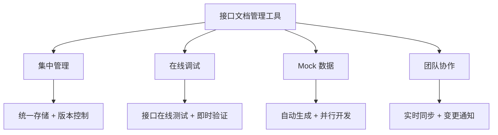
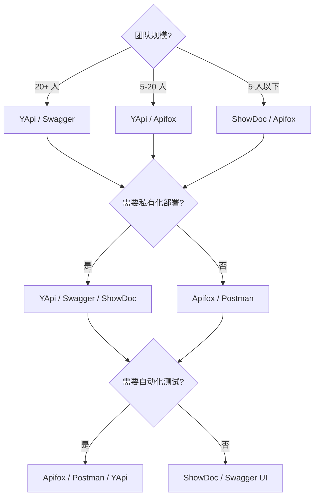
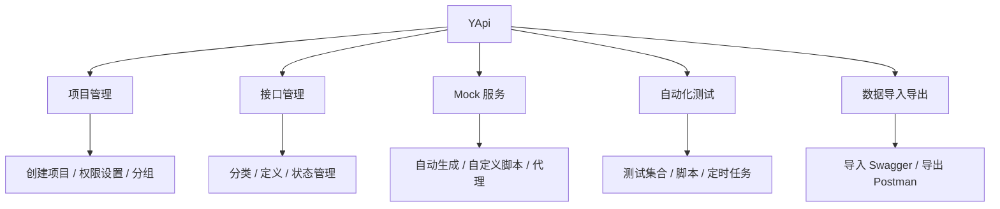
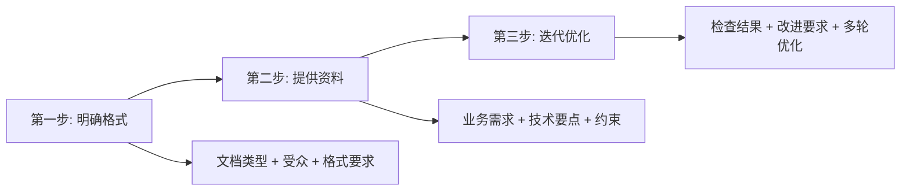
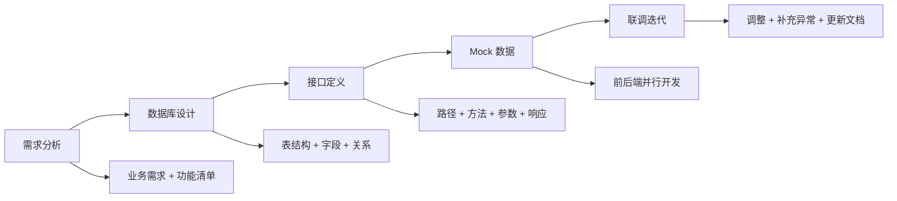

# 接口文档工具与API设计实践

## 概述

接口文档管理工具是前后端协作的核心基础设施。本文对比主流文档管理工具的适用场景，阐述项目文档结构设计规范，介绍数据库设计基础，并给出从需求分析到接口落地的完整实践流程。

## 前置知识

- 了解 RESTful 接口设计基本规范（参见 [RESTful接口设计规范](../../../../02-Node/11-实战案例/07-RESTful接口设计规范.md)）
- 熟悉 HTTP 协议与 JSON 数据格式
- 了解关系型数据库基本概念（表、字段、主键、外键）

## 学习目标

- 根据团队规模和需求选择合适的接口文档工具
- 掌握项目文档目录组织规范和命名规则
- 理解前端开发者需要掌握的数据库设计基础
- 能够完成从需求分析到接口文档输出的完整流程

---

## 一、接口文档管理工具

### 1.1 工具的核心价值



### 1.2 主流工具对比

| 工具 | 特点 | 适用场景 | 开源 |
|------|------|---------|------|
| YApi | 可视化管理、Mock 强大、自动化测试 | 中大型团队前后端协作 | 是 |

> 注：YApi 开源社区自 2021 年起已基本停止维护，且存在未修复的已知安全漏洞，新建项目建议优先评估 Apifox 等仍在活跃迭代的替代方案。
| Swagger | 自动生成文档、OpenAPI 标准 | 后端 API 文档、规范驱动 | 是 |
| Apifox | 文档+调试+Mock+自动化一体化 | 个人开发者、小团队 | 部分免费 |
| Postman | 调试神器、团队协作 | 接口调试、测试 | 部分免费 |
| Knife4j | Swagger 增强 UI | Java 后端项目 | 是 |
| ShowDoc | 轻量级、支持 API 和数据字典 | 小团队快速上手 | 是 |

### 1.3 工具选择决策



### 1.4 YApi 功能架构



---

## 二、AI 辅助文档生成

### 2.1 应用场景

| 场景 | AI 工具作用 | 提示词方向 |
|------|-----------|-----------|
| 生成文档模板 | 提供标准文档结构 | "生成 API 接口文档模板" |
| 编写接口说明 | 根据功能描述生成详细说明 | "根据以下功能生成接口文档" |
| 数据库设计 | 设计表结构和字段 | "设计一个用户表，包含..." |
| 生成 Mock 数据 | 根据 Schema 生成测试数据 | "根据 JSON Schema 生成 Mock" |
| 编写变更日志 | 根据 Git 提交生成 Change Log | "根据提交记录生成 Change Log" |

### 2.2 提示词编写三步法



---

## 三、项目文档结构设计

### 3.1 标准目录组织

```
项目文档/
├── 01-项目说明/
│   ├── 项目简介
│   ├── 技术栈说明
│   ├── 团队成员
│   └── 开发规范
├── 02-变更日志/
│   ├── WIP（进行中）
│   ├── v1.1.0
│   └── v1.0.0
├── 03-数据库设计/
│   ├── 用户表（users）
│   ├── 订单表（orders）
│   └── 数据字典
├── 04-功能模块/
│   ├── 首页模块/
│   │   ├── 首页-轮播图接口
│   │   └── 首页-推荐列表接口
│   ├── 用户模块/
│   │   ├── 用户-登录接口
│   │   └── 用户-注册接口
│   └── 订单模块/
│       ├── 订单-创建接口
│       └── 订单-列表接口
└── 05-附录/
    ├── 错误码说明
    ├── 通用参数说明
    └── 版本规划
```

### 3.2 文档命名规范

| 文档类型 | 命名规则 | 示例 |
|---------|---------|------|
| 项目说明 | 直接命名 | "项目说明" |
| 变更日志 | 版本号格式 | v1.0.0、WIP |
| 数据库表 | 英文小写 + 下划线 | user_profile |
| 功能接口 | 模块-功能 | 用户-登录接口 |

### 3.3 变更日志管理

变更日志（Change Log）的核心价值：版本追溯、团队协作、用户通知。

```markdown
# 变更日志

## [WIP] - 进行中
### 新增
- [用户模块] 用户登录接口

## [v1.1.0] - 2024-02-01
### 新增
- [商品模块] 商品搜索接口
### 修复
- [订单模块] 修复订单列表分页问题

## [v1.0.0] - 2024-01-01
### 新增
- [用户模块] 用户登录/注册接口
- [商品模块] 商品列表接口
```

自动生成工具：

```bash
# conventional-changelog
npm install -g conventional-changelog-cli
conventional-changelog -p angular -i CHANGELOG.md -s
```

---

## 四、数据库设计基础

### 4.1 前端开发者为何需要了解数据库

- 理解数据结构，更好地设计接口参数
- 了解数据关系，优化数据获取策略
- 参与数据库设计讨论，提升全栈能力

### 4.2 设计原则

| 原则 | 说明 | 示例 |
|------|------|------|
| 唯一性 | 每个表必须有主键 | `id INT PRIMARY KEY` |
| 原子性 | 字段不可再分 | `username VARCHAR(50)` |
| 规范性 | 遵循数据库范式，避免冗余 | 拆分子表 |
| 可扩展性 | 预留扩展字段 | `extra JSON` |
| 命名规范 | 表名小写，字段见名知意 | `created_at` |

### 4.3 表设计示例

```sql
CREATE TABLE users (
  id INT PRIMARY KEY AUTO_INCREMENT COMMENT '用户ID',
  username VARCHAR(50) NOT NULL UNIQUE COMMENT '用户名',
  password VARCHAR(255) NOT NULL COMMENT '密码（bcrypt加密）',
  nickname VARCHAR(50) COMMENT '昵称',
  email VARCHAR(100) UNIQUE COMMENT '邮箱',
  phone VARCHAR(20) UNIQUE COMMENT '手机号',
  avatar VARCHAR(255) COMMENT '头像URL',
  role ENUM('user', 'admin') DEFAULT 'user' COMMENT '角色',
  status TINYINT DEFAULT 1 COMMENT '状态：1-正常，0-禁用',
  created_at TIMESTAMP DEFAULT CURRENT_TIMESTAMP,
  updated_at TIMESTAMP DEFAULT CURRENT_TIMESTAMP ON UPDATE CURRENT_TIMESTAMP,
  INDEX idx_username (username),
  INDEX idx_email (email)
) ENGINE=InnoDB DEFAULT CHARSET=utf8mb4 COMMENT='用户表';
```

### 4.4 数据库设计检查清单

- 必须字段：`id`（主键自增）、`created_at`、`updated_at`
- 索引设计：主键索引、唯一索引（username/email）、常用查询字段普通索引
- 字段规范：小写+下划线命名，避免保留字，统一 utf8mb4
- 安全考虑：密码 bcrypt 加密、敏感数据加密、软删除（`deleted_at`）

---

## 五、API 接口设计实践

### 5.1 设计流程



### 5.2 接口文档编写示例

**用户-登录接口**

| 项目 | 内容 |
|------|------|
| 接口路径 | `/api/v1/auth/login` |
| 请求方式 | POST |
| 接口描述 | 用户通过用户名和密码登录系统 |

请求参数：

| 参数名 | 类型 | 必填 | 说明 |
|--------|------|------|------|
| username | string | 是 | 用户名（4-20字符） |
| password | string | 是 | 密码（6-20字符） |

成功响应：

```json
{
  "code": 200,
  "message": "登录成功",
  "data": {
    "token": "eyJhbGciOiJIUzI1NiIs...",
    "user": {
      "id": 1,
      "username": "testuser",
      "nickname": "测试用户",
      "role": "user"
    }
  }
}
```

错误码说明：

| 错误码 | 说明 |
|--------|------|
| 200 | 登录成功 |
| 400 | 参数错误 |
| 401 | 用户名或密码错误 |
| 403 | 账号已被禁用 |
| 500 | 服务端异常 |

### 5.3 数据结构定义（TypeScript）

```typescript
// 统一响应结构
interface ApiResponse<T> {
  code: number
  message: string
  data: T
}

// 分页响应
interface PaginatedData<T> {
  list: T[]
  pagination: {
    page: number
    size: number
    total: number
    totalPages: number
  }
}

// 用户实体
interface User {
  id: number
  username: string
  nickname: string
  email: string
  avatar: string
  role: 'user' | 'admin'
}
```

---

## 常见问题

| 问题 | 原因 | 解决方案 |
|------|------|---------|
| 文档与实际接口不一致 | 更新不及时 | 接口变更必须同步更新文档，纳入 CI 流程 |
| 接口参数说明不清 | 编写不详细 | 使用表格明确类型、必填、校验规则 |
| 返回数据结构不统一 | 缺乏规范 | 制定统一 `{ code, message, data }` 标准 |
| 缺少错误码说明 | 文档不完整 | 补充完整错误码列表和处理建议 |
| 文档查找困难 | 组织混乱 | 按模块分类，建立清晰目录结构 |
| Mock 数据不真实 | 生成随意 | 根据真实数据格式和边界值生成 |

---

## 最佳实践

1. **工具先行**：项目启动时即搭建文档管理平台，不要后补
2. **规范统一**：制定响应格式、命名规范、错误码标准
3. **自动化生成**：使用 Swagger/OpenAPI 从代码注解自动生成文档
4. **Mock 驱动开发**：先定义接口 → 生成 Mock → 前后端并行
5. **变更可追溯**：每次接口变更记录 Change Log，通知相关方
6. **定期审核**：每个迭代周期检查文档完整性和准确性

---

## 延伸阅读

- 《RESTful Web APIs》- Leonard Richardson
- 《API 设计模式》- JJ Geewax
- YApi：https://github.com/YMFE/yapi
- Swagger：https://swagger.io/
- Apifox：https://www.apifox.cn/
- OpenAPI Specification 3.0
- JSON API Specification
