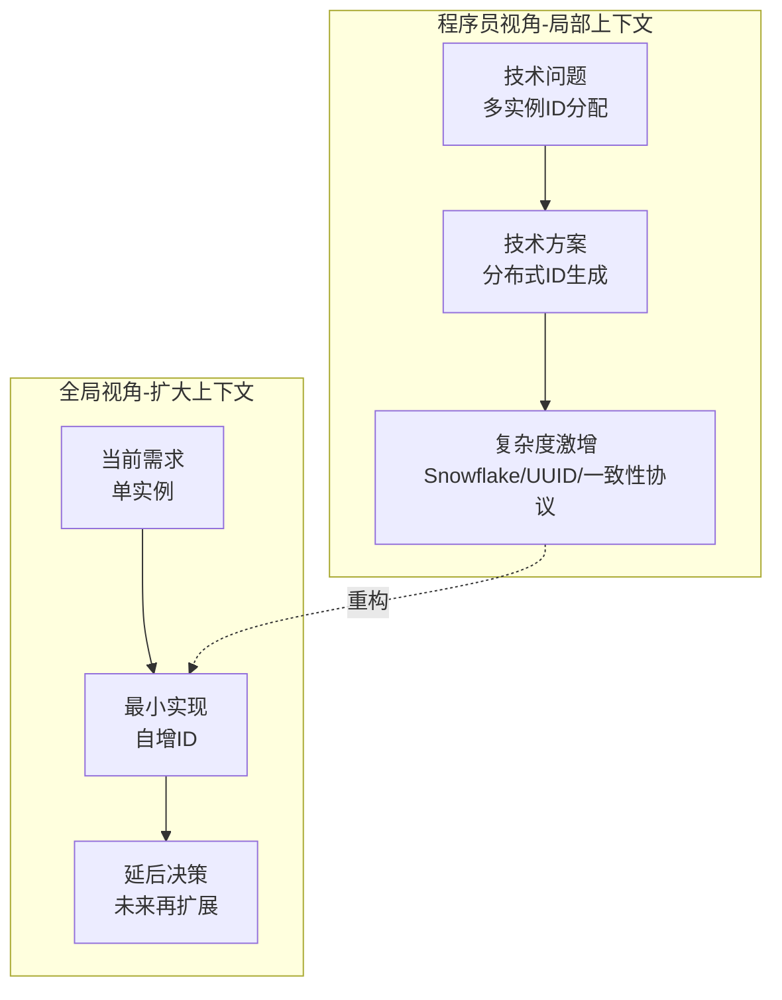
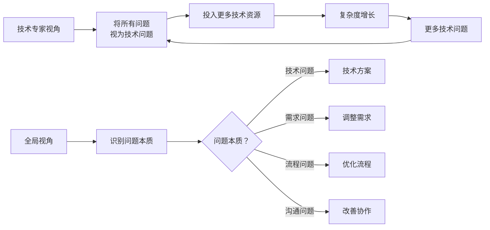
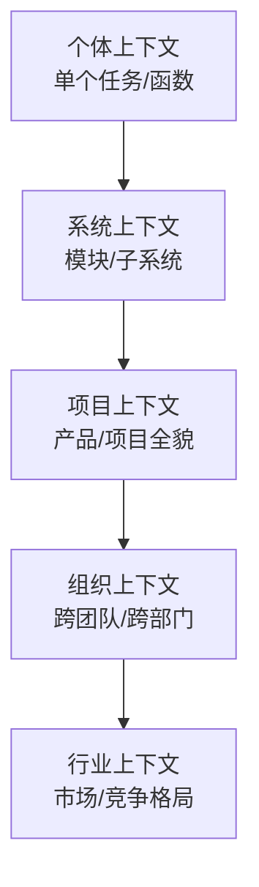
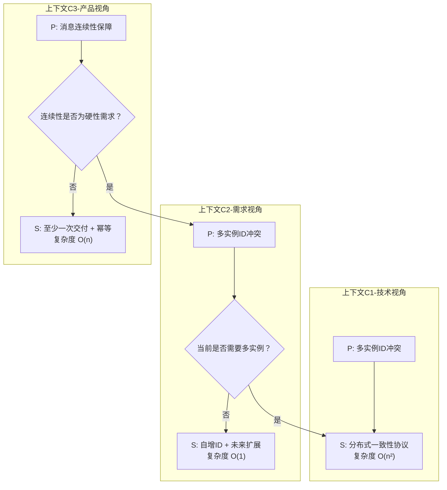
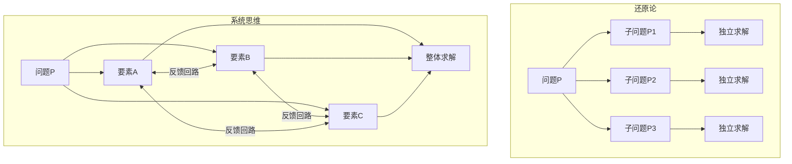
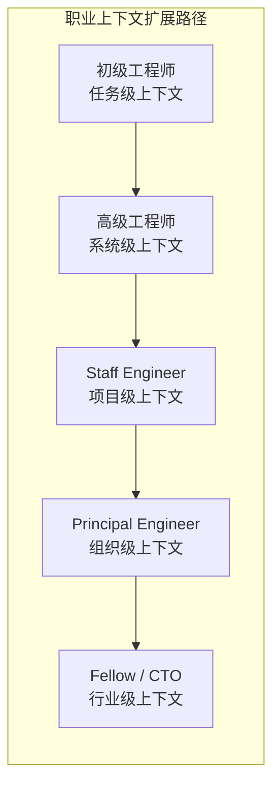
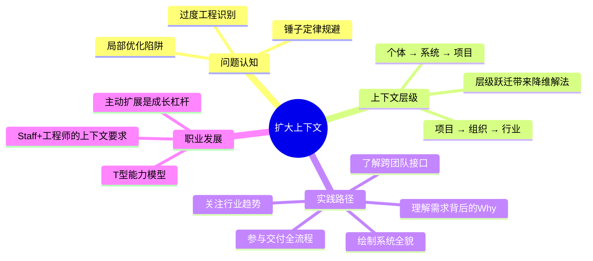

# 解决了很多技术问题，为什么你依然在"坑"里

## 核心命题

技术能力是程序员的立身之本，但**仅凭技术视角解决问题，往往陷入局部优化（Local Optimization）**。不同角色的工作差异本质上不是能力差异，而是**上下文（Context）的差异**。扩大工作上下文，从单点思维跃迁到系统思维，是提升工作效能与职业发展的关键杠杆。

---

## 1. 局部优化的陷阱

### 1.1 问题重构：从"解决技术问题"到"质疑问题本身"

原文案例中，团队成员纠结于"多实例间 ID 分配"这一技术方案，而实际上当前需求仅涉及单实例场景。这类问题的本质是**过度工程（Over-Engineering）**——为尚未出现的需求投入过早的复杂性。

**过度工程的特征识别**：

| 信号 | 含义 | 应对策略 |
|------|------|---------|
| "如果将来需要..." | 基于假设而非需求设计 | YAGNI 原则（You Aren't Gonna Need It） |
| "这个方案更优雅..." | 技术审美驱动而非价值驱动 | 回归需求验证 |
| "这样更灵活..." | 为未知场景预留扩展点 | 预留接口，但不实现 |
| "业界标准做法是..." | 盲目对标大厂方案 | 评估方案成本与当前需求的匹配度 |

### 1.2 锤子定律在软件工程中的表现

> "手里有了锤子，眼里都是钉子。" —— Abraham Maslow

软件工程中的"锤子定律"具体表现为：

---

## 2. 上下文差异：角色认知的结构性分析

### 2.1 上下文层级模型

不同角色的工作上下文构成一个嵌套层级结构：

| 上下文层级 | 典型关注点 | 思考模式 | 时间尺度 |
|-----------|-----------|---------|---------|
| **个体** | 代码实现、Bug 修复 | How（怎么做） | 小时-天 |
| **系统** | 架构设计、模块交互 | How + What（做什么） | 天-周 |
| **项目** | 需求优先级、交付节奏 | What + Why（为什么做） | 周-月 |
| **组织** | 跨团队协作、资源分配 | Why + When（何时做） | 月-季度 |
| **行业** | 市场趋势、竞争壁垒 | Strategic（战略方向） | 季度-年 |

### 2.2 上下文跃迁的收益

原文指出："许多在低一级难以解决的问题，放到更大的上下文里，根本就不是问题。" 这一观察可形式化为：

> **上下文跃迁定律**：当问题 P 在上下文 C₁ 中难以求解时，将上下文扩展至 C₂（C₁ ⊂ C₂），P 可能不再需要求解，或存在降维解法。

---

## 3. 扩大上下文的实践路径

### 3.1 主动扩展策略

| 维度 | 实践方法 | 具体行动 |
|------|---------|---------|
| **需求上下文** | 理解需求背后的业务目标 | 参与需求评审、与产品经理对齐 Why |
| **系统上下文** | 理解系统全貌而非局部 | 绘制系统架构图、阅读跨模块代码 |
| **组织上下文** | 理解跨团队协作接口 | 了解上下游团队的交付物与约束 |
| **流程上下文** | 理解软件交付全流程 | 参与 DevOps 流水线建设、发布流程 |
| **行业上下文** | 理解技术趋势与业务竞争 | 关注行业报告、竞品分析 |

### 3.2 系统思维 vs 还原论思维

| 思维模式 | 特征 | 局限 | 适用场景 |
|---------|------|------|---------|
| **还原论（Reductionism）** | 将问题拆解为子问题逐一解决 | 可能忽略子问题间的交互效应 | 明确边界的独立问题 |
| **系统思维（Systems Thinking）** | 关注要素间的关系与反馈回路 | 需要更大的认知负荷 | 复杂、动态、多因素问题 |

### 3.3 职业发展与上下文扩展

原文通过个人经历说明了上下文扩展对职业发展的价值。这一观察与现代职业发展理论一致：

**T型人才模型**的深化理解：

- **纵向深度（|）**：专业技术能力，是立足之本
- **横向广度（-）**：跨领域上下文，是发展之翼
- **关键洞察**：横向广度不是"什么都会一点"，而是**理解各领域的核心逻辑与接口**

> Will Larson 在 *Staff Engineer* (2021) 中指出：Staff+ 工程师的核心差异化能力不是技术深度，而是**在更大上下文中定义和解决技术问题的能力**。

---

## 4. 总结

**核心要义**：扩大自己工作的上下文，别把自己局限在一个"程序员"的角色上。单点再努力也只是局部优化，真正的突破来自上下文的跃迁——在更大的格局中，许多曾经令人纠结的问题根本不需要被解决。

---

> **延伸阅读**
>
> - Donella Meadows, *Thinking in Systems: A Primer* (2008): 系统思维经典
> - Will Larson, *Staff Engineer: Leadership beyond the management track* (2021): Staff+ 工程师的上下文要求
> - Martin Fowler, "TradeOffHypothesis": 技术决策中的权衡思维
> - YAGNI Principle: https://martinfowler.com/bliki/Yagni.html

---

## 原文存档

> 以下为郑晔原文完整内容，保留作为参考。

## 07 | 解决了很多技术问题，为什么你依然在“坑”里？

在前面的内容中，我给你介绍了几个体现“以终为始”原则的实践，包括怎样界定工作是否完成的 DoD、怎样判定需求是否完成的验收标准、还有怎样验证产品经理给出的产品特性是否合理的精益创业理念。

了解了这些内容，可能你会想：我为什么要关心这些啊？我是程序员啊！难道我不应该安安静静地写程序吗？为什么要操心其他人的工作做得好坏？如果我管了那么多事，我还是不是一个程序员，到底哪里才是我的“终”呢？

今天本文，我们就来聊聊这个让许多人困惑的问题。因为只有要跳出程序员的角色看问题，工作才会变得更加高效。

### “独善其身”不是好事

在需要与人协作的今天，独善其身可不一定是好的做法。我先给你讲一个发生在我身边的故事。

有一次，我的团队要开发一个数据服务层，准备作为一个基础设施提供给核心业务系统。开发没多久，一个团队成员和我说，他的工作进展不顺利，卡在了一个重要问题上，他想不明白该如何在多个实例之间分配 ID。

我听完之后，有些疑惑，为什么要考虑这个和功能无关的问题呢？他解释说，因为我们的系统需要保证消息的连续性，所以他设计了消息 ID，这样下游系统就可以通过消息 ID 识别出是否有消息丢失。

这是没错的，但我奇怪的是，他为什么要在多个实例之间协调呢？他给出的理由是，这么做，是出于考虑应对将来有多实例并发场景的出现。然而事实是，我们当下的需求应对的是单实例的情况。

我了解情况之后，马上跟他说清楚这一点，让他先把第一步做出来。这个同事还是有些担心未来如何做扩展。我告诉他，别纠结，先把第一步做出来，等后面真的有需求，我们再考虑。同事欣然答应了。

其实，这个同事的技术能力非常强，如果我不拦着他，他或许真能实现出一个完美的技术方案，但正如他自己所纠结的那样，这个方案可能要花掉他很长时间。但这真的是我们想要的吗？以现阶段的目标来看，根本没有这样的需求。

我们一直在强调“以终为始”。所谓“终”，其实就是我们的做事目标。虽然大家工作在一起，朝着一个共同的大目标前进，但真的到了一个具体的问题上，每个人看到的目标却不尽相同。

我之所以能把同事从一个纠结的状态中拉出来，是因为我看到的是需求，而他看到的是一个要解决的技术问题。所以，我们俩在对目标的理解上是有根本差异的。

你也许会认为，我和同事之所以有这样的差异，是角色上的差异，我在项目里承担的角色要重一些，而且我的工作时间比同事要长一些。但不知道你有没有想过，不同角色的差异到底在哪里呢？

### 角色的差异

作为一个在职场工作的人，每个人都有一颗渴望得到认可的心，希望自己在职业的阶梯上步步高升。假如今天就让你往上走一个台阶，比如，你原来在项目里打杂，现在成为项目的主力，或者，你已经对项目细节驾轻就熟，即将委任你为项目负责人。你是否能胜任呢？

你需要补充的东西是什么？换句话说，你和你职业台阶中的上一级那个人，差异到底是什么？

也许你会说，他比我来的时间长，或者说，他每天的主要工作就是开会。如果真的是这样，那是不是只要你凑足这个条件，就可以到达他的位置呢？显然不是。

**不同角色工作上真正的差异是上下文的不同。**

这是什么意思呢？以前面的问题为例，你在项目里打杂，你只能关注到一个具体的任务，而项目主力心目中是整个系统。 **虽然写的代码都一样，但你看到的是树木，人家看到的是森林，他更能从全局思考。**

同样，项目负责人的工作，虽然包括在项目组内的协调，但还有一部分工作是跨项目组的，他需要考虑你们项目组与其他组的互动。所以，他工作的上下文是在各组之间，包括技术和产品等方面。

再上升一个层面，部门负责人要协调内部各个组，同时要考虑部门之间的协调。而公司负责人考虑的上下文甚至要跳脱公司内部，进入到行业层面。

你可能会问，好了，我知道不同角色的上下文有差异了，但这对我意味着什么呢？

我们先从工作角度看。回到前面我分享的那个故事，你可能注意到了， **我并不是靠技术能力解决了问题，而是凭借对需求的理解把这个问题绕过去了。**

之所以我能这样做，原因就在于我是在一个更大的上下文里工作。类似的故事在我的职业生涯中发生过无数次，许多令程序员愁眉不展的问题，换个角度可能都不是问题。

技术是一把利刃，程序员相信技术可以改变世界，但并不是所有问题都要用技术解决。有这样一种说法，手里有了锤子，眼里都是钉子。花大力气去解决一个可能并不是问题的问题，常常是很多程序员的盲区。

之所以称之为盲区，是因为很多人根本看不见它，而看不见的原因就在于上下文的缺失，也就是说，你只在程序员的维度看问题。

多问几个为什么，交流一下是不是可以换个做法，许多困惑可能就烟消云散了。 **而能想到问这样的问题，前提就是要跳出程序员角色思维，扩大自己工作的上下文。**

虽然我不是项目主力，但不妨碍我去更深入地了解系统全貌；虽然我不是项目负责人，但不妨碍我去了解系统与其他组的接口；同样，虽然我不是项目经理，但我可以去了解一下项目经理是怎样管理项目的；虽然我不是产品经理，但了解一个产品的设计方法对我来说也是有帮助的。

**当你对软件开发的全生命周期都有了认识之后，你看到的就不再是一个点了，而是一条线。** 与别人讨论问题的时候，你就会有更多的底气，与那些只在一个点上思考的人相比，你就拥有了降维攻击的能力。

现在你知道为什么你的工作总能让老板挑出毛病了吧！没错，工作的上下文不同，看到的维度差异很大。单一维度的思考，在多维度思考者的眼里几乎就是漏洞百出的。

当扩大了自己工作的上下文时，我们的目标就不再局限于一个单点，而是会站在更高的维度去思考，解决问题还有没有更简单的方案。许多在低一级难以解决的问题，放到更大的上下文里，根本就不是问题。

我的职业生涯中经常遇到这样的情况，在一个特定的产品设计下，我总觉得设计的技术方案有些不优雅的地方，而只要产品设计微调一下，技术方案一下子就会得到大幅度提升。在这种情况下，我会先去问产品经理，是否可以这样调整。只要不是至关重要的地方，产品经理通常会答应我的要求。

### 在更大的上下文工作

扩展自己工作的上下文，目光不再局限于自己的一亩三分地，还可以为自己的职业发展做好布局。在这个方面，我给你分享一个不太成功的案例，就是我自己的故事。

我是属于愚钝型的程序员，工作最初的几年，一直把自己限定在程序员的上下文里，最喜欢的事就是安安静静地写代码，把一个系统运作机理弄清楚会让我兴奋很长一段时间。

我的转变始于一次机缘巧合，当时有一个咨询项目，负责这个项目的同事家里有些事，需要一个人来顶班，公司就把我派去了。

到了咨询项目中，我自己习惯的节奏完全乱掉了，因为那不是让代码正常运作就可以解决的问题，更重要的是与人打交道。

有很长一段时间，我一直处于很煎熬的状态，感谢客户没有把我从这个项目赶出来，让我有了“浴火重生”的机会。

为了让自己从这种煎熬的状态中摆脱出来，我必须从代码中走出来，尽量扩大自己思考的边界。经过一段时间的调整，我发现与人打交道也没那么难，我也能更好地理解一个项目运作的逻辑，因为项目运作本质上就是不同人之间的协作。

突破了自己只愿意思考技术的限制，世界一下子宽阔了许多。所以，后来才有机会更多地走到客户现场，看到更多公司的项目运作。虽然我工作过的公司数量并不多，但我却见过很多公司是如何工作的。

再后来，我有机会参与一个新的分公司建设工作中，这让我有了从公司层面进行思考的角度。对于员工招聘和培养，形成了自己一套独立的思考。

这些思考在我创业的过程中，帮我建立了一支很不错的团队。而创业的过程中，我又有了更多机会，去面对其他公司的商务人员，从而建立起一个更大的上下文，把思考从公司内部向外拓展了一些。

回过头来看自己的生涯时，我发现，因为不愿意拓展自己的上下文，我其实错过了很多职业发展的机会。所幸我还有机会突破自己，让自己走出来，虽然走的速度不如理想中快，但至少一直在前进，而不是原地打转。这也是我告诫你一定要不断扩大自己工作上下文的原因。

机会总是垂青那些有准备的人，尤其在公司规模不大的时候，总有一些跳跃式的发展机会。

我见过有人几年之内从程序员做到公司中国区负责人，只是因为起初公司规模不大，而他特别热心公司的很多事情，跳出了固定角色的思维。所以，当公司不断发展，需要有人站出来的时候，虽然没有人是完全合格的，但正是他的热心，让他有了更多的维度，才有机会站到了前排。

当然，随着公司规模越来越大，这种幅度极大的跳跃是不大可能的。江湖上流传着一个华为的故事，一个新员工给任正非写了封万言书，大谈公司发展，任正非回复：“此人如果有精神病，建议送医院治疗，如果没病，建议辞退。”

因为一旦公司规模大了，你很难了解更大的上下文，很多关于公司的事情，你甚至需要从新闻里才知道。

本质上，一个人能在自己的工作范围内多看到两三级都是有可能的。在公司规模不大时，从基层到老板没有太多层级，跳跃就显得很明显，而公司一大，层级一多，从低到顶的跳跃就不太可能了，但跨越级别跳跃是可能的。

所以我希望你跳出程序员思维，这不仅仅是为了工作能够更高效，也是希望你有更好的发展机会。

### 总结时刻

程序员总喜欢用技术去解决一切问题，但很多令人寝食难安的问题其实根本不是问题。之所以找不出更简单的解决方案，很多时候原因在于程序员被自己的思考局限住了。

不同角色工作真正的差异在于上下文的差异。在一个局部上下文难以解决的问题，换到另外一个上下文甚至是可以不解决的。所以说无论单点有多努力也只是局部优化，很难达到最优的效果。

想把工作做好，就需要不断扩大自己工作的上下文，多了解一下别人的工作逻辑是什么样的，认识软件开发的全生命周期。

扩大自己的上下文，除了能对自己当前的工作效率提高有帮助，对自己的职业生涯也是有好处的。随着你看到的世界越来越宽广，得到的机会也就越来越多。

如果今天的内容你只记住一件事，那请记住： **扩大自己工作的上下文，别把自己局限在一个“程序员”的角色上。**

最后，我想请你分享一下，在你的工作中，有哪些因为你扩大了工作上下文而解决的问题呢？

感谢阅读，如果你觉得这篇文章对你有帮助的话，也欢迎把它分享给你的朋友。