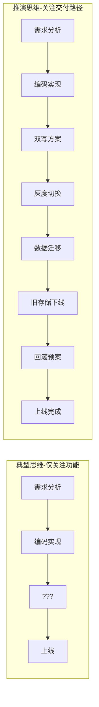
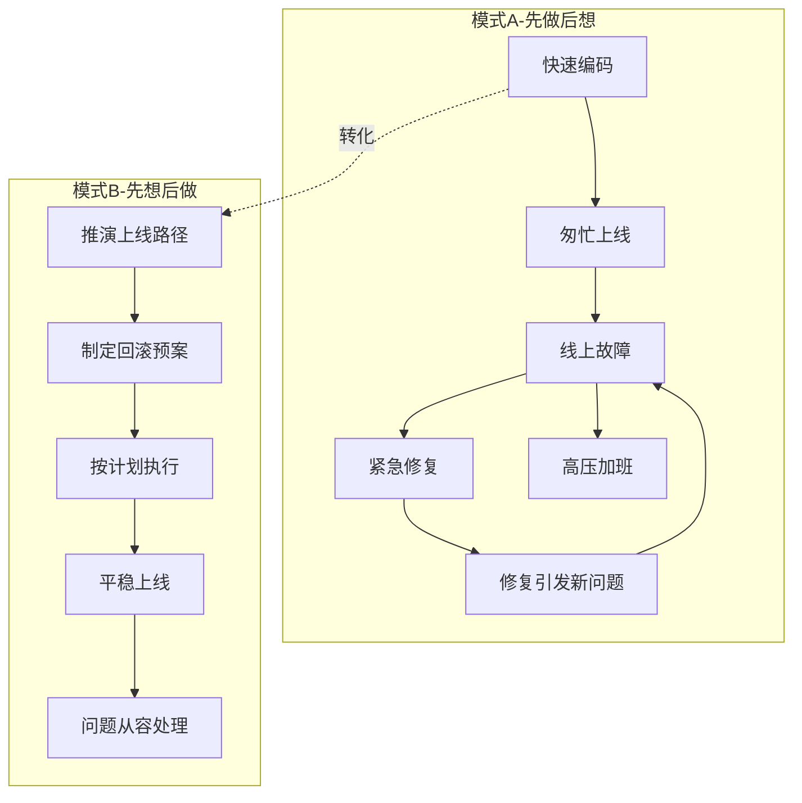
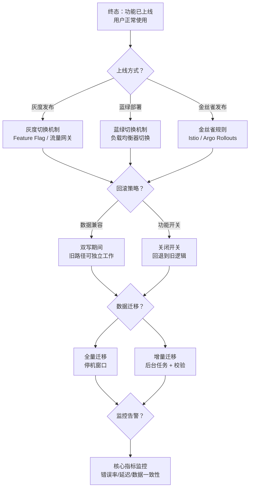
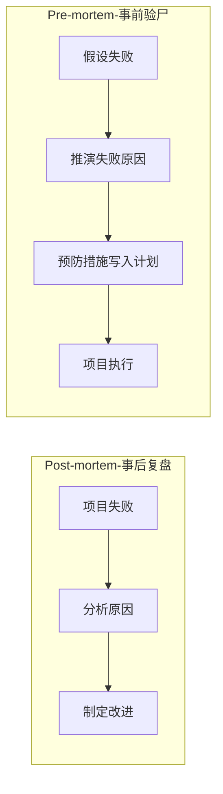
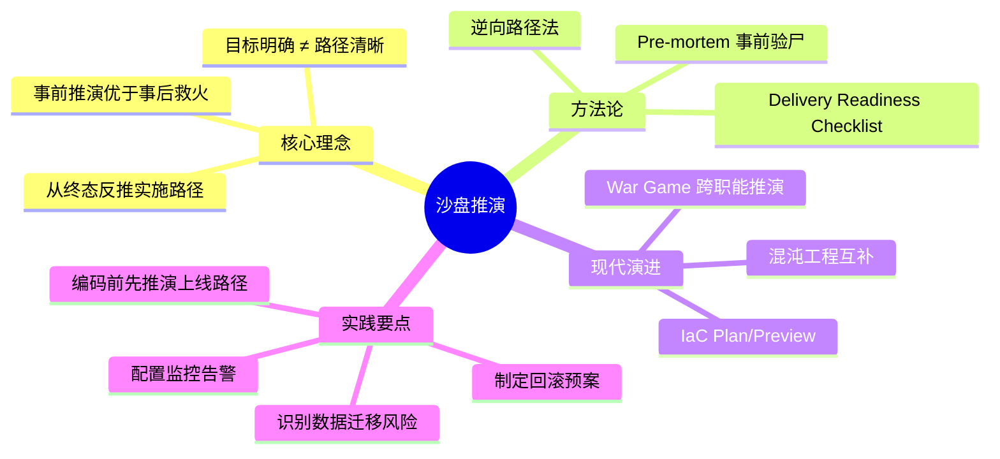
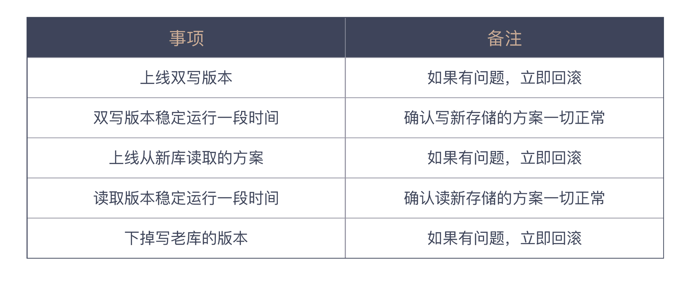
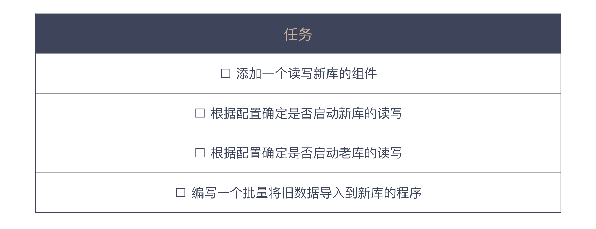

# 为什么说做事之前要先进行推演

## 核心命题

目标明确并不等同于路径清晰。在软件工程中，**仅确定"做什么"而不推演"怎么做"**，是导致"最后一公里"频繁失败的根因。沙盘推演（Tabletop Exercise）——在动手之前完成智力上的创造（First Creation），从终态反推实施路径——是将"手忙脚乱的事后补救"转化为"有条不紊的事前准备"的关键方法。

---

## 1. "最后一公里"问题的本质

### 1.1 功能实现 ≠ 交付完成

原文通过数据库迁移案例揭示了一个普遍问题：开发者倾向于只考虑**功能实现**（Happy Path），而忽视**交付路径**（Delivery Path）。



**数据库迁移案例的推演清单**：

| 步骤 | 关注点 | 风险 | 缓解措施 |
|------|--------|------|---------|
| ① 读写新库组件 | 新库 API 兼容性 | 查询语义差异 | 对比测试 |
| ② 双写阶段 | 数据一致性 | 写入失败导致不一致 | 异步对账 + 补偿机制 |
| ③ 读切换 | 查询结果正确性 | 新旧数据不一致 | 灰度放量 + 监控告警 |
| ④ 停止旧写 | 旧存储不再更新 | 遗漏写入路径 | 全量代码扫描 |
| ⑤ 历史数据迁移 | 历史数据完整性 | 迁移过程数据丢失 | 校验脚本 + 抽样比对 |
| ⑥ 旧存储下线 | 依赖清理 | 隐式依赖未清理 | 渐进式下线 + 监控 |

### 1.2 两种工作模式的系统动力学



| 维度 | 先做后想（Reactive） | 先想后做（Proactive） |
|------|---------------------|---------------------|
| 压力分布 | 前期轻松，后期高压 | 前期投入，后期从容 |
| 问题发现时机 | 上线后暴露 | 推演时预判 |
| 修复成本 | 高（影响线上用户） | 低（仅影响计划文档） |
| 团队士气 | 挫败感（反复救火） | 成就感（按计划推进） |
| 知识积累 | 零散（故障驱动） | 系统（推演驱动） |

---

## 2. 沙盘推演方法论

### 2.1 定义与渊源

沙盘推演源自军事领域，指在行动前通过模拟对抗来检验战略战术。在软件工程中，其核心实践为：

> **假设软件已经就绪，从终态出发，逆向推演上线/推广/运营的完整路径，识别前置依赖与风险点。**

### 2.2 推演框架：逆向路径法



**推演检查清单（Delivery Readiness Checklist）**：

| 类别 | 检查项 | 状态 |
|------|--------|------|
| **部署策略** | 部署方式（灰度/蓝绿/滚动）已确定 | ☐ |
| **回滚方案** | 回滚触发条件与步骤已明确 | ☐ |
| **数据迁移** | 迁移脚本已编写并验证 | ☐ |
| **数据一致性** | 对账机制已就绪 | ☐ |
| **监控告警** | 核心指标已配置、告警阈值已设定 | ☐ |
| **功能开关** | 开关控制粒度与回退行为已确认 | ☐ |
| **依赖就绪** | 下游服务已同步升级 | ☐ |
| **文档更新** | API 文档、运维文档已更新 | ☐ |
| **应急预案** | 各阶段故障的 SOP 已制定 | ☐ |

### 2.3 推演的三种实践形式

| 形式 | 参与者 | 时机 | 适用场景 |
|------|--------|------|---------|
| **个人推演** | 任务负责人 | 编码前 | 小规模变更 |
| **团队 Walkthrough** | 开发 + 测试 + 运维 | 任务分解后 | 中等规模上线 |
| **War Game（作战推演）** | 跨职能团队 | 重大变更前 | 大规模架构迁移 |

---

## 3. 推演思维在现代工程实践中的体现

### 3.1 Chaos Engineering（混沌工程）

沙盘推演的"识别风险"思想在云原生时代演化为**混沌工程**——通过主动注入故障来验证系统的韧性：

| 维度 | 沙盘推演 | 混沌工程 |
|------|---------|---------|
| 风险发现方式 | 脑力推演（假设性） | 实际注入（验证性） |
| 执行时机 | 上线前 | 运行中（受控实验） |
| 覆盖范围 | 逻辑推理可及的风险 | 包括未预期的涌现行为 |
| 工具 | 无（思维工具） | Chaos Monkey、Litmus、Chaos Mesh |

> **Principle**：沙盘推演和混沌工程不是替代关系，而是**互补关系**——推演覆盖"可预知风险"，混沌工程覆盖"涌现风险"。

### 3.2 Pre-mortem（事前验尸）

与传统的 Post-mortem（事后复盘）相反，Pre-mortem 要求团队在项目开始前假设项目已经失败，然后反推失败原因：



**Pre-mortem 实施步骤**：

1. 团队成员独立写下"项目失败的可能原因"（5 分钟）
2. 汇总并去重，按可能性和影响度排序
3. 对 Top 5 风险制定预防措施，纳入项目计划
4. 在项目关键节点复查风险清单

### 3.3 Infrastructure as Code 的推演能力

现代 IaC 工具（Terraform、Pulumi、Crossplane）提供了 `plan` / `preview` 功能，使基础设施变更的推演从"脑力活动"变为"可执行验证"：

```bash
# Terraform Plan：推演基础设施变更
terraform plan -out=plan.tfplan
terraform show -json plan.tfplan  # 查看变更详情

# Pulumi Preview：预览资源变更
pulumi preview --diff

# Argo CD Sync Preview：预览 K8s 资源变更
argocd app diff my-app
```

---

## 4. 总结



**核心要义**：在动手做一件事之前，先推演一番。推演不是"想太多"，而是用最低成本（思维成本）发现最高成本（线上故障）的问题。"最后一公里"的失败，99% 可通过事前推演预防。

---

> **延伸阅读**
>
> - Gary Klein, "Performing a Project Premortem" (HBR 2007): Pre-mortem 方法论
> - Nora Jones & Casey Rosenthal, *Chaos Engineering* (2020): 混沌工程系统化实践
> - Terraform Plan: https://developer.hashicorp.com/terraform/cli/commands/plan
> - Argo Rollouts: https://argoproj.github.io/argo-rollouts/

---

## 原文存档

> 以下为郑晔原文完整内容，保留作为参考。

## 08 | 为什么说做事之前要先进行推演？

经过前面的学习，想必你已经对“以终为始”这个原则有了自己的理解。你知道接到一个任务后，要做的不是立即埋头苦干，而是要学会思考，找出真正的目标。那目标明确之后，我们是不是就可以马上开始执行了呢？

先不着急给出你的答案，今天的内容从一个技术任务开始。

### 一个技术任务

你现在在一家发展还不错的公司工作。随着业务的不断发展，原来采用的关系型数据库越发无法满足快速的变化。于是，项目负责人派你去做个技术选型，把一部分业务迁移到更合适的存储方式上。

经过认真的调研和思考，你给负责人提出了自己的建议，“我们选择 MongoDB。”出于对你的信任，负责人无条件地同意了你的建议，你获得了很大的成就感。

在你的喜悦尚未消退时，负责人进一步对你委以重任，让你来出个替代计划。替代计划？你有些不相信自己的耳朵，嘴里嘟囔着：“把现在存到数据库的内容写到 MongoDB 不就成了，我就一个表一个表地替换。难道我还要把哪天替换哪个表列出来吗？”

刚刚还对你欣赏有加的负责人，脸色一下子沉了下来。“只有表改写吗？”他问你。你一脸懵地看着他，心里想，“不然呢？”

“上线计划呢？”负责人问。

“我还一行代码都没写呢？”你很无辜地看着负责人。

“我知道你没写代码，我们就假设代码已经写好了，看看上线是怎样一个过程。”

“不是发新版本就好了吗？”你还是不知道负责人到底想说什么。

“你能确定新版代码一定是对的吗？”

虽然你已经叱咤编程很多年，但作为老江湖，一听这话反而是有些怯的。“不能。”你痛快地承认了。

“一旦出错，我们就回滚到上一个版本不就成了。”常规的处理手段你还是有的。

“但数据已经写到了不同的存储里面，查询会受到影响，对不对？”负责人一针见血。

“如果这个阶段采用两个数据存储双写的方案，新代码即便出问题，旧存储的代码是正常，我们还有机会回滚。”你一下子就给出了一个解决方案，咱最不怕出问题了。

“对。”负责人认同了你的做法，一副没看错人的神情。“让你出上线方案，就是为了多想想细节。”

你终于明白了负责人的良苦用心，也就不再大意。很快，你就给出了一份更详尽的上线方案。



你把这个方案拿给负责人看，信心满满，觉得自己够小心，一步一步做，没有任何问题。但负责人看了看你的上线计划，眉头逐渐锁了起来，你知道负责人还是不满意，但不知道还差在哪里？

“原有的数据怎么办？”负责人又问了一个问题。你一下子意识到，确实是问题。“没有原有数据，一旦查询涉及到原有数据，查询的结果一定是错的。所以，还应该有一个原有数据的迁移任务。”你尴尬地笑了笑。

负责人微笑着看着你。“好吧，从我的角度看差不多了，你可以再仔细想想。然后，排一个开发任务出来吧！”

你当然不会辜负负责人的信任，很快排出了开发任务。



看着排出的任务，你忽然困惑了。最开始只是想写个读写新库的组件，怎么就多出这么些任务。此外，你还很纳闷为什么负责人总是能找到这么多问题。

### 一次个人回顾

你想起之前的工作里有过类似的场景，那个负责人也是让你独立安排任务。通常，你最初得到的也是一个简单的答案，从当时的心境上看，你是很有成就感的。

只是后来的故事就不那么美妙了，上线时常常出现各种问题，你和其他同事们手忙脚乱地处理各种异常。当时顶着巨大压力解决问题的场景，你依然记忆犹新。解决完问题离开公司时，天空已经泛起鱼肚白。

而似乎自从加入了现在的公司，这种手忙脚乱的场景少了很多。你开始仔细回想现在这个负责人在工作中的种种。从给大家机会的角度来看，这个负责人确实不错，他总会让一个人独立承担一项任务。只不过，他会要求大家先将任务分解的结果给他看。

拿到组里任何一个人的开发列表之后，他都会问一大堆问题，而且大多数情况下，他都会问到让人哑口无言。说句心里话，每次被他追问心里是挺不舒服的，就像今天这样。

本来在你看来挺简单的一件事，经过他的一系列追问，变成了一个长长的工作列表，要做的事一下子就变多了。毕竟谁不愿意少做点活呢！

不过，你不得不承认的一点是，加入这个公司后，做事更从容了。你知道无论做的事是什么，那些基本的部分是一样的，差别体现在事前忙，还是事后忙，而现在这家公司属于事前忙。于是，你开始把前一家公司上线时所忙碌的内容，和现在负责人每次问的问题放在一起做对比。

这样一梳理，你才发现，原来负责人问的问题，其实都是与上线相关的问题。包括这次的问题也是，上线出问题怎么办，线上数据怎么处理等等。

你突然意识到一个关键问题，其实负责人每次问的问题都是类似的，无论是你还是其他人，他都会关心上线过程是什么样，给出一个上线计划。即便我们还一行代码都没有，他依然会让我们假设如果一切就绪，应该怎样一步一步地做。

你终于明白了，之前的项目之所以手忙脚乱，因为那时候只想了功能实现，却从来没考虑过上线，而且问题基本上都是出在上线过程中的。你想到了上次参加一个社区活动，其中的一个大牛提到了一个说法：“ **最后一公里**”。

想到这，你赶紧上网搜了一下“最后一公里”，这个说法指的是完成一件事，在最后也是最关键的步骤。你才意识到，“最后一公里”这个说法已经被应用在很多领域了，负责人就是站在“最后一公里”的角度来看要发生的事情。

嗯，你学会了一招，以后你也可以站在“最后一公里”去发现问题了，加上你已经具备的推演能力，给出一个更令人满意的任务列表似乎更容易一些。

把这个问题想清楚了，你重新整理了自己的思路，列出了一个自己的问题解决计划。

- 先从结果的角度入手，看看最终上线要考虑哪些因素。
- 推演出一个可以一步一步执行的上线方案，用前面考虑到的因素作为衡量指标。
- 根据推演出来的上线方案，总结要做的任务。

不过，更令你兴奋的是，你拥有了一个看问题的新角度，让自己可以再上一个台阶，向着资深软件工程师的级别又迈进了一步。

### 通往结果之路

好了，这个小故事告一段落。作为我们专栏的用户，你可能已经知道了这个故事要表达的内容依旧是“以终为始”。关于“以终为始”，我们前面讲的内容一直是看到结果，结果是重要的。然而， **通向结果的路径才是更重要的。**

这个世界不乏有理想的人，大多数人都能看到一个宏大的未来，但这个世界上，真正取得与这些理想相配成绩的人却少之又少，大部分人都是泯然众生的。

宏大理想是一个目标，而走向目标是需要一步一个脚印地向前走的。唐僧的目标是求取真经，但他依然用了十几年时间才来到大雷音寺。唐僧西天取经有一个极大的优势，他达成目标的路径是清晰的，从长安出发，向着西天一路前行就好。

**对比我们的工作，多数情况下，即便目标清晰，路径却是模糊的。** 所以，不同的人有不同的处理方式。有些人是走到哪算哪，然后再看；有些人则是先推演一下路径，看看能走到什么程度。

在我们做软件的过程中，这两种路径所带来的差异，已经在前面的小故事里体现出来了。一种是前期其乐融融，后期手忙脚乱；一种是前面思前想后，后面四平八稳。我个人是推崇后一种做法的。

或许你已经发现了，这就是我们在“以终为始”主题的开篇中，提到的第一次创造或者智力上的创造。如果不记得了，不妨回顾一下 [《02 \| 以终为始：如何让你的努力不白费？》](https://time.geekbang.org/column/article/74834)。

实际上，早就有人在熟练运用这种思想了。 **在军事上，人们将其称为沙盘推演，或沙盘模拟。** 军队通过沙盘模拟军事双方的对战过程，发现战略战术上存在的问题。这一思想也被商界借鉴过来，用来培训各级管理者。

这个思想并不难理解，我们可以很容易地将它运用在工作中的很多方面。比如：

- 在做一个产品之前，先来推演一下这个产品如何推广，通过什么途径推广给什么样的人；
- 在做技术改进之前，先来考虑一下上线是怎样一个过程，为可能出现的问题准备预案；
- 在设计一个产品特性之前，先来考虑数据由谁提供，完整的流程是什么样的。

最后这个例子也是软件开发中常遇到的，为数不少的产品经理在设计产品时，只考虑到用户界面是怎样交互的，全然不理会数据从何而来，造成的结果是：累死累活做出来的东西，完全跑不通，因为没有数据源。

很多时候，我们欠缺的只是在开始动手之前做一遍推演，所以，我们常常要靠自己的小聪明忙不迭地应对可能发生的一切。

希望通过今天的分享，能让你打破手忙脚乱的工作循环，让自己的工作变得更加从容。

### 总结时刻

即便已经确定了自己的工作目标，我们依然要在具体动手之前，把实施步骤推演一番，完成一次头脑中的创造，也就是第一次创造或智力上的创造。这种思想在军事上称之为沙盘推演，在很多领域都有广泛地应用。

在软件开发过程中，我们就假设软件已经就绪，看就绪之后，要做哪些事情，比如，如何上线、如何推广等等，这样的推演过程会帮我们发现前期准备的不足之处，进一步丰富我们的工作计划。为了不让我们总在“最后一公里”摔跟头，前期的推演是不可或缺的，也是想让团队进入有条不紊状态的前提。

如果今天的内容你只记住一件事，那请记住： **在动手做一件事之前，先推演一番。**

最后，我想请你思考一下，如果把你在做的事情推演一番，你会发现哪些可以改进的地方呢？

感谢阅读，如果你觉得这篇文章对你有帮助的话，也欢迎把它分享给你的朋友。