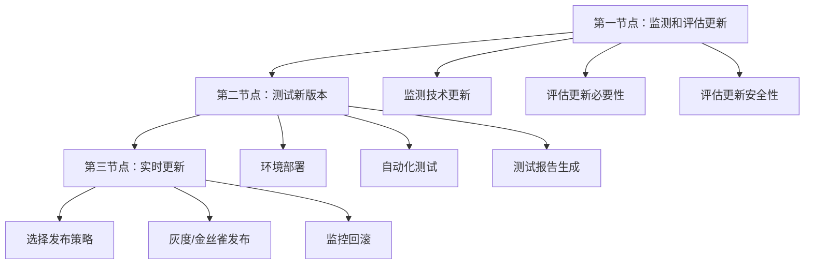
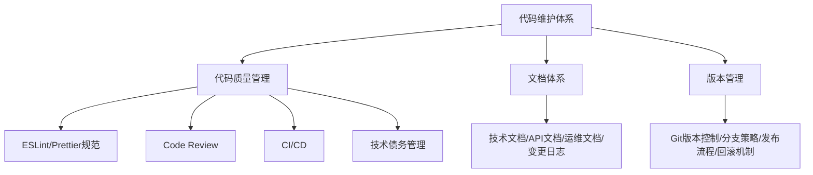

# 项目管理与维护

## 概述

项目上线后的技术更新与持续维护是保障系统长期稳定运行的关键。本文系统介绍技术更新三大关键节点（监测评估→测试验证→实时更新）、语义化版本号规范、七大更新发布策略（灰度/特性切换/金丝雀/AB测试/CDN边缘/Service Workers/前端路由），以及完整的维护体系设计。

## 前置知识

- 完成 [05-架构设计方法论](05-架构设计方法论.md) 的学习
- 了解 CI/CD 基本概念
- 具备 npm 依赖管理经验

## 学习目标

- 掌握技术更新三节点完整流程
- 理解语义化版本号（SemVer）规范
- 熟练运用七大更新发布策略
- 建立完整的维护体系（代码质量+监控+安全）

---

## 一、技术更新三大关键节点



### 更新范围

| 更新类型 | 内容 |
|---------|------|
| 前端依赖更新 | npm 包版本更新、框架版本升级、工具链升级 |
| 服务端服务更新 | 后端服务版本更新、数据库版本升级、中间件版本升级 |

---

## 二、第一节点：监测和评估更新

### 2.1 监测工具

| 工具类型 | 工具名称 | 说明 |
|---------|---------|------|
| 本地 CLI | npm-check-updates | 检查并批量更新 package.json |
| 本地 CLI | npm outdated | 列出过期依赖 |
| 网络工具 | Dependabot（GitHub） | 自动创建依赖更新 PR |
| 网络工具 | Renovate | 多平台依赖更新自动化 |
| 网络工具 | Snyk | 安全漏洞扫描与修复 |

### 2.2 语义化版本号（SemVer）

格式：`主版本号.次版本号.修订号`（如 `2.3.1`）

| 版本号 | 含义 | 特点 | 应对策略 |
|--------|------|------|---------|
| 主版本号（Major） | 破坏性更新 | 不兼容的 API 修改 | 全面评估、测试验证 |
| 次版本号（Minor） | 功能性更新 | 向后兼容的功能新增 | 评估新功能、按需升级 |
| 修订号（Patch） | 安全更新/Bug修复 | 向后兼容的问题修复 | 优先升级、及时修复 |

### 2.3 更新优先级

| 更新类型 | 优先级 | 处理方式 |
|---------|--------|---------|
| 安全更新 | 最高 | 立即评估，尽快升级 |
| 功能更新 | 中等 | 根据需求评估是否升级 |
| 破坏性更新 | 谨慎 | 全面评估迁移成本 |

### 2.4 风险评估清单

- **破坏性更新风险**：API 兼容性、配置修改、依赖关系影响、迁移成本
- **安全性风险**：已知漏洞、安全性提升、数据安全影响
- **兼容性风险**：现有代码兼容、依赖库兼容、运行环境兼容

---

## 三、第二节点：测试新版本

### 3.1 环境三层部署

| 环境 | 用途 | 特点 | 目标 |
|------|------|------|------|
| 开发环境（Dev） | 本地开发、快速迭代 | 配置宽松、快速部署 | 功能验证 |
| 测试环境（Test） | 功能测试、性能测试 | 接近生产、数据隔离 | 质量保证 |
| 生产环境（Prod） | 正式运行、对外服务 | 高可用、高性能 | 稳定运行 |

### 3.2 自动化测试三层体系

| 测试类型 | 范围 | 工具 | 执行时机 |
|---------|------|------|---------|
| 单元测试 | 单个函数/组件 | Jest、Mocha | 每次提交 |
| 集成测试 | 模块间交互 | Jest、Testing Library | 每日构建 |
| E2E 测试 | 完整业务流程 | Cypress、Playwright | 每次发布前 |

### 3.3 测试报告内容

- **测试概览**：覆盖率、通过率、失败用例数
- **性能指标**：页面加载时间、接口响应时间、资源大小变化
- **兼容性报告**：浏览器/设备/系统兼容性
- **风险提示**：已知问题、潜在风险、建议措施

---

## 四、第三节点：七大更新策略

### 4.1 策略一：灰度发布


| 阶段 | 范围 | 目标 |
|------|------|------|
| 第一步 | 5% 用户 | 小范围验证，快速发现问题 |
| 第二步 | 20% 用户 | 扩大范围，收集反馈 |
| 第三步 | 50% 用户 | 大范围验证，性能监控 |
| 第四步 | 100% 用户 | 全量发布，持续监控 |

优势：降低风险、快速发现问题、平滑过渡、灵活回滚。

### 4.2 策略二：特性切换（Feature Toggle）

通过配置开关控制功能的启用/禁用，支持按用户ID、地理位置、浏览器类型、时间段等维度切换。

```javascript
const features = {
  newUI: {
    enabled: true,
    rolloutPercentage: 20, // 20%用户看到新UI
  },
  newFeature: {
    enabled: false, // 功能开发中，默认关闭
  },
};

function isFeatureEnabled(feature, userId) {
  const config = features[feature];
  if (!config.enabled) return false;
  return hashUserId(userId) % 100 < config.rolloutPercentage;
}
```

### 4.3 策略三：金丝雀测试（Canary Testing）

核心思想：小范围快速验证。部署到少量服务器，路由小部分流量，快速收集反馈。

### 4.4 策略四：AB 测试

| 应用场景 | 说明 |
|---------|------|
| UI/UX 优化 | 对比两个界面设计，数据驱动决策 |
| 功能验证 | 对比两个功能方案，验证用户偏好 |
| 性能优化 | 对比两个技术方案，验证性能提升 |

### 4.5 策略五：CDN 边缘服务器

利用边缘计算实现地域灰度发布：

```javascript
// Cloudflare Workers 示例
addEventListener("fetch", (event) => {
  const country = event.request.cf.country;
  if (country === "CN") {
    event.respondWith(fetchNewVersion(event.request));
  } else {
    event.respondWith(fetchOldVersion(event.request));
  }
});
```

常用工具：Cloudflare Workers、Akamai EdgeWorkers、AWS Lambda@Edge。

### 4.6 策略六：Service Workers

通过本地缓存和请求拦截实现版本动态切换：
- 注册 Service Worker → 缓存新版本资源 → 用户切换激活 → 后台更新资源
- 优势：离线可用、快速切换、用户体验好

### 4.7 策略七：前端路由方案

通过路由守卫、权限判断、动态路由实现功能模块级别的灰度控制，适用于前端功能模块的小范围灰度和快速迭代。

---

## 五、维护体系设计

### 5.1 代码维护体系



### 5.2 监控和日志

| 监控类型 | 工具推荐 | 关注指标 |
|---------|---------|---------|
| 性能监控 | Prometheus + Grafana | 页面加载、接口响应、资源加载 |
| 日志收集 | ELK Stack | 日志聚合、可视化分析 |
| 错误追踪 | Sentry | 实时错误监控、堆栈追踪 |
| 用户体验 | Google Analytics / 百度统计 | 用户行为分析、转化率 |

### 5.3 安全防护

| 安全维度 | 措施 |
|---------|------|
| 数据安全 | HTTPS 加密、敏感数据加密存储、数据备份、访问控制 |
| 接口安全 | 身份认证、权限验证、防重放攻击、限流控制 |
| 代码安全 | 依赖漏洞扫描、代码安全审计、敏感信息检查 |

---

## 六、更新发布最佳实践

### 发布前
- 完整测试（单元、集成、E2E）
- 性能测试 + 兼容性测试
- 制定回滚预案

### 发布中
- 选择合适策略（灰度/金丝雀）
- 逐步放量（5%→20%→50%→100%）
- 实时监控 + 快速响应

### 发布后
- 持续监控
- 收集用户反馈
- 问题快速修复 + 文档更新

---

## 常见问题

| 问题场景 | 问题描述 | 解决方案 |
|---------|---------|---------|
| 依赖版本冲突 | 不同依赖版本不兼容 | 使用 lock 文件、版本对齐 |
| 破坏性更新 | 主版本升级导致 API 不兼容 | 评估迁移成本、渐进式升级 |
| 性能退化 | 升级后性能下降 | 性能基准测试、优化配置 |
| 兼容性问题 | 新版本不兼容旧环境 | 兼容性测试、降级方案 |
| 安全漏洞 | 发现安全漏洞 | 及时更新、Snyk 安全扫描 |

## 最佳实践

1. **自动化监测更新**：使用 Dependabot/Renovate 自动创建更新 PR
2. **Patch 优先升级**：安全更新和 Bug 修复应及时合入
3. **Major 升级需 POC**：破坏性更新必须经过完整测试验证
4. **灰度发布为默认**：任何生产更新都应逐步放量
5. **建立监控告警**：发布后 30 分钟内密切关注核心指标
6. **定期清理技术债务**：每个迭代预留 10-20% 时间处理债务

## 延伸阅读

- 《持续交付》- Jez Humble
- 《DevOps 实践指南》- Gene Kim
- 《网站可靠性工程（SRE）》- Google
- 依赖管理：npm-check-updates、Dependabot、Snyk
- CI/CD：GitHub Actions、GitLab CI、Jenkins

---

**上一篇**：[05-架构设计方法论](05-架构设计方法论.md)  
**下一篇**：[11-原型设计理论基础](11-原型设计理论基础.md)
