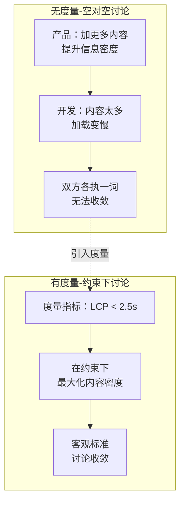
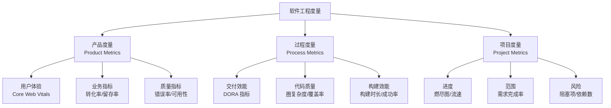
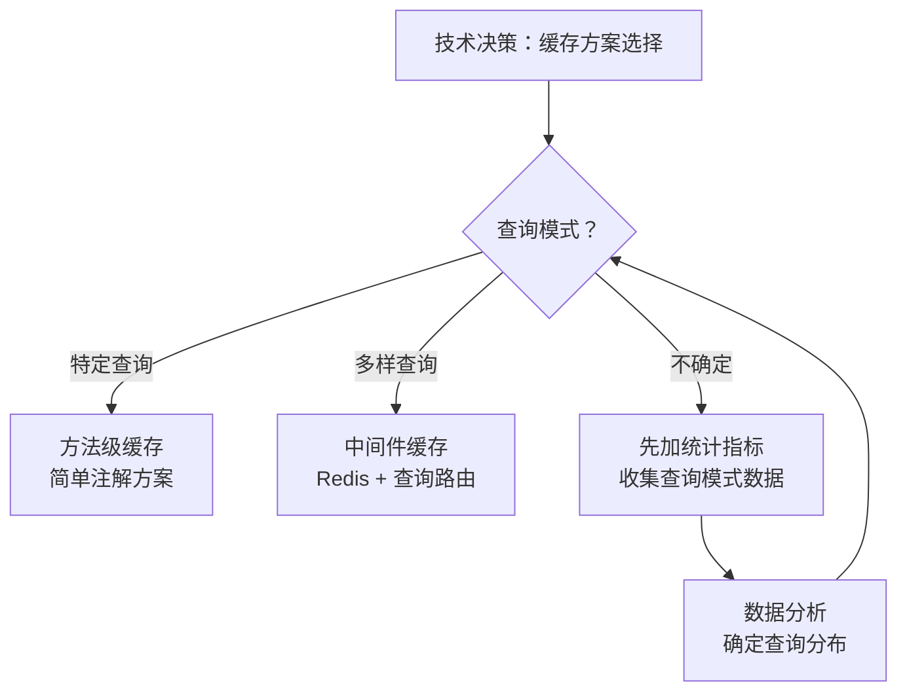
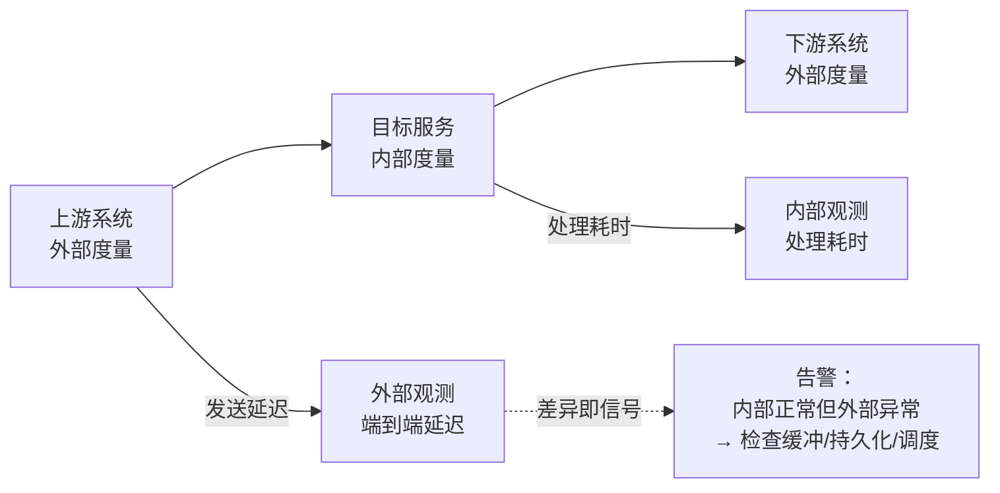
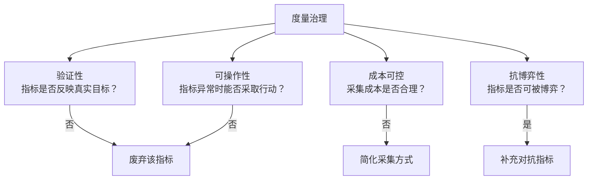
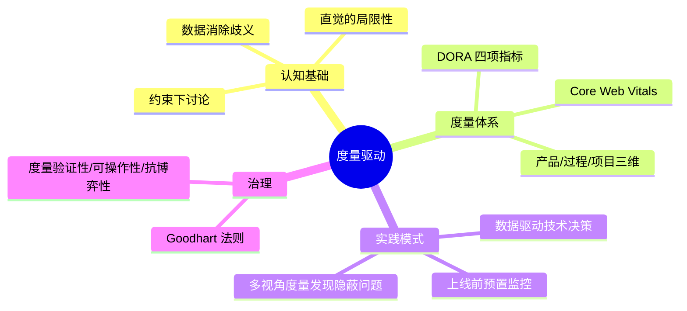

# 你的工作可以用数字衡量吗

## 核心命题

语言定义的"终"天然存在模糊性，而**数字是消除歧义的最有效手段**。在软件工程中，从"靠直觉讨论"到"用数据决策"的转变，是将主观争论转化为客观约束的关键。结合"以终为始"原则，应在着手工作之前**先设计度量指标**，使工作目标可量化、可验证、可追溯。

---

## 1. 度量驱动的认知基础

### 1.1 直觉的局限性与数据思维的必要性

人类认知系统存在两套决策模式：

| 模式 | 特征 | 适用场景 | 局限 |
|------|------|---------|------|
| **System 1（直觉）** | 快速、自动化、低能耗 | 简单、重复性判断 | 复杂场景下系统性偏差 |
| **System 2（分析）** | 缓慢、需主动调用、高能耗 | 复杂、多变量决策 | 认知负荷大，易疲劳 |

> 原文指出"所谓直觉，通常是一种洞见（Insight），洞见依赖于长期沉淀积累，本质上是一种内化的'大数据'"。这一观察与 Herbert Simon 的**专家直觉理论**一致——专家的直觉是模式匹配的结果，而非凭空产生。

**但在软件工程中，System 1 的适用边界极窄**：

- 系统行为涉及多变量交互（并发、网络、数据一致性）
- 人的直觉对非线性关系、概率分布、时间序列趋势的判断系统性失准
- "我觉得"式的讨论在信息不对称时无法收敛

### 1.2 从"空对空"到"约束下讨论"

原文的主页改版案例揭示了一个通用模式：

**度量指标的核心价值**：将主观争论转化为**约束优化问题**——在给定约束下最大化目标函数。

---

## 2. 软件工程中的度量体系

### 2.1 度量分类框架

### 2.2 DORA 指标：交付效能的黄金标准

DORA（DevOps Research and Assessment）四项指标是衡量软件交付效能的**行业标准**：

| 指标 | 定义 | 低效能 | 高效能 | 精英级 |
|------|------|--------|--------|--------|
| **Deployment Frequency** | 部署到生产的频率 | 低于每周一次 | 每天至少一次 | 按需（每天多次） |
| **Lead Time for Changes** | 提交→部署生产的耗时 | 1 周-1 个月 | 1 天-1 周 | < 1 小时 |
| **Change Failure Rate** | 部署导致故障的比例 | 40%-64% | 10%-15% | 约 5% |
| **MTTR** | 失败部署恢复时间（故障→恢复） | 1 周-1 个月 | < 1 天 | < 1 小时 |

> 注：阈值为 DORA 历年报告的集群分档口径（以 2021 报告四档基准为主），各年度分档数值会随调研样本浮动，使用时应以最新报告为准。

> **2024 DORA 报告关键发现**：精英级团队比例从 2023 年的 7% 提升至 2024 年的 18%，且**持续实施度量的团队在所有四项指标上均显著优于未实施团队**。

### 2.3 Core Web Vitals：用户体验的量化标准

Google 于 2020 年推出 Core Web Vitals，为用户体验提供了标准化度量：

| 指标 | 含义 | 良好阈值 | 度量方式 |
|------|------|---------|---------|
| **LCP（Largest Contentful Paint）** | 最大内容渲染时间 | < 2.5s | Performance Observer |
| **INP（Interaction to Next Paint）** | 交互响应延迟 | < 200ms | Event Timing API |
| **CLS（Cumulative Layout Shift）** | 累积布局偏移 | < 0.1 | Layout Instability API |

> 2024 年 3 月，FID（First Input Delay）被 INP 替代，因 INP 更准确地反映页面全生命周期的交互响应性。

---

## 3. 度量驱动的实践模式

### 3.1 技术决策的数据驱动

原文缓存方案案例的模式化：

**数据驱动决策的通用流程**：

1. **明确决策点**：需要做出什么选择？
2. **识别关键变量**：哪些数据能区分选项？
3. **采集数据**：埋点/日志/监控
4. **分析数据**：统计分布/趋势/异常
5. **基于数据决策**：消除"我觉得"式讨论

### 3.2 上线监控的预置指标

原文系统升级案例体现了**上线前预置监控**的实践：

| 阶段 | 预置指标 | 异常阈值 | 响应动作 |
|------|---------|---------|---------|
| **上线前** | 基线值采集 | - | 建立正常范围 |
| **灰度期** | 错误率、P99 延迟、QPS | 较基线偏移 > 2σ | 暂停灰度 |
| **全量期** | 同上 + 业务指标 | 较基线偏移 > 3σ | 触发回滚 |
| **稳定期** | 趋势监控 | 连续 30min 无回归 | 确认上线成功 |

### 3.3 从数字中发现问题：内部 vs 外部度量差异

原文揭示了一个重要模式——**多视角度量**：

> **原则**：永远不要只依赖单一视角的度量。内部度量与外部度量的差异，往往揭示系统中最隐蔽的问题。

---

## 4. 度量的反模式与治理

### 4.1 Goodhart 法则

> **Goodhart's Law**："当一个指标成为目标时，它就不再是一个好指标。" —— Charles Goodhart

软件工程中的典型反模式：

| 反模式 | 表现 | 后果 | 治理 |
|--------|------|------|------|
| **测试覆盖率崇拜** | 追求 100% 覆盖率但测试无断言 | 覆盖率高但质量低 | 覆盖率 + 变异测试（Mutation Testing） |
| **代码行数崇拜** | 以代码量衡量产出 | 鼓励冗余代码 | 改为度量功能交付速率 |
| **Story Point 通胀** | 估算值逐迭代增长 | 速率虚高 | 用 Lead Time 替代 Story Point |
| **告警疲劳** | 告警过多导致忽视 | 真正的告警被忽略 | 告警分级 + 去噪 |

### 4.2 度量治理框架

---

## 5. 总结

**核心要义**：问一下自己，我的工作是不是可以用数字衡量。如果无法度量，就无法改进；如果无法量化，就无法对齐。度量不是目的，而是**将主观争论转化为客观约束**的手段。

---

> **延伸阅读**
>
> - DORA State of DevOps Report (2024): https://dora.dev/research/
> - Google Core Web Vitals: https://web.dev/vitals/
> - Daniel Kahneman, *Thinking, Fast and Slow* (2011): System 1 vs System 2
> - Goodhart's Law: https://en.wikipedia.org/wiki/Goodhart%27s_law
> - Charity Majors, "Observability: The 5-Year Retrospective": https://www.honeycomb.io/blog/observability-retrospective

---

## 原文存档

> 以下为郑晔原文完整内容，保留作为参考。

## 09 | 你的工作可以用数字衡量吗？

今天的分享从日常工作开始。请你回想一下，你每天到岗之后做的第一件事是什么呢？然后你来猜猜我的答案是什么？你可能猜不到，我每天到公司之后，第一件正事是 **看数字**。

我现在服务于一家做数字资产的公司，我们提供的是一个24小时运行的服务。从加入这家公司的第一天开始，公司的人就给我不断灌输一个重要理念——看数字。在我座位的正前方，摆着一个巨大的显示器，上面展示着各种不断变换的曲线、柱状图和数字，这些数字反映的是各种系统运行的指标。

我们就是每天看着这些指标，来发掘一些线上系统问题的，一旦某些指标出现自己不能理解的异常，就要着手调查。

你或许会纳闷，我们不是在探讨“以终为始”吗？怎么变成了一个关于监控的讨论呢？别急，我们确实还在讨论“以终为始”，因为数字是诠释“终”的最好方式。

我们前面讨论了各种“终”，但通常靠语言定义的“终”，或多或少都会存在一些模糊的地方，也就是容易产生误解的地方。而数字却是一个明明白白的“终”。比如，测试覆盖率要求100%，即便你做到了99.9%，不达标就是不达标，没什么好说的，说破天也是不达标。

再比如，之前内容我们讲到精益创业时，提到了一个重要的反馈循环：开发（build）-测量（measure）-认知（learn）。你会发现，在这个循环中，开发（build）是可控的，认知（learn）必须是得到反馈之后才能有的。所以，这里面最需要我们回答的问题是测量（measure）。而这里的测量，最好的检验标准当然就是数字。

或许你会说，数字我们都很熟，还用讲吗？不过在我看来，你还真的未必习惯于使用数字。

### 熟悉而陌生的数字

从进化的角度来看，人们做事更多是依赖于直觉的。数字，是人类在非洲大草原上奔跑了许久之后才创造出来的东西。著名科普著作《从一到无穷大》的开篇有这么一个故事：

> 两个匈牙利贵族决定做一次数数的游戏，看谁说出的数字大。
>
> 一个贵族说：“好，那你先说吧！”
>
> 另一个绞尽脑汁想了好几分钟，说了一个数字：“3”。
>
> 现在轮到第一个贵族苦思冥想了，他想了一刻钟，然后说：“好吧，你赢啦!”

这个故事听起来有些荒诞，但一些非洲探险家证实，在某些原始部族里，不存在比3大的数词。如果问他们有几个孩子，而这个数字大于3的话，他就会回答“许多个”。

虽然我们中华民族是一个重视教育的民族，现在也都承认数学是一门重要的基础知识。但我们还是习惯性地观其大略，因为在日常生活领域里，除了买东西发工资，需要对数字斤斤计较的场合并不多。

历史的车轮在不停地滚滚向前，当今社会所面临的复杂度已经远远超过凭直觉就能把事情做好的程度。

**一些人说，自己靠直觉就能把事情做好，其实这是一种误解，因为那种所谓的直觉，通常是一种洞见（Insight），洞见很大程度上依赖于一个人在一个领域长期的沉淀和积累，而这其实是某种意义上的大数据。**

我们都在说，人类马上就要进入智能时代了。之所以这么说，主要是现在人工智能技术不断地向前发展着。而人工智能作为一门在50年代就已经问世的技术，直到最近几年才得到大踏步的前进，主要归功于基础设施的发展。

在人工智能领域，基于统计的方法早就在学术界提了出来，但由于当时的技术条件所限，人们的数据采集和存储能力都有限，当时的“大”数据和今天的大数据完全不是一个量级的概念。

直到进入到互联网时代，随着处理数据量的增加，基础设施在不断地拓展，进而促使人们采集更多的数据，这个正向反馈也造就了今天的大数据。

原本因为缺乏足够数据支撑，难以施展拳脚的 AI 算法，在今天一下子有了足够的表演空间，从一个边缘角色成为了舞台中心的主角。

今天谈到人工智能，人们主要会谈三件事： **算法、算力和数据。** 算法几乎是行业共有的，而算力在云计算普及的今天也不再是稀缺资源，所以，数据几乎成了兵家必争之“物”。于是，我们看到的现象是各个公司都在努力地搜集各种数据，让数据成为自己的竞争力。所以，在大方向上，数据采集是一个行业共识。

但是，作为这个世界上最了解数据价值的一批人，我们程序员只是在努力地把数据用于不断改善别人的生活，而对于自己日常工作的改善，则思考得少之又少。

我们更习惯的讨论方式依然是靠直觉。比如：增加了这个特性 **可能** 会让用户增长，做了这个调整 **应该** 会让系统的压力变小。

在一些简单的情形下，或者说大家信息对称、知识背景相差无几的情况下，这样的讨论是很容易得到认同的。 **而当事情复杂到一定程度时，简单地靠感觉是很难让人相信的。**

所以，在我们的工作中，经常会发生的一个现象是，一个人说，我觉得这个有作用，另一个人说，我觉得那个没有。几个“觉得”下来，双方就开始进入了隔空对话的环节，谁也无法说服谁。

如果换成用数字的方式进行讨论，效果就会更好。有一次，为了改善用户体验，我们准备进行一次主页改版。产品团队希望在主页上加上大量的内容，而开发团队则认为太多的内容会导致主页加载变慢，进而造成用户体验下降。

正当这个对话即将进入“空对空”的讨论之时，我们找到了一个测量指标：主页加载速度。只要保证主页加载速度，产品团队就可以按照自己的理解来做调整。于是，一个即将不可挽回的讨论，变成了在一定约束条件下的讨论，双方谁也不再思维发散，讨论就能继续推进了。

如果你认同了数据本身的价值，那么再结合“以终为始”的理念，我们就应该在着手做一件事之前，先来想怎么去测量。无论是在讨论产品特性，还是功能开发，“信口雌黄”是容易的，落到数字上，人们就会多想一下，这是对彼此的约束。

### 从数字出发

前面的内容我们都是在说应该重视测量指标，重视数字。接下来，我就分享下几个我在实际工作中运用数字的案例，让你看看习惯用数字去思考问题之后，会拓宽哪些思考的维度。

首先是基于数字进行技术决策。有一次，我们打算做一个技术改进，给系统增加一些缓存，减轻数据库的压力。大家一起设计了两个技术方案。如果查询是特定的，我们就准备简单地在某些方法上加上缓存；如果查询是五花八门的，就准备用一个中间件，使用它的查询方案。

系统现在的情况到底是什么样的呢？我们发现并不能立刻回答这个问题。于是，大家决定在系统中增加一些统计指标，让数据给我们答案。然后根据数据反映出的情况，进行具体的决策。

其次是一个准备上线的案例。当时，我们是要做一个影响力比较大的系统升级，因为这是一个系统的关键模块，上下游系统都会受到影响。

谁也不能确定哪个模块会在上线过程中出问题。于是，设计了一个全新的数据面板，将相关的几个模块的核心指标都摆在上面。而我们要做的就是在上线的同时，观察这些指标的变化。

所幸的是，这次上线影响不大，几个指标一路平稳，而大家的信心就源自这些提前准备好的指标。

再次，看一个从数字中发现问题的例子。由于各种历史原因，我们的重点指标面板上，会有几个指标表示的是类似的东西。

比如，某个模块的处理能力，一个指标是站在这个模块内部度量的，而另一个指标则是由这个模块上下游系统度量的。在大多数情况下，它们的表现是一致的。结果有一天两者突然出现了很大的差异，内部度量表现依然良好，而外部度量则出现了很大的延迟。

于是，我们开始追问为什么。一路追寻下来，我们发现，是这个模块内部需要定期将内部状态持久化下来，而在那个时间段内，这个模块就会停止从上游读取数据。所以，在内部看一切正常，而外部看则延迟较大。随后，我们找到了方案，解决了这一问题。

最后再说一个行业中的例子，据我所知，行业里的某些公司已经开始做所谓的 AIOps，也就是通过人工智能的方式，从数据中，发现更多运维的问题。无论哪种做法，都是为了 **从数字中发现问题，让系统更稳定。**

我的一个同事有个观点非常值得玩味，他说，从数字上看，好的系统应该是“死水一潭”。

我是赞同这个观点的，因为出现波动尤其是大幅度波动，又不能给出一个合理解释的话，就说明系统存在着隐患。而让系统稳定，正是我们工作的一个重要组成部分。

回到本文的开头，我说每天工作中的一个重要组成部分就是看数字，其实就是在尝试着从数字的趋势中发现问题，如今团队已经习惯了“给个数字看看”这样的沟通方式，内部扯皮的机会也相应地减少了一些。

### 总结时刻

随着智能时代的来临，人类社会开始逐渐认识到数据的重要性。但我们这群 IT 人在通过数据为其他人服务的同时，却很少把数字化的思维带到自己的工作范围内。这也是工作中很多“空对空”对话的根源所在。

结合着“以终为始”的思考，如果我们可以在一开始，就设计好测量工作有效性的指标，那么就可以更有目的性地去工作了。

而如果我们习惯了用数字去思考，就可以在很多方面让数字帮助我们。我举了几个小例子，比如：基于数据进行技术决策、预先设定系统指标，以及发现系统中的问题等等。希望你也可以把数字思维带到你的日常工作中。

如果今天的内容你只记住一件事，那请记住： **问一下自己，我的工作是不是可以用数字衡量。**

最后，我想请你分享一下，你的工作中，有哪些应用数字解决问题的场景呢？

感谢阅读，如果你觉得这篇文章对你有帮助的话，也欢迎把它分享给你的朋友。