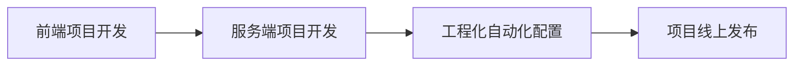
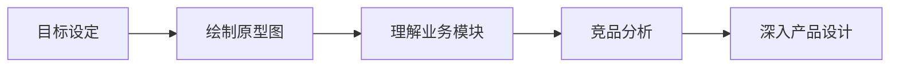
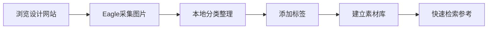

# 原型设计理论基础

## 概述

原型设计是前端工程师从"代码执行者"向"全栈思维"进阶的必备能力。本文阐述前端工程师学习原型设计的必要性，对比主流原型工具，梳理设计参考资源与素材管理方法，并深入介绍竞品分析方法论和版权合规要点。

## 前置知识

- 完成 [09-项目管理与维护](09-项目管理与维护.md) 的学习
- 了解基本 UI/UX 设计概念
- 有 Web 页面布局基础认知

## 学习目标

- 理解前端工程师学习原型设计的职业价值
- 了解主流原型工具的特点与适用场景
- 掌握设计参考资源与素材管理方法
- 熟练运用竞品分析方法论

---

## 一、全栈能力培养与原型设计

### 1.1 前端工程师能力链路



培养目标：熟悉前端综合性解决方案，强化知识点综合应用能力，掌握完整开发流程。

### 1.2 为什么前端工程师需要绘制原型图

| 职业发展方向 | 理由 |
|------------|------|
| 管理路线 | 了解所有开发工作流程，便于会议沟通和跨部门协作 |
| 技术路线 | 深入理解需求，掌握业务逻辑，提升技术深度 |

### 1.3 学习需求的方法论



核心要求：原型图只需要表达线框关系即可，不需要过于精细的设计。

---

## 二、原型图绘制工具对比

| 工具名称 | 价格 | 协作 | 学习曲线 | 模板功能 | 推荐场景 |
|---------|------|------|---------|---------|---------|
| 即时设计 | 免费为主 | 支持 | 低 | 组件库 | 初学者、团队协作 |
| ProcessOn | 免费受限 | 支持 | 低 | 便签本 | 简单流程图、原型 |
| Axure RP | 付费 | 不支持 | 高 | Master | 专业原型、交互设计 |
| 墨刀 | 免费受限 | 支持 | 中 | 组件库 | 快速原型 |
| 蓝湖 | 付费为主 | 支持 | 中 | 无 | 设计协作 |

**选择原则**：只需能清晰表达线框关系即可，不必拘泥于特定工具。

推荐方案：
- 初学者：ProcessOn 或即时设计（免费、易上手）
- 专业需求：Axure RP（功能全面）
- 团队协作：蓝湖或即时设计

---

## 三、设计参考资源

### 3.1 设计灵感网站

| 网站 | 特点 | 使用方法 |
|------|------|---------|
| 站酷 (ZCOOL) | 海量设计作品，分类明确 | 发现→网页→企业官网/响应式网站 |
| 大作网 | 设计素材丰富，支持分类搜索 | 搜索关键词：企业首页、企业官网 |
| 花瓣网 | 用户采集整理的图片集合 | 搜索画板、关注优质画板、一键采集 |

### 3.2 素材资源网站

| 网站 | 特点 | 注意事项 |
|------|------|---------|
| 千图网 | 素材种类丰富 | 商用需购买会员 |
| 昵图网 | 图片素材库 | 商用需要授权，版权保护严格 |

---

## 四、设计资源管理

### 4.1 图片采集工具：Eagle



核心功能：网页图片一键采集、本地分类管理、标签系统、快速浏览。

### 4.2 素材库分类建议

```
设计素材库/
├── 首页设计/
│   ├── 企业官网
│   ├── 电商首页
│   └── 知识付费
├── 配色方案/
│   ├── 商务风
│   ├── 科技风
│   └── 活力风
└── 组件设计/
    ├── 导航栏
    ├── 轮播图
    └── 卡片组件
```

标签维度：项目类型、设计风格、组件类型、配色方案。

---

## 五、竞品分析方法论

### 5.1 首页设计通用模式

| 区域 | 内容 | 占比 |
|-----|------|-----|
| 顶部导航 | Logo、菜单、用户操作 | 10% |
| 轮播图 | 广告、推荐内容 | 40-50% |
| 内容区 | 课程/产品展示 | 30-40% |
| 底部 | 公司信息、外链 | 10-20% |

### 5.2 竞品分析四维度

| 分析维度 | 关注点 |
|---------|--------|
| 信息架构 | 导航层级、内容分类、用户路径 |
| 视觉设计 | 配色方案、排版布局、图标风格 |
| 交互体验 | 动画效果、操作反馈、加载策略 |
| 功能模块 | 核心功能、辅助功能、特色功能 |

---

## 六、版权注意事项

### 6.1 常见风险场景

| 风险类型 | 说明 | 后果 |
|---------|------|-----|
| 未授权使用 | 直接使用网络图片 | 法律诉讼、赔偿 |
| 授权过期 | 会员素材过期使用 | 侵权风险 |
| 修改使用 | 修改他人作品使用 | 仍需授权 |

### 6.2 免费商用资源

| 类型 | 网站 | 说明 |
|-----|------|------|
| 图片 | Unsplash | 高质量免费图片 |
| 图片/视频 | Pexels | 免费商用素材 |
| 图标 | Iconfont | 阿里巴巴图标库 |
| 图标 | Font Awesome | 开源图标字体 |
| 字体 | Google Fonts | 免费开源字体 |
| 插画 | unDraw | 免费 SVG 插画 |

### 6.3 安全使用建议

1. **购买正版授权**：购买素材网站会员或使用免费可商用素材
2. **使用免费资源**：优先使用上述免费商用网站
3. **原创设计**：自行拍摄图片、原创图标设计

---

## 常见问题

| 问题 | 解决方案 |
|------|---------|
| 不知道如何下手设计 | 先浏览参考网站，收集 10+ 同类设计，总结共性 |
| 设计工具不熟悉 | 选择在线工具（即时设计/ProcessOn），边用边学 |
| 缺乏设计灵感 | 使用 Eagle 建立素材库，定期浏览整理 |
| 担心版权问题 | 使用免费商用资源网站，或购买正版授权 |
| 原型图过于精细 | 记住目标：表达线框关系即可，不要过度设计 |

## 最佳实践

1. **建立素材管理习惯**：使用 Eagle 分类整理，每周更新
2. **竞品先行**：绘制原型前先分析 3-5 个竞品网站
3. **线框优先**：原型图表达结构关系，不追求视觉精美
4. **版权合规**：商业项目必须使用正版或免费商用资源
5. **持续积累**：每日浏览站酷/花瓣，采集 5-10 张优秀设计

## 延伸阅读

- 即时设计官方教程：https://js.design/
- Axure RP 中文教程：https://www.axure.com.cn/
- Material Design 设计规范：https://material.io/design
- Ant Design 设计语言：https://ant.design/docs/spec/introduce-cn
- 《About Face 4：交互设计精髓》
- 《设计心理学》- 唐纳德·诺曼
- 《用户体验要素》- Jesse James Garrett

---

**上一篇**：[09-项目管理与维护](09-项目管理与维护.md)  
**下一篇**：[13-原型设计工具实战](13-原型设计工具实战.md)
