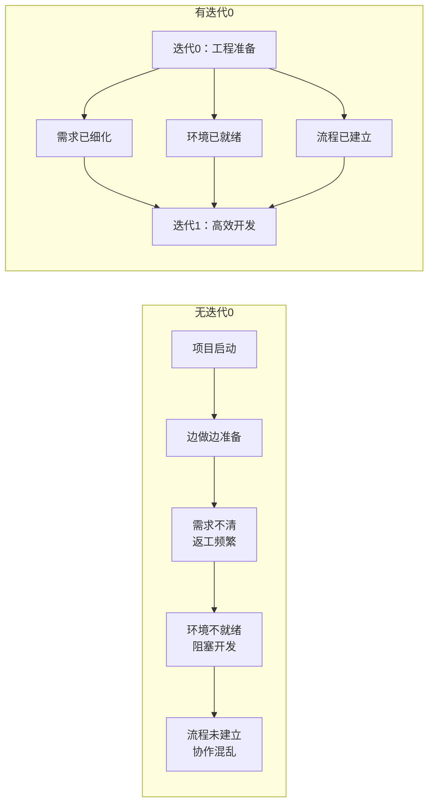
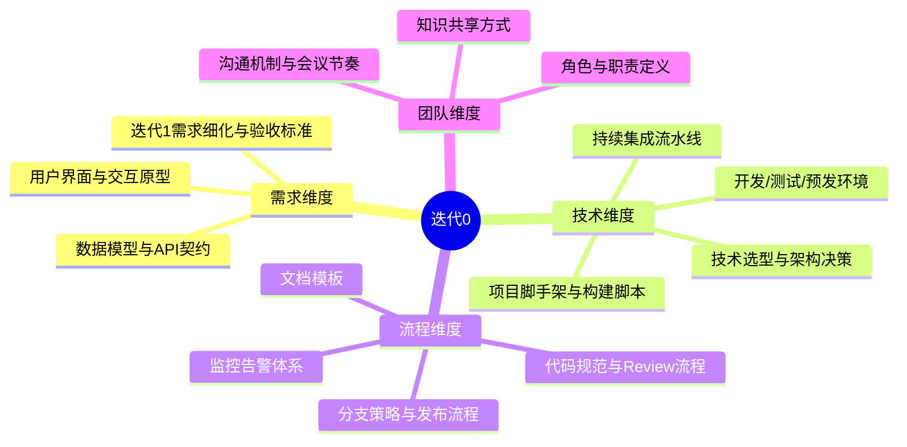
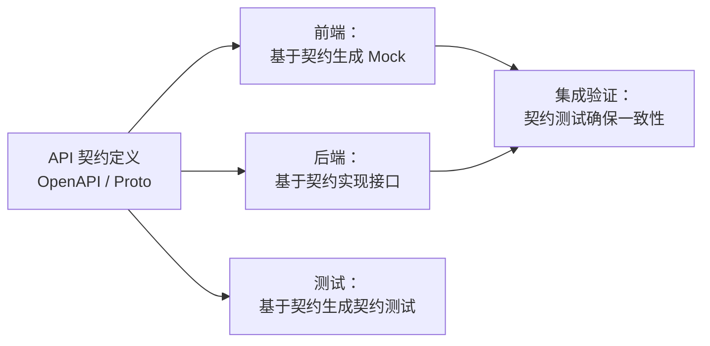
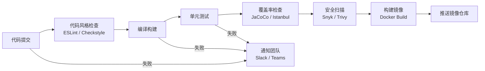
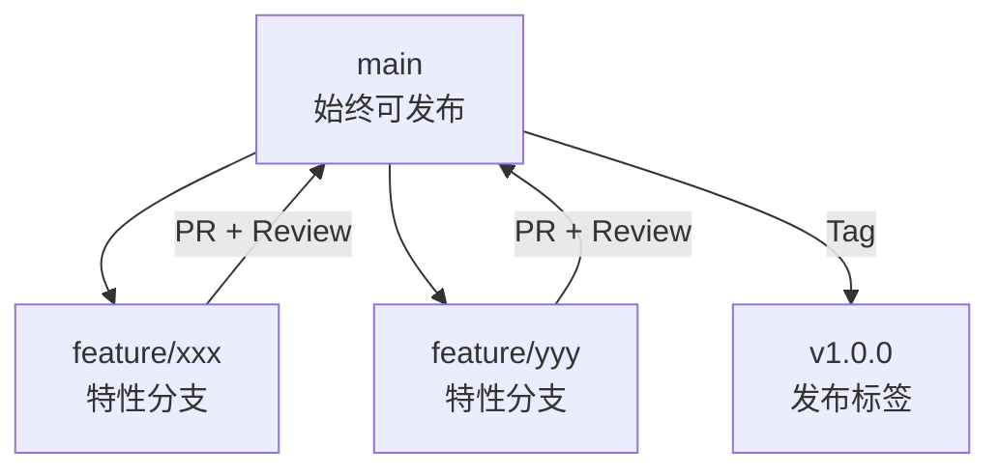
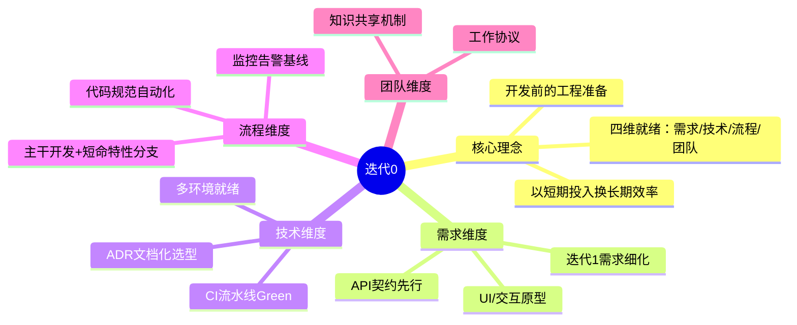
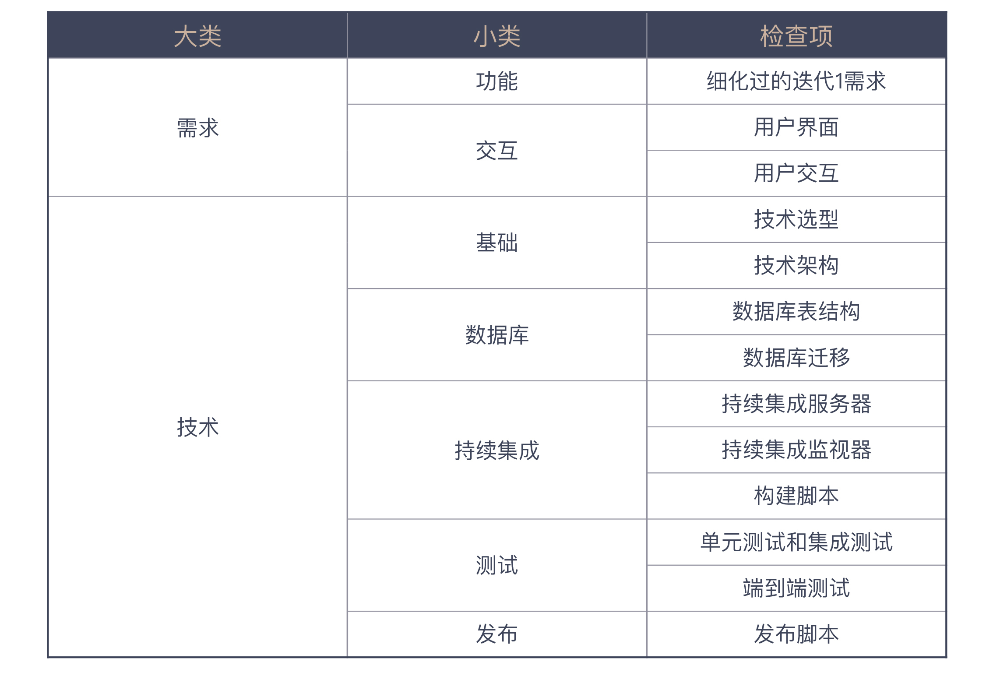

# 迭代0：启动开发之前，你应该准备什么

## 核心命题

迭代0（Iteration Zero）是项目正式启动前的**工程准备阶段**，其目标是在编码开始之前，将需求、技术、流程、团队四个维度的基础设施就绪。迭代0的质量直接决定了后续迭代的节奏稳定性——**"磨刀不误砍柴工"的本质，是以短期投入换取长期效率**。

---

## 1. 迭代0的定义与定位

### 1.1 为什么需要迭代0

### 1.2 迭代0的四维准备框架

---

## 2. 需求维度准备

### 2.1 迭代1需求细化

| 步骤 | 活动 | 产出物 |
|------|------|--------|
| ① 需求分解 | 将 Epic 拆分为 User Story | Product Backlog |
| ② 优先级排序 | 基于 MVP 目标确定优先级 | 优先级排列的 Backlog |
| ③ 迭代1范围确定 | 选择最高优先级需求 | Sprint Backlog（迭代1） |
| ④ 需求细化 | 定义验收标准（Acceptance Criteria） | 可执行的 User Story |
| ⑤ 契约定义 | API 契约先行（Consumer-Driven Contract） | OpenAPI / gRPC Proto |

### 2.2 用户界面与交互原型

现代原型工具链：

| 工具 | 特点 | 适用场景 |
|------|------|---------|
| **Figma** | 协作设计、组件库、Design Token | UI 设计与交互原型 |
| **Storybook** | 组件级原型、视觉回归测试 | 前端组件开发 |
| **Moco / WireMock** | API 模拟服务器 | 前后端并行开发 |

### 2.3 API 契约先行（Contract-First）

**API 契约工具生态**：

- **OpenAPI 3.1**（REST）：Swagger Editor、Prism（Mock Server）、Spectral（Lint）
- **gRPC / Protocol Buffers**：grpcurl、Buf（Lint + Breaking Change Detection）
- **GraphQL**：GraphQL Schema、Apollo Federation

---

## 3. 技术维度准备

### 3.1 基本技术准备清单

| 类别 | 准备项 | 现代工具/实践 |
|------|--------|-------------|
| **技术选型** | 语言、框架、数据库、中间件 | ADR（Architecture Decision Record）文档化 |
| **架构决策** | 分层架构、模块划分、部署架构 | C4 Model 架构图 |
| **项目脚手架** | 初始项目结构 | Nx Monorepo / Turborepo / Spring Initializr |
| **数据库** | Schema 定义、迁移脚本 | Flyway / Liquibase / Prisma Migrate |
| **构建脚本** | 编译、测试、打包、检查 | Gradle / Maven / pnpm / Bazel |

### 3.2 持续集成流水线

迭代0中 CI 流水线的最低要求：

**CI 可视化**：部署 CI 监视器（如 Buildkite Dashboard、Grafana CI Dashboard），确保构建失败时全团队即时感知。

### 3.3 开发环境就绪

| 环境 | 用途 | 就绪标准 |
|------|------|---------|
| **本地开发环境** | 开发与调试 | 一键启动（`docker compose up` / `devcontainer`） |
| **CI 环境** | 自动化构建与测试 | 流水线 Green |
| **测试环境** | 集成测试与 QA | 与生产环境配置一致 |
| **预发环境（Staging）** | 发布前验证 | 与生产环境同构 |

> **DevContainer 实践**：通过 `.devcontainer/devcontainer.json` 定义开发环境，确保团队成员环境一致性，消除"在我机器上能跑"的问题。

---

## 4. 流程维度准备

### 4.1 代码规范与自动化检查

| 规范类别 | 工具 | 集成方式 |
|----------|------|---------|
| **代码风格** | Prettier / google-java-format | Pre-commit Hook + CI |
| **静态分析** | SonarQube / ESLint / Pylint | CI Pipeline |
| **安全扫描** | Snyk / Trivy / Semgrep | CI Pipeline + PR Check |
| **提交规范** | Conventional Commits + commitlint | Pre-commit Hook |
| **依赖安全** | Dependabot / Renovate | 自动 PR |

### 4.2 分支策略

**推荐策略**：Trunk-Based Development（主干开发）+ Short-Lived Feature Branch（< 24h）

### 4.3 监控告警体系

迭代0需建立基础监控：

| 层级 | 监控类型 | 工具 |
|------|---------|------|
| **基础设施** | CPU / 内存 / 磁盘 / 网络 | Prometheus + Grafana |
| **应用** | 错误率 / 延迟 / QPS / 饱和度 | OpenTelemetry + Jaeger |
| **业务** | 核心业务指标 | 自定义 Metrics + Dashboard |
| **日志** | 结构化日志聚合 | ELK / Loki + Grafana |

---

## 5. 团队维度准备

### 5.1 工作协议（Working Agreement）

| 协议项 | 示例内容 |
|--------|---------|
| **核心工作时间** | 10:00-16:00 无会议，专注开发 |
| **每日站会** | 9:30，15 分钟，3 个问题 |
| **Code Review SLA** | PR 提交后 4 小时内 Review |
| **构建失败 SLA** | 发现失败后 30 分钟内修复 |
| **文档规范** | ADR / README / API Doc 模板 |

### 5.2 知识共享机制

| 机制 | 形式 | 频率 |
|------|------|------|
| **Tech Talk** | 团队内技术分享 | 双周 |
| **Architecture Decision Record** | 架构决策记录 | 按需 |
| **Retrospective** | 回顾与改进 | 每迭代 |
| **Pair/Mob Programming** | 结对/群体编程 | 按需 |

---

## 6. 迭代0完整检查清单

| 维度 | 检查项 | 状态 |
|------|--------|------|
| **需求** | 迭代1需求已细化，验收标准已定义 | ☐ |
| **需求** | 用户界面/交互原型已完成 | ☐ |
| **需求** | API 契约已定义 | ☐ |
| **技术** | 技术选型已确定并文档化（ADR） | ☐ |
| **技术** | 项目脚手架已创建 | ☐ |
| **技术** | CI 流水线已建立且 Green | ☐ |
| **技术** | 开发/测试/预发环境已就绪 | ☐ |
| **技术** | 数据库 Schema 与迁移脚本已准备 | ☐ |
| **流程** | 代码规范已配置并自动化检查 | ☐ |
| **流程** | 分支策略与发布流程已约定 | ☐ |
| **流程** | 监控告警已建立基础覆盖 | ☐ |
| **团队** | 工作协议已达成 | ☐ |
| **团队** | 知识共享机制已建立 | ☐ |

---

## 7. 总结

迭代0的本质是**在编码开始之前，建立项目的"操作系统"**——需求、技术、流程、团队四维就绪，使后续迭代专注于价值交付而非环境搭建。

**核心要义**：磨刀不误砍柴工——迭代0的投入，是项目可持续交付的基石。没有迭代0的团队，将在后续每个迭代中为"准备不足"支付复利。

---

> **延伸阅读**
>
> - Architecture Decision Records (ADR): https://adr.github.io/
> - C4 Model: https://c4model.com/
> - GitHub Dev Containers: https://containers.dev/
> - OpenTelemetry: https://opentelemetry.io/
> - Trunk-Based Development: https://trunkbaseddevelopment.com/

---

## 原文存档

> 以下为郑晔原文完整内容，保留作为参考。

## 10 | 迭代0: 启动开发之前，你应该准备什么？

关于“以终为始”，我们已经从各个方面讲了很多。你或许会想，既然我们应该有“以终为始”的思维，那么在项目刚开始，就把该准备的东西准备好，项目进展是不是就能稍微顺畅一点儿呢？

是这样的，事实上这已经是一种常见的实践了。今天，我们就来谈谈在一开始就把项目准备好的实践： **迭代0**。

为什么叫迭代0呢？在“敏捷”已经不是新鲜词汇的今天，软件团队对迭代的概念已经不陌生了，它就是一个完整的开发周期，各个团队在迭代上的差别主要是时间长度有所不同。

一般来说，第一个迭代周期就是迭代1，然后是迭代2、迭代3，依次排列。从名字上你就不难发现，所谓迭代0，就是在迭代1之前的一个迭代，所以，我们可以把它理解成开发的准备阶段。

既然迭代0是项目的准备阶段，我们就可以把需要提前准备好的各项内容，在这个阶段准备好。事先声明， **这里给出的迭代0，它的具体内容只是基本的清单**。在了解了这些内容之后，你完全可以根据自己项目的实际情况，扩展或调整这个清单。

好，我们来看看我为你准备的迭代0清单都包含了哪些内容。

### 需求方面

#### 1\. 细化过的迭代1需求

一个项目最重要的是需求，而在迭代0里最重要的是，弄清楚第一步怎么走。当我们决定做一个项目时，需求往往是不愁的，哪些需求先做、哪些需求后做，这是我们必须做的决策。迭代0需要做的事，就是把悬在空中的内容落到地上。

在需求做好分解之后，我们就会有一大堆待开发的需求列表。注意，这个时候需求只是一个列表，还没有细化。因为你不太可能这个时候把所有的内容细化出来。如果你做过 Scrum 过程，你的 backlog 里放的就是这些东西。

然后，我们要根据优先级从中挑出迭代1要开发的需求，优先级是根据我们要完成的最小可行产品（minimum viable product，MVP）来确定的，这个最小可行产品又是由我们在这个迭代里要验证的内容决定的。一环扣一环，我们就得到了迭代1要做的需求列表。

确定好迭代1要做的需求之后，接下来就要把这些需求细化了，细化到可执行的程度。前面讲 [用户故事](https://time.geekbang.org/column/article/75100) 时，我们已经说过一个细化需求应该是什么样子的，这里的关键点就是要把验收标准定义清楚。

所以，我们要在迭代0里，根据优先级来确定迭代1要做的需求，然后进行细化。

#### 2. 用户界面和用户交互

如果你的项目是一个有用户界面的产品，给出用户界面，自然也是要在迭代0完成的。另外，还有一个东西也应该在迭代0定义清楚，那就是用户交互。

我见过很多团队只给出用户界面，然后，让前端程序员或者 App 程序员根据界面去实现。程序员实现功能没问题，但定义交互并不是程序员这个角色的强项，它应该是需求的一部分。

如何让用户用着舒服，这是一门学问。我们在市面上看到很多难用的网站或 App，基本上都是程序员按照自己习惯设计出来的。

现如今，我们可以很容易地在市面上找到画原型的工具，某些工具用得好的话，甚至可以达到以假乱真的地步。如果能再进一步的话，甚至可以用一些模拟服务器的工具，把整个交互的界面都做出来。作为 Moco 这个模拟服务器的开发者，我很清楚，一个原型可以达到怎样的高度。

所以，一个有用户界面的项目需要在迭代0中给出用户界面和用户交互。

### 技术方面

#### 1\. 基本技术准备

技术方面，需要在项目一开始就准备好的事比较多。其中有一些是你很容易想到的，比如：在进入迭代1开始写代码之前，我们需要确定技术选型，确定基本的技术架构等等。也许你还能想到，数据库表结构也是这个阶段应该准备的。

确实，这些东西都应该是在一个项目初期准备的，也是大家容易想到的。接下来，我来补充一些大家可能会遗漏的。

- 持续集成

对于持续集成，我们通常的第一反应是搭建一个持续集成服务器。没错，但还不够。这里的重点其实是构建脚本。因为持续集成服务器运行的就是构建脚本。

那要把什么东西放在构建脚本里呢？最容易想到的是编译打包这样的过程。感谢现在的构建工具，它们一般还会默认地把测试也放到基本的构建过程中。

但仅有这些还是不够，我们还会考虑把更多的内容放进去，比如：构建 IDE 工程、代码风格检查、常见的 bug 模式检查、测试覆盖率等等。

持续集成还有一个很重要的方面，那就是持续集成的展示。为什么展示很重要？当你的持续集成失败时，你怎么发现呢？

一个简单的解决方案是：摆个大显示器，用一个 CI Monitor 软件，把持续集成的状态展示在上面。更有甚者，会用一个实体的灯，这样感官刺激更强一些。

在“以终为始”这个模块中，我们提到集成的部分时，只讲了要做持续集成，后面我们还会再次讲到持续集成，和你说说持续集成想做好，应该做成什么样子。

- 测试

测试是个很有趣的东西，程序员对它又爱又恨。一般来说，运行测试已经成为现在很多构建工具的默认选项，如果你采用的工具没有这个能力，建议你自己将它加入构建脚本。

让你为一个项目补测试，那是一件非常痛苦的事，如果在一开始就把测试作为规范加入进去的话，那么在边开发边写测试的情况下，相对来说，写测试痛苦度就低多了，团队成员也就容易遵守这样的开发规范。

**把测试当作规范确定下来的办法就是把测试覆盖率加入构建脚本。**

大多数团队提起测试，尤其是开发者测试，多半想到的都是单元测试和集成测试。把整个系统贯穿在一起的“端到端测试”却基本上交给其他人来做，也有不少团队是交给测试团队专门开发的特定程序来做。

在今天的软件开发中，有一些更适合描述这类测试的方法，比如BDD，再比如Specification by Example。你可以简单地把它们理解成一种描述系统行为的方式。还有一点做得好的地方是，有一些软件框架很好地支持了这种开发方法，比如Cucumber。如果你有这种测试，不妨也将它加入构建脚本。

#### 2.发布准备

- 数据库迁移

如果你做的是服务器端开发，多半离不开与数据库打交道。只要是和数据库打交道，强烈建议你把数据库变更管理起来。

管理数据库变更的方式曾是很多团队面临的困扰。好在现在已经有了很多工具支持，比如，我最近喜欢的工具是 flyway，它可以把每一次数据库变更都当作一个文件。这样一来，我们就可以把数据库变更放到版本控制工具里面，方便进行管理。

管理变更有几种不同的做法，一种是每个变更是一个文件，一种是每一次发布是一个文件。各有各的好处，你可以根据需要，自行选择。

- 发布

技术团队擅长做功能开发，但上线部署或打包发布却是很多团队在前期最欠考量的内容，也是很多团队手忙脚乱的根源。

如果一开始就把部署或发布过程自动化，那么未来的生活就会轻松很多。如果你采用的是 Docker，就准备好第一个可以部署的 Dockerfile；如果是自己部署，就编写好 Shell 脚本。

其实你会发现，上面提到的所有内容即便不在迭代0做，在项目的各个阶段也会碰到。而且一般情况下，即便你在迭代0把这些工作做好了，后续依然要不断调整。但我依然建议你在迭代0把这些事做好，因为它会给你的项目定下一个基调，一个自动化的基调。

### 日常工作

最后，我们来看一下，如果在迭代0一切准备就绪，你在迭代1应该面对的日常工作是什么样的。

> 你从已经准备好的任务卡中选了一张，与产品经理确认了一些你不甚清楚的几个细节之后，准备实现它。你从代码仓库更新了最新的代码，然后，开始动手写代码。

> 这个任务要在数据库中添加一个字段，你打开开发工具，添加了一个数据库迁移文件，运行了一下数据库迁移工具，一切正常，新的字段已经出现在数据库中。

> 这个任务很简单，你很快实现完了代码，运行一下构建脚本，代码风格检查有个错误，你顺手修复了它。再运行，测试通过了，但测试覆盖率不够，你心里说，偷懒被发现了。不过，这是小事，补几个测试就好了。一切顺利！

> 你又更新了一下代码，有几个合并的问题。修复之后，再运行构建脚本，全过，提交代码。

> 你伸了一个懒腰，完成任务之后，你决定休息片刻。忽然，持续集成的大屏幕红了，你的提交搞砸了。你立刻看了一下代码，有一个新文件忘提交了，你吐了一下舌头赶紧把这个文件补上了。不一会儿，持续集成大屏幕又恢复了代表勃勃生机的绿色。

> 你休息好了，准备开始拿下下一个任务。

这就是一个正常开发该有的样子，在迭代0时，将准备工作做好，后续你的一切工作就会变得井然有序，出现的简单问题会很快地被发现，所有人都在一种有条不紊的工作节奏中。

### 总结时刻

在本文中，我给你介绍了迭代0的概念，它是在正式开发迭代开始之前，进行一些基础准备的实践。我给了一份我自己的迭代0准备清单，这份清单包含了需求和技术两个大方面，你可以参照它设计你自己的迭代0清单。

根据我的经验，对比这个清单，大多数新项目都在一项或几项上准备得不够充分。 **即便你做的不是一个从头开始的项目，对照这个清单，也会发现项目在某些项上的欠缺，可以有针对性地做一些补充。**

如果今天的内容你只记住一件事，那么请记住： **设计你的迭代0清单，给自己的项目做体检。**

最后，我想请你思考一下，如果让你来设计迭代0清单，它会包含哪些内容呢？

感谢阅读，如果你觉得这篇文章对你有帮助的话，也欢迎把它分享给你的朋友。