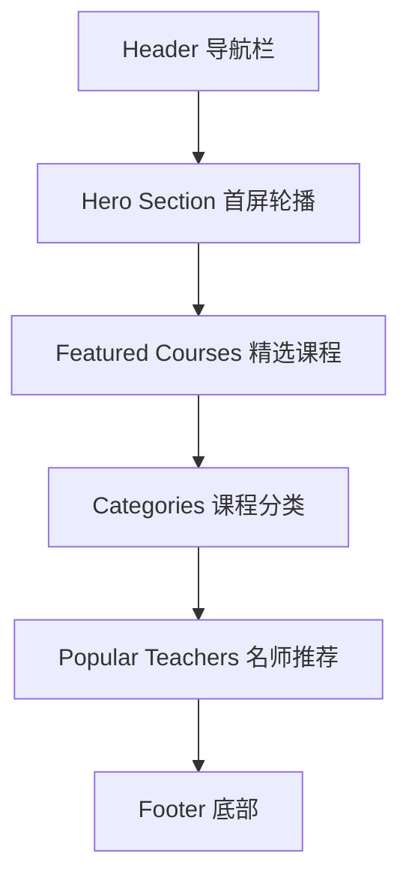
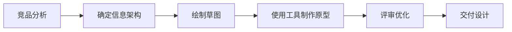
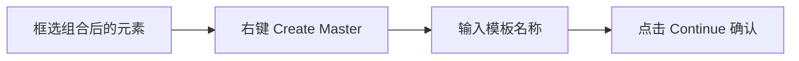
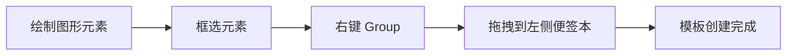

# 原型设计工具实战

## 概述

本文以知识付费平台首页为实战案例，详细讲解 Axure RP 的界面操作、Master 模板创建与复用、ProcessOn 便签本功能、版本管理方法以及内容区域宽度规范，帮助工程师快速掌握原型设计的核心工作流。

## 前置知识

- 完成 [11-原型设计理论基础](11-原型设计理论基础.md) 的学习
- 了解基本的 UI 布局概念（Header/Content/Footer）
- 已安装 Axure RP 或注册即时设计账号

## 学习目标

- 掌握 Axure RP 界面布局与基础操作
- 熟练创建和使用 Master 模板
- 了解 ProcessOn 便签本模板功能
- 建立版本管理与变更记录习惯

---

## 一、实战案例：知识付费首页原型设计

### 1.1 首页结构规划



| 模块 | 内容 |
|------|------|
| Header | Logo、导航菜单、搜索框、用户操作（登录/注册） |
| Hero Section | 轮播图（课程推荐/活动广告） |
| Featured Courses | 课程卡片列表 |
| Categories | 分类导航 |
| Popular Teachers | 教师卡片 |
| Footer | 公司介绍、友情链接、版权信息 |

### 1.2 设计流程



---

## 二、Axure RP 界面与基础操作

### 2.1 界面布局

```
┌────────────────────────────────────────────┐
│              顶部菜单栏                      │
├──────┬─────────────────────────┬───────────┤
│      │                         │           │
│ 页面 │      中间绘图区域         │  右侧属性  │
│ 目录 │                         │  面板      │
│      │                         │           │
└──────┴─────────────────────────┴───────────┘
```

核心特点：
- 支持创建目录结构（多页面管理）
- 支持模板功能（Master）
- 本地客户端，离线可用
- 功能强大，适合专业原型设计

### 2.2 创建项目基础模板

**步骤一：设置页面尺寸**

推荐尺寸：1920 x 1080（标准屏幕分辨率）

操作：创建矩形框 → 设置宽度 1920px → 设置高度 1080px → 作为首页边界

**步骤二：划分页面结构**

| 区域 | 高度 | 说明 |
|------|------|------|
| Header | 80px | 头部导航 |
| Main Content | 自适应 | 内容区 |
| Footer | 220px | 底部信息 |

操作：绘制 Header → 绘制 Footer → 框选所有元素 → 右键 Group（组合）

---

## 三、Master 模板创建与使用

### 3.1 创建模板



### 3.2 使用模板

双击左侧模板列表中的布局模板，模板自动添加到当前页面。

### 3.3 模板优势

| 优势 | 说明 |
|------|------|
| 快速复用 | 多页面共享同一布局，提高效率 |
| 统一风格 | 保持所有页面一致性 |
| 全局更新 | 修改模板，所有引用页面同步更新 |

---

## 四、ProcessOn 便签本功能

### 4.1 开启方式

顶部菜单 → 查看 → 勾选"便签本"

### 4.2 创建模板



### 4.3 使用与删除

- **使用**：从便签本直接拖拽模板到画布
- **删除**：点击便签本"编辑"→ 选中模板 → 删除 → 保存

---

## 五、版本管理与变更记录

### 5.1 目录组织

```
项目名称/
├── 版本说明/
│   └── V1.0
│       ├── 首页
│       ├── 需求文档
│       ├── 学习社区
│       ├── 关于我们
│       └── 个人中心
├── V2.0/
│   └── ...
└── 公共说明/
    ├── 原型图说明
    └── 更新日志
```

### 5.2 更新日志格式

```markdown
## 2026-03-06 V1.0

**新增**：
- A 新增首页内容
- A 新增功能模块

**修改**：
- M 修改导航栏布局

**删除**：
- D 移除旧版轮播图
```

常用标记：A（Added）、M（Modified）、D（Deleted）、R（Removed）

---

## 六、内容区域宽度规范

### 6.1 业界标准

| 宽度 | 适用场景 |
|------|---------|
| 1000px | 传统网站 |
| 1100px | 中等宽度 |
| 1200px | 现代网站主流 |

### 6.2 设置方法

**方法一**：在布局模板中添加矩形框 → 设置宽度 1000-1200px → 居中对齐 → 保存为模板

**方法二**：修改布局模板整体宽度，内部内容自动适配

### 6.3 居中对齐技巧

拖拽元素到页面中间，当出现红色虚线时表示已居中，红色虚线即为内容区域的参考线。

---

## 七、原型图绘制最佳实践

### 7.1 推荐工作流程

| 阶段 | 时间 | 内容 |
|------|------|------|
| 竞品分析 | 1-2 小时 | 收集同类设计，总结共性 |
| 确定页面结构 | 30 分钟 | 规划模块和布局 |
| 创建基础模板 | 30 分钟 | Header/Footer/内容区 |
| 绘制各页面原型 | 2-3 小时 | 使用模板快速绘制 |
| 评审与修改 | 1 小时 | 团队评审反馈 |
| 版本管理 | 30 分钟 | 文档输出与归档 |

### 7.2 效率提升技巧

| 技巧 | 说明 |
|-----|------|
| 使用模板 | 创建常用组件模板，快速复用 |
| 快捷键 | 熟悉工具快捷键，提升绘制速度 |
| 组件库 | 建立个人组件库，避免重复造轮子 |
| 版本管理 | 及时保存版本，便于回溯和对比 |
| 标注说明 | 添加必要的文字说明，提高可读性 |

### 7.3 常见错误与解决方案

| 错误 | 解决方案 |
|-----|---------|
| 页面尺寸不合理 | 使用标准尺寸（1920x1080 或 1440x900） |
| 没有使用模板 | 养成创建 Master 的习惯 |
| 缺少版本管理 | 建立 version 文件夹，记录变更历史 |
| 内容宽度过大 | 遵循 1000-1200px 标准 |
| 缺少文档说明 | 添加功能说明和版本日志 |

---

## 常见问题

| 问题 | 解决方案 |
|------|---------|
| Axure 学习曲线陡峭 | 先掌握 Group/Master/对齐三个核心操作 |
| 多人协作困难 | 使用即时设计或蓝湖等在线协作工具 |
| 原型与最终实现差距大 | 原型阶段与开发保持沟通，及时校准 |
| 不确定需要多少页面 | 从核心页面开始（首页+3个关键页面），逐步扩展 |

## 最佳实践

1. **先规划后绘制**：动笔前先确定页面结构和模块划分
2. **善用模板**：Header/Footer 等公共部分必须做成 Master
3. **内容宽度统一**：全站内容区保持 1000-1200px
4. **及时版本管理**：每次重大修改后保存版本并记录日志
5. **适度精细**：原型表达线框关系即可，不追求视觉完美

## 延伸阅读

- Axure RP 官方文档：https://www.axure.com/
- 即时设计：https://js.design/
- ProcessOn：https://www.processon.com/
- Material Design 布局规范：https://material.io/design/layout

---

**上一篇**：[11-原型设计理论基础](11-原型设计理论基础.md)  
**下一篇**：[15-AI工具与原型实战](15-AI工具与原型实战.md)
