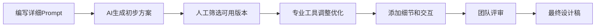

# AI工具与原型实战

## 概述

AI 设计工具正在改变原型设计的工作方式。本文评测主流 AI 设计工具（Wireframe Designer/Uizard/即时AI），总结 Prompt 编写方法论，并以知识付费平台首页为案例，详细演示从布局模板创建到完整页面绘制的实战流程，附带 Axure RP 常用快捷键速查。

## 前置知识

- 完成 [13-原型设计工具实战](13-原型设计工具实战.md) 的学习
- 熟悉 Axure RP 基本操作（Group/Master/对齐）
- 了解 AI 生成工具的基本概念

## 学习目标

- 了解主流 AI 设计工具的能力与局限
- 掌握 AI 设计 Prompt 编写方法论
- 能独立完成多页面布局模板创建
- 熟练运用快捷键提升原型绘制效率

---

## 一、AI 设计工具评测

### 1.1 主流工具概览

| 工具名称 | 类型 | 平台 | 特点 | 推荐度 |
|---------|------|------|------|--------|
| Wireframe Designer | Figma 插件 | Figma | 快速生成线框图 | 中 |
| Google Stitch（原 Galileo AI） | 在线工具 | Web | AI 设计生成；Galileo AI 已于 2025 年 7 月并入 Google，独立服务停止 | 中高 |
| Uizard AI | 在线工具 | Web/APP | 商业化程度高，组件丰富 | 高 |
| 即时 AI | 在线工具 | Web | 即时设计内置 AI | 中高 |

### 1.2 Wireframe Designer 实测

**安装路径**：Figma Community → 搜索 "Wireframe Designer" → Try it out → 添加到 Figma

**局限性**：
- 只支持内置 UI 组件，无法搜索 Figma 组件库
- 组件匹配度不高，仅支持移动端设计
- 设计风格单调，仅供参考无法直接使用

### 1.3 即时 AI 双模型对比

| 模型 | 速度 | 组件规范度 | 风格多样性 | 适用场景 |
|-----|------|-----------|-----------|---------|
| Inno | 较慢（约60秒） | 中等 | 高 | 需要多样化风格 |
| UI bots | 快 | 高 | 低 | 需要规范组件 |

**实测结论**：
- 生成结果结构基本完整，但细节问题多（菜单重复、宽度不达标）
- 只能做参考，无法直接商用
- 需要大量人工调整

### 1.4 AI 设计工具现状总结

**优势**：

| 优势 | 说明 |
|-----|------|
| 快速生成 | 几十秒生成初步方案 |
| 降低门槛 | 非设计师也能快速上手 |
| 提供灵感 | 多版本参考，激发创意 |
| 持续进化 | 技术不断进步，质量提升中 |

**局限**：设计质量参差不齐、组件匹配度不高、无法理解复杂需求、只能做参考无法直接商用。

**适用场景**：快速生成初始方案、获取设计灵感、非关键页面快速原型、个人学习和小项目。

**不适用场景**：正式商业项目、高精度设计、复杂交互需求、品牌化定制设计。

---

## 二、Prompt 编写方法论

### 2.1 官方推荐结构

```
主题描述 + 页面主要功能 + 页面类型 + 布局 + 模块内容
```

### 2.2 完整 Prompt 模板

```markdown
设计一个知识付费平台PC端首页

【主题描述】
- 设计风格：简约现代，科技感强
- 配色：蓝色为主色调，白色背景
- 目标用户：职场人士，学习者

【页面主要功能】
- 课程推荐展示
- 分类导航
- 搜索功能

【页面类型】
- PC端首页，响应式设计

【布局要求】
- 内容宽度：1200px 居中
- 顶部固定导航
- 底部通用页脚

【模块内容】
1. Header（高度80px）：Logo + 导航菜单 + 搜索框 + 登录/注册
2. 轮播区（高度500px）：全屏宽屏轮播图
3. 课程推荐区（高度400px）：4列卡片布局
4. 分类导航区（高度300px）：8个分类图标，2行4列
5. Footer（高度220px）：公司介绍 + 快速链接 + 版权信息
```

### 2.3 提高生成质量的技巧

| 技巧 | 说明 |
|-----|------|
| 详细描述 | 越详细越好，包含风格、布局、模块 |
| 提供参考 | 描述类似产品或竞品 |
| 明确尺寸 | 指定内容宽度、高度等具体数值 |
| 结构清晰 | 分模块描述，逻辑清晰 |
| 多次尝试 | 同一 Prompt 多次生成，选择最佳 |

### 2.4 组合使用策略

| 策略 | 流程 |
|------|------|
| AI 生成 + 人工优化 | AI 工具生成 60% → 专业工具优化 40% |
| 多工具组合 | 即时AI（灵感）→ Figma（细化）→ Axure（交互） |
| AI 辅助组件设计 | AI 生成组件 → 手动组装页面 → 统一调整风格 |

### 2.5 推荐工作流



---

## 三、知识付费项目原型实战

### 3.1 创建多种布局模板

**首页布局**：

| 区域 | 高度 | 说明 |
|------|------|------|
| Header | 80px | 导航栏 |
| Main Content | 自适应 | 内容宽度 1000-1200px |
| Footer | 220px | 底部信息 |

**详情页布局**（右侧分栏）：

| 区域 | 尺寸 | 说明 |
|------|------|------|
| Main Content | 自适应 | 左侧主内容 |
| Sidebar | 280px | 右侧分栏 |

适用：课程详情页、文章详情页、商品详情页。

**列表页布局**（顶部筛选区）：

| 区域 | 高度 | 说明 |
|------|------|------|
| 顶部区域 | 350px | 筛选器/搜索框/分类导航 |
| 列表内容 | 自适应 | 内容宽度 1000-1200px |
| Footer | 220px | 底部信息 |

### 3.2 首页原型绘制流程

**模块一：Header 区域**
- 添加 Logo（左上角）
- 使用文字工具（快捷键 T）添加菜单项
- 框选菜单项 → 顶部对齐 → 水平分布
- 保存为 Master 供其他页面复用

**模块二：轮播图区域**
- 创建容器：宽度 1920px，高度 450px
- 调整层级：右键 → Order → Send to Back（或快捷键 `[`）
- 添加文字内容（标题+描述+按钮）
- 添加控制按钮（左右箭头+页码指示）

**模块三：课程展示区**
- 添加区域标题
- 创建单个课程卡片（图标+标题+描述+按钮）
- Group 组合 → 复制多份 → 调整间距

**模块四：项目展示区**
- 创建图文卡片（图片+标题+描述+查看更多）
- Group 后复制 6 个，3 列布局

**模块五：合作伙伴区**
- 添加标题
- 添加 Logo 占位符
- 使用对齐工具均匀分布

**模块六：Footer 区域**
- 多列菜单链接
- 社交媒体图标
- 版权信息

### 3.3 扩展页面高度

当默认 1080px 不够时：选中最外层 Master → 修改高度为 3000px → 拉伸背景参考线 → 将 Footer 移到底部。

---

## 四、Axure RP 常用快捷键

### 4.1 文字与图形工具

| 快捷键 | 功能 |
|-------|------|
| T | 快速创建文字 |
| R | 矩形工具 |
| O | 椭圆工具 |
| L | 线条工具 |
| P | 钢笔工具 |

### 4.2 层级调整

| 快捷键 | 功能 | 平台 |
|-------|------|------|
| [ | 下移一层 | macOS |
| ] | 上移一层 | macOS |
| Page Up | 上移一层 | Windows |
| Page Down | 下移一层 | Windows |
| Ctrl + [ | 置于底层 | Windows |
| Ctrl + ] | 置于顶层 | Windows |

### 4.3 组合与锁定

| 快捷键 | 功能 |
|-------|------|
| Ctrl/Cmd + G | Group（组合） |
| Ctrl/Cmd + Shift + G | 取消组合 |
| Ctrl/Cmd + K | 锁定/解锁 |

---

## 五、原型图设计规范

### 5.1 布局规范

| 属性 | 标准值 |
|------|--------|
| 内容宽度 | 1000px / 1100px / 1200px（主流） |
| Header 高度 | 60-80px |
| 轮播图高度 | 400-500px |
| Footer 高度 | 200-240px |
| 元素间距 | 16px / 24px / 32px |
| 区域间距 | 40px / 60px / 80px |

### 5.2 组件规范

| 组件 | 规格 |
|------|------|
| 小按钮 | 高度 32px，圆角 4px |
| 中按钮 | 高度 40px，圆角 4px |
| 大按钮 | 高度 48px，圆角 4px |
| 卡片 | 最小宽度 260px，推荐 300px，间距 24px，圆角 8px |
| 标题文字 | 24px / 32px / 40px |
| 正文文字 | 14px / 16px |
| 辅助文字 | 12px |
| 行高 | 1.5 - 1.8 |

---

## 常见问题

| 问题 | 解决方案 |
|------|---------|
| AI 生成结果不可用 | 定位为灵感参考，不期望直接商用 |
| Group 时选错元素 | 只选择需要组合的元素，不要选中背景 Master |
| 元素层级混乱 | 使用 `[` `]` 快捷键调整层级 |
| 布局间距不统一 | 使用对齐工具和分布工具 |
| 页面高度不够 | 修改 Master 高度属性 |

## 最佳实践

1. **AI 辅助而非替代**：AI 生成初始方案，人工完成精细调整
2. **先画一个复制多个**：设计好一个组件 → Group → 复制 → 调整布局
3. **快捷键优先**：熟练使用快捷键，减少鼠标操作
4. **结构化思维**：先布局后填充，模块化设计，逐步细化
5. **Group 时排除 Master**：组合卡片元素时不要选中背景布局

## 延伸阅读

- 即时 AI：https://js.design/ai
- Uizard：https://uizard.io/
- Figma Community 插件市场
- Google Stitch（原 Galileo AI，2025 年 7 月并入 Google）：https://stitch.withgoogle.com/

---

**上一篇**：[13-原型设计工具实战](13-原型设计工具实战.md)  
**下一篇**：[17-设计稿与素材工具](17-设计稿与素材工具.md)
