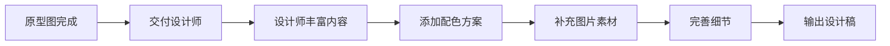
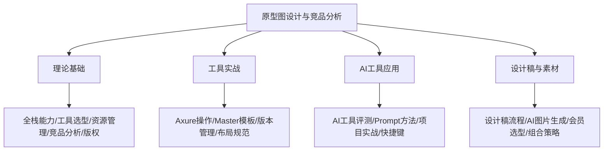

# 设计稿与素材工具

## 概述

从原型图到最终设计稿的交付，需要设计师进行视觉丰富和素材补充。本文介绍原型图到设计稿的标准流程、AI 图片生成工具评测与选型、会员机制与成本分析，以及不同场景下的工具组合策略，帮助前端工程师高效获取项目所需的视觉素材。

## 前置知识

- 完成 [15-AI工具与原型实战](15-AI工具与原型实战.md) 的学习
- 了解原型图与设计稿的区别
- 有基本的图片素材使用经验

## 学习目标

- 理解从原型图到设计稿的标准交付流程
- 掌握主流 AI 图片生成工具的特点与适用场景
- 能根据项目需求选择合适的素材获取方案
- 建立版权合规的素材使用意识

---

## 一、从原型图到设计稿

### 1.1 标准流程

### 1.2 设计师工作内容

| 工作项 | 说明 |
|--------|------|
| 添加品牌配色 | 根据品牌规范确定主色调和辅助色 |
| 选择高质量图片 | 匹配业务场景的正版图片素材 |
| 调整字体和排版 | 确定字体层级和排版规范 |
| 优化视觉层次 | 通过对比、留白建立信息层级 |
| 补充图标和装饰 | 添加功能图标和装饰性元素 |

### 1.3 典型页面设计稿结构

**首页**：Header → Hero Section（全屏轮播）→ 精选课程 → 课程分类 → Footer

**学习页面**：全屏轮播（推荐好课）→ 精品微课 → 学习计划 → 优质专栏 → 通用页脚

**关于我们**：走进我们/企业价值观 → 工作环境展示 → 发展历程（时间线）→ 合作伙伴 Logo

**课程详情**：左侧课程封面图 + 右侧课程信息（标题/描述/价格/讲师/购买按钮）

---

## 二、AI 图片生成工具

### 2.1 使用场景

| 场景 | 说明 |
|-----|------|
| 高保真原型图 | 制作接近真实效果的原型展示 |
| 公众号配图 | 快速生成文章封面图 |
| 博客配图 | 为技术文章添加配图 |
| 临时演示 | 快速生成演示素材 |
| 个人项目 | 小型项目的图片需求 |

核心优势：版权风险较低（AI 生成内容商用前仍需查看平台协议）、快速生成、个性化定制、成本较低。

### 2.2 推荐工具

| 工具 | 类型 | 价格 | 生成速度 | 图片质量 | 推荐场景 |
|-----|------|------|---------|---------|---------|
| 搞定设计 | 在线 | 一次性付费 | 快 | 中 | 公众号配图、快速设计 |
| 图怪兽 | 在线 | 会员制 | 快 | 中 | 海报设计、社交媒体 |
| Stable Diffusion | 本地 | 免费 | 中 | 高 | 艺术创作、个人项目 |
| Midjourney | 在线 | 月费制 | 中 | 高 | 专业设计、商业项目 |
| 即时 AI | 在线 | Beta 免费 | 中 | 中 | 原型设计灵感 |

### 2.3 搞定设计核心功能

**AI 图片生成流程**：
1. 点击"搞定 AI"
2. 选择场景（如：公众号首图）
3. 选择主题（如：科技新闻推送）
4. 输入副标题
5. 系统自动生成多张配图（4-8 张不同风格）
6. 点击"开始编辑"进行二次调整

**在线编辑能力**：文字大小/位置/内容、添加素材、调整颜色、修改布局。

---

## 三、工具对比与场景选型

### 3.1 与 Stable Diffusion/Midjourney 对比

| 维度 | 搞定设计/图怪兽 | Stable Diffusion | Midjourney |
|-----|---------------|-----------------|------------|
| 部署方式 | 在线使用 | 本地部署 | 在线使用 |
| 使用门槛 | 低 | 高 | 中 |
| 生成速度 | 快 | 中 | 中 |
| 图片质量 | 中（基于模板） | 高 | 高 |
| 版权问题 | 可商用 | 需注意 | 需注意 |
| 成本 | 一次性付费 | 免费 | 月费制 |
| 使用场景 | 快速配图 | 艺术创作 | 专业设计 |

### 3.2 不同场景最佳选择

| 场景 | 推荐工具 | 理由 |
|------|---------|------|
| 博客/公众号配图 | 搞定设计/图怪兽 | 快速生成、无需专业技能、支持二次编辑 |
| 高保真原型图 | Midjourney/Stable Diffusion | 图片质量高、风格多样化 |
| 个人项目 | Stable Diffusion + 搞定设计 | 本地免费 + 移动端应急 |
| 商业项目 | 购买版权图片/聘请设计师 | 版权清晰、质量保证 |

### 3.3 移动端 vs 桌面端

| 环境 | 推荐方案 | 特点 |
|------|---------|------|
| 桌面端（有电脑） | Stable Diffusion 本地部署 | 完全免费，满足基本需求 |
| 移动端（无电脑） | 搞定设计等在线工具 | 手机即可操作，用金钱换效率 |

---

## 四、会员机制与成本分析

### 4.1 搞定设计会员方案

| 版本 | 价格 | 适用对象 | 授权范围 |
|-----|------|---------|---------|
| 个人版 | 约 300-400 元/年 | 个人用户 | 个人商用 |
| 终身版 | 699 元 | 个人用户 | 个人商用 |
| 团队版 | 价格不等 | 团队协作 | 团队商用 |
| 企业版 | 价格较高 | 企业用户 | 企业商用 |

### 4.2 性价比分析

| 方案 | 年成本 | 特点 |
|------|--------|------|
| 搞定设计终身版 | 699 元（一次性） | AI 生成 + 模板库 + 编辑器 + 商用授权 |
| Midjourney | 700-2100 元/年 | 高质量但月费制 |
| Stable Diffusion | 免费 | 需本地部署，学习成本高 |
| 购买版权图片 | 每张几十到几百元 | 按需购买，不可复用 |

### 4.3 省钱策略

1. **促销活动购买**：双十一/周年庆，通常 50% 折扣
2. **教育优惠**：学生身份享受教育折扣
3. **团购优惠**：团队购买多人拼单
4. **长期订阅**：使用频率高选终身版，低频选年费版

### 4.4 用户类型推荐

| 用户类型 | 推荐方案 |
|---------|---------|
| 学生党 | 教育优惠 + 免费工具 |
| 个人开发者 | 终身版 + Stable Diffusion |
| 小型团队 | 团队版 + AI 工具组合 |
| 企业用户 | 企业授权 + 专业设计师 |

---

## 五、素材使用最佳实践

### 5.1 工具组合策略

| 组合 | 方案 | 适用场景 |
|------|------|---------|
| 低成本方案 | Stable Diffusion + 搞定设计免费版 + 免费商用网站 | 个人项目 |
| 高效率方案 | 搞定设计终身版 + Midjourney + 免费素材网站 | 频繁出图 |
| 企业级方案 | 企业设计软件授权 + 专业设计师 + AI 辅助 | 商业项目 |

### 5.2 版权合规要点

| 素材来源 | 版权状态 | 建议 |
|---------|---------|------|
| AI 生成的图片 | 通常可商用（需查看平台协议） | 保留生成记录 |
| 购买的模板/素材 | 需要会员授权 | 注意授权范围和有效期 |
| 网络随意下载的图片 | 可能存在版权风险 | 不建议用于商业项目 |

### 5.3 效率提升技巧

1. **建立素材库**：收集常用模板，整理优质配图，分类管理，定期更新
2. **批量生成**：一次性生成多张图，选择最佳效果，批量编辑调整
3. **模板复用**：保存常用模板，快速修改文字，一键替换图片

---

## 六、能力培养路径

### 6.1 分阶段成长

| 阶段 | 核心能力 |
|------|---------|
| 初级 | 掌握一款原型工具、学会竞品分析、了解设计规范、建立素材管理习惯 |
| 中级 | 精通 Axure RP、掌握模板和组件化设计、熟练使用快捷键、建立 Design System 思维 |
| 高级 | 跨职能协作能力、产品思维培养、设计团队管理、技术方案设计 |

### 6.2 完整知识体系

---

## 常见问题

| 问题 | 解决方案 |
|------|---------|
| AI 生成图片质量不够 | 定位为辅助工具，核心素材仍需专业设计 |
| 不确定是否需要购买会员 | 评估使用频率，每月 3 次以上建议购买 |
| 素材版权不确定 | 优先使用免费商用网站，或保留 AI 生成记录 |
| 设计稿与原型差距大 | 原型阶段与设计师充分沟通，提供明确标注 |

## 最佳实践

1. **原型与设计分离**：原型表达结构，设计稿表达视觉，各司其职
2. **AI 工具组合使用**：桌面端 Stable Diffusion + 移动端搞定设计
3. **版权第一**：商业项目绝不使用未授权素材
4. **建立个人素材库**：日常积累，项目时信手拈来
5. **成本意识**：根据使用频率选择付费方案，不盲目消费

## 延伸阅读

- 搞定设计：https://www.gaoding.com/
- 图怪兽：https://818ps.com/
- Stable Diffusion WebUI：https://github.com/AUTOMATIC1111/stable-diffusion-webui
- Midjourney：https://www.midjourney.com/
- 免费商用图片：Unsplash、Pexels
- 免费图标：Iconfont、Font Awesome

---

**上一篇**：[15-AI工具与原型实战](15-AI工具与原型实战.md)
