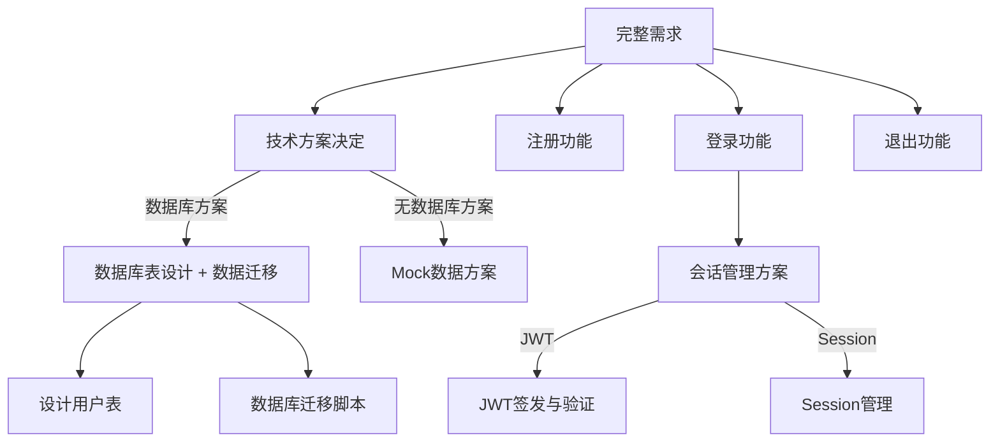
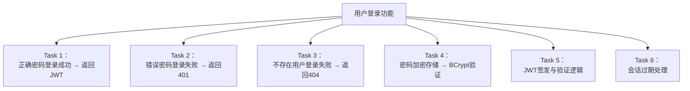
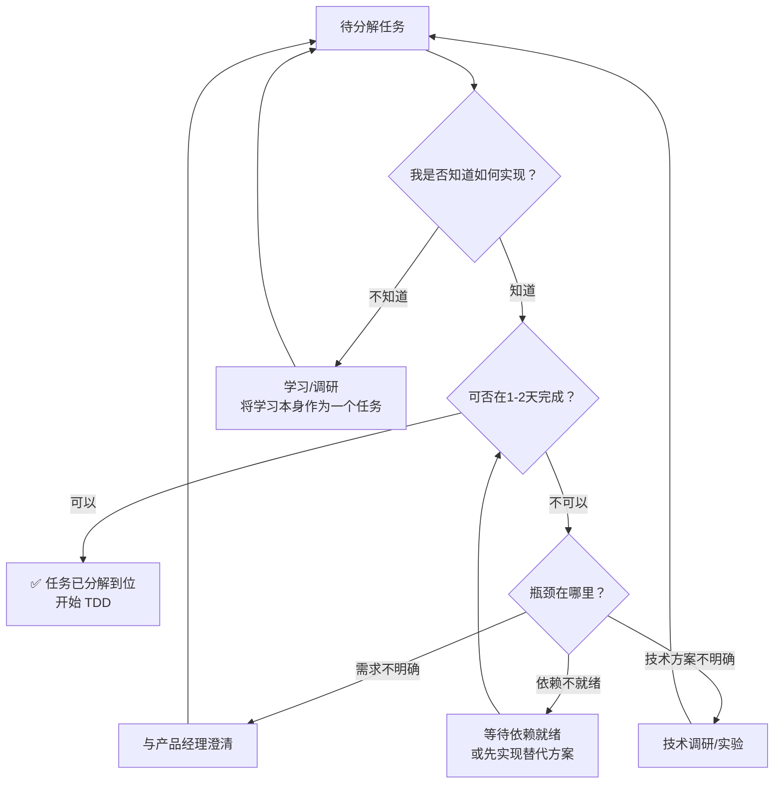
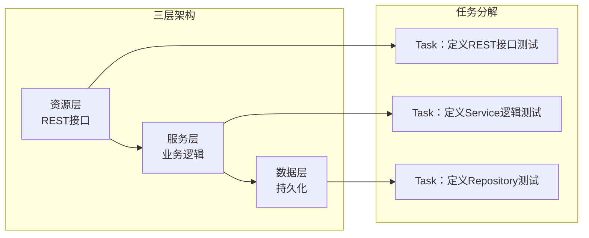
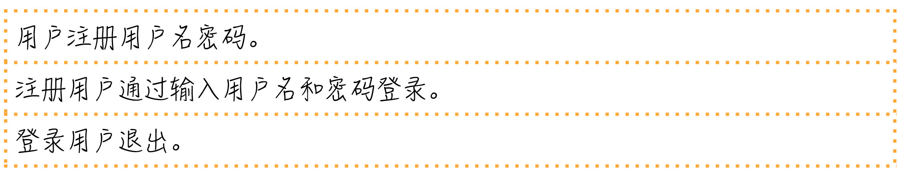
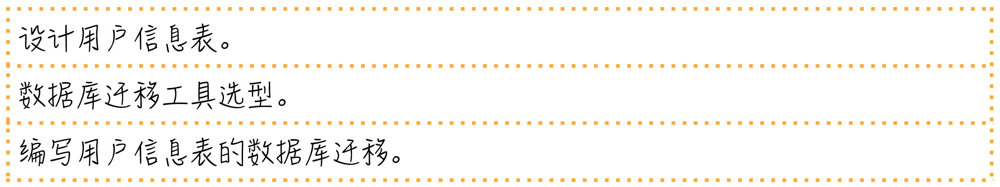
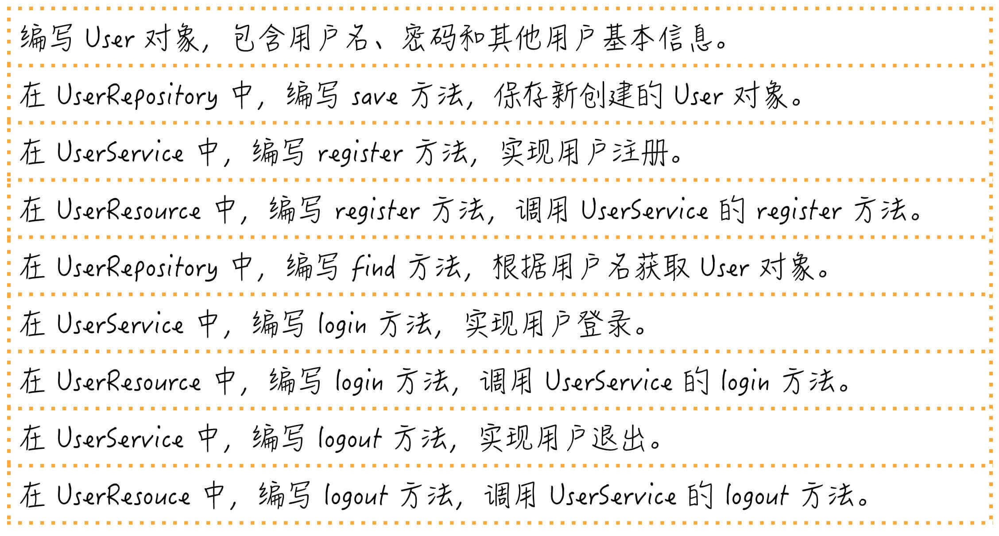
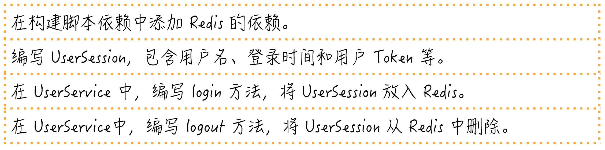
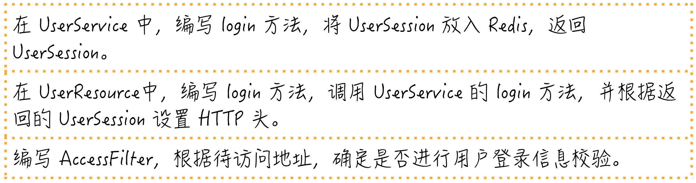
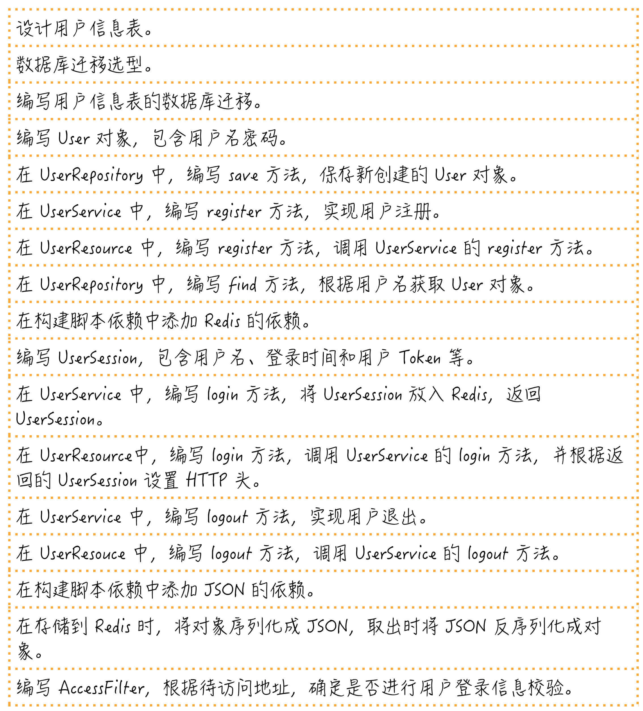

# 一起练习：手把手带你分解任务

## 核心命题

任务分解不是理论空谈，而是需要反复练习的**工程手艺**。以"用户登录"这一最常见功能为例，通过完整的需求→技术→实现的分解过程，展示如何将一个看似简单的需求拆解为**可独立开发、可独立测试、可独立验证**的子任务序列。

---

## 1. 需求分解：从"登录"到完整需求

### 1.1 沙盘推演发现隐含需求

原始需求："用户通过用户名密码登录"

推演后发现隐含需求：

| 原始需求 | 推演发现的隐含需求 |
|----------|------------------|
| 用户登录 | 用户名密码从何而来？→ 需要注册功能 |
| 用户登录 | 登录后的状态如何管理？→ 需要退出功能 |
| 用户登录 | 分布式场景下的会话共享？→ 需要会话持久化 |

**完整需求列表**：

1. 用户注册（设置用户名密码）
2. 用户登录
3. 用户退出

### 1.2 需求→技术方案→任务分解

---

## 2. 逐步分解过程

### 2.1 第一轮：需求级分解

| # | 任务 | 状态 | 备注 |
|---|------|------|------|
| 1 | 设计用户信息数据库表 | 需技术选型 | 表结构设计 |
| 2 | 数据库迁移 | 需选型 | Flyway/Liquibase |
| 3 | 用户注册 | 明确 | 用户名+密码注册 |
| 4 | 用户登录 | 明确 | 验证+会话 |
| 5 | 用户退出 | 明确 | 清除会话 |

### 2.2 第二轮：技术细节填充

技术选型确定后，每个任务进一步拆解：

| # | 原始任务 | 子任务 | TDD 切入点 |
|---|---------|--------|-----------|
| 1 | 设计用户表 | 用户表 Schema | 无（纯设计） |
| 2 | 数据库迁移 | 编写迁移脚本 | 无（基础设施） |
| 3 | 用户注册 | REST接口+Service+Repository | 先写注册接口的测试 |
| 4 | 用户登录 | 验证+JWT签发 | 先写"正确密码登录成功"测试 |
| 5 | 用户退出 | 清除JWT/Session | 先写"退出后会话失效"测试 |

### 2.3 第三轮：实现级分解（TDD 级）

以"用户登录"为例的 TDD 级分解：

**每个 Task 的 Red-Green-Refactor 循环**：

| Task | Red（测试） | Green（最小实现） | Refactor（重构） |
|------|-------------|------------------|----------------|
| 1 | `shouldReturnJwtWhenValidCredentials` | 硬编码返回 JWT | 引入 JWT 生成器 |
| 2 | `shouldRejectInvalidPassword` | 返回 401 状态码 | 引入密码验证逻辑 |
| 3 | `shouldRejectNonexistentUser` | 返回 404 状态码 | 引入 Repository 查询 |
| 4 | `shouldStorePasswordAsBCryptHash` | BCrypt 加密+验证 | 提取 PasswordEncoder |
| 5 | `shouldGenerateValidJwtToken` | JWT 签发 | 提取 TokenService |
| 6 | `shouldHandleExpiredToken` | 检查过期时间 | 提取 TokenValidator |

---

## 3. 分解过程的通用方法论

### 3.1 分解决策树

### 3.2 不确定性任务的处理策略

| 不确定性类型 | 策略 | 示例 |
|-------------|------|------|
| **需求不确定** | 先做需求澄清任务 | "与产品经理确认登录失败重试限制" |
| **技术方案不确定** | 先做技术 Spike | "对比 JWT vs Session 方案（半天调研）" |
| **实现细节不确定** | 先做最简单的测试 | "从 'shouldReturnJwt' 开始，逐步细化" |

> **Spike（技术探针）**：时间盒限定的技术调研活动（通常 1-2 天），目的是消除不确定性，产出是认知而非代码。Spike 结束后丢弃探针代码，用 TDD 重新实现。

---

## 4. REST 服务的三层架构分解

原文案例采用 REST 服务 + 三层架构，其任务分解映射为：

**Outside-In TDD 的推进顺序**：

1. 先写 Controller 层测试（定义 REST 接口行为）
2. Mock Service 层，实现 Controller
3. 写 Service 层测试（定义业务逻辑行为）
4. Mock Repository，实现 Service
5. 写 Repository 层测试（定义数据访问行为）
6. 实现 Repository

---

## 5. 总结

任务分解是一个需要反复练习的手艺。从"用户登录"案例的完整分解过程中，我们学到：

1. **沙盘推演**发现隐含需求——"登录"不只包含登录本身
2. **技术选型**影响分解方向——数据库方案决定了额外的迁移任务
3. **不确定性处理**——不知道怎么做时，先做学习/调研任务
4. **TDD 级粒度**——每个子任务对应一个 Red-Green-Refactor 循环
5. **Outside-In 推进**——从外部接口开始，由外向内驱动设计

**核心要义**：分解到每个子任务都"知道怎么做"的程度，才是一个可执行的分解。

---

> **延伸阅读**
>
> - Kent Beck, *TDD By Example* (2002): 完整的 TDD 分解实战
> - "Growing Object-Oriented Software, Guided by Tests" (2009): Outside-In TDD 案例
> - Spike Solution: https://www.extremeprogramming.org/rules/spike.html
---

## 原文存档

> 以下为郑晔原文完整内容，保留作为参考。

## 15 | 一起练习：手把手带你分解任务

前面在讨论 TDD 的时候，我们说任务分解是 TDD 的关键。但这依然是一种感性上的认识。今天，我们就来用一个更加具体的例子，让你看看任务分解到底可以做到什么程度。

这个例子就是最简单的用户登录。需求很简单，用户通过用户名密码登录。

我相信，实现这个功能对大家来说并不困难，估计在我给出这个题目的时候，很多人脑子里已经开始写代码了。今天主要就是为了带着大家体验一下任务分解的过程，看看怎样将一个待实现的需求一步步拆细，变成一个个具体可执行的任务。

要完成这个需求，最基本的任务是用户通过输入用户名和密码登录。

用户名和密码登录这个任务很简单，但我们在第一部分讲过沙盘推演，只要推演一下便不难发现，这不是一个完整的需求。

用户名和密码是哪来的呢？它们可能是用户设置的，也可能是由系统管理员设置的。这里我们就把它们简单设定成由用户设定。另外，有用户登录，一般情况下，还会有一个退出的功能。好了，这才是一个简单而完整的需求。我们就不做进一步的需求扩展。

所以，我们要完成的需求列表是下面这样的。

假设我们就是拿到这个需求列表的程序员，要进行开发。我们先要分析一下要做的事情有哪些，也就是任务分解。到这里，你可以先暂停一会，尝试自己分解任务，之后，再来对比我后面给出的分解结果，看看差异有多少。

好，我们继续。

我们先来决定一下技术方案，就用最简单的方式实现，在数据库里建一张表保存用户信息。一旦牵扯到数据库表，就会涉及到数据库迁移，所以，有了下面的任务。

这时，需要确定这两个任务自己是否知道怎么做。设计表，一般熟悉 SQL 的人都知道怎么做。数据库迁移，可能要牵扯到技术选型，不同的数据库迁移工具，写法上略有差别，我们就把还不完全明确的内容加到任务清单里。

数据库的内容准备好了，接下来，就轮到编写代码的准备上了。我们准备用常见的 REST 服务对外提供访问。这里就采用最常规的三层技术架构，所以，一般要编写下面几项内容。

- 领域对象，这里就是用户。
- 数据访问层，在不同的项目里面叫法不一，有人从 J2EE 年代继承下来叫 DAO（数据访问对象，Data Access Object），有人跟着 Mybatis 叫 mapper，我现在更倾向于使用领域驱动设计的术语，叫 repository。
- 服务层，提供对外的应用服务，完成业务处理。
- 资源层，提供 API 接口，包括外部请求的合法性检查。

根据这个结构，就可以进一步拆解我们的开发任务了。

不知道你有没有注意到，我的任务清单上列任务的顺序，是按照一个需求完整实现的过程。

比如，第一部分就是一个完整的用户注册过程，先写 User，然后是 UserRepository 的 save 方法，接着是 UserService 的 register 方法，最后是 UserResource 的 register 方法。等这个需求开发完了，才是 login 和 logout。

**很多人可能更习惯一个类一个类的写，我要说，最好按照一个需求、一个需求的过程走，这样，任务是可以随时停下来的。**

比如，同样是只有一半的时间，我至少交付了一个完整的注册过程，而按照类写的方法，结果是一个需求都没完成。这只是两种不同的安排任务的顺序，我更支持按照需求的方式。

我们继续讨论任务分解。任务分解到这里，需要看一下这几个任务有哪个不好实现。register 只是一个在数据库中存储对象的过程，没问题，但 login 和 logout 呢？

考虑到我们在做的是一个 REST 服务，这个服务可能是分布到多台机器上，请求到任何一台都能提供同样的服务，我们需要把登录信息共享出去。

这里我们就采用最常见的解决方案：用 Redis 共享数据。登录成功的话，就需要把用户的 Session 信息放到 Redis 里面，退出的话，就是删除 Session 信息。在我们的任务列表里，并没有出现 Session，所以，需要引入 Session 的概念。任务调整如下。

如果采用 Redis，我们还需要决定一下在 Redis 里存储对象的方式，我们可以用原生的Java序列化，但一般在开发中，我们会选择一个文本化的方式，这样维护起来更容易。这里选择常见的 JSON，所以，任务就又增加了两项。

至此，最基本的登录退出功能已经实现了，但我们需要问一个问题，这就够了吗？之所以要登录，通常是要限定用户访问一些资源，所以，我们还需要一些访问控制的能力。

简单的做法就是加入一个 filter，在请求到达真正的资源代码之前先做一层过滤，在这个 filter 里面，如果待访问的地址是需要登录访问的，我们就看看用户是否已经登录，现在一般的做法是用一个 Token，这个 Token 一般会从 HTTP 头里取出来。但这个 Token 是什么时候放进去的呢？答案显然是登录的时候。所以，我们继续调整任务列表。

至此，我们已经比较完整地实现了一个用户登录功能。当然，要在真实项目中应用，需求还是可以继续扩展的。比如：用户 Session 过期、用户名密码格式校验、密码加密保存以及刷新用户 Token等等。

这里主要还是为了说明任务分解，相信如果需求继续扩展，根据上面的讨论，你是有能力进行后续分解的。

来看一下分解好的任务清单，你也可以拿出来自己的任务清单对比一下，看看差别有多大。

首先要说明的是，任务分解没有一个绝对的标准答案，分解的结果根据个人技术能力的不同，差异也会很大。

**检验每个任务项是否拆分到位，就是看你是否知道它应该怎么做了。** 不过，即便你技术能力已经很强了，我依然建议你把任务分解到很细，观其大略人人行，细致入微见本事。

也许你会问我，我在写代码的时候，也会这么一项一项地把所有任务都写下来吗？实话说，我不会。因为任务分解我在之前已经训练过无数次，已经习惯怎么一步一步地把事情做完。换句话说，任务清单虽然我没写下来，但已经在我脑子里了。

不过，我会把想到的，但容易忽略的细节写下来，因为任务清单的主要作用是备忘录。一般情况下，主流程我们不会遗漏，但各种细节常常会遗漏，所以，想到了还是要记下来。

另外，对比我们在分解过程中的顺序，你会看到这个完整任务清单的顺序是调整过的，你可以按照这个列表中的内容一项一项地做，调整最基本的标准是，按照这些任务的依赖关系以及前面提到的“完整地实现一个需求”的原则。

最后，我要特别强调一点，所有分解出来的任务，都是独立的。也就是说， **每做完一个任务，代码都是可以提交的。** 只有这样，我们才可能做到真正意义上的小步提交。

如果今天的内容你只能记住一件事，那请记住： **按照完整实现一个需求的顺序去安排分解出来的任务。**

最后，我想请你分享一下，你的任务清单和我的任务清单有哪些差异呢？

感谢阅读，如果你觉得这篇文章对你有帮助的话，也欢迎把它分享给你的朋友。