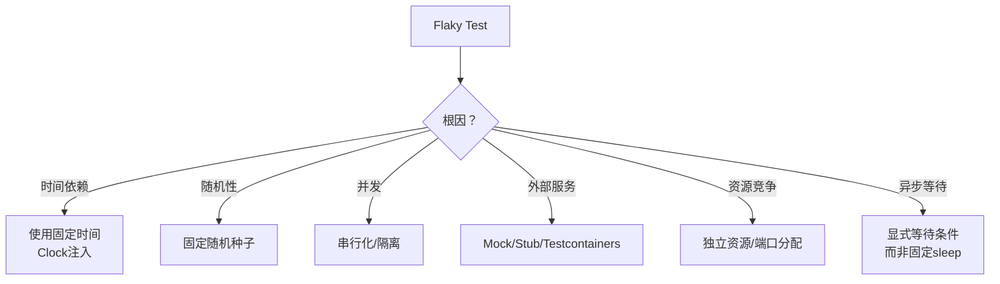
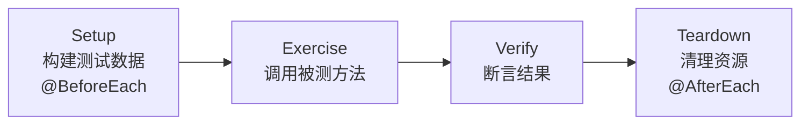
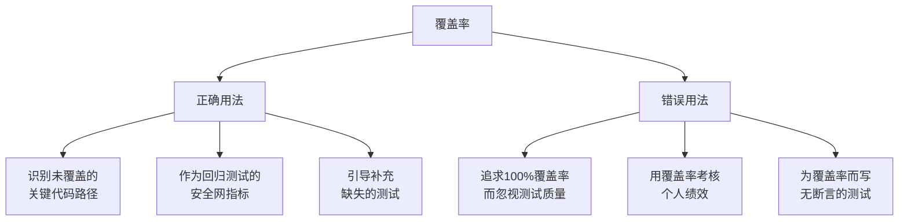

# 为什么你的测试不够好

## 核心命题

**测试必须简单到一目了然，不需要证明其正确性。** 谁来保证测试的正确性？答案是：没有人——因为给测试写测试会导致无限递归。唯一的出路是**将测试写得足够简单**，使其正确性不证自明。测试质量问题的根因，几乎都可以归结为"测试不够简单"。

---

## 1. 测试质量的典型问题与根因

### 1.1 常见测试反模式

| 反模式 | 表现 | 根因 | 后果 |
|--------|------|------|------|
| **Flaky Test** | 时过时不过 | 非确定性（时间/随机/并发/外部依赖） | 破坏信任，团队忽视测试 |
| **Setup 过重** | 测试环境搭建耗时 | 测试耦合了过多外部依赖 | 测试慢，不愿运行 |
| **测试间依赖** | 必须按特定顺序执行 | 共享可变状态 | 不可并行，不可重复 |
| **测试测实现** | 修改实现导致测试失败 | 测试断言了内部实现细节 | 重构困难，测试脆弱 |
| **God Test** | 一个测试验证所有行为 | 未按单一关注点拆分 | 失败时难以定位问题 |

### 1.2 Flaky Test 的治理

Flaky Test 是 CI/CD 流水线的头号敌人。据 Google 工程团队在 Google Testing Blog 上的披露，**约 16%** 的 Google 内部测试存在不同程度的 Flaky 行为。



**Flaky Test 的处理策略**：

1. **隔离**：标记为 Flaky，从 CI 关键路径中移除
2. **诊断**：多次运行（`--repeat=100`）定位非确定性来源
3. **修复**：消除非确定性根因
4. **移除**：无法修复的 Flaky Test 应删除，而非保留

---

## 2. 简单测试的结构化规范

### 2.1 一个好测试的结构

```
测试 = 准备（Arrange）+ 执行（Act）+ 断言（Assert）
```

**好测试的特征**：

| 特征 | 含义 | 检验方法 |
|------|------|---------|
| **单一断言原则** | 一个测试只验证一个行为 | 测试名与断言一一对应 |
| **无隐式依赖** | 所有依赖显式构造 | 无全局状态访问 |
| **确定性** | 相同输入→相同输出 | 多次运行结果一致 |
| **自解释** | 测试名即文档 | 阅读测试名即可理解行为 |
| **快速** | 毫秒级完成 | 无 I/O、无网络、无 sleep |

### 2.2 测试的 4 阶段生命周期



**Setup/Teardown 的最佳实践**：

- 使用 Builder Pattern 构建测试数据，提高可读性
- 使用 JUnit Rule/Extension 管理共享资源，避免手动 Teardown
- Test Fixture 应**最小化**——只构造当前测试所需的数据

### 2.3 测试代码与生产代码同等重要

| 维度 | 生产代码 | 测试代码 |
|------|---------|---------|
| **代码质量** | 需要重构 | 同样需要重构 |
| **命名** | 清晰表达意图 | 同样清晰表达行为 |
| **DRY** | 避免重复 | 适度重复（测试应自包含） |
| **设计模式** | 使用适当模式 | Builder、Object Mother、Test Data |

> **关键区别**：测试代码中**适度的重复是可接受的**——每个测试应独立可读，不应为消除重复而引入共享的复杂 Setup 逻辑。

---

## 3. 测试替身的精确使用

### 3.1 Mock vs Stub 的选择原则

| 场景 | 选择 | 原因 |
|------|------|------|
| 验证**交互行为**（是否调用了某方法） | Mock | 关注"做了什么" |
| 隔离**返回值**（需要特定数据） | Stub | 关注"返回什么" |
| 需要**简化实现**（如内存数据库） | Fake | 关注"行为等价" |

### 3.2 Mock 的过度使用问题

> **London School 的批评**：过度使用 Mock 会导致测试与实现细节强耦合——重构实现时测试大量失败，即使行为未变。

**缓解策略**：

- Mock 接口而非具体类
- Mock 外部边界（Repository、Gateway），不 Mock 内部协作
- 优先使用 Fake（如内存数据库），仅在必要时使用 Mock

---

## 4. 测试覆盖率：度量而非目标

### 4.1 覆盖率类型的精确理解

| 覆盖率类型 | 含义 | 局限 |
|-----------|------|------|
| **行覆盖率** | 被执行的代码行比例 | 不检查分支 |
| **分支覆盖率** | 被执行的分支比例 | 不检查条件组合 |
| **路径覆盖率** | 被执行的执行路径比例 | 组合爆炸，实际不可达 |
| **Mutation 覆盖率** | 被杀死的变异比例 | 最严格，但计算成本高 |

### 4.2 覆盖率的正确使用方式



> **原则**：覆盖率是**发现工具**（发现未测试的代码），而非**目标**（追求数字）。100% 行覆盖率不等于 100% 行为覆盖。

---

## 5. 总结

**核心要义**：测试必须简单到一目了然。如果测试比被测代码还复杂，那测试本身就成了问题。Flaky Test、Setup 过重、测试间依赖等问题的根因，都是测试不够简单。将复杂测试拆分为简单测试，是测试质量提升的第一步。

---

> **延伸阅读**
>
> - Gerard Meszaros, *xUnit Test Patterns* (2007): 测试反模式与重构
> - Google Testing Blog: https://testing.googleblog.com/
> - Martin Fowler, "TestDouble": https://martinfowler.com/bliki/TestDouble.html
> - PITest Mutation Testing: https://pitest.org/

---

## 原文存档

> 以下为郑晔原文完整内容，保留作为参考。

## 16 | 为什么你的测试不够好？
你好！我是郑晔。今天是除夕，我在这里给大家拜年了，祝大家在新的一年里，开发越做越顺利！

关于测试，我们前面讲了很多，比如：开发者应该写测试；要写可测的代码；要想做好 TDD，先要做好任务分解，我还带你进行了实战操作，完整地分解了一个任务。

但有一个关于测试的重要话题，我们始终还没聊，那就是测试应该写成什么样。今天我就来说说怎么把测试写好。

你或许会说，这很简单啊，前面不都讲过了吗？不就是用测试框架写代码吗？其实，理论上来说，还真应该就是这么简单，但现实情况却往往相反。我看到过很多团队在测试上出现过各种各样的问题，比如：

- 测试不稳定，这次能过，下次过不了；
- 有时候是一个测试要测的东西很简单，测试周边的依赖很多，搭建环境就需要很长的时间；
- 这个测试要运行，必须等到另外一个测试运行结束；
- ……

如果你也在工作中遇到过类似的问题，那你理解的写测试和我理解的写测试可能不是一回事，那问题出在哪呢？

为什么你的测试不够好呢？

**主要是因为这些测试不够简单。只有将复杂的测试拆分成简单的测试，测试才有可能做好。**

### 简单的测试

测试为什么要简单呢？有一个很有趣的逻辑，不知道你想没想过，测试的作用是什么？显然，它是用来保证代码的正确性。随之而来的一个问题是，谁来保证测试的正确性？

许多人第一次面对这个问题，可能会一下子懵住，但脑子里很快便会出现一个答案：测试。但是，你看有人给测试写测试吗？肯定没有。因为一旦这么做，这个问题会随即上升，谁来保证那个测试的正确性呢？你总不能无限递归地给测试写测试吧。

既然无法用写程序的方式保证测试的正确性，我们只有一个办法： **把测试写简单，简单到一目了然，不需要证明它的正确性。** 所以，如果你见到哪个测试写得很复杂，它一定不是一个好的测试。

既然说测试应该简单，我们就来看看一个简单的测试应该是什么样子。下面我给出一个简单的例子，你可以看一下。

```
@Test
void should_extract_HTTP_method_from_HTTP_request() {
  // 前置准备
  request = mock(HttpRequest.class);
  when(request.getMethod()).thenReturn(HttpMethod.GET);
  HttpMethodExtractor extractor = new HttpMethodExtractor();

  // 执行
  HttpMethod method = extractor.extract(request);

  // 断言
  assertThat(method, is(HttpMethod.GET));

  // 清理
}

```

这个测试来自我的开源项目 [Moco](https://github.com/dreamhead/moco)，我稍做了一点调整，便于理解。这个测试很简单，从一个 HTTP 请求中提取出 HTTP 方法。

我把这段代码分成了四段，分别是 **前置准备、执行、断言和清理**，这也是一般测试要具备的四段。

- 这几段的核心是中间的执行部分，它就是测试的目标，但实际上，它往往也是最短小的，一般就是一行代码调用。其他的部分都是围绕它展开的，在这里就是调用 HTTP 方法提取器提取 HTTP 方法。
- 前置准备，就是准备执行部分所需的依赖。比如，一个类所依赖的组件，或是调用方法所需要的参数。在这个测试里面，我们准备了一个 HTTP 请求，设置了它的方法是一个 GET 方法，这里面还用到了之前提到的 Mock 框架，因为完整地设置一个 HTTP 请求很麻烦，而且与这个测试也没什么关系。
- 断言是我们的预期，就是这段代码执行出来怎么算是对的。这里我们判断了提取出来的方法是否是 GET 方法。另外补充一点，断言并不仅仅是 assert，如果你用 Mock 框架的话，用以校验 mock 对象行为的 verify 也是一种断言。
- 清理是一个可能会有的部分，如果你的测试用到任何资源，都可以在这里释放掉。不过，如果你利用好现有的测试基础设施（比如，JUnit 的 Rule），遵循好测试规范的话，很多情况下，这个部分就会省掉了。

怎么样，看着很简单吧，是不是符合我前面所说的不证自明呢？

### 测试的坏味道

有了对测试结构的了解，我们再来说说常见的测试“坏味道”。

首先是执行部分。不知道你有没有注意到，前面我提到执行部分时用了一个说法，一行代码调用。是的，第一个“坏味道”就来自这里。

很多人总想在一个测试里做很多的事情，比如，出现了几个不同方法的调用。请问，你的代码到底是在测试谁呢？

**这个测试一旦出错，就需要把所有相关的几个方法都查看一遍，这无疑是增加了工作的复杂度。**

也许你会问，那我有好几个方法要测试，该怎么办呢？很简单，多写几个测试就好了。

另一个典型“坏味道”的高发区是在断言上，请记住， **测试一定要有断言。** 没有断言的测试，是没有意义的，就像你说自己是世界冠军，总得比个赛吧！

我见过不少人写了不少测试，但测试运行几乎从来就不会错。出于好奇，我打开代码一看，没有断言。

没有断言当然就不会错了，写测试的同事还很委屈地说，测试不好写，而且，他已经验证了这段代码是对的。就像我前面讲过的，测试不好写，往往是设计的问题，应该调整的是设计，而不是在测试这里做妥协。

还有一种常见的“坏味道”：复杂。最典型的场景是，当你看到测试代码里出现各种判断和循环语句，基本上这个测试就有问题了。

举个例子，测试一个函数，你的断言写在一堆 if 语句中，美其名曰，根据条件执行。还是前面提到的那个观点，你怎么保证这个测试函数写的是对的？除非你用调试的手段，否则，你都无法判断你的条件分支是否执行到了。

你或许会疑问，我有一大堆不同的数据要测，不用循环不用判断，我怎么办呢？ **你真正应该做的是，多写几个测试，每个测试覆盖一种场景。**

### 一段旅程（A-TRIP）

怎么样的测试算是好的测试呢？有人做了一个总结 A-TRIP，这是五个单词的缩写，分别是

- Automatic，自动化；
- Thorough，全面的；
- Repeatable，可重复的；
- Independent，独立的；
- Professional，专业的。

下面，我们看看这几个单词分别代表什么意思。

**Automatic，自动化。** 有了前面关于自动化测试的铺垫，这可能最好理解，就是把测试尽可能交给机器执行，人工参与的部分越少越好。

这也是我们在前面说，测试一定要有断言的原因，因为一个测试只有在有断言的情况下，机器才能自动地判断测试是否成功。

**Thorough，全面，应该尽可能用测试覆盖各种场景。** 理解这一点有两个角度。一个是在写代码之前，要考虑各种场景：正常的、异常的、各种边界条件；另一个角度是，写完代码之后，我们要看测试是否覆盖了所有的代码和所有的分支，这就是各种测试覆盖率工具发挥作用的场景了。

当然，你想做到全面，并非易事，如果你的团队在补测试，一种办法是让测试覆盖率逐步提升。

**Repeatable，可重复的。** 这里面有两个角度：某一个测试反复运行，结果应该是一样的，这说的是，每一个测试本身都不应该依赖于任何不在控制之下的环境。如果有，怎么办，想办法。

比如，如果有外部的依赖，就可以采用模拟服务的手段，我的 [Moco](https://github.com/dreamhead/moco) 就是为了解决外部依赖而生的，它可以模拟外部的 HTTP 服务，让测试变得可控。

有的测试会依赖数据库，那就在执行完测试之后，将数据库环境恢复，像 Spring 的测试框架就提供了测试数据库回滚的能力。如果你的测试反复运行，不能产生相同的结果，要么是代码有问题，要么是测试有问题。

理解可重复性，还有一个角度，一堆测试反复运行，结果应该是一样的。这说明测试和测试之间没有任何依赖，这也是我们接下来要说的测试的另外一个特点。

**Independent，独立的。** 测试和测试之间不应该有任何依赖，什么叫有依赖？比如，如果测试依赖于外部数据库或是第三方服务，测试 A 在运行时在数据库里写了一些值，测试 B 要用到数据库里的这些值，测试 B 必须在测试 A 之后运行，这就叫有依赖。

我们不能假设测试是按照编写顺序运行的。比如，有时为了加快测试运行速度，我们会将测试并行起来，在这种情况下，顺序是完全无法保证的。如果测试之间有依赖，就有可能出现各种问题。

减少外部依赖可以用 mock，实在要依赖，每个测试自己负责前置准备和后续清理。如果多个测试都有同样的准备和清理呢？那不就是 setup 和 teardown 发挥作用的地方吗？测试基础设施早就为我们做好了准备。

**Professional，专业的。** 这一点是很多人观念中缺失的，测试代码，也是代码，也要按照代码的标准去维护。这就意味着你的测试代码也要写得清晰，比如：良好的命名，把函数写小，要重构，甚至要抽象出测试的基础库，在 Web 测试中常见的 PageObject 模式，就是这种理念的延伸。

看了这点，你或许会想，你说的东西有点道理，但我的代码那么复杂，测试路径非常多，我怎么能够让自己的测试做到满足这些要求呢？

我必须强调一个之前讲测试驱动开发强调过的观点： **编写可测试的代码。** 很多人写不好测试，或者觉得测试难写，关键就在于，你始终是站在写代码的视角，而不是写测试的视角。如果你都不重视测试，不给测试留好空间，测试怎么能做好呢？

### 总结时刻

测试是一个说起来很简单，但很不容易写好的东西。在实际工作中，很多人都会遇到关于测试的各种各样问题。之所以出现问题，主要是因为这些测试写得太复杂了。测试一旦复杂了，我们就很难保证测试的正确性，何谈用测试保证代码的正确性。

我给你讲了测试的基本结构：前置准备、执行、断言和清理，还介绍了一些常见的测试“坏味道”：做了太多事的测试，没有断言的测试，还有一种看一眼就知道有问题的“坏味道”，测试里有判断语句。

怎么衡量测试是否做好了呢？有一个标准：A-TRIP，这是五个单词的缩写，分别是 Automatic（自动化）、Thorough（全面）、Repeatable（可重复的）、Independent（独立的）和 Professional（专业的）。

如果今天的内容你只能记住一件事，那请记住： **要想写好测试，就要写简单的测试。**

最后，我想请你分享一下，经过最近持续对测试的讲解，你对测试有了哪些与之前不同的理解呢？

感谢阅读，如果你觉得这篇文章对你有帮助的话，也欢迎把它分享给你的朋友。