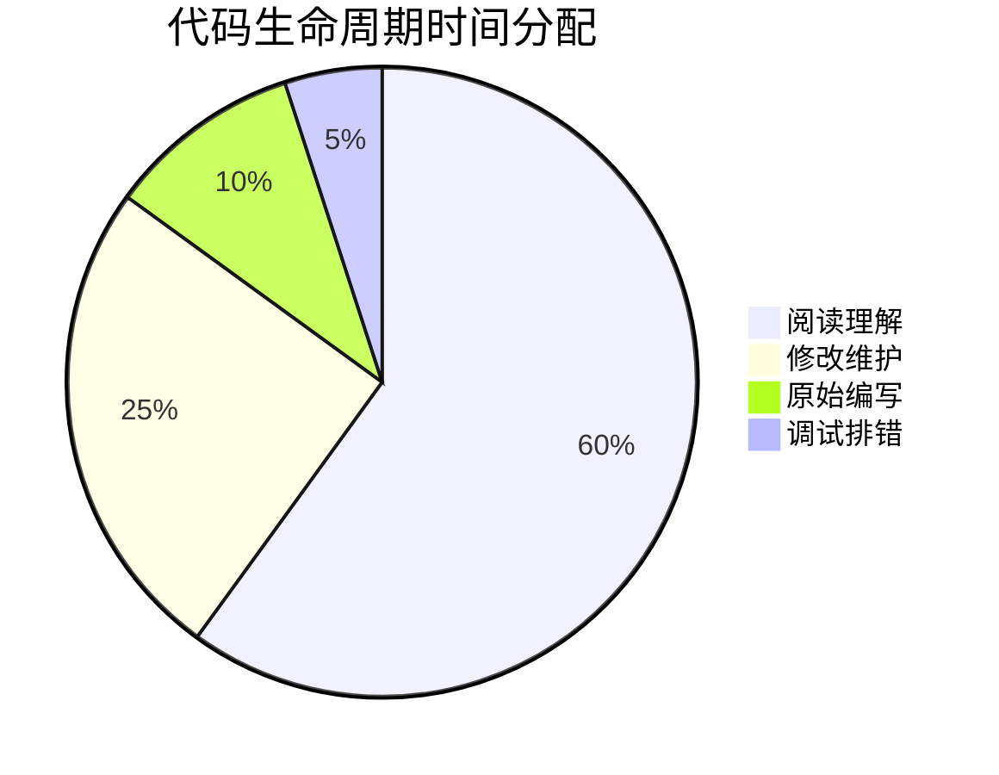
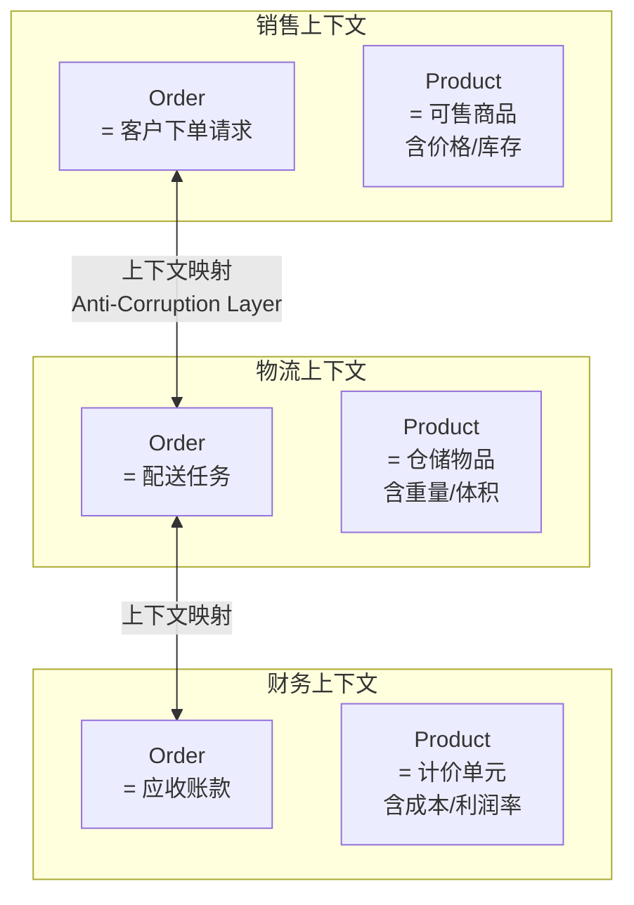
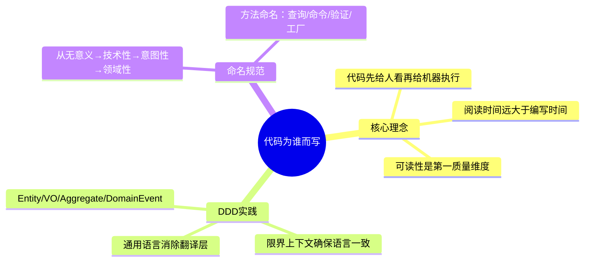
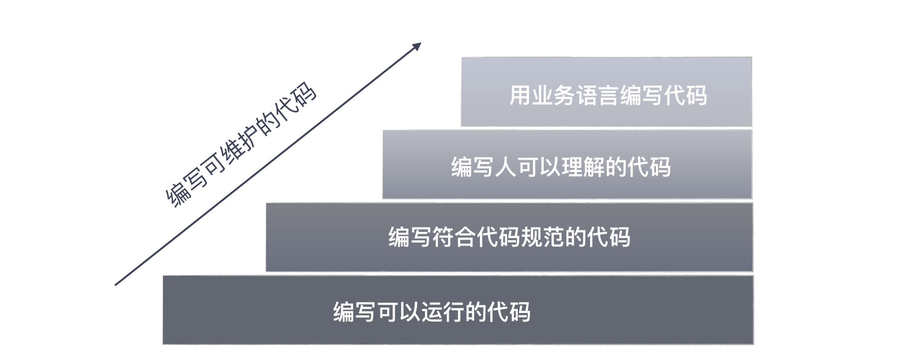

# 你的代码为谁而写

## 核心命题

代码首先是写给人看的，其次才是给机器执行的。**可维护性**是代码质量的第一评价维度——代码的生命周期中，阅读时间远大于编写时间。通过领域驱动设计（DDD）的**通用语言（Ubiquitous Language）**和**限界上下文（Bounded Context）**，使代码成为业务意图的精确表达——当代码的业务语义一目了然时，维护成本最低，沟通效率最高。

---

## 1. 代码的读者与生命周期

### 1.1 代码时间分配的真相

> "读代码的时间是写代码时间的 10 倍以上。" —— Robert C. Martin, *Clean Code*

**推论**：代码优化的首要目标是**可读性**，而非运行效率——因为阅读占了 60% 的时间。

### 1.2 代码质量的演进标准

| 阶段 | 质量标准 | 关注点 | 典型表现 |
|------|---------|--------|---------|
| **初级** | 功能正确 | 算法、数据结构、框架使用 | "能跑就行" |
| **中级** | 可维护 | 命名、结构、设计模式 | "改起来不痛苦" |
| **高级** | 可沟通 | 代码即文档，表达业务意图 | "读代码如读需求" |

---

## 2. DDD：代码与业务的桥梁

### 2.1 通用语言（Ubiquitous Language）

**核心原则**：代码中的命名与业务术语一一对应，消除"翻译层"。

| 反模式 | 问题 | DDD 修正 | 业务语义恢复 |
|--------|------|---------|-------------|
| `DataManager` | 业务含义模糊 | `OrderRepository` | 订单数据访问 |
| `process()` | 动作不明确 | `placeOrder()` | 下单 |
| `flag` | 业务语义丢失 | `isEligibleForDiscount` | 是否符合折扣条件 |
| `dto1` | 完全无意义 | `OrderConfirmation` | 订单确认 |
| `calc()` | 计算什么？ | `calculateTotalWithTax()` | 计算含税总价 |

> **检验标准**：如果产品经理能读懂代码中的类名和方法名，说明通用语言到位了。

### 2.2 限界上下文（Bounded Context）

同一术语在不同业务上下文中含义不同——Bounded Context 确保每个上下文内部语言一致：

> **关键洞察**：同一个"Order"在不同上下文中有不同含义。Bounded Context 确保每个上下文内部语言一致，上下文之间通过映射（Anti-Corruption Layer）转换，而非共享同一模型。

### 2.3 代码中的 DDD 模式

| DDD 概念 | 代码实现 | 作用 |
|----------|---------|------|
| **Entity** | 有唯一标识的可变对象 | `Order`（有 orderId） |
| **Value Object** | 无唯一标识的不可变对象 | `Money`、`Address` |
| **Aggregate** | 一致性边界 | `Order` + `OrderItem`（事务边界） |
| **Domain Service** | 跨聚合的业务逻辑 | `PricingService` |
| **Repository** | 持久化接口 | `OrderRepository` |
| **Domain Event** | 领域事件 | `OrderPlacedEvent` |

---

## 3. 代码可读性的实践规范

### 3.1 命名的四个层次

| 层次 | 命名特征 | 示例 | 可读性 |
|------|---------|------|--------|
| **L1：无意义** | 缩写/单字母 | `d`, `tmp`, `x1` | ❌ 需要注释才能理解 |
| **L2：技术性** | 描述数据结构 | `userList`, `dataMap` | ⚠️ 知道"是什么"但不知"为什么" |
| **L3：意图性** | 描述意图 | `eligibleUsers`, `taxRateByRegion` | ✅ 理解业务含义 |
| **L4：领域性** | 使用业务术语 | `vipCustomers`, `regionalTaxPolicy` | ✅✅ 产品经理也能读懂 |

### 3.2 方法命名的模式

| 模式 | 命名模板 | 示例 |
|------|---------|------|
| **查询** | `get`/`find`/`query` | `findEligibleCustomers()` |
| **命令** | 动词 | `placeOrder()`, `cancelSubscription()` |
| **验证** | `is`/`has`/`can`/`should` | `isEligibleForRefund()` |
| **工厂** | `create`/`from`/`of` | `Order.from(cart)` |

---

## 4. 总结

**核心要义**：代码为"后来的读者"而写。通过 DDD 的通用语言，使代码成为业务意图的精确表达；通过限界上下文，使代码结构反映业务边界。当产品经理能读懂代码中的类名和方法名时，代码才真正做到了"可沟通"。

---

> **延伸阅读**
>
> - Eric Evans, *Domain-Driven Design* (2003): 通用语言与限界上下文
> - Vaughn Vernon, *Implementing Domain-Driven Design* (2013): DDD 实现模式
> - Robert C. Martin, *Clean Code* (2008): 命名与可读性
---

## 原文存档

> 以下为郑晔原文完整内容，保留作为参考。

## 21 | 你的代码为谁而写？

关于“沟通反馈”的话题，我准备从代码开始讲起，毕竟我们程序员是靠代码与机器进行沟通的。

写代码是每个程序员的职责，程序员们都知道要把代码写好。但究竟什么叫写好呢？每个人的理解却是各有差异。

### 编写可维护的代码

初涉编程的程序员可能觉得能把功能实现出来的代码，就是好代码，这个阶段主要是基本功的学习，需要掌握的是各种算法、数据结构、典型的处理手法、常用的框架等等。

经过一段时间工作，日常工作所需的大多数代码，在你看来都是不在话下的。尤其像搜索和问答网站蓬勃发展之后，你甚至不需要像我初入职场时那样，记住很多常见的代码模式，现在往往是随手一搜，答案就有了。

再往后，更有追求的程序员会知道，仅仅实现功能是不够的，还需要写出可维护的代码。于是，这样的程序员就会找一些经典的书来看。

> 我在这方面的学习是从一本叫做《程序设计实践》（The Practice of Programming）的书开始的，这本书的作者是 Brian Kernighan 和 Rob Pike，这两个人都出身于大名鼎鼎的贝尔实验室，参与过 Unix 的开发。

写出可维护的代码并不难，它同样有方法可循。今天，我们用写代码中最简单的一件事，深入剖析怎样才能写出可维护的代码，这件事就是命名。

### 命名难题

> 计算机科学中只有两大难题：缓存失效和命名。
>
> —— Phil Karlton

这是行业里流传的一个经典说法，无论是哪本写代码风格的书，都会把命名放在靠前的位置。

估计你开始写程序不久，就会有人告诉你不要用 a、b、c 做变量名，因为它没有意义；步入职场，就会有人扔给你一份编程规范，告诉你这是必须遵循的。

不管怎样，你知道命名是很重要的，但在你心目中，合格的命名是什么样的呢？

想必你知道，命名要遵循编码规范，比如：Java 风格的 camelCase，常量命名要用全大写。

但是，这类代码规范给出的要求，大多是格式上的要求。在我看来，这只是底线，不应该成为程序员的追求，因为现在很多编码规范的要求，都可以用静态检查工具进行扫描了。

我们的讨论要从名字的意义说起。作为程序员，我们大多数人理解为什么要避免起无意义的名字，但对于什么样的名字是有意义的，每个人的理解却是不同的。

**名字起得是否够好，一个简单的评判标准是，拿着代码给人讲，你需要额外解释多少东西。**

比如，我们在代码评审中会看到类似这样的场景：

> 评审者：这个叫 map 的变量是做什么用的？
>
> 程序员：它是用来存放账户信息的，它的键值是账户 ID，值就是对应的账户信息。
>
> 评审者：那为什么不直接命名成 accounts？

你知道评审者给出的这个建议是什么意思吗？如果不能一下子意识到，遇到类似的问题，你可能会和这个程序员一样委屈：这个变量本来就是一个 map，我把它命名成 map 怎么了？

变量的命名，实际上牵扯到一个重要问题， **代码到底是给谁写的？**

### 代码为谁而写？

> 任何人都能写出计算机能够理解的代码，只有好程序员才能写出人能够理解的代码。
>
> —— Martin Fowler

代码固然是程序员与机器沟通的重要途径，但是，机器是直白的，你写的代码必须是符合某种规则的，这一点已经由编译器保证了，不符合规则的代码，你想运行，门都没有。

所以，只要你的代码是符合语言规则的，机器一定认。要让机器认，这并不难，你写得再奇怪它都认。行业里甚至有专门的混乱代码比赛。比如，著名的 IOCCC（The International Obfuscated C Code Contest，国际 C 语言混乱代码大赛）。

**但是，我们写代码的目的是与人沟通，因为我们要在一个团队里与人协同工作。**

与人沟通，就要用与人沟通的方式和语言写代码。人和机器不同，人需要理解的不仅是语言规则，还需要将业务背景融入其中，因为人的目的不是执行代码，而是要理解，甚至扩展和维护这段代码。

**人要负责将业务问题和机器执行连接起来，缺少了业务背景是不可能写出好代码的。**

我们在“ [为什么世界和你理解的不一样](http://time.geekbang.org/column/article/80755)”这篇内容中就讲过，沟通的时候，输出时的编码器很重要，它是保证了信息输出准确性的关键。

很多程序员习惯的方式是用计算机的语言进行表达，就像前面这个例子里面的 map，这是一种数据结构的名字，是面向计算机的，而评审者给出的建议，把变量名改成 accounts，这是一个业务的名字。

**虽然只是一个简单的名字修改，但从理解上，这是一步巨大的跨越，缩短了其他人理解这段代码所需填补的鸿沟，工作效率自然会得到提高。**

### 用业务语言编程

写代码的时候，尽可能用业务语言，会让你转换一个思路。前面还只是一个简单的例子，我们再来看一个。

我们用最常用的电商下单过程来说，凭直觉我们会构建一个订单类 Order。什么东西会放在这个类里呢？

首先，商品信息应该在这个类里面，这听上去很合理。然后，既然是电商的订单，可能要送货，所以，应该有送货的信息，没问题吧。再来，买东西要支付，我们会选择一些支付方式，所以，还应该有支付信息。

就这样，你会发现这个订单类里面的信息会越来越多：会员信息可能也要加进去，折扣信息也可能会加入。

你是一个要维护这段代码的人，这个类会越来越庞大，每个修改都要到你这里来，不知不觉中，你就陷入了一个疲于奔命的状态。

如果只是站在让代码运行的角度，这几乎是一个无法解决的问题。我们只是觉得别扭，但没有好的解决方案，没办法，改就改呗！

但如果我们有了看业务的视角，我们会问一个问题，这些信息都放在“订单”是合理的吗？

我们可以与业务人员交流，询问这些信息到底在什么场景下使用。这时候你就会发现，商品信息主要的用途是下单环节，送货信息是在物流环节，而支付信息则用在支付环节。

有了这样的信息，你会知道一件事，虽然我们在用一个“订单”的概念，但实际上，在不同的场景下，用到信息是不同的。

所以，更好地做法是，把这个“订单”的概念拆分了，也就有了：交易订单、物流订单和支付订单。我们原来陷入的困境，就是因为我们没有业务知识，只能笼统地用订单去涵盖各种场景。

如果你在一个电商平台工作，这几个概念你可能并不陌生，但实际上，类似的错误我们在很多代码里都可以看到。

再举个例子，在很多系统里，大家特别喜欢一个叫“用户”的概念，也把很多信息塞到了“用户”里。但实际上，在不同的场景下，它也应该是不同的东西：比如，在项目管理软件中，它应该是项目管理员和项目成员，在借贷的场景下，它应该是借款方和贷款方等等。

要想把这些概念很好地区分出来，你得对业务语言有理解，为了不让自己“分裂”，最好的办法就是把这些概念在代码中体现出来，给出一个好的名字。这就要求你最好和业务人员使用同样的语言。

如果了解领域驱动设计（Domain Driven Design，DDD），你可能已经分辨出来了，我在这里说的实际上就是领域驱动设计。把不同的概念分解出来，这其实是限界上下文（Bounded Context）的作用，而在代码里尽可能使用业务语言，这是通用语言（Ubiquitous Language）的作用。

所以，一个好的命名需要你对业务知识有一个深入的理解，遗憾的是，这并不是程序员的强项，需要我们额外地学习，但这也是我们想写好代码的前提。现在，你已经理解了，取个好名字，并不是一件容易的事。

### 总结时刻

代码是程序员与机器沟通的桥梁，写好代码是每个程序员的追求，一个专业程序员，追求的不仅是实现功能，还要追求代码可维护。如果你想详细学习如何写好代码，我推荐你去读 Robert Martin 的《代码整洁之道》（Clean Code），这本书几乎覆盖了把代码写好的方方面面。

命名，是写程序中最基础，也是一个程序员从业余走向专业的门槛。我以命名为基础，给你解释了写好代码的提升路径。最初的层次是编写可以运行的代码，然后是编写符合代码规范的代码。

对于命名，最粗浅的理解是不要起无意义的名字，遵循编码规范。但名字起得是否够好，主要看是否还需要额外的解释。很多程序员起名字习惯于采用面向实现的名字，比如，采用数据结构的名字。

再进一步提升，编写代码是要写出人可以理解的代码。因为代码更重要的作用是人和人沟通的桥梁，起一个降低其他人理解门槛的名字才是好名字。

实际上，我们很多没写好的程序有一些原因就是名字起错，把一些概念混淆在一起了。想起好名字，就要学会用业务语言写代码，需要尽可能多地学习业务知识，把业务领域的名字用在代码中。

如果今天的内容你只能记住一件事，那请记住： **用业务的语言写代码。**

最后，我想请你思考一下，想要写好代码，还有哪些因素是你特别看重的？

感谢阅读，如果你觉得这篇文章对你有帮助的话，也欢迎把它分享给你的朋友。