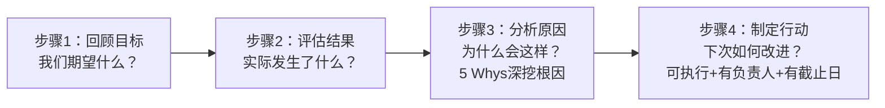
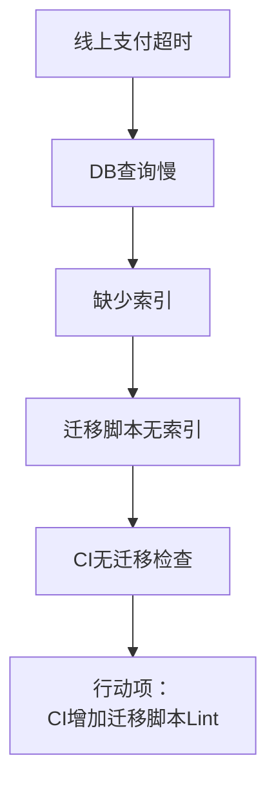
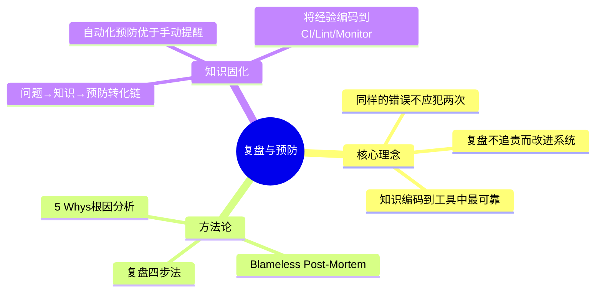

# 开发中的问题一再出现，应该怎么办

## 核心命题

同样的问题反复出现，说明团队**未建立有效的复盘（Retrospective）机制**——问题被修复但根因未被消除。复盘不是追责，而是**系统性地从问题中提取知识并转化为预防措施**。每次线上故障、每个反复出现的 Bug，都应触发一次结构化复盘，产出可执行的改进行动项。**圣斗士不会被同样的招数击败两次——软件团队也不应犯同样的错误两次。**

---

## 1. 复盘方法论

### 1.1 复盘四步法



### 1.2 Blameless Post-Mortem：无罪复盘

| 原则 | 含义 | 反模式 |
|------|------|--------|
| **无罪推定** | 假设每个人在当时条件下都做了最佳决策 | "谁犯的错？追责！" |
| **系统性归因** | 寻找流程/工具/系统的改进点 | "这个人不仔细" |
| **可执行行动** | 每个发现必须有对应的改进行动 | "以后注意"（无法验证） |
| **跟踪闭环** | 行动项有人负责、有截止日期、有验证 | 复盘完就忘了 |

> **Etsy 的实践**：每个线上故障必须在 48 小时内完成 Blameless Post-Mortem，产出公开的复盘报告和行动项。

### 1.3 5 Whys 根因分析

```
问题：线上支付接口超时
Why1：数据库查询慢
  Why2：缺少索引
    Why3：新增字段未加索引
      Why4：数据库迁移脚本不含索引创建
        Why5：CI 中无数据库迁移检查
→ 行动项：在 CI 中增加迁移脚本 Lint，确保新表/字段包含索引定义
```



---

## 2. 知识固化：从复盘到预防

### 2.1 问题→知识→预防的转化链

| 阶段 | 产出 | 责任方 | 工具 |
|------|------|--------|------|
| **问题发生** | 故障报告 | On-call 工程师 | PagerDuty/Opsgenie |
| **复盘分析** | 根因 + 行动项 | 团队 | Confluence/Notion |
| **预防措施** | 代码检查/CI 规则/监控 | 行动项负责人 | 自动化工具 |
| **知识沉淀** | Runbook/SOP | 团队 | 内部 Wiki |

### 2.2 自动化预防：将知识转化为工具

| 问题类型 | 手动预防（❌） | 自动化预防（✅） |
|----------|-------------|----------------|
| 缺少索引 | "以后注意加索引" | CI 中检查迁移脚本 |
| 依赖安全漏洞 | "定期检查依赖" | Dependabot/Renovate 自动 PR |
| 代码规范违反 | "Code Review 时检查" | Lint + Pre-commit Hook |
| 配置错误 | "仔细检查配置" | Schema 验证 + 配置漂移检测 |
| 遗漏测试 | "记得写测试" | CI 中检查覆盖率阈值 |

> **原则**：如果一条经验只能靠"记住"来执行，它迟早会被遗忘。**将知识编码到工具中**，是防止问题再次出现的最可靠方式。

---

## 3. 复盘的组织实践

### 3.1 复盘的触发时机

| 触发条件 | 频率 | 参与者 |
|----------|------|--------|
| **线上故障** | 每次故障后 48h 内 | On-call + 相关开发者 |
| **迭代回顾** | 每迭代结束 | 全团队 |
| **项目里程碑** | 里程碑完成后 | 项目组 |
| **重复 Bug** | 同类 Bug 第 2 次出现 | 相关开发者 |

### 3.2 复盘报告模板

```markdown
# Post-Mortem: [故障标题]

## 时间线
- HH:MM - 告警触发
- HH:MM - 确认影响范围
- HH:MM - 执行回滚/修复
- HH:MM - 服务恢复

## 影响范围
- 持续时间：X 分钟
- 影响用户：Y 人
- 业务损失：Z

## 根因分析（5 Whys）
...

## 行动项
| # | 行动 | 负责人 | 截止日 | 状态 |
|---|------|--------|--------|------|
| 1 | CI 增加迁移检查 | @alice | 2024-01-15 | Done |
```

---

## 4. 总结



**核心要义**：同样的错误不应犯两次。复盘是提取知识、制定预防措施的系统性方法。Blameless Post-Mortem 确保复盘不追责而改进系统，5 Whys 深挖根因，自动化预防将知识转化为工具——如果一条经验只能靠"记住"来执行，它迟早会被遗忘。

---

> **延伸阅读**
>
> - Etsy, "Blameless Post-Mortems": https://codeascraft.com/2012/05/22/blameless-postmortems/
> - Google SRE Ch. 15: Post-Mortem 文化与最佳实践
> - Sidney Dekker, *The Field Guide to Understanding 'Human Error'* (2014): 系统性归因方法论
---

## 原文存档

> 以下为郑晔原文完整内容，保留作为参考。

## 25 | 开发中的问题一再出现，应该怎么办？

看过《圣斗士星矢》的同学大多会对其中的一个说法印象颇深：圣斗士不会被同样的招数击败两次。

我们多希望自己的研发水平也和圣斗士一样强大，可现实却总不遂人愿：同样的线上故障反复出现，类似的 Bug 在不同的地方一再地惹祸，能力强的同学每天就在“灭火”中消耗人生。我们难道就不能稍微有所改善吗？

如果在开发过程中，同样的问题反复出现，说明你的团队没有做好复盘。

### 什么是复盘？

复盘，原本是一个围棋术语，就是对弈者下完一盘棋之后，重新把对弈过程摆一遍，看看哪些地方下得好，哪些下得不好，哪些地方可以有不同甚至是更好的下法等等。

**这种把过程还原，进行研讨与分析的方式，就是复盘。**

现如今，复盘的概念已经被人用到了很多方面，比如，股市的复盘、企业管理的复盘，它也成为了许多人最重要的工具，帮助个体和企业不断地提升。这其中最有名的当属联想的创始人柳传志老爷子，他甚至把“复盘”写到了联想的核心价值观里。

为什么复盘这么好用呢？在我看来有一个重要的原因，在于 **客体化。**

俗话说，当局者迷，旁观者清。以我们的软件开发作为例子，在解决问题的时候，我们的注意力更多是在解决问题本身上，而很少会想这个问题是怎么引起的。

当你复盘时，你会站在另外一个视角，去思考引起这个问题的原因。这个时候，你不再是当事者，而变成了旁观者。你观察原来那件事的发生过程，就好像是别人在做的一样。你由一个主观的视角，变成了一个客观的视角。

**用别人的视角看问题，这就是客体化。**

在软件开发领域，复盘也是一个重要的做法，用来解决开头提到那些反复出现的问题，只不过，它会以不同的方式呈现出来。

### 回顾会议

回顾会议是一个常见的复盘实践，定期回顾是一个团队自我改善的前提。回顾会议怎么开呢？我给你分享我通常的做法。

作为组织者，我会先在白板上给出一个主题分类。我常用的是分成三类：“做得好的、做得欠佳的、问题或建议”。

还有不同的主题分类方式，比如海星图，分成了五大类：“继续保持、开始做、停止做、多做一些、少做一些”五类。

分类方式可以根据自己团队的喜好进行选择。我之所以选用了三类的分类方式，因为它简单直观，几乎不需要对各个分类进行更多的解释。

然后，我会给与会者五分钟时间，针对这个开发周期内团队的表现，按照分类在便签上写下一些事实。比如，你认为做得好的是按时交付了，做得不好的是 Bug 太多。

这里面有两个重点。 **一个是写事实，不要写感受。** 因为事实就是明摆在那里的东西，而感受无法衡量，你感觉好的东西，也许别人感觉很糟糕。

另外， **每张便签只写一条，因为后面我要对便签归类。** 因为大家是分头写的，有可能很多内容是重复的，所以，要进行归类。

五分钟之后，我会号召大家把自己写的便签贴到白板上。等大家把便签都贴好了，我会一张一张地念过去。

这样做是为了让大家了解一下其他人都写了些什么，知道不同人的关注点是什么。一旦有哪一项不清楚，我会请这张便签的作者出来解释一下，保证大家对这个问题的理解是一致的。在念便签的同时，我就顺便完成了便签归类的工作。

等到所有的便签都归好类，这就会成为后续讨论的主题，与会者也对于大家的关注点和看到的问题有了整体的了解。

做得好的部分，是大家值得自我鼓励的部分，需要继续保持。而我们开回顾会议的主要目的是改善和提升，所以，我们的重点在于解决做得不好的部分和有问题出现的地方。

在开始更有针对性的讨论之前，我会先让大家投个票，从这些分类中选出自己认为最重要的几项。我通常是给每人三票，投给自己认为重要的主题。每个人需要在诸多内容中做出取舍，你如果认为哪一项极其重要，可以把所有的票都投给这个主题。

根据大家的投票结果，我就会对所有的主题排出一个顺序来，而这就是我们要讨论的顺序。我们不会无限制的开会，所以，通常来说，只有最重要的几个主题才会得到讨论。

无论是个人选择希望讨论的主题，还是团队选择最终讨论的主题，所有人都要有“优先级”的概念在心里。然后，我们就会根据主题的顺序，一个一个地进行讨论。

讨论一个具体的主题时，我们会先关注现状。我会先让写下反馈意见的人稍微详细地介绍他看到的现象。比如，测试人员会说，最近的 Bug 比较多，相比于上一个开发周期，Bug 增加了50%。

然后，我会让大家分析造成这个现象的原因。比如，有人会说，最近的任务量很重，没有时间写测试。

再下来，我们会尝试着找到一个解决方案，给出行动项。比如，任务重，我们可以让项目经理更有效地控制一下需求的输入，再把非必要的需求减少一下；测试被忽略了，我们考虑把测试覆盖率加入构建脚本，当测试覆盖率不足时，就不允许提交代码。

请注意， **所有给出的行动项应该都是可检查的，而不是一些无法验证的内容。** 比如，如果行动项是让每个程序员都“更仔细一些”，这是做不到的。因为“仔细”这件事很主观，你说程序员不仔细，程序员说我仔细了，这就是扯皮的开始。

而我们上面给出的行动项就是可检查的，项目经理控制输入的需求，我们可以用工作量衡量，还记得我们在讨论用户故事中提到的工作量评估的方式吗？

控制工作量怎么衡量？就是看每个阶段开发的总点数是不是比上一个阶段少了。而测试覆盖率更直接，直接写到构建脚本中，跑不过，不允许提交代码。

好，列好了一个个的行动项，接下来就是找责任人了，责任人要对行动项负责。

比如，项目经理负责需求控制，技术负责人负责将覆盖率加入构建脚本。有了责任人，我们就可以保障这个任务不是一个无头公案。下一次做回顾的时候，我们就可以拿着一个个的检查项询问负责人任务的完成情况了。

### 5个为什么

无论你是否采取回顾会议的方式进行复盘，分析问题，找到根因都是重要的一环。

你的团队如果能一下洞见到根因固然好，如果不能，那么最好多问一些为什么。具体怎么问，有一个常见的做法是：5个为什么（5 Whys）。这种做法是丰田集团的创始人丰田佐吉提出的，后来随着丰田生产方式而广为人知。

为什么要多问几个为什么？因为初始的提问，你能得到的只是表面原因，只有多问几个为什么，你才有可能找到根本原因。

我给你举个例子。服务器经常返回504，那我们可以采用“5个为什么”的方式来问一下。

- 为什么会出现504呢？因为服务器处理时间比较长，超时了。
- 为什么会超时呢？因为服务器查询后面的 Redis 卡住了。
- 为什么访问 Redis 会卡住呢？因为另外一个更新 Redis 的服务删除了大批量的数据，然后，重新插入，服务器阻塞了。
- 为什么它要大批量的删除数据重新插入呢？因为更新算法设计得不合理。
- 为什么一个设计得不合理的算法就能上线呢？因为这个设计没有按照流程进行评审。

问到这里，你就发现问题的根本原因了：设计没有经过评审。找到了问题的原因，解决之道自然就浮出水面了：一个核心算法一定要经过相关人员的评审。

当然，这只是一个例子。有时候，这个答案还不足以解决问题，我们还可以继续追问下去，比如，为什么没有按流程评审等等。

**所以，“5个为什么”中的“5”只是一个参考数字，不是目标。**

“5个为什么”是一个简单易上手的工具，你可能听了名字就知道该怎么用它。有一点需要注意的是，问题是顺着一条主线追问，不能问5个无关的问题。

无论是“回顾会议”也好，“5个为什么”也罢，其中最需要注意的点在于，不要用这些方法责备某个人。我们的目标是想要解决问题，不断地改进，而不是针对某个人发起情感批判。

### 总结时刻

在软件研发中，许多问题是反复出现的，很多开发团队会因此陷入无限“救火”中，解决这种问题一个好的办法就是复盘。

复盘，就是过程还原，进行研讨与分析，找到自我改进方法的一个方式。这种方式使我们拥有了客体化的视角，能够更客观地看待曾经发生过的一切。这种方法在很多领域中都得到了广泛的应用，比如股市和企业管理。

在软件开发中，也有一些复盘的实践。我给你详细介绍了“回顾会议”这种形式。

无论哪种做法，分析问题，找到根因是一个重要的环节。“5个为什么”就是一个常用的找到根因的方式。

如果今天的内容你只能记住一件事，那请记住： **定期复盘，找准问题根因，不断改善。**

最后我想请你分享一下，你的团队是怎么解决这些反复出现的问题呢？

感谢阅读，如果你觉得这篇文章对你有帮助的话，也欢迎把它分享给你的朋友。