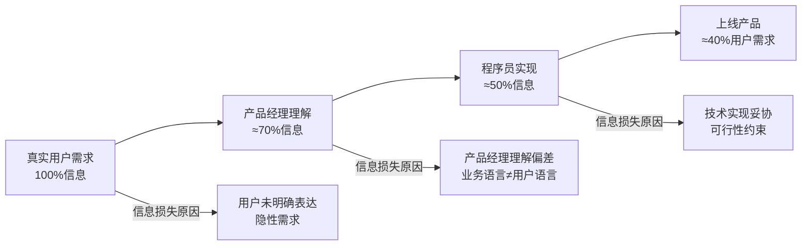
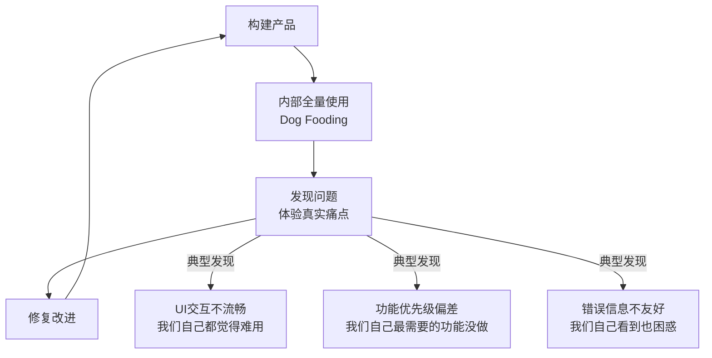
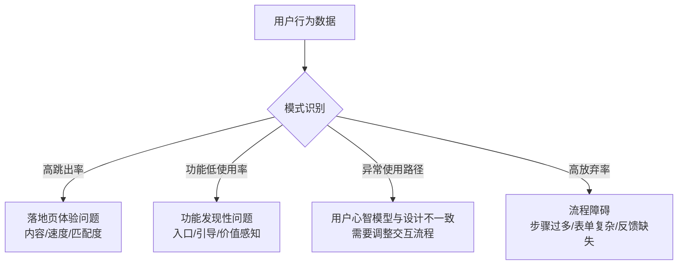
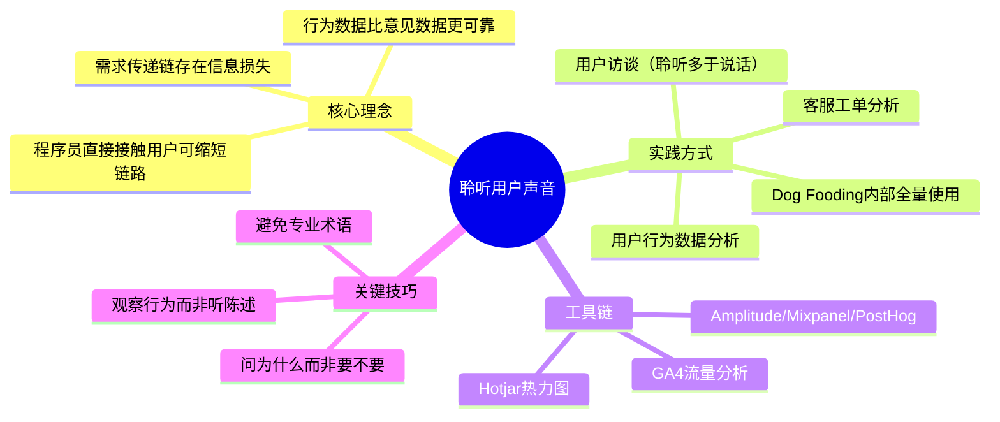

# 作为程序员，你也应该聆听用户声音

## 核心命题

产品经理的需求未必代表用户真实需求——需求经过"用户→产品经理→程序员"的传递链后，信息损失和扭曲不可避免。程序员通过**直接接触用户**——观察用户行为、聆听用户反馈、使用自家产品（Eat Your Own Dog Food）——可以获得超出产品经理传达范围的洞察，形成来自真实世界的**直接反馈**，这是纠正需求偏差的关键维度。

---

## 1. 需求传递链的信息损失

### 1.1 信息传递的衰减效应

> **核心洞察**：经过三级传递后，最终产品仅满足约 40% 的原始用户需求。程序员直接接触用户，可以缩短传递链，显著减少信息损失。

### 1.2 程序员获取用户视角的方式

| 方式 | 深度 | 成本 | 信息类型 | 适用场景 |
|------|------|------|---------|---------|
| **Eat Your Own Dog Food** | 最高 | 零 | 体验级 | 内部工具/开发者产品 |
| **用户访谈** | 高 | 中 | 意见+行为 | 任何产品 |
| **用户行为数据分析** | 中 | 低 | 行为级 | 有埋点基础设施 |
| **客服/工单分析** | 低 | 低 | 问题级 | 已有客服体系 |
| **社区/论坛反馈** | 低 | 低 | 意见级 | 开源/公开产品 |
| **Sales/运营反馈** | 中 | 低 | 商业级 | 商业产品 |

---

## 2. Dog Fooding：最深度的用户视角

### 2.1 定义与行业实践

> **Eat Your Own Dog Food**：公司内部员工率先使用自己的产品，在真实使用场景中发现问题。这一概念因 1988 年微软的 Paul Maritz 发出的"Eating our dog food"邮件而流行开来。

### 2.2 Dog Fooding 的行业案例

| 公司 | Dog Fooding 实践 | 关键发现 |
|------|-----------------|---------|
| **Microsoft** | 内部率先使用 Windows/Office | 安装体验、兼容性问题 |
| **Google** | 内部使用 Chrome/Gmail | 内存占用、搜索体验 |
| **Stripe** | 开发者使用自家 API | API 文档、错误信息可读性 |
| **Slack** | 内部全量使用 Slack | 通知策略、频道管理、搜索体验 |
| **Apple** | 内部使用 iPhone/Mac | 硬件手感、生态系统流畅度 |
| **Netflix** | 内部使用自家流媒体 | 播放延迟、推荐算法效果 |

### 2.3 Dog Fooding 的实施要点

| 要点 | 说明 |
|------|------|
| **全量使用** | 不只是测试，而是日常工作中真正依赖自家产品 |
| **真实场景** | 在生产环境中使用，而非在干净的测试环境中 |
| **反馈机制** | 内置"一键反馈"按钮，降低反馈门槛 |
| **数据追踪** | 内部用户行为数据与外部用户对比，发现差异 |

---

## 3. 数据驱动的用户洞察

### 3.1 行为数据 vs 意见数据

| 数据类型 | 来源 | 特点 | 局限 |
|----------|------|------|------|
| **行为数据** | 埋点/日志/分析 | 用户实际做了什么 | 无法解释"为什么" |
| **意见数据** | 用户访谈/问卷 | 用户说什么 | 可能与行为不一致 |

> **关键洞察**：用户说的和做的往往不一致。行为数据比意见数据更可靠，但需要意见数据解释"为什么"。

### 3.2 行为数据分析工具链

| 工具 | 核心能力 | 适用规模 | 特色 |
|------|---------|---------|------|
| **Amplitude** | 行为分析+归因+实验 | 中大型 | 最全面的产品分析平台 |
| **Mixpanel** | 事件级分析+用户画像 | 中型 | 交互式分析界面 |
| **PostHog** | 开源产品分析+Feature Flag | 初创-中型 | 开源、自托管 |
| **Google Analytics 4** | 流量+转化+事件 | 所有规模 | 免费、生态完善 |
| **Hotjar** | 热力图+录屏+问卷 | 中型 | 可视化用户行为 |

### 3.3 数据洞察的典型模式

---

## 4. 用户访谈的实践

### 4.1 访谈的类型与场景

| 类型 | 时长 | 目的 | 方法 |
|------|------|------|------|
| **探索性访谈** | 30-60 分钟 | 发现未知需求 | 开放式问题，让用户讲故事 |
| **验证性访谈** | 15-30 分钟 | 验证假设 | 结构化问题，聚焦特定功能 |
| **可用性测试** | 15-20 分钟 | 发现交互问题 | 观察用户完成特定任务 |

### 4.2 访谈的关键技巧

| 原则 | 说明 | 反模式 |
|------|------|--------|
| **聆听多于说话** | 80% 听 + 20% 问 | 向用户推销自己的想法 |
| **问"为什么"而非"要不要"** | 深挖动机而非表面需求 | "你需要这个功能吗？"（诱导性） |
| **观察行为而非听陈述** | 用户做的比说的更真实 | 只听用户说，不看用户做 |
| **避免专业术语** | 用用户的语言提问 | 用技术术语与普通用户交流 |

> **Steve Portigal 的建议**：不要问"你喜欢这个功能吗？"，而问"你上次遇到这个问题时是怎么解决的？"——前者诱导偏好，后者揭示真实行为。

---

## 5. 总结

**核心要义**：程序员应主动获取用户视角——通过 Dog Fooding、行为数据分析、用户访谈。仅依赖产品经理的需求传达，会缺失来自真实世界的直接反馈。用户说的和做的往往不一致，行为数据比意见数据更可靠。

---

> **延伸阅读**
>
> - Steve Portigal, *Interviewing Users* (2013): 用户访谈方法论
> - Tomer Sharon, *Validating Product Ideas* (2016): Lean 用户研究
> - PostHog: https://posthog.com/
> - Amplitude: https://amplitude.com/
---

## 原文存档

> 以下为郑晔原文完整内容，保留作为参考。

## 26 | 作为程序员，你也应该聆听用户声音

在前面的专栏内容中，我们讨论过几次与产品经理的交流：你应该问问产品经理为什么要做这个产品特性，要用 MVP（最小可行产品）的角度，衡量当前做的产品特性是不是一个好的选择。

但还有一个问题可能困扰着我们：怎么判断产品经理说的产品特性是不是用户真的需要的呢？

很多时候，产品经理让你实现一个产品特性，你感觉这么做好像不太对，却又说不出哪不对，想提出自己的看法，却不知道从哪下手。之所以会遇到这样的问题，一个重要的原因就是，你少了一个维度：用户视角，你需要来自真实世界的反馈。

### 吃自家的狗粮

产品经理无论要做什么，他都必须有一个立足的根基：为用户服务。所以，如果你了解了用户怎么想，你就有资本判断产品经理给出的需求，是否真的是用户需要的了。

**而作为一个程序员，欠缺用户视角，在与产品经理的交流中，你是不可能有机会的，因为他很容易用一句话就把你打败：“这就是用户需求。”**

很多程序员只希望安安静静地写好代码，但事实上，对于大多数人来说，安安静静是不太可能写好代码的，只有不断扩大自己的工作范围，才可能对准“靶子”。

今天我们讨论的角度，就是要你把工作范围扩大， **由听产品经理的话，扩大成倾听用户的声音。**

作为程序员，你应该听说过一个说法“Eat your own dog food”（吃自家的狗粮）。这个说法有几个不同的来源，都是说卖狗粮的公司真的用了自家的狗粮。

从1988年开始，这个说法开始在 IT 行业流行的，微软的保罗·马瑞兹（Paul Maritz）写了一封“Eating our dog food”的邮件，提到要“提高自家产品在内部使用的比例。”从此，这个说法在微软迅速传播开来。

如今，自己公司用自己的产品几乎成了全行业的共识。抛开一些大公司用这个说法做广告的因素，不断使用自家的产品，会让你多出一个用户的视角。

在挑毛病找问题这件事上，人是不需要训练的，哪里用着不舒服，你一下子就能感受到。所以，不断地使用自家产品，你自己就是产品的用户，这会促使你不断去思考怎么改进产品，再与产品经理讨论时，你就自然而然地拥有了更多的维度。

比如，前面在讨论 MVP 时，我曾经讲过一个我做 P2P 产品的经历。在这个项目中，我就作为用户在上面进行了一些操作。当自己作为用户使用时，就发现了一些令人不爽的地方。

比如，一开始设计的代金券只能一次性使用，如果代金券金额比较大，又没那么多本金，只能使用代金券的一部分，就会让人有种“代金券浪费了”的感觉。

于是，我就提出是不是可以把代金券多次使用。很快，产品就改进了设计。 **这种改进很细微，如果你不是用户，只从逻辑推演的角度是很难看到这种差异的。**

### 当你吃不到狗粮时

不过，不是每家公司的产品都那么“好吃”。“吃自家狗粮”的策略对于那些拥有“to C”产品的公司来说，相对是比较有效的。但有时候，你做的产品你根本没有机会用到。

我曾经与很多海外客户合作过，我做的很多产品，自己根本没有机会使用。比如，我做过五星级酒店的审计平台。除了能对界面上的内容稍微有点感觉之外，对于使用场景，我是完全不知道的。

如果没有机会用到自己的产品，我们该怎么办呢？我们能做的就是尽可能找机会，去到真实场景里，看看用户是如何使用我们软件的。

比如，做那个酒店审计平台时，我就和客户一起到了一家五星级酒店，看着他们怎样一条一条地按照审计项核查，然后把审计结果登记在我们的平台上。

那些曾经只在写程序时见到的名词，这回就活生生地呈现在我眼前了。后来再面对代码时，我看到就不再是一个死板的程序了，我和产品经理的讨论也就更加扎实了。

有的团队在这方面有比较好的意识，会主动创造一些机会，让开发团队成员有更多机会与用户接触。

比如，让开发团队到客服团队轮岗。接接电话，听听用户的抱怨，甚至是谩骂。你会觉得心情非常不好，但当你静下来的时候，你就会意识到自己的软件有哪些问题，如果软件做得不好，影响会有多大。

这时，你也就能理解，为什么有的时候，很多业务人员会对开发团队大发雷霆了，因为他们是直接面对用户“炮火”的人。

我们为什么要不断地了解用户的使用情况呢？因为用户的声音是来自真实世界的反馈。不去聆听用户声音，很容易让人自我感觉良好。还记得在 “ [为什么世界和你的理解不一样](http://time.geekbang.org/column/article/80755)” 中，我们提到的那个只接收好消息的花剌子模国国王的例子吗？

我们要做一个有价值的产品，这个“价值”，不是对产品经理有价值，而是要对用户有价值。华为总裁任正非就曾经说过，“让听得见炮声的人来做决策。”

我们做什么产品，本质上不是由产品经理决定的，而是由用户决定的。只有听见“炮声”，站在一线，我们才更有资格判断产品经理给出的需求是否真的是用户所需。

### 当产品还没有用户时

如果你的团队做的是一个新的产品，还没有真正的用户，那又该怎么办呢？你可以尝试一下“用户测试”的方法。

之前我做过一个海外客户的项目。因为项目处于启动阶段，我被派到了客户现场。刚到那边，客户就兴高采烈地告诉我，他们要做一个用户测试，让我一起参加。当时，我还有点不知所措，因为我们的项目还没有开始开发，一个什么都没有的项目就做用户测试了？是的，他们只做了几个页面，就开始测试了。

站在今天的角度，我前面已经给你讲过了精益创业和 MVP，你现在理解起来就会容易很多。是的，他们就是要通过最小的代价获取用户反馈。

他们是怎么做测试的呢？首先是一些准备工作，找几个普通用户，这些人各有特点，能够代表不同类型的人群。准备了一台摄像机，作为记录设备，拍摄用户测试的全过程。还准备了一些表格，把自己关注的问题罗列上去。

然后，就是具体的用户测试了。他们为用户介绍了这个测试的目的、流程等一些基本信息。然后，请用户执行几个任务。

在这个过程中，测试者会适时地让用户描述一下当时的感受，如果用户遇到任何问题，他们会适当介入，询问出现的问题，并提供适当的帮助。

最后，让用户为自己使用的这个产品进行打分，做一番评价。测试者的主要工作是观察和记录用户的反应，寻找对用户使用造成影响的部分。做用户测试的目的就是看用户会怎样用这个网站，这样的网站设计会对用户的使用有什么影响。

当天测试结束之后，大家一起整理了得到的用户反馈，重新讨论那些给用户体验造成一定影响的设计，然后调整一版，再来做一次用户测试。

对我来说，那是一个难忘的下午，我第一次这么近距离地感受用户。他们的关注点，他们的使用方式都和我曾经的假设有很多不同。后面再来设计这个系统时，我便有了更多的发言权，因为产品经理有的角度，我作为开发人员也有。

最后，我还想说一个程序员常见的问题： **和产品经理没有“共同语言。”**

因为他们说的通常是业务语言，而我们程序员的口中，基本上是计算机语言。这是两个领域的东西，很难互通。前面在讨论代码的时候，我提到要用业务的语言写代码，实际上，这种做法就是领域驱动设计中的通用语言（Ubiquitous Language）。

所谓通用语言，不只是我们写代码要用到，而是要让所有人说一套语言，而这个语言应该来自业务，来自大家一起构建出的领域模型。

这样大家在交流的时候，才可能消除歧义。所以，如果你想让项目顺利进行，先邀请产品经理一起坐下来，确定你们的通用语言。

### 总结时刻

今天我们讨论了一个重要的话题：倾听用户声音。这是开发团队普遍欠缺的一种能力，更准确地说，是忽略的一种能力。所以，“吃自家的狗粮”这种听上去本来是理所当然的事情，才被反复强调，成为 IT 行业的经典。

在今天本文，我给你介绍了“了解用户需求”的不同做法，但其归根结底就是一句话，想办法接近用户。

无论是自己做用户，还是找机会接触已有用户，亦或是没有用户创造用户。只有多多听取来自真实用户的声音，我们才不致于盲目自信或是偏颇地相信产品经理。 **谁离用户近，谁就有发言权，无论你的角色是什么。**

如果今天的内容你只能记住一件事，那请记住： **多走近用户。**

最后，我想请你思考一下，在你的实际工作中，有哪些因为走近客户而发现的问题，或者因为没有走近客户造成的困扰呢？

感谢阅读，如果你觉得这篇文章对你有帮助的话，也欢迎把它分享给你的朋友。