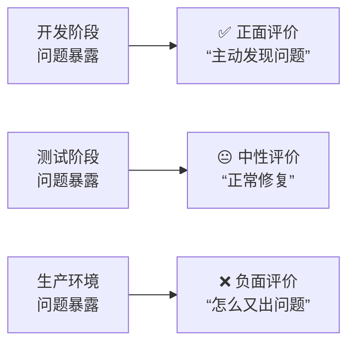
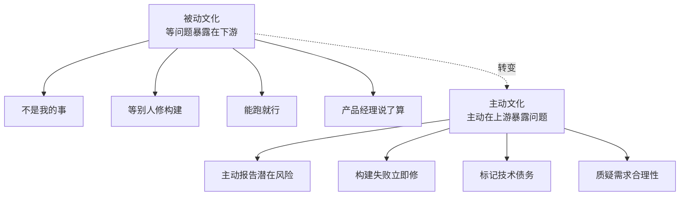
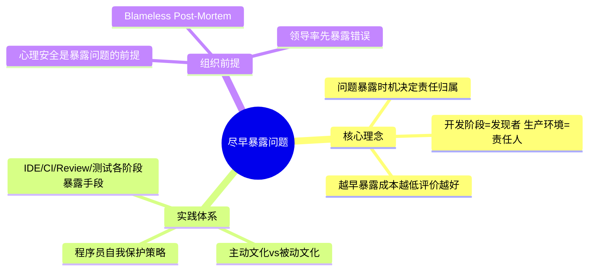

# 尽早暴露问题：为什么被指责的总是你

## 核心命题

"辛苦工作却总被指责"的根因是**问题暴露在下游而非上游**。当问题在开发阶段暴露，你是"发现者"（正面评价）；当问题在生产环境暴露，你是"责任人"（负面评价）。尽早暴露问题（Shift-Left）不仅是工程实践，更是**自我保护的职业策略**——问题暴露越早，修复成本越低，你的评价越好。

---

## 1. 问题暴露时机与责任归属

### 1.1 时机决定评价

> **核心洞察**：同样的问题，暴露时机不同，责任归属完全不同。开发阶段暴露 = 发现者（英雄），生产环境暴露 = 责任人（被指责）。

### 1.2 代价曲线：越早越低

| 暴露时机 | 修复成本 | 影响范围 | 你的评价 |
|----------|---------|---------|---------|
| **编码时（IDE/编译）** | 1x | 仅自己 | 正面 |
| **提交时（CI 构建）** | 10x | 团队可见 | 正面 |
| **Code Review 时** | 10-50x | 2-3 人可见 | 正面-中性 |
| **QA 测试时** | 100x | QA 团队可见 | 中性 |
| **生产环境** | 1000x | 用户+管理层可见 | 负面 |

---

## 2. 尽早暴露问题的实践体系

### 2.1 各阶段的暴露手段

| 阶段 | 暴露手段 | 发现的问题类型 | 速度 |
|------|---------|--------------|------|
| **编码时** | IDE 提示、编译错误、TDD Red | 语法错误、逻辑错误 | 秒级 |
| **提交时** | CI 构建、Lint、静态分析 | 规范违反、安全漏洞 | 分钟级 |
| **Code Review** | PR Review | 设计问题、边界遗漏 | 小时级 |
| **测试环境** | 集成测试、契约测试 | 服务间兼容性 | 分钟级 |
| **预发环境** | 冒烟测试、性能测试 | 环境差异、性能退化 | 小时级 |

### 2.2 主动暴露问题的文化

| 行为 | 被动文化 | 主动文化 |
|------|---------|---------|
| **发现潜在问题** | "不是我的事" | 主动报告并提出修复建议 |
| **构建失败** | "等别人修" | 立即停止手头工作优先修复 |
| **技术债务** | "能跑就行" | 标记并排入 Backlog |
| **需求疑问** | "产品经理说了算" | 主动质疑并要求澄清 |
| **线上异常** | "没报错就行" | 关注指标趋势，主动排查 |

### 2.3 程序员的自我保护策略

| 策略 | 做法 | 保护效果 |
|------|------|---------|
| **CI 红灯即停** | 构建失败后立即修复，不继续开发 | 避免问题累积 |
| **小步提交** | 每次提交增量小，问题范围窄 | 快速定位问题 |
| **主动报告风险** | 在站会/Review 中提前指出风险 | 问题由你发现而非别人发现 |
| **沙盘推演** | 编码前推演上线路径 | 预判上线风险 |
| **监控告警** | 上线后主动配置关键指标监控 | 第一时间感知异常 |

---

## 3. 心理安全：尽早暴露的组织前提

### 3.1 心理安全（Psychological Safety）

> Amy Edmondson 的研究指出：**高心理安全的团队更愿意主动暴露问题**——因为暴露问题不会被惩罚。

| 组织特征 | 低心理安全 | 高心理安全 |
|----------|-----------|-----------|
| **暴露问题** | 隐藏、掩盖 | 主动报告 |
| **犯错** | 被惩罚 | 被视为学习机会 |
| **提问** | 怕被嘲笑 | 被鼓励 |
| **创新** | 只做安全的事 | 敢于尝试 |

### 3.2 建立心理安全的实践

| 实践 | 说明 |
|------|------|
| **领导率先暴露自己的错误** | 树立"犯错不丢人"的榜样 |
| **Blameless Post-Mortem** | 复盘不追责而改进系统 |
| **奖励问题发现者** | "发现构建失败的人值得表扬" |
| **公开承认不确定性** | "我不确定这个方案是否可行，需要验证" |

---

## 4. 总结

**核心要义**：尽早暴露问题，既是工程实践，也是职业策略。问题暴露越早，修复成本越低，你的评价越好。主动暴露问题的人是"发现者"，被动暴露问题的人是"责任人"。心理安全是尽早暴露的组织前提。

---

> **延伸阅读**
>
> - Amy C. Edmondson, *The Fearless Organization* (2018): 心理安全与问题暴露
> - Google SRE Ch. 15: Post-Mortem 文化
> - Sidney Dekker, *The Field Guide to Understanding 'Human Error'* (2014)
---

## 原文存档

> 以下为郑晔原文完整内容，保留作为参考。

## 27 | 尽早暴露问题： 为什么被指责的总是你？

今天我准备讨论一个经常会让很多程序员郁闷的事情，为什么你已经工作得很辛苦了，但依然会被指责。在讨论这个问题之前，我们先来讲一个小故事。

程序员小李这天接到了一个新的任务。系统要做性能提升，原先所有的订单都要下到数据库里，由于后来有很多订单都撤了，反复操作数据库，对真正成交过程的性能造成了影响。所以，技术负责人老赵决定把订单先放到缓存里。

这就会牵扯到一个技术选型的问题，于是，老赵找了几个可以用作缓存的中间件。为了给大家一个交代，老赵决定让小李给这几个中间件做一个测试，给出测试结果，让大家一起评估。小李高兴了，做这种技术任务最开心，可以玩新东西了。

老赵问他：“多长时间可以搞定？”

小李说：“一个星期吧！”

老赵也很爽快，“一个星期就一个星期。不过，我得提个要求，不能是纯测中间件，得带着业务跑。”

“没问题。”小李一口答应下来。老赵怕小李做多了，还特意嘱咐他，只测最简单的下单撤单环节就好。

等真的开始动手做了，小李发现，带着业务跑没那么容易，因为原来的代码耦合度太高，想把新的中间件加进去，要先把下单和撤单环节隔离开来。而这两个操作遍布在很多地方，需要先做一些调整。

于是，小李只好开始不分白天黑夜地干起来。随着工作的深入，小李越发觉得这个活是个无底洞，因为时间已经过半了，他的代码还没调整完。

这时，老赵来问他工作进展，他满面愁容地说，估计干不完了。老赵很震惊，“不就是测试几个中间件吗？”

小李也一脸委屈，“我们为啥要带着业务跑啊？我这几天的时间都在调整代码，以便能够把中间件的调用加进去。”

老赵也很疑惑，“你为啥要这么做？”

“你不是说要带着业务跑吗？”

“我是说要带着业务跑啊！但你可以自己写一个下单撤单的程序，主要过程保持一致就好了。”小李很无奈，心里暗骂，你咋不早说呢？

是啊！你咋不早说呢？不过，我想说不是老赵，而是小李。

### 谁知道有问题？

我们来分析一下问题出在哪。在这个故事里，小李和老赵也算有“以终为始”的思维，在一开始就确定了一个目标，做一个新中间件测试，要带着业务跑。

小李可以说是很清楚目标的，但在做的过程中，小李发现了问题，原有代码很复杂，改造的工作量很大，工作可能没法按时完成。

到此为止，所有的做法都没有错。 **但接下来，发现问题的小李选择了继续埋头苦干，直到老赵来询问，无奈的小李才把问题暴露出来。**

在老赵看来，这并不是大事，调整一下方案就好了。但是小李心生怨气，在他看来，老赵明明有简单方案，为啥不早说，害得自己浪费了这么多时间。

但反过来，站在老赵的角度，他是怎么想的呢？“我的要求是带着业务跑，最理想的方案当然是和系统在一起，你要是能搞定，这肯定是最好的；既然你搞不定，退而求其次，自己写一个隔离出来的方案，我也能接受。”

你看出来问题在哪了吗？老赵的选择没有任何问题，问题就出在， **小李发现自己可能搞不定任务的时候，他的选择是继续闷头做，而不是把问题暴露出来，寻求帮助。**

作为一个程序员，克服技术难题是我们工作的一个重要组成部分，所以，一旦有困难我们会下意识地把自己投入进去。但这真的是最好的做法吗？并不是， **不是所有的问题，都是值得解决的技术难题。**

在工作中遇到问题，这简直是一件正常得不能再正常的事儿了，即便我们讲了各种各样的工作原则，也不可避免会在工作中遇到问题。

既然是你遇到的问题，你肯定是第一个知道问题发生的人，如果你不把问题暴露出来，别人想帮你也是有心无力的。

如果老赵不过问，结果会怎么样？必然是小李一条路跑到黑。然后，时间到了，任务没完成。

更关键的是，通常项目计划是一环套一环的，小李这边的失败，项目的后续部分都会受到影响，项目整体延期几乎是必然的。这种让人措手不及的情况，是很多项目负责人最害怕见到的。

所以，虽然单从小李的角度看，这只是个人工作习惯的事，但实际上，处于关键节点的人可能会带来项目的风险。而小李的问题被提前发现，调整的空间则会大很多。

**遇到问题，最好的解决方案是尽早把问题暴露出来。** 其实，这个道理你并不陌生，因为你在写程序的时候，可能已经用到了。

### Fail Fast

写程序有一个重要的原则叫 [Fail Fast](http://www.martinfowler.com/ieeeSoftware/failFast.pdf)，这是什么意思呢？就是如果遇到问题，尽早报错。

举个例子，我做了一个查询服务，可以让你根据月份查询一些信息，一年有12个月，查询参数就是从1到12。

问题来了，参数校验应该在哪做呢？如果什么都不做，这个查询参数就会穿透系统，传到你的数据库上。

如果传入的参数是合法的，当然没有任何问题，这个查询会返回一个正常的结果。但如果这个参数是无意义的，比如，传一个“13”，那这个查询依然会传到数据库上。

事实上，很多不经心的系统就是这么做的，一旦系统出了什么状况，你很难判断问题的根源。

在这个极度简化的例子里，你可以一眼看出问题出在输入参数上，一旦系统稍具规模，请求来自不同的地方，这些请求最终都汇集到数据库上，识别来源的难度就会大幅度增加。尤其是系统并发起来，很难从日志中找出这个请求的来源。

你可能会说，“为了方便服务对不同数据来源进行识别，可以给每个请求加上一个唯一的请求ID吧？”

看，系统就是这么变复杂的，我经常调侃这种解决方案，就是没有困难创造困难也要上。当然，即便以后真的加上请求ID，理由也不是现在这个。

其实，要解决这个问题，做法很简单。稍微有经验的人都知道，参数校验应该放在入口的位置上，不合法的请求就不让它往后走了。这种把可能预见的失败拦在外面的做法就是 Fail Fast，有问题不可怕，让失败尽早到来。

上面这个例子很简单，我再给你举一个例子。如果配置文件缺少了一个重要参数，比如，缺少了数据库最大连接数，你打算怎么处理？很多人会选择给一个缺省值，这就不是 Fail Fast 的做法。既然是重要参数，少了就报错，这才叫 Fail Fast。

其实，Fail Fast 也有一些反直觉的味道，很多人以构建健壮系统为由，兼容了很多奇怪的问题，而不是把它暴露出来。反而会把系统中的 Bug 隐藏起来。

我们都知道，靠 debug 来定位问题是最为费时费力的一种做法。所以，别怕系统有问题，有问题就早点报出来。

顺便说一下，在前面这个例子里，透传参数还有几个额外的问题。一是会给数据库带来额外的压力，如果有人用无意义查询作为一种攻击手段，它会压垮你的数据库。再有一点，也是安全问题，一些SQL攻击，利用的就是这种无脑透传。

### 克服心理障碍

对我们来说，在程序中尽早暴露问题是很容易接受的。但在工作中暴露自己的问题，却是很大的挑战，因为这里还面临着一个心理问题：会不会让别人觉得自己不行。

说实话，这种担心是多余的。因为每个人的能力是强是弱，大家看得清清楚楚。只有你能把问题解决了大家才会高看你，而把问题遮盖住，并不能改善你在别人心目中的形象。

既然是问题，藏是藏不住的，就像最开始那个故事里的小李，即便他试图隐藏问题，但最后他还是不可能完成的，问题还是会出来，到那时，别人对他的评价，只会更加糟糕。

比起尽早暴露问题，还有更进一步的工作方式，那就是把自己的工作透明化，让别人尽可能多地了解自己的工作进展，了解自己的想法。

如果能做到这一点，其他人在遇到与你工作相关的事情，都会给你提供信息，帮助你把工作做得更好。当然，这种做法对人的心理挑战，比尽早暴露问题更大。

从专栏开始到现在，我们讲了这么多原则和实践，其实，大多数都是在告诉你，有事先做。

一方面，这是从软件变更成本的角度在考虑；另一方面，也是在从与人打交道的角度在考虑。

越往前做，给人留下的空间和余地越大，调整的机会也就越充足。而在最后一刻出现问题的成本实在太高，大到让人无法负担。

### 总结时刻

我们今天讨论了一个重要的工作原则，把事情往前做，尽早暴露问题。我们前面讲的很多内容说的都是这个原则，比如，要先确定结果，要在事前做推演等等。越早发现问题，解决的成本就越低，不仅仅是解决问题本身的成本，更多的是对团队整体计划的影响。

一方面，事前我们要通过“以终为始”和“任务分解”早点发现问题；另一方面，在做事过程中，一旦在有限时间内搞不定，尽早让其他人知道。

这个原则在写程序中的体现就是 Fail Fast，很多程序员因为没有坚持这个原则，不断妥协，造成了程序越来越复杂，团队就陷入了无尽的泥潭。

原则很简单，真正的挑战在于克服自己的心理障碍。很多人都会下意识地隐瞒问题，但请相信你的队友，大家都是聪明人，问题是藏不住的。

如果今天的内容你只记住一件事，那请记住： **事情往前做，有问题尽早暴露。**

最后，我想请你回想一下，如果遵循了这样的工作原则，你之前犯过的哪些错误是可以规避掉的呢？

感谢阅读，如果你觉得这篇文章对你有帮助的话，也欢迎把它分享给你的朋友。