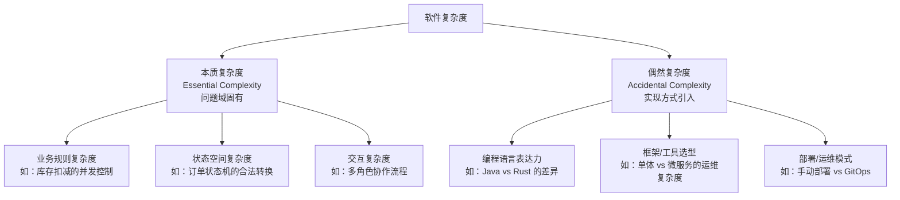
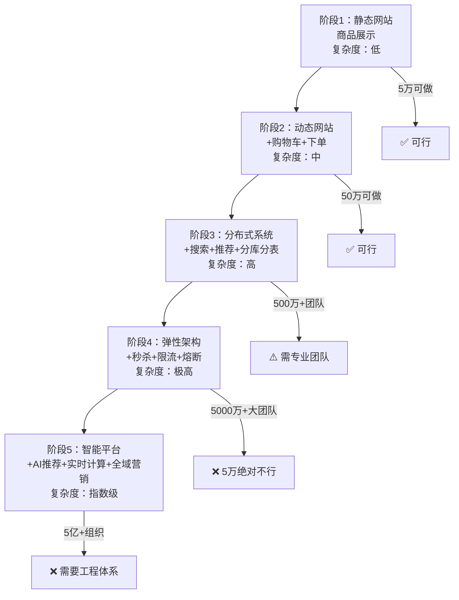
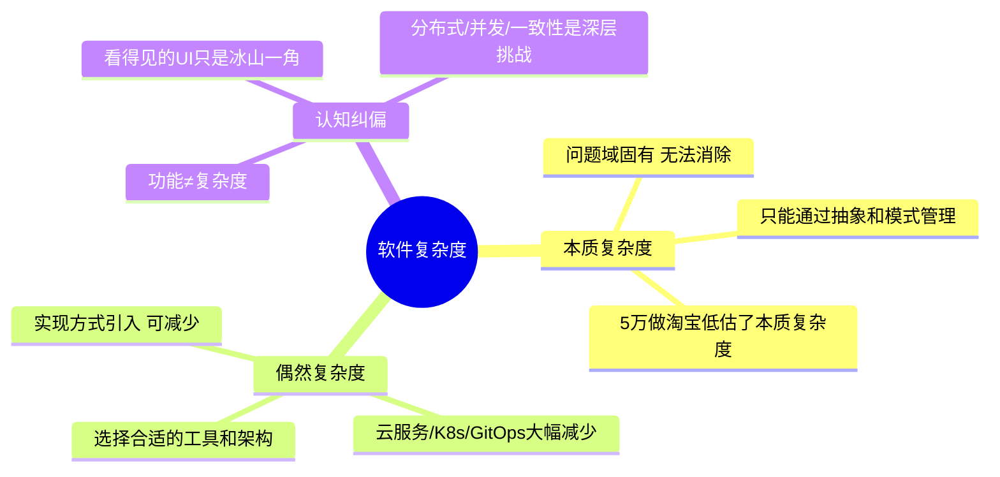
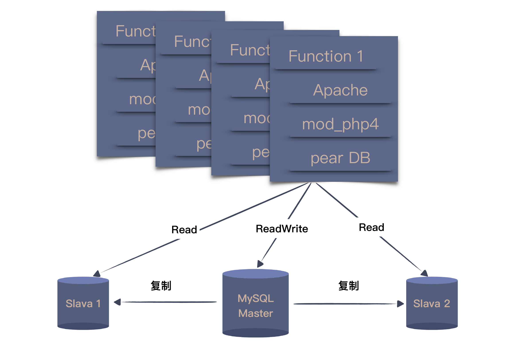
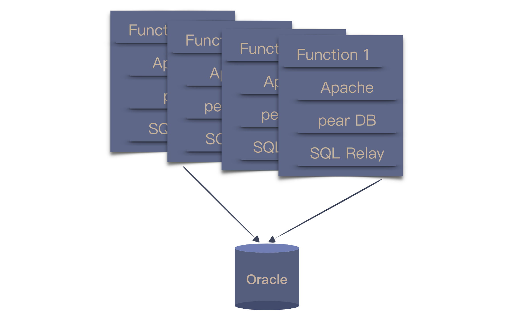

# 为什么总有人觉得5万块钱可以做一个淘宝

## 核心命题

"5万块做一个淘宝"的荒谬，源于**对软件复杂度的系统性低估**。Fred Brooks 在 1986 年的经典论文"No Silver Bullet"中将软件复杂度分为**本质复杂度（Essential Complexity）**——问题域固有的复杂性，和**偶然复杂度（Accidental Complexity）**——实现方式引入的复杂性。淘宝的复杂度不是"一个购物网站"那么简单，而是**分布式系统、高并发、数据一致性、运维体系**等多维度的综合。低估本质复杂度，是"5万做淘宝"思维的根源。

---

## 1. 软件复杂度的双维度模型

### 1.1 Brooks 的复杂度分类

> **核心论断**：本质复杂度无法消除（因为问题就在那里），只能通过好的设计来**管理**；偶然复杂度可以通过更好的工具、语言、架构来**减少**。

### 1.2 "5万做淘宝"低估了什么？

| 维度 | 用户认知 | 淘宝实际 | 本质复杂度 |
|------|---------|---------|-----------|
| **功能** | "能买东西就行" | 搜索、推荐、比价、评价、客服、物流追踪… | 电商业务规则的组合爆炸 |
| **并发** | "几百人用" | 双11峰值 58.3 万笔/秒 | 高并发下的数据一致性 |
| **数据** | "存到数据库" | PB 级数据，数百个分库分表 | 数据分布与查询效率的矛盾 |
| **一致性** | "买了就减库存" | 分布式事务、超卖防护、最终一致性 | 并发环境下的状态正确性 |
| **可用性** | "能访问就行" | 99.99% SLA，全年故障 < 52 分钟 | 容错、降级、熔断机制 |
| **运维** | "部署上去就行" | 全链路监控、灰度发布、混沌工程 | 大规模分布式系统的可观测性 |

---

## 2. 从"购物网站"到"淘宝"的复杂度阶梯

### 2.1 各阶段的本质复杂度增长

### 2.2 关键技术挑战的本质复杂度分析

| 挑战 | 5万方案 | 本质复杂度 | 专业方案 |
|------|---------|-----------|---------|
| **库存扣减** | `UPDATE stock SET count=count-1` | 并发下超卖 | 分布式锁 + 乐观锁 + 库存预热 |
| **订单状态** | 简单状态字段 | 状态机合法转换约束 | 状态机引擎 + Saga 编排 |
| **搜索** | `SELECT * LIKE '%keyword%'` | 分词+相关性+实时性 | Elasticsearch + 向量搜索 |
| **推荐** | 无 | 用户画像+实时计算 | 协同过滤 + 深度学习 + 实时特征 |
| **支付** | 无 | 资金安全+对账+幂等 | 分布式事务 + TCC + 对账系统 |

---

## 3. 偶然复杂度的减少策略

### 3.1 工具与平台的进步

| 偶然复杂度来源 | 2010 年方案 | 2024-2026 方案 | 复杂度减少 |
|---------------|-----------|---------------|-----------|
| **服务器运维** | 自建机房+物理机 | 云服务 + K8s + Serverless | 大幅减少 |
| **数据库运维** | 自建 MySQL 主从 | 云 RDS + PlanetScale + Neon | 大幅减少 |
| **CI/CD** | 手动构建+部署 | GitHub Actions + Argo CD | 大幅减少 |
| **监控** | 自建 Zabbix | Datadog + OpenTelemetry | 大幅减少 |
| **搜索** | 自建 Solr 集群 | Elastic Cloud + Meilisearch | 中等减少 |

### 3.2 本质复杂度的管理策略

> 本质复杂度无法消除，但可以通过**抽象**和**模式**来管理：

| 本质复杂度 | 管理策略 | 设计模式 |
|-----------|---------|---------|
| 业务规则复杂 | 领域建模 + DDD | 聚合、值对象、领域事件 |
| 状态空间复杂 | 有限状态机 | State Pattern、Saga |
| 并发控制复杂 | CQRS + Event Sourcing | 事件溯源、最终一致性 |
| 交互复杂 | 流程编排 | BPMN、工作流引擎 |

---

## 4. 总结

**核心要义**：软件复杂度 = 本质复杂度 + 偶然复杂度。好的设计减少偶然复杂度，但无法消除本质复杂度。"5万块做淘宝"低估的是本质复杂度——分布式一致性、高并发、数据规模等问题的固有难度。理解复杂度的双维度模型，才能做出合理的技术决策和资源评估。

---

> **延伸阅读**
>
> - Fred Brooks, "No Silver Bullet: Essence and Accidents of Software Engineering" (1986): 本质复杂度 vs 偶然复杂度的奠基论文
> - Martin Kleppmann, *Designing Data-Intensive Applications* (2017): 分布式系统的本质复杂度分析
> - Eric Evans, *Domain-Driven Design* (2003): 用领域建模管理本质复杂度
---

## 原文存档

> 以下为郑晔原文完整内容，保留作为参考。

## 36 | 为什么总有人觉得5万块钱可以做一个淘宝？

今天，我们从软件行业的一个段子说起。

甲方想要做个电商网站，作为乙方的程序员问：“你要做个什么样的呢？”甲方说：“像淘宝那样就好。”程序员问：“那你打算出多少钱？”甲方想了想，“5万块钱差不多了吧！”

这当然是个调侃客户不懂需求的段子，但你有没有想过，为什么在甲方看来并不复杂的系统，你却觉得困难重重呢？

**因为你们想的根本不是一个东西。**

在客户看来，我要的不就是一个能买东西的网站吗？只要能上线商品，用户能看到能购买不就好了，5万块钱差不多了。

而你脑中想的却是，“淘宝啊，那得是多大的技术挑战啊，每年一到‘双11’，那就得考虑各种并发抢购。淘宝得有多少程序员，5万块你就想做一个，门都没有。”

如果放在前面“沟通反馈”的模块，我可能会讲双方要怎么协调，把想法统一了。但到了“自动化”的模块，我想换个角度讨论这个问题：系统是怎么变复杂的。

### 淘宝的发展历程

既然说到了淘宝，我们就以一些公开资料来看看淘宝的技术变迁过程。2013年，子柳出版了一本《 [淘宝技术这十年](http://book.douban.com/subject/24335672/)》，这本书里讲述了淘宝是怎么一步步变化的。

按照书中的说法，第一个淘宝是“买来的”，买的是一个叫做 PHPAuction 的系统，即便选择了最高配，也才花了2000美元左右。这是一个采用 LAMP 架构的系统，也就是 Linux + Apache + MySQL + PHP，这在当年可是典型的开源架构。

团队所做的主要就是一些订制化工作，最大的调整就是将单一数据库的读写进行了拆分，变成了一个主库和两个从库。这种结构在今天来看，依然是很多团队做调整的首选。

当访问量和数据量不断提升，MySQL 数据库率先扛不住了。当年的 MySQL 默认采用的是 MyISAM 引擎，写数据的时候会锁住表，读也会被卡住，当然，这只是诸多问题中的一个。

2003年底，团队将 MySQL 换成了 Oracle。由于 Oracle 的性能要好上许多，主从的数据库架构又改回了单一数据库。但由于 PHP 访问数据库的缺省方案没有连接池，只好找了开源的 SQL Relay，这也为后续的改进埋下了伏笔。

当数据量继续加大，本地存储就已经无法满足了，只能通过引入网络存储解决问题。数据量进一步增大之后，存储节点一拆再拆，依然不能解决问题，淘宝就踏上了购买小型机的道路。

IBM 的小型机、Oracle 的数据库和 EMC 的存储，这个阶段就踏上了 IOE 之路。

2004年初，SQL Relay 已经成了一个挥之不去的痛点，于是，只能从更根本的方案上动脑筋：更换程序设计语言。作为当时的主流，Java 成了不二之选。

替换的方案就是给业务分模块，一块一块地替换。老模块只维护，不增加新功能，新功能只在新模块开发，新老模块共用数据库。新功能上线，则关闭老模块对应功能，所有功能替换完毕，则老模块下线。

淘宝的数据量继续增长，单台 Oracle 很快到了上限，团队采用了今天常见的“分库分表”模式，但“分库分表”就会带来新的问题，跨数据库的数据怎么整合？于是，打造出了一个 DBRoute，用以处理分库的数据。

但是，这种做法也带来了一个新的问题，同时连接多个数据库，任何一个数据库出了问题，都会导致整个网站的故障。

当淘宝的数据量再次增长，每次访问都到了数据库，数据库很难承受。一个解决方案就是引入缓存和 CDN（Content Delivery Network，内容分发网络），这样，只读数据的压力就从数据库解放了出来。

当时的缓存系统还不像今天这么成熟，于是，团队基于一个开源项目改出了一个。他们用的 CDN 最开始是一个商用系统，但流量的增加导致这个系统也支撑不住了，只好开始搭建自己的 CDN。

后来，因为 CDN 要消耗大量的服务器资源，为了降低成本，淘宝又开始研发自己的低功耗服务器。

随着业务的不断发展，开发人员越来越多，系统就越来越臃肿，耦合度也逐渐提升，出错的概率也逐渐上升。这时，不得不对系统进行分解，将复用性高的模块拆分出来，比如，用户信息。

业务继续发展，拆分就从局部开始向更大规模发展，底层业务和上层流程逐渐剥离，并逐渐将所有业务都模块化。

有了一个相对清晰地业务划分之后，更多的底层业务就可以应用于不同的场景，一个基础设施就此成型，新的业务就可以使用基础设施进行构建，上层业务便如雨后春笋一般蓬勃发展起来。

在这个过程中，有很多技术问题在当时还没有好的解决方案，或者是不适合于它们所在的场景。所以，淘宝的工程师就不得不打造自己的解决方案，比如：分布式文件系统（TFS）、缓存系统（Tair）、分布式服务框架（HSF）等等。还有一些技术探索则是为了节省成本，比如，去 IOE 和研发低功耗服务器等等。

我这里以淘宝网站的发展为例，做了一个快速的梳理，只是为了让你了解一个系统的发展，如果你有兴趣了解更多细节，不妨自己找出这本书读读。当然，现在的淘宝肯定比这更加完整复杂。

### 同样的业务，不同的系统

为什么我们要了解一个系统的演化过程呢？ **因为作为程序员，我们需要知道自己面对的到底是一个什么样的系统。**

回到我们今天的主题上，5万块钱可以不可以做一个淘宝？答案是，取决于你要的是一个什么样的系统。最开始买来的“淘宝”甚至连5万块钱都不用，而今天的淘宝和那时的淘宝显然不是一个系统。

从业务上说，今天的淘宝固然已经很丰富了，但最核心的业务相差并不大，无非是卖家提供商品，买家买商品。那它们的本质差别在哪呢？

回顾上面的过程，你就可以看到，每次随着业务量的增长，原有技术无法满足需要，于是，就需要用新的技术去解决这个问题。这里的关键点在于： **不同的业务量。**

一个只服务于几个人的系统，单机就够了，一个刚刚入行的程序员也能很好地实现这个系统。而当业务量到达一台机器抗不住的时候，就需要用多台机器去处理，这个时候就必须考虑分布式系统的问题，可能就要适当地引入中间件。

而当系统变成为海量业务提供服务，就没有哪个已经打造好的中间件可以提供帮助了，需要自己从更底层解决问题。

虽然在业务上看来，这些系统是一样的，但在技术上看来，在不同的阶段，一个系统面对的问题是不同的，因为它面对业务的量级是不同的。 **更准确地说，不同量级的系统根本就不是一个系统。**

只要业务在不断地发展，问题就会不断出现，系统就需要不断地翻新。我曾听到一个很形象的比喻：把奥拓开成奥迪。

### 你用对技术了吗？

作为一个程序员，我们都知道技术的重要性，所以，我们都会努力地去学习各种各样的新技术。尤其是当一个技术带有大厂光环的时候，很多人都会迫不及待地去学习。

我参加过很多次技术大会，当大厂有人分享的时候，通常都是人山人海，大家都想学习大厂有什么“先进”技术。

知道了，然后呢？

很多人就想迫不及待地想把这些技术应用在自己的项目中。我曾经面试过很多程序员，给我讲起技术来滔滔不绝，说什么自己在设计时考虑各种分布式的场景，如果系统的压力上来时，他会如何处理。

我就好奇地问了一个问题，“你这个系统有多少人用？”结果，他做的只是一个内部系统，使用频率也不高。

为了技术而技术的程序员不在少数，过度使用技术造成的结果就是引入不必要的复杂度。即便用了牛刀杀鸡，因为缺乏真实场景检验，也不可能得到真实反馈，对技术理解的深度也只能停留在很表面的程度上。

在前面的例子中， **淘宝的工程师之所以要改进系统，真实的驱动力不是技术，而是不断攀升的业务量带来的问题复杂度。**

所以，评估系统当前所处的阶段，采用恰当的技术解决，是我们最应该考虑的问题。

也许你会说，我做的系统没有那么大的业务量，我还想提高技术怎么办？答案是到有好问题的地方去。现在的 IT 行业提供给程序员的机会很多，找到一个有好问题的地方并不是一件困难的事，当然，前提条件是，你自己得有解决问题的基础能力。

### 总结时刻

今天，我以淘宝的系统为例，给你介绍了一个系统逐渐由简单变复杂的发展历程，希望你能认清不同业务量级的系统本质上就不是一个系统。

一方面，有人会因为对业务量级理解不足，盲目低估其他人系统的复杂度；另一方面，也有人会盲目应用技术，给系统引入不必要的复杂度，让自己陷入泥潭。

作为拥有技术能力的程序员，我们都非常在意个人技术能力的提升，但却对在什么样情形下，什么样的技术更加适用考虑得不够。采用恰当的技术，解决当前的问题，是每个程序员都应该仔细考虑的问题。

如果今天的内容你只能记住一件事，那请记住： **用简单技术解决问题，直到问题变复杂。**

最后，我想请你回想一下，你身边有把技术做复杂而引起的问题吗？

感谢阅读，如果你觉得这篇文章对你有帮助的话，也欢迎把它分享给你的朋友。