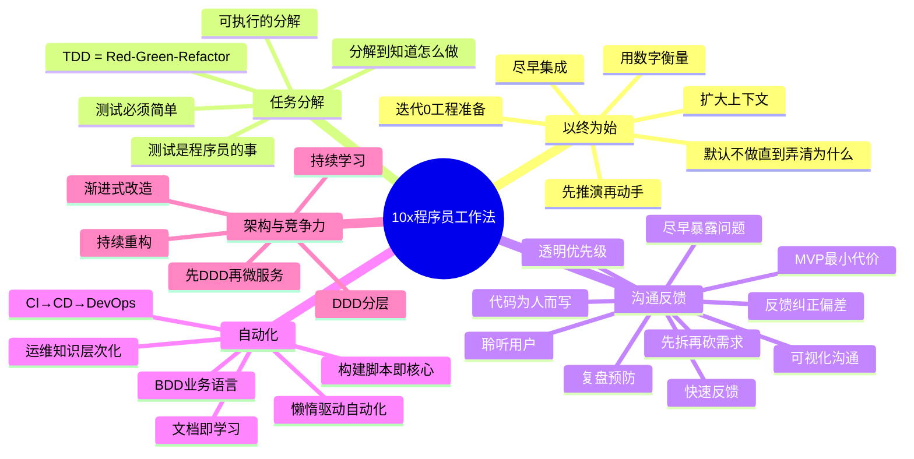

# 划重点：10x程序员工作法——2024-2026现代化重构版

## 以终为始

| # | 核心要义 | 现代实践 |
|---|---------|---------|
| 05 | 尽早提交代码去集成 | 持续集成 + Trunk-Based Development + Feature Flag |
| 06 | 默认所有需求都不做，直到弄清为什么 | 精益创业 BML 循环 + 产品发现（OST） |
| 07 | 扩大工作上下文，别局限在程序员角色 | 上下文跃迁定律 + T型人才模型 |
| 08 | 动手前先推演一番 | 沙盘推演 + Pre-mortem + IaC Plan |
| 09 | 工作用数字衡量 | DORA 指标 + Core Web Vitals + 度量驱动决策 |
| 10 | 迭代0：开发前工程准备 | ADR + CI Green + DevContainer + 多环境就绪 |

## 任务分解

| # | 核心要义 | 现代实践 |
|---|---------|---------|
| 11 | 可执行的分解是解决问题的一半 | 因子化分解 + Commit 级粒度 |
| 12 | 测试是程序员的事 | 测试金字塔/钻石 + Testcontainers + 契约测试 |
| 13 | TDD = Red-Green-Refactor（先写测试≠TDD） | Outside-In TDD + AI 辅助 TDD |
| 14 | 任务分解是 TDD 的"任督二脉" | 极限思维 + 金发姑娘粒度原则 |
| 15 | 分解到"知道怎么做"的程度 | Spike + 不确定性处理 + Outside-In 推进 |
| 16 | 测试必须简单到一目了然 | Flaky Test 治理 + Mutation Testing |

## 沟通反馈

| # | 核心要义 | 现代实践 |
|---|---------|---------|
| 17 | 先拆需求再砍 | INVEST 原则 + 价值-成本矩阵 |
| 18 | 建立透明的优先级机制 | WSJF + OKR 对齐 |
| 19 | 用最小代价做产品（MVP） | Feature Flag + 渐进式发布 |
| 20 | 建立纠正偏差的反馈回路 | 认知偏差识别 + 三层反馈模型 |
| 21 | 代码为"后来的读者"而写 | DDD 通用语言 + 限界上下文 |
| 22 | 能异步不同步，能短不长 | 异步优先沟通架构 |
| 23 | 可视化降低沟通成本 | 技术雷达 + 看板 + C4 Model |
| 24 | CI 的核心是快速反馈 | CI 红灯=停线 + 分层构建策略 |
| 25 | 同样的错误不应犯两次 | Blameless Post-Mortem + 5 Whys + 自动化预防 |
| 26 | 程序员应主动获取用户视角 | Dog Fooding + 行为数据分析 |
| 27 | 尽早暴露问题 | Shift-Left + 主动暴露文化 |

## 自动化

| # | 核心要义 | 现代实践 |
|---|---------|---------|
| 28 | 写文档是结构化学习的过程 | ADR + Feynman Technique |
| 29 | 懒惰→自动化驱动力 | 做两次以上就自动化 |
| 30 | 构建脚本是项目自动化的核心 | Gradle + Nx/Turborepo Monorepo |
| 31 | 运维学习应有层次 | 配置管理→IaC→GitOps→平台工程 |
| 32 | CI 不够，还需要 CD | 持续交付流水线 + 部署策略 + 平台工程 |
| 33 | 验收测试用业务语言 | BDD + Given-When-Then + 活文档 |

## 架构与竞争力

| # | 核心要义 | 现代实践 |
|---|---------|---------|
| 34 | 代码混乱=缺乏持续重构 | 坏味道识别 + 测试保护下小步重构 |
| 35 | 分层=关注点分离 | DDD 四层架构 + 依赖倒置 |
| 36 | 本质复杂度无法消除 | Brooks "No Silver Bullet" |
| 37 | 先做好 DDD 再谈微服务 | Bounded Context→服务边界 + MonolithFirst |
| 38 | 新入职：由外而内建立认知框架 | 业务→系统→代码→团队 |
| 39 | 渐进式改造优于推倒重来 | Strangler Fig + Branch by Abstraction |
| 40 | 构建持续学习的能力 | T型知识 + 输出驱动 + 刻意练习 |

---

## 贯穿全文的核心理念

