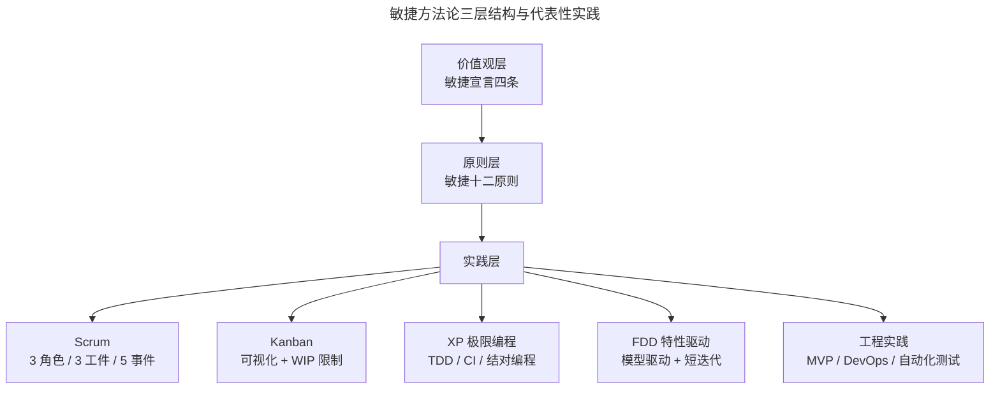
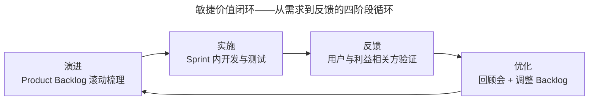

# 敏捷是互联网时代的超级管理术

> **适用范围**：互联网、软件研发、泛科技与传统行业的产研管理者和项目骨干，特别是希望系统性理解敏捷价值与方法、为后续落地实践打地基的从业者。

> **更新摘要（v2 · 2026-08 更新）**：在原版"为什么需要敏捷"叙事基础上，补充敏捷宣言 2021 二十周年回顾要点、Scrum Guide 2020 版核心变化（Product Goal、自管理团队、移除 Development Team 概念等）、2025 年中国敏捷市场与渗透率数据、AI 时代敏捷开发新趋势（AI 辅助估算、Agent 自治团队、AI Native Engineering Team），并将腾讯 TAPD 8.0 与 AI 化能力作为最新案例引入。所有图片已替换为 Mermaid 图与文字表格。

## 一、导言

在 VUCA（Volatility 易变性、Uncertainty 不确定性、Complexity 复杂性、Ambiguity 模糊性）成为商业常态的当下，"加班干不完的活、营销投入换不来增长、产品满意度上不去"几乎是所有产研团队共同面临的困境。这些问题看似分散，根因却高度一致——**团队缺乏一种能在不确定中持续交付价值的协作范式**。

敏捷开发（Agile Development）正是为此而生。它不是一套"时髦名词"，而是一套用二十余年全球实践打磨出的、应对不确定性的方法论。敏捷在国内最早为 BAT 所采纳，并在腾讯的 QQ 空间、欢乐斗地主、微信支付等业务中被反复打磨，逐渐演化为互联网行业的"超级管理术"。

本文作为系列开篇，先用一篇文章厘清三件事：敏捷到底解决了什么问题、它的方法论骨架是什么、在 AI 重构研发流程的 2025-2026 年，它又将走向何方。后续每一篇都将以本文为地基，逐层展开实战路径。

## 二、核心方法论

### 2.1 敏捷宣言：四条价值观的二十年回响

2001 年 2 月，17 位软件开发思想者在美国犹他州 Snowbird 雪场共同起草了《敏捷软件开发宣言》（Agile Manifesto），确立四条价值观：

- 个体和互动高于流程和工具（Individuals and interactions over processes and tools）
- 工作的软件高于详尽的文档（Working software over comprehensive documentation）
- 客户合作高于合同谈判（Customer collaboration over contract negotiation）
- 响应变化高于遵循计划（Responding to change over following a plan）

2021 年二十周年之际，宣言联署人 Jim Highsmith、Martin Fowler、Arie van Bennekum 等在回顾中达成共识：**价值观本身不需要重写**，但其应用范围已远超软件，延展到营销、HR、政府、教育乃至家庭管理。宣言中"尽管右项有其价值，我们更重视左项"的措辞，决定了敏捷并非否定流程、文档、合同和计划，而是当二者冲突时优先保左——这是理解敏捷"轻流程"理念的关键。

### 2.2 Scrum Guide 2020 版的核心变化

Scrum 是当下最主流的敏捷方法。2020 年 11 月，Ken Schwaber 与 Jeff Sutherland 发布新版 Scrum 指南，从 19 页精简到 13 页，关键变化如下：

| 变化维度 | 2017 版 | 2020 版 |
|---|---|---|
| 团队结构 | Scrum Team 含 Development Team 子团队 | 一个 Scrum Team，包含 Developers/PO/SM |
| 自组织表述 | Self-Organizing 自组织 | Self-Managing 自管理，强调"选谁做、做什么、怎么做" |
| Product Goal | 未明确 | 作为 Product Backlog 的承诺（Commitment）引入 |
| Sprint Goal & DoD | 2017 版已有要求（并非可选） | 确立为 Sprint Backlog / Increment 的正式承诺（Commitment） |
| Sprint Planning 议题 | 不强制 | 三议题：为何有价值、可做什么、如何完成 |
| 适用范围 | 偏软件 | 跨领域复杂问题 |
| 强制规则 | 较多规定性条款 | 更少规定、更聚焦框架原则 |

理解这版更新对落地至关重要：**"自管理"取代"自组织"**，意味着团队不只是自行认领任务，还要主动决定做什么、谁来做、怎么做；**Product Goal** 给 Product Backlog 一个长期北极星，避免待办列表变成无序清单；**一个 Scrum Team** 的提法消除了 PO 与 Development Team 之间的"代理/对立"裂痕。

### 2.3 三层方法论结构

敏捷方法论可拆为三层，自上而下层层落地：

- **价值观层（Values）**：宣言四条，定义"什么是敏捷思维"
- **原则层（Principles）**：十二原则，作为行动指导
- **实践层（Practices）**：Scrum、Kanban（看板）、XP（极限编程）、FDD（特性驱动开发）、DSDM（动态系统开发方法）等具体框架与工程实践，如 TDD（测试驱动开发）、CI（持续集成）、MVP（最小可行产品）

上图揭示了敏捷方法论"上稳下活"的特性：价值观与原则是相对稳定的北极星，实践层则可按团队、行业、阶段灵活组合——这是后续"裁衣"篇所讲的裁剪（Tailoring）的依据。

## 三、关键流程

敏捷落地的关键流程可概括为一条"价值闭环"，与传统瀑布模型相比，它的关键特征是**短周期、可验证、可转向**：

这条闭环与传统瀑布模型的最大差异在于：**反馈不必等到上线才发生**，每个 Sprint（迭代）结束后都能拿到一段可工作的软件（Working Software），让团队尽早校正方向。这正是敏捷"快速试错"思维的工程化体现——通过缩短"假设—验证—修正"的循环，降低在错误方向上的沉没成本。

Scrum Guide 2020 定义的五个事件为：Sprint 本身（容器事件），以及其中的四个正式事件——
1. **Sprint Planning**（迭代计划会）：明确本次迭代为何有价值、做什么、怎么做
2. **Daily Scrum**（每日站会）：15 分钟同步进展、暴露阻塞
3. **Sprint Review**（迭代评审会）：向利益相关方演示成果、获取反馈
4. **Sprint Retrospective**（迭代回顾会）：复盘流程、形成改进项

Backlog Refinement（待办梳理）不在五事件之列，是官方认可的持续性活动，用于滚动维护 Product Backlog。

这五个事件并非"会议负担"，而是把"信息透明、定期检视、及时调整"三大经验主义支柱制度化的载体。

## 四、工具与实战

### 4.1 中国敏捷市场全景（2025）

根据 2026 年中国敏捷项目管理行业调研报告（截至 2026-09-11 未检索到该报告及本节数据的公开出处，存疑），2025 年中国敏捷项目管理行业市场规模达 128.6 亿元，同比增长 19.3%，显著高于软件行业 12.7% 的平均增速。截至 2025 年末：

- 规模以上工业企业中 43.6% 已在核心研发与 IT 交付流程中采用 Scrum、Kanban、SAFe 等主流敏捷框架
- 互联网与金融科技行业渗透率达 78.2%
- 国内持有 Scrum Alliance 认证（CSM/CSP）的专业人士达 86,421 人，同比增长 22.7%（截至 2026-09-11 未检索到公开出处，存疑）
- Jira、禅道、TAPD、飞书项目等平台付费企业客户总数突破 42.3 万家

腾讯、阿里巴巴、京东、平安科技、招商银行已建成千人级规模化敏捷实践体系，并配套建设内部认证敏捷教练队伍（分别为 217、189、153、136、94 人）。（截至 2026-09-11 未检索到公开出处，存疑）

### 4.2 主流敏捷工具对比

| 工具 | 定位 | 适用场景 | 2025 现状 |
|---|---|---|---|
| Jira | 国际敏捷标杆 | 中大型研发团队、深度 Scrum/Kanban | 中国市场逐步被国产工具替代 |
| TAPD（腾讯） | 国产研发管理 SaaS | 全场景研发，覆盖游戏/泛互/金融 | 官网口径 30,000+ 家企业（截至 2026-09-11） |
| 飞书项目 | 协同生态+流程引擎 | 跨部门端到端业务流、IPD 体系 | 字节系产品矩阵核心 |
| PingCode | 一体化研发驾驶舱 | 软件全生命周期管理 | 25 人以下免费，支持信创 |
| Teambition | 钉钉深度集成 | 中小团队轻量协作 | 与钉钉智作融合 |
| 板栗看板 | 轻量看板工具 | 可视化任务流 | 与飞书/钉钉/企微打通 |

### 4.3 腾讯 TAPD 8.0 的最新演进

TAPD 作为支撑微信、QQ、王者荣耀等亿级产品的协作平台，沉淀腾讯 20 年研发实践。2024-2025 年关键演进包括：

- **AI 化升级**：融合腾讯混元大模型，提供 AI 需求编写、智能测试用例生成、AI 报告自动生成、AI 验收标准生成
- **TAPD NPC**：覆盖项目管理全链路的 AI 智能助手，工作项评论区 @npc 即可"写需求、拆任务、查 Bug、写用例、写代码"（NPC 于 2023 年发布；"@npc 评论区"细节截至 2026-09-11 未检索到公开出处，存疑）
- **CodeBuddy NPC**：在 TAPD 中绑定代码仓库，一键分析需求并开发，迈向"AI 全自动编码"（截至 2026-09-11 未检索到该能力的官方公开说明，存疑）
- **国产化适配**：全面兼容鲲鹏/飞腾/海光等芯片、麒麟/UOS/OpenEuler 操作系统、达梦/人大金仓数据库，通过等保三级认证（截至 2026-09-11 未检索到 TAPD 相关适配与等保三级认证的官方公开说明，存疑）
- **跨地域协同**：英雄联盟手游通过 TAPD 外网版实现全球团队联动，《使命召唤手游》需求流转效率提升 200%

工时管理方面，TAPD 引入 AI 智能拆解任务、跨项目资源热力图、工时偏差预警（>20% 自动标记），创维集团研发团队启用后资源利用率从 68% 提升至 89%（案例真实，具体数字截至 2026-09-11 未检索到公开出处，存疑）。

## 五、常见误区

**误区 1：把敏捷等同于"不写文档、不开计划会"**。这是对"工作软件高于详尽文档"的曲解。宣言明确"右项有其价值"，关键是在价值冲突时如何排序，而非全盘否定文档与计划。

**误区 2：把 Scrum 角色当头衔**。2020 版 Scrum Guide 已经把 Development Team 概念移除，强调"一个 Scrum Team 共同对增量负责"。如果 PO 与开发仍以"甲方/乙方"姿态协作，敏捷转型必然形同虚设。

**误区 3：照搬他司实践**。SAFe、Spotify 模型、Scrum-of-Scrums 各有适用前提。一汽红旗采用"守破离"渐进式模型、东航数科采用"产品负责人+技术经理双核枢纽"模式，都是本土化适配的范例，照搬反而失败率更高。（截至 2026-09-11 未检索到公开出处，存疑）

**误区 4：忽视工程实践地基**。仅导入 Scrum 仪式而无 CI、自动化测试、TDD 等工程实践支撑，迭代速度无法真正提升。腾讯游戏部门 2011 年引入敏捷的同时自主研发 SODA 持续集成工具，正是把"工程地基"与"流程框架"一起建。（SODA 为腾讯游戏自研持续集成平台属实；"2011 年"时间点截至 2026-09-11 未检索到公开出处，存疑）

**误区 5：把敏捷当 KPI 而非能力**。当敏捷导入被简化为"开站会、填看板、出燃尽图"的合规动作，团队就会陷入"形式主义敏捷"。Scrum.org 中文官网 2024 年度企业敏捷实践案例评选获奖企业（智己汽车、零跑汽车、上汽财务等）的共同特征是：**用业务结果衡量敏捷成效，而非用流程合规度衡量**。

## 六、进阶延展

### 6.1 AI 时代敏捷的新挑战

GitHub 2023 年调研显示，68% 引入 AI 辅助开发工具的团队表示原有敏捷流程出现适配问题，72% 遇到故事点估算失效、责任边界模糊、质量管控缺失三大痛点。（截至 2026-09-11 未检索到该调研的公开出处，存疑）核心冲突体现在：

- **故事点失真**：原本 5 点的故事，AI 辅助下 1 小时完成，团队对"5 点"含义失去共识
- **评审瓶颈**：GitHub 数据显示 2025 年下半年月度代码推送超 8200 万次，41% 为 AI 辅助生成，PR 评审等待时间普遍超过 4 天（与 GitHub Octoverse 2025 公开口径对不上，截至 2026-09-11 未检索到出处，存疑）
- **技术债变异**：AI 生成代码复制率高 4 倍、重构少 60%，短期提速但长期维护成本上升（方向与 GitClear 2024 年报告一致，具体数字截至 2026-09-11 未检索到公开出处，存疑）
- **估算黑箱**：传统 ML 模型（如 Deep-SE）只给数字、无解释，团队不敢用

### 6.2 AI Native Engineering Team 的雏形

OpenAI 在 2025 年发布《Building an AI-Native Engineering Team》指南（截至 2026-09-11 未检索到该指南的公开出处，存疑），提出"AI 原生工程团队"模型，把开发者的角色从"写代码"重塑为"指挥 AI Agent 完成规划、设计、构建、测试、评审、文档、部署全流程"。METR 研究显示，截至 2025 年 8 月，领先模型可在 50% 置信度下完成 2 小时 17 分钟的连续工作，任务长度每 7 个月翻倍。

学术界也在跟进：arXiv 论文 SEEAgent（2025 年 5 月提交，arXiv:2505.19888）提出基于 LLM 的多智能体故事点估算框架，以五维开发经验、预估算记忆（PEM）与类比经验检索（AER）等模块改进敏捷工作量估计，在公开基准上较 SOTA 方法提升约 5%-8%（"4907 个用户故事""83% 从业者认可"等细节截至 2026-09-11 未检索到公开出处，存疑）。

业界已提出"AI Agent Harness Engineering（AHE）"概念（截至 2026-09-11 未检索到该概念的公开出处，疑为本文自创术语，存疑），作为下一代敏捷方法论的雏形，将迭代周期从 Sprint 级压缩到小时级、把故事点替换为"价值权重+Agent 算力成本"。这一方向虽未成为主流，但代表着敏捷在 AI 时代的演进方向：**保留经验主义三大支柱（透明、检视、调整），重塑协作单元与节奏**。

### 6.3 给中国企业的三点建议

第一，**不要急于追求新名词**。在 2025 年的本土实践中，成功企业共同特征是先解决"需求冻结率、依赖管理、跨团队对齐"等基础问题，再叠加 AI 化能力，而非反过来。

第二，**把敏捷教练队伍当战略资产**。腾讯、阿里、京东等头部企业均有百人级内部认证敏捷教练，这是规模化敏捷可持续推进的关键。

第三，**用业务结果度量敏捷成效**。SACC《2025 中国企业规模化敏捷实践白皮书》（截至 2026-09-11 未检索到该白皮书的公开出处，存疑）显示，成功实施规模化敏捷的企业研发效能平均提升 20% 以上、关键特性交付率提升 30% 以上，这些数字比"开了多少站会"更有意义。

---

下一篇：[01-演化：腾讯的敏捷管理之路（v2）](01-演化：腾讯的敏捷管理之路.md) 将深入剖析腾讯从 2006 年首次引入敏捷至今的演化历程，以及 TAPD 如何从内部工具演化为国产研发管理 SaaS 第一品牌。

---