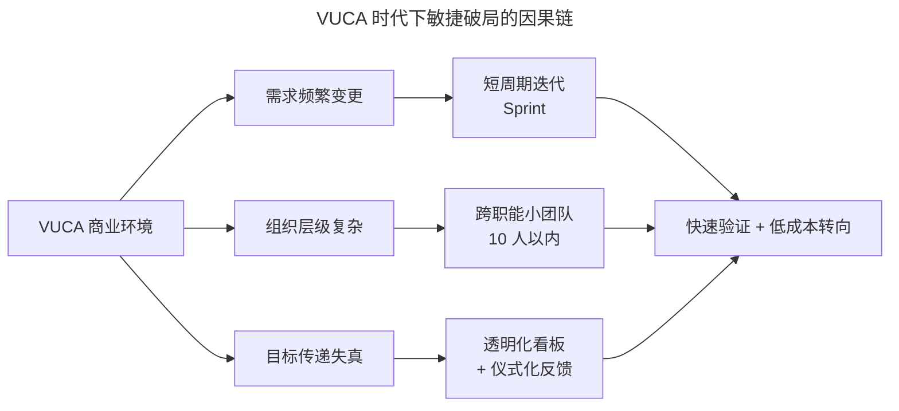
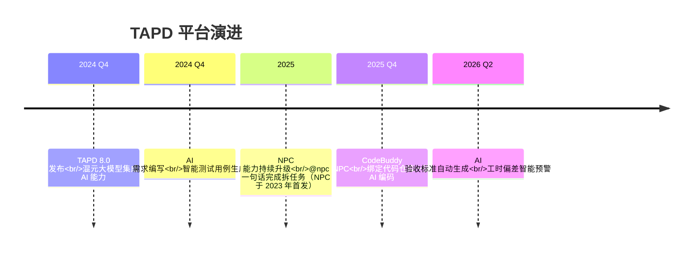

# 演化：腾讯的敏捷管理之路

> **适用范围**：希望了解腾讯从 2006 年首次引入敏捷至今的演化脉络、并借鉴其"试点—推广—工具化—智能化"四阶段路径的产研管理者与敏捷教练。

> **更新摘要（v2 · 2026-08 更新）**：在原版腾讯敏捷演化叙事基础上，补充 2020-2025 年 TAPD 平台演进的关键节点（8.0 混元大模型集成、TAPD NPC AI 助手、CodeBuddy NPC AI 编码、国产化适配），引入 2025 年中国敏捷市场数据，并补全敏捷在 AI 时代的演化方向。失效图片已替换为 Mermaid 图与文字表格。

## 一、导言

腾讯是中国最早系统化引入敏捷的互联网公司之一。从 2006 年 QQ 空间试点开始，到 2011 年欢乐斗地主敏捷转型、2013 年微信支付合规敏捷（此两个节点截至 2026-09-11 未检索到公开出处，存疑）、2018 年 TAPD 对外服务化、2024 年 TAPD 8.0 AI 化升级，这条近二十年的演化路径，几乎完整呈现了一家大型互联网公司从"单点试点"到"平台化能力外溢"的敏捷转型范式。

理解腾讯的演化，重点不在于"抄作业"，而在于看清一家万人级组织如何在保持业务高速增长的同时，把敏捷从一种"研发实践"逐步演化为"组织能力"和"商业基础设施"。本文将沿着"为什么会引入—怎样落地—怎样工具化—怎样智能化"四个维度展开。

## 二、核心方法论：VUCA 时代的敏捷破局

马化腾曾在内部讲话中表示"只看三年"（据 36 氪、界面新闻等媒体 2021-2022 年报道转述）。这句话背后是对时代特征的判断：**这个时代唯一能确定的，就是它的不确定性**。VUCA 四要素具体表现为：

- **Volatility 易变性**：商业环境瞬息万变，产品生命周期被显著压缩
- **Uncertainty 不确定性**：用户偏好、监管政策、技术栈快速演进，"做什么能成"难以提前断言
- **Complexity 复杂性**：产品成功依赖品牌、营销、资本、生态等多因素共振
- **Ambiguity 模糊性**：目标在层层传递中失真，管理层难以判断"做的事是否对齐目标"

敏捷破局的核心逻辑，是承认 VUCA 不可消除，转而用**短周期、可验证、可转向**的方式降低不确定性带来的代价。它不试图一次性预测未来，而是通过"小步快跑、频繁反馈"把未来切片化、可校准化。这与 Jim Highsmith 在 1999 年提出的自适应软件开发（Adaptive Software Development，ASD）一脉相承——"自适应比优化重要"。

这条因果链解释了为什么敏捷的方法选择是有内在逻辑的：短周期迭代解决"需求变"的问题、跨职能小团队解决"组织复杂"的问题、透明化看板与仪式化反馈解决"目标失真"的问题。三者共同构成应对 VUCA 的工程化手段。

## 三、关键流程：腾讯敏捷演化的四阶段

### 3.1 阶段一：思维引入与试点（2006-2008）

腾讯敏捷的起点不是工具，而是**思维转变**。当时 Google、Facebook 在国外已成熟实践敏捷，腾讯决定从国外引入知名咨询教练团队，让有经验的专业团队帮助内部导入敏捷思维。

试点对象选择 QQ 空间团队，并非偶然，而是基于三个判断：

| 试点条件 | 具体表现 |
|---|---|
| 发布方式灵活 | Web 页面，无须客户端更新，用户无感知 |
| 业务风险可控 | 非主营业务，转型失败不影响主营收入 |
| 改变意愿强烈 | 新产品无稳定用户群，急需新方法破局 |

QQ 空间团队采用了 Scrum 的 Sprint（迭代）实践，保持每周一个新版本，发布后取得用户反馈快速响应。（内部叙事，截至 2026-09-11 无法回源核实）这一阶段验证了敏捷在腾讯内部的可落地性。

### 3.2 阶段二：组织适配与游戏部门转型（2009-2014）

QQ 空间试点成功后，敏捷逐步推广到 QQ 农场、QQ 浏览器等团队。但真正考验敏捷价值的是游戏部门。

游戏部门敏捷起步晚，因为早期 PC 游戏体量大、研发周期长达 1-2 年甚至 5 年。直到手游崛起，三五个人的小团队、两三个月的研发周期，天然契合敏捷。腾讯提出"精品 2.0"战略后，作为棋牌游戏"一哥"的欢乐斗地主在 2011 年正式引入敏捷：

- **把控质量**：引入"客户合作"价值观，短周期迭代尽早发布让用户体验，让用户加入产品生产环节
- **把控效率**：自主研发 SODA（Software Development Accelerator）持续集成工具，实现代码提交→自动编译→自动测试→自动部署，时间成本降低三分之二，最终把游戏研发周期从两年压缩到 8 个月（该数字截至 2026-09-11 未检索到公开出处，存疑）

欢乐斗地主被评为公司精品游戏 2.0 战略下的五星游戏，并成为腾讯走上手游制霸之路的关键节点。

### 3.3 阶段三：工具平台化与 TAPD 对外服务（2015-2022）

腾讯本身具有技术优势，因此选择自行研发敏捷研发管理工具 TAPD（Tencent Agile Product Development）。在敏捷导入过程中，TAPD 提供的关键能力包括：

- **看板（Kanban）**：直观展示团队进展
- **流程配置**：适应不同团队的敏捷过程
- **任务流转**：让团队更好地自组织起来
- **报表系统**：让领导更清晰地看到团队的目标和执行过程

2018 年前后，TAPD 从内部工具演化为对外服务的 SaaS 平台，开始承载微信、QQ、王者荣耀等亿级产品的研发实践，并逐步对外开放。

### 3.4 阶段四：AI 化与国产化双轮驱动（2023-2026）

进入大模型时代，TAPD 进入第四次跃迁。2024-2025 年的关键演进如下：

时间线呈现了 TAPD 从"流程管理工具"演化为"AI 协同智脑"的轨迹。（其中 2025 Q4、2026 Q2 两个能力节点截至 2026-09-11 未检索到官方公开出处，存疑）同时 TAPD 全面适配信创生态，支持鲲鹏/飞腾/海光芯片、麒麟/UOS/OpenEuler 操作系统、达梦/人大金仓数据库，通过等保三级认证，成为 Jira 国产化替代的核心选项。

## 四、工具与实战

### 4.1 TAPD 的实战价值

据 TAPD 官网口径（截至 2026-09-11），已有 30,000+ 家企业使用 TAPD。代表性案例包括：

- **使命召唤手游**：通过 TAPD 实现需求流转效率提升 200%，敏感信息分级权限管理保障 IP 合作安全
- **米哈游、三七互娱**：将 TAPD 作为标准化研发管线底座
- **广汽丰田**：通过 TAPD 甘特图实现多工厂进度透明化
- **中金公司**：替代 Jira 构建国产化 DevOps 流水线，支持监管合规要求（细节截至 2026-09-11 未检索到公开出处，存疑）
- **创维集团**：启用 TAPD 工时管理后，资源利用率从 68% 提升至 89%，项目延期率下降 41%

### 4.2 TAPD 工时管理：从"凭感觉"到"数据驱动"

传统工时统计痛点是"凭感觉填报、数据滞后、跨项目资源冲突"。TAPD 工时管理引入三大能力：

| 能力维度 | 实现方式 | 实战效果 |
|---|---|---|
| 资源浪费精准定位 | 工时预估 vs 实际消耗对比，>20% 偏差自动标记 | 某游戏团队发现 BUG 修复任务超时 35%，返工率降低 52% |
| 跨项目资源热力图 | 直观展示成员负载，避免资源争抢 | 资源利用率提升至 89% |
| AI 智能拆解 | 输入需求描述，自动拆子任务并推荐工时模型 | 某金融项目节省 28% 人力成本 |

（表中实战效果数据截至 2026-09-11 未检索到公开出处，存疑）

### 4.3 中国敏捷市场全景（2025）

根据 2026 年中国敏捷项目管理行业调研报告（截至 2026-09-11 未检索到该报告及本节数据的公开出处，存疑），2025 年中国敏捷项目管理市场规模达 128.6 亿元，同比增长 19.3%；敏捷开发服务行业总市场规模 187.3 亿元，同比增长 24.6%。规模以上工业企业中 43.6% 已采用主流敏捷框架，互联网与金融科技行业渗透率达 78.2%。

| 行业 | 渗透率 | 代表企业 |
|---|---|---|
| 互联网与金融科技 | 78.2% | 腾讯、阿里、京东、平安科技、招商银行 |
| 智能制造 | 83.6%（关键 KPI 列入"2 周内响应"） | 一汽红旗、蔚来、零跑、中国商飞 |
| 银行卡业务 | 监管驱动 | 福建海峡银行、上汽财务 |
| 国央企 | 44.2% | ABB、医科达、中煤信息 |

在 Scrum.org 中文官网 2024 年度中国企业敏捷实践案例评选中，智己汽车、零跑汽车、上汽财务等企业获奖，敏捷在中国制造业的本土化落地持续推进。

## 五、常见误区

**误区 1：把"试点成功"等同于"全局可复制"**。QQ 空间试点成功后，腾讯没有立即在所有部门强推敏捷，而是按部门需求逐步推广。游戏部门敏捷起步比 QQ 空间晚 5 年，正说明"试点—部门适配—全面推广"之间需要足够缓冲。

**误区 2：忽视工程实践地基**。欢乐斗地主敏捷转型的关键不是 Scrum 仪式，而是自主研发的 SODA 持续集成工具。如果团队没有 CI、自动化测试、TDD 等工程地基，敏捷仪式只会变成额外负担。

**误区 3：把工具当敏捷**。TAPD 能承载敏捷，但不等于"用了 TAPD 就敏捷"。腾讯在引入工具前已经完成了 5 年思维与组织适配，工具只是放大器而非起点。

**误区 4：把敏捷教练当"项目经理"**。2020 版 Scrum Guide 已明确 Scrum Master 是"真正的领导者、教练、教师、促进者、障碍清除者（impediment remover）"，而非命令式管理者。腾讯内部 217 名认证敏捷教练是组织能力建设的核心。（截至 2026-09-11 未检索到公开出处，存疑）

**误区 5：忽视国产化与合规要求**。中金公司、银行类企业落地敏捷时，必须考虑信创、监管审计、可回溯增量交付等本土约束，照搬硅谷实践会触碰合规红线。

## 六、进阶延展

### 6.1 从团队敏捷到价值流敏捷

SACC《2025 中国企业规模化敏捷实践白皮书》显示，5000 人以上大型企业占比 27.54%，成为规模化敏捷实践主力，但跨团队协作是最大挑战。科大讯飞智能汽车事业部通过 SAFe 框架构建 ART（敏捷发布火车）机制，把百人产研团队对齐至统一业务价值流；蔚来汽车通过"OS-平台服务-应用"三层软件架构解耦，支持数千人整车软件团队并行开发三大品牌、10 款+ 车型。这是从"团队敏捷"向"价值流敏捷"跨越的本土范例。（科大讯飞 SAFe 转型与蔚来软件分层架构有公开佐证；上述成效数字截至 2026-09-11 未检索到公开出处，存疑）

### 6.2 AI 时代腾讯敏捷的下一站

TAPD NPC 与 CodeBuddy NPC 的发布，意味着腾讯正在探索"AI Agent 自治团队"的可能性。这与 OpenAI 提出的"AI Native Engineering Team"理念、学界 SEEAgent 多智能体框架、业界 AI Agent Harness Engineering 思路相呼应，核心特征是：

- **协作单元**：从纯人类团队演化为"人类+AI Agent 混合团队"
- **迭代周期**：从 Sprint 周级压缩到小时级
- **估算单位**：从故事点演化为"价值权重 + Agent 算力成本"
- **质量管控**：从人类评审演化为"AI 预校验 + 人类终审"双轨机制

但需要警惕的是，GitHub 2023 年调研显示 68% 引入 AI 工具的团队遇到原有敏捷流程适配问题。（截至 2026-09-11 未检索到该调研的公开出处，存疑）腾讯选择"先工具、再流程、最后组织"的渐进路径，是把 AI 化建立在已有敏捷地基之上，而非"为 AI 而 AI"。

### 6.3 给中国企业的三点启示

第一，**试点选择有讲究**。选发布灵活、风险可控、改变意愿强的产品作为试点，比选主营业务更能降低转型风险。

第二，**工程地基与流程框架同步建**。腾讯的演化路径表明，没有 SODA、TAPD、CNB 这类工程地基支撑，敏捷仪式会沦为形式主义。

第三，**工具开放化是组织能力溢出的标志**。当内部工具足以服务海量外部企业，意味着敏捷实践已沉淀为可复制的能力，这是组织成熟度的高级阶段。

### 6.4 腾讯敏捷演化的三阶段经验沉淀

回顾腾讯近二十年敏捷演化，可提炼三阶段经验：

| 阶段 | 时间跨度 | 核心动作 | 关键教训 |
|---|---|---|---|
| 单点试点 | 2006-2010 | QQ 空间试点 Scrum | 选发布灵活、风险可控、改变意愿强的产品 |
| 工程地基 | 2011-2017 | 欢乐斗地主 + SODA 持续集成 | 工程地基与流程框架必须同步建，否则仪式成负担 |
| 平台外溢 | 2018-2026 | TAPD 对外服务、AI 化升级 | 内部工具沉淀为外部能力，标志组织成熟度跃迁 |

这三阶段经验对其他企业的启示是：**敏捷不是一蹴而就的运动，而是一场以年为单位的组织能力建设**。试图跳过任何一阶段、追求速成，往往会陷入"形式主义敏捷"陷阱。

腾讯演化路径还揭示了一个常被忽视的规律：**工具平台化与组织能力溢出之间存在正反馈循环**——内部实践沉淀为工具、工具对外服务反哺内部实践、外部客户反馈再优化工具。TAPD 从内部工具演化为对外服务的 SaaS 平台、又从外部实践反哺腾讯内部 AI 化升级，正是这一循环的范例。

---

下一篇：[02-入门：你必须知道的敏捷内容（v2）](02-入门：你必须知道的敏捷内容.md) 将系统拆解敏捷的三层方法论（价值观/原则/实践），并对比 Scrum、Kanban、XP、FDD、DSDM 等主流敏捷方法的适用场景。

---