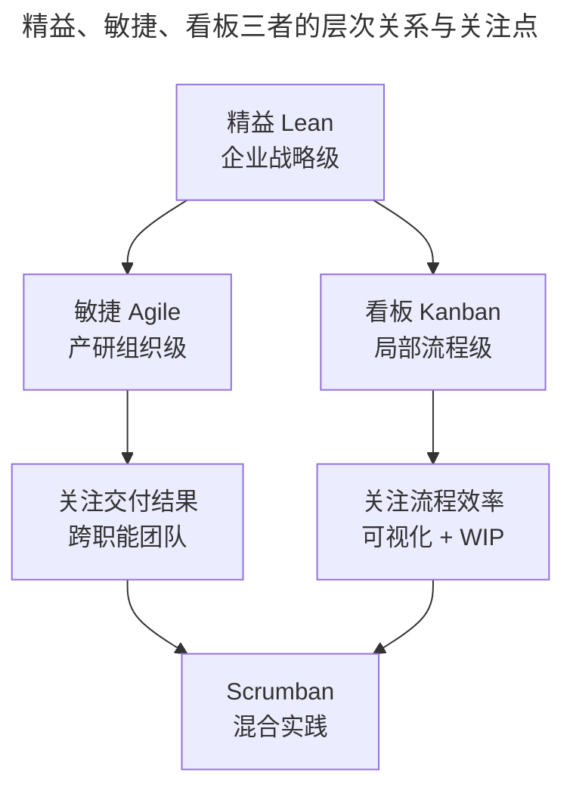
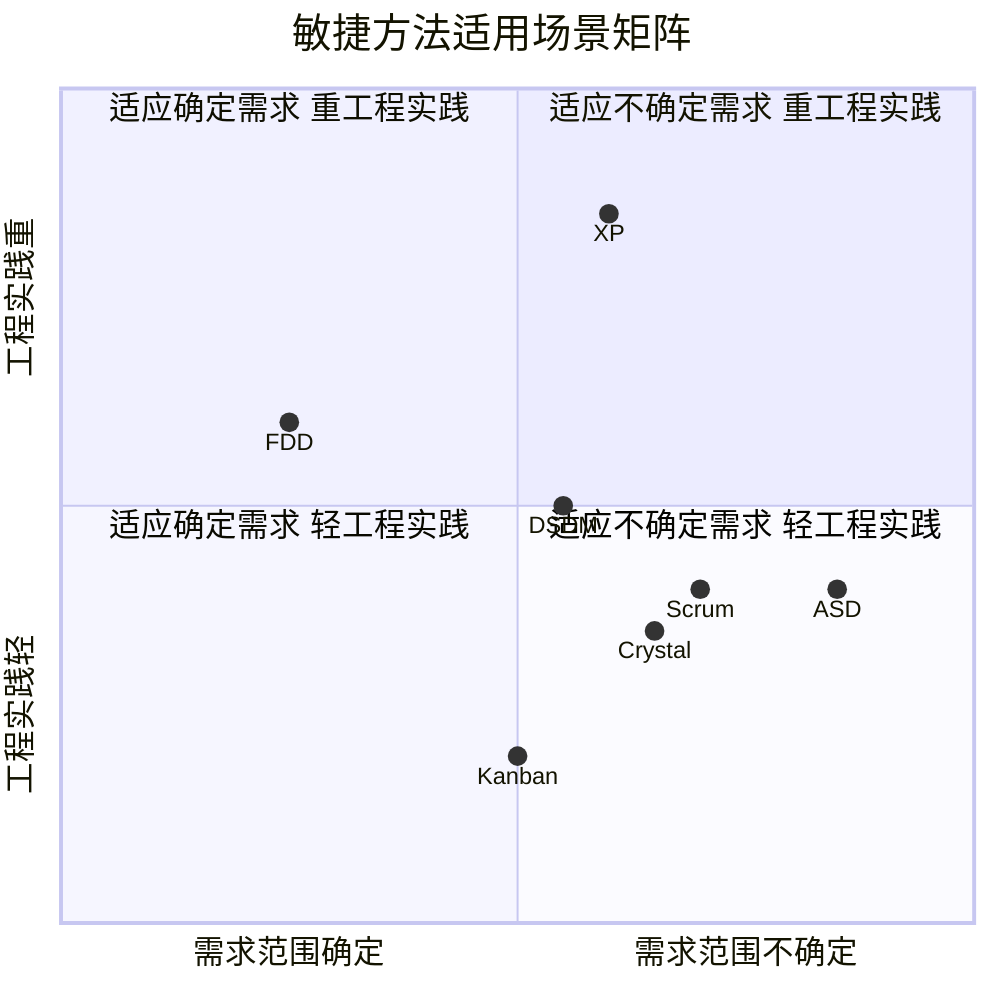

# 入门：你必须知道的敏捷内容

> **适用范围**：需要系统化建立敏捷知识体系的产研管理者、项目经理、敏捷教练与工程师，特别是对敏捷与精益、看板的边界存在模糊认知的从业者。

> **更新摘要（v2 · 2026-08 更新）**：在原版敏捷三把利剑（价值观/原则/实践）的基础上，补充 Scrum Guide 2020 版的核心更新（Product Goal、自管理团队、移除 Development Team、三议题 Sprint Planning 等）、十二原则的现代工程实践对照、Scrum 3355 框架的 2020 版语义校准，以及 AI 时代敏捷工程实践的新趋势。失效图片已替换为 Mermaid 图与文字表格。

## 一、导言

学会敏捷实践，首先要打好理论基础。但敏捷既是思维、也是方法、又是一组工程实践，初学者常在这三者之间迷失：要么把敏捷当成一种口号式的"思维方式"，要么当成一组刻板的"会议和卡片"，要么把 DevOps、TDD、CI 等工程实践与敏捷割裂看待。

本文用一篇文章把敏捷的方法论骨架厘清：先分清敏捷、精益（Lean）与看板（Kanban）三者边界；再展开敏捷的"价值观—原则—实践"三层结构；最后逐个梳理主流敏捷方法的适用场景，并补全 Scrum Guide 2020 版带来的关键语义校准。

## 二、核心方法论

### 2.1 区分：敏捷、精益与看板

三者并非互斥，而是层次关系：

- **精益（Lean）**：面向企业管理全局的战略级方法，源自丰田生产方式，关注消除浪费、价值流优化
- **敏捷（Agile）**：面向产研团队的组织级方法，要求改变职能型组织为项目制跨职能团队，对最终交付结果负责
- **看板（Kanban）**：面向局部改善的方法，可视化工作流并限制在制品（WIP），不动组织结构、实施阻力小

敏捷与看板都被视为精益思想的具体实例，反映"关注价值、小批量、消除浪费"等共性。但二者关注点不同：**看板关注流程效率**，**敏捷关注交付结果与组织协同**。在实际工作中常两者结合——用 Scrum 框架做组织与节奏，用看板做任务流可视化与瓶颈管理，这就是 Scrumban 混合实践的起源。

上图揭示了三者并非"非此即彼"：企业级用精益定方向、组织级用敏捷搭骨架、流程级用看板提效率，三者协同才构成完整的"精益—敏捷—工程实践"体系。

### 2.2 敏捷的三层方法论结构

敏捷思维由价值观定义、原则指导、实践体现三层构成：

- **价值观（Values）**：定义"什么是敏捷思维"，回答"我们重视什么"
- **原则（Principles）**：行动指导，回答"应该怎么做"
- **实践（Practices）**：具体应用，回答"用什么方法做"

学习敏捷的最终目标是形成敏捷思维，而思维需要通过实践反复打磨。理论是字典，掌握寓于实践。

### 2.3 敏捷宣言与 2021 二十周年回响

2001 年 2 月，17 位软件开发思想者在美国犹他州 Snowbird 起草《敏捷软件开发宣言》，确立四条价值观。2021 年二十周年之际，宣言联署人达成共识：**价值观本身不需要重写**，但其应用已远超软件，扩展到营销、HR、政府、教育等领域。

宣言中"尽管右项有其价值，我们更重视左项"的措辞常被忽视。这表明敏捷并非否定流程、文档、合同、计划，而是当二者冲突时优先保左。这是理解敏捷"轻流程而非无流程"的关键。

### 2.4 敏捷十二原则与工程实践对照

十二原则是宣言的操作化延伸，每条都对应具体的工程实践：

| 原则（节选） | 现代工程实践对照 |
|---|---|
| 持续不断地及早交付有价值的软件 | MVP（最小可行产品）+ 短周期 Sprint |
| 经常地交付可工作的软件 | CI/CD（持续集成/持续交付） |
| 业务人员和开发人员必须互相合作 | PO 与开发同坐、Backlog 共同梳理 |
| 面对面交谈是最高效的沟通方式 | 站会、作战室、结对编程 |
| 可工作的软件是进度的首要度量 | 增量（Increment）+ Definition of Done |
| 坚持不懈追求技术卓越和良好设计 | TDD（测试驱动开发）+ 重构 |
| 以简洁为本 | YAGNI（You Aren't Gonna Need It） |
| 最好的架构、需求和设计出自自组织团队 | 自管理团队（2020 版表述） |
| 团队定期反思如何提高成效 | Sprint Retrospective 回顾会 |

### 2.5 Scrum Guide 2020 版的核心更新

Scrum 是当下最主流的敏捷方法。2020 年 11 月新版发布，从 19 页精简到 13 页，关键更新如下：

| 变化维度 | 2020 版内容 | 影响 |
|---|---|---|
| 团队结构 | 一个 Scrum Team，含 Developers/PO/SM | 消除"我们 vs 他们"代理对立 |
| 自管理表述 | Self-Managing 替代 Self-Organizing | 强调选谁做、做什么、怎么做 |
| Product Goal | Product Backlog 的承诺 | 给待办列表一个长期北极星 |
| Sprint Goal & DoD | 不再可选，分别作为 Sprint Backlog 与 Increment 承诺 | 强化透明度与质量底线 |
| Sprint Planning 三议题 | 为何有价值 / 可做什么 / 如何完成 | 结构化计划会议 |
| 适用范围 | 跨领域复杂问题，超越软件 | 适配非软件场景 |
| 强制规则 | 大幅精简，更聚焦框架原则 | 给团队更多裁剪空间 |

### 2.6 主流敏捷方法对比

敏捷方法主要包括 Scrum、DSDM、水晶（Crystal）、特性驱动（FDD）、自适应软件开发（ASD）、极限编程（XP）、持续集成（CI）等。

各方法核心特点：

- **Scrum**：3 角色（PO/SM/Developers）、3 工件（Product Backlog/Sprint Backlog/Increment）、5 事件（Sprint/Planning/Daily/Review/Retro）、5 价值观（承诺/专注/开放/尊重/勇气）
- **DSDM（Dynamic Systems Development Method）**：时间与资源固定，力争最大化满足业务需求，适合合同制项目
- **Crystal 水晶方法**：按项目重要程度与人员规模划分（Clear/Yellow/Orange/Red），强调组织转型
- **FDD（Feature Driven Development）**：模型驱动+短期迭代，适合需求范围确定的合同制项目，腾讯欢乐斗地主早期即用此方法
- **ASD（Adaptive Software Development）**：基于复杂自适应系统理论，强调自适应比优化重要，敏捷雏形
- **XP（Extreme Programming）**：工程实践集大成者，含 TDD、持续集成、重构、结对编程、用户故事
- **CI（Continuous Integration）**：每次提交自动编译/测试/部署，腾讯 SODA 即此方法的产品化

## 三、关键流程：敏捷最佳实践九要素

通过具体内容评判团队是否达到最佳实践：

| 实践要素 | 含义 | 落地标志 |
|---|---|---|
| 稳定的团队 | 一段时间内成员固定 | 至少 3 个 Sprint 不变 |
| 可预见的速率 | 形成团队速率基准 | 速率波动 <20% |
| 单件流 | 一次只做好一件事 | WIP 限制生效 |
| 质量内建 | 每环节保证质量 | DoD 明确并执行 |
| 日事日毕 | 任务粒度 ≤1 天 | 任务分解到位 |
| 紧急停车带 | 给紧急任务预留容量 | <20% 容量预留给变更 |
| 滚动迭代 | 通过迭代交付完善产品 | 持续发布节奏 |
| 持续改进 | 通过回顾强化能力 | 改进项有闭环 |
| 尽早交付 | 尽快得到用户反馈 | 首次发布 <1 个 Sprint |

**重要提醒**：要认清自己与最佳实践的差距，不可一蹴而就。**针对实际情况按需裁剪，避免形式主义，不要为敏捷而敏捷。** Scrum.org 中国 2025 年获奖企业（智己、零跑、上汽财务、ABB、医科达）共同特征是：**只取最契合自身痛点的几项实践深度落地，而非全盘照搬九要素**。

## 四、工具与实战

### 4.1 主流敏捷工具的 2025 现状

| 工具 | 适配方法 | 2025 关键能力 | 适用团队 |
|---|---|---|---|
| Jira | Scrum/Kanban 深度支持 | 国际标杆，但中国市场逐步退场 | 中大型研发团队 |
| TAPD | 全场景研发管理 | 8.0 混元大模型、NPC AI 助手、CodeBuddy AI 编码 | 全场景国产化首选 |
| 飞书项目 | Scrum + 业务流引擎 | 全景视图、父子流程嵌套 | 跨部门端到端业务流 |
| PingCode | Scrum/Kanban/瀑布混合 | 25 人以下免费、信创适配 | 标准产研团队 |
| Teambition | Scrum/Kanban 轻量 | 与钉钉智作融合 | 中小团队 |
| 板栗看板 | Kanban 轻量 | 与飞书/钉钉/企微打通 | 可视化任务流 |

### 4.2 TAPD NPC 在敏捷实践中的 AI 增强案例

TAPD 8.0 集成腾讯混元大模型，提供覆盖项目管理全链路的 AI 能力，工作项评论区 @npc 即可一句话完成：

- **写需求**：根据业务描述自动生成用户故事与验收标准
- **拆任务**：把大需求拆解为可执行的子任务，并推荐工时模型
- **查 Bug**：基于历史缺陷模式智能识别风险
- **写用例**：根据需求文档一键生成测试点
- **写代码**：CodeBuddy NPC 绑定代码仓库，一键分析需求并开发
- **写报告**：自动生成迭代进度与风险预警报告

某游戏团队通过 TAPD AI 报告自动生成功能，把每周准备迭代评审材料的时间从 4 小时压缩到 20 分钟；某金融团队通过 AI 验收标准生成，把需求评审返工率降低 30%。

### 4.3 AI 辅助估算的实践路径

敏捷工作量估计长期依赖规划扑克（Planning Poker），主观性强、共识形成慢。2025 年 9 月 arXiv 论文 SEEAgent 提出 LLM 多智能体框架，用"长期记忆+短期记忆+行动通信模块"实现可解释、可讨论的估算：

- 长期记忆：微调 Llama-3.1 或用 GPT-4o-mini 学习项目历史故事，减少幻觉
- 短期记忆：存储当前会话聊天记录与同伴估算
- 行动模块：支持聊天解释与提交估算，可扮演前端/后端角色

4907 个用户故事验证表明，SEEAgent 在多数指标上超过 Deep-SE 等 SOTA 模型；12 位从业者实测后，83% 认为协作自然、58% 愿意信任推荐。这预示着传统规划扑克可能演化为"人+AI 共同估算"的混合模式。

## 五、常见误区

**误区 1：把敏捷宣言当教条**。宣言联署人在 2021 年二十周年时明确：价值观提供方向，但具体落地应因地制宜。把它当成僵化教条，反而违背"响应变化高于遵循计划"。

**误区 2：把 Scrum 等同于敏捷**。Scrum 只是敏捷方法之一，对需求范围确定的项目 FDD 更合适，对流程瓶颈突出的团队看板更直接。Scrum.org 中国 2025 获奖案例中，中煤信息采用"IPD+Scrum"混合模式，福建海峡银行采用"敏捷破冰"渐进式试点，都是非纯 Scrum 实践。

**误区 3：忽视工程实践**。仅导入 Scrum 仪式而无 TDD、CI、自动化测试等工程地基支撑，迭代速度无法真正提升。腾讯游戏部门敏捷转型同期自研 SODA 持续集成工具，正是工程地基与流程框架同步建的范例。

**误区 4：照搬 3355 框架不裁剪**。2020 版 Scrum Guide 已明确 Scrum 是"故意不完整的轻量框架"，鼓励团队填充自己的实践。机械套用 3 角色 3 工件 5 事件，反而会陷入"形式主义敏捷"。

**误区 5：把 Product Goal 当 KPI**。Product Goal 是 Product Backlog 的承诺，给团队一个长期北极星，不是季度 KPI。把它当 KPI 会催生"为达成 Goal 而忽略质量"的副作用。

## 六、进阶延展

### 6.1 SAFe 与规模化敏捷

当敏捷从单团队扩展到千人级组织，单靠 Scrum-of-Scrums 难以支撑。SAFe（Scaled Agile Framework）通过 ART（敏捷发布火车）机制，把百人产研团队对齐至统一业务价值流。科大讯飞智能汽车事业部通过 SAFe 实施，把因依赖导致的延期比例从 55% 降至 15%；蔚来通过软件架构分层解耦，支持数千人整车软件团队并行开发三大品牌、10 款+ 车型，需求平均开发周期缩短超 50%。

### 6.2 AI Native Engineering 对敏捷的挑战

GitHub 2023 年调研显示，68% 引入 AI 辅助开发工具的团队表示原有敏捷流程出现适配问题。挑战集中在三处：

- **故事点失真**：5 点的故事在 AI 辅助下 1 小时完成，团队对"5 点"含义失去共识
- **责任边界模糊**：AI 生成的代码出问题，谁负责？
- **质量管控缺失**：AI 生成代码复制率高 4 倍、重构少 60%

应对方向是把"编码工作量"与"交付工作量"分开估算，重新校准参考故事（Reference Stories），并引入"AI 预校验+人类终审"双轨机制。这是 Scrum 框架在 AI 时代需要演化的方向。

### 6.3 敏捷宣言 2026 年再回望

距宣言发布已 25 年，敏捷已成为全球数十万家企业的默认协作范式。但宣言联署人 Arie van Bennekum 提醒："敏捷只有在成为公司组织默认时才会失去相关性，在那之前它仍不可或缺。"2025 年中国规模以上工业企业敏捷渗透率仅 43.6%，意味着敏捷在中国仍有巨大渗透空间。

对企业而言，**重点不是争论敏捷是否过时，而是认清自己处于哪个阶段**：从未导入者应关注试点选择与方法匹配，已导入者应关注规模化与 AI 化升级，已规模化者应关注价值流优化与组织能力溢出。

---

下一篇：[03-量体：如何判断是否适合做敏捷转型？（v2）](03-量体：如何判断是否适合做敏捷转型？.md) 将用项目生命周期四象限模型，给出"是否适合敏捷"的判断框架。

---