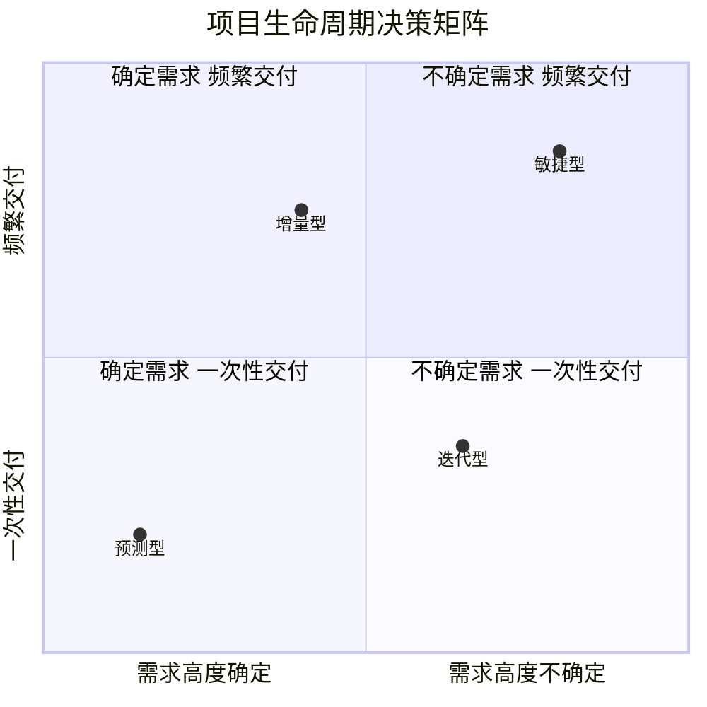
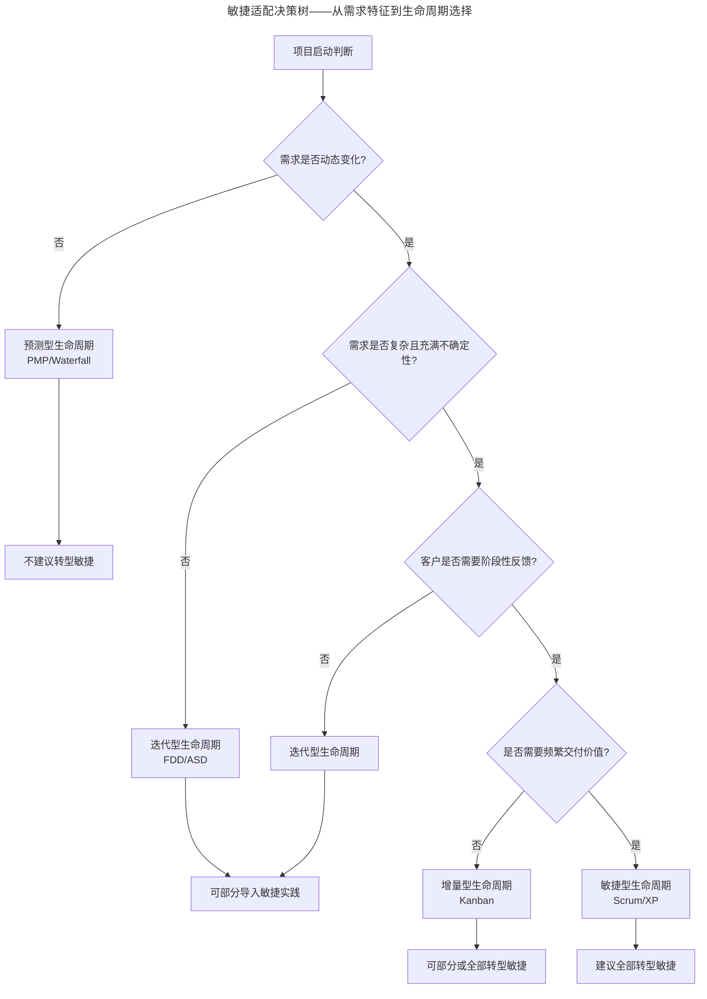

# 量体：如何判断是否适合做敏捷转型？

> **适用范围**：在是否启动敏捷转型决策前徘徊的产研管理者、PMO、CTO，特别是需要给出一套可量化判断框架的决策者。

> **更新摘要（v2 · 2026-08 更新）**：在原版项目生命周期四象限框架基础上，引入 2025 年中国规模化敏捷实践白皮书数据、SAFe 与 Spotify 模型的本土适配判断、AI 时代敏捷转型的新增维度（AI 化基础、数据治理成熟度），并补充一汽红旗、蔚来、东航数科等 2025 标杆案例的转型判断依据。失效图片已替换为 Mermaid 图与文字表格。

## 一、导言

在前文建立敏捷知识体系后，团队常陷入一个纠结：**我们到底适不适合做敏捷转型？** 这个问题没有"是/否"二元答案，而是需要根据项目生命周期类型、组织成熟度、业务复杂度、工程地基四个维度综合判断。

很多企业失败的根因不在敏捷本身，而在"拿着锤子找钉子"——把敏捷当万金油，用在预测型项目上反而增加变更成本。本文用一套四象限决策框架，配合 2025 年中国本土化转型案例，帮你判断"是否适合"以及"适合哪种程度的敏捷"。

## 二、核心方法论：项目生命周期四象限

### 2.1 项目生命周期的五个过程组

项目生命周期（Project Life Cycle）是描述项目从概念到完成的整个过程，包含五个过程组：

| 过程组 | 核心任务 | 资源投入 |
|---|---|---|
| 启动（Initiating） | 获得授权、定义新项目或阶段 | 极少（制作人、PO、PM、研发领导） |
| 规划（Planning） | 明确范围、优化目标、制定行动方案 | 中等 |
| 执行（Executing） | 完成计划中确定的工作 | 高峰 |
| 监控（Monitoring & Controlling） | 跟踪、审查、调整进展 | 持续 |
| 收尾（Closing） | 完结所有活动、总结教训 | 收尾 |

### 2.2 四种生命周期类型

根据项目需求确定性、交付方式、目标清晰度，业界归纳出四种生命周期：

- **预测型（Predictive/Waterfall）**：以分析→设计→构建→测试→交付为顺序，制定详细计划，限制变更
- **迭代型（Iterative）**：通过原型验证减少不确定性，关注构建和优化
- **增量型（Incremental）**：向客户分批交付可用成果，收集反馈调整
- **敏捷型（Agile）**：兼具迭代与增量属性，频繁交付价值

四象限图揭示了生命周期选择的核心逻辑：**需求越不确定、要求越频繁交付，越偏向敏捷型**；**需求越确定、一次性交付，越偏向预测型**。

### 2.3 四种生命周期特性对比

| 维度 | 预测型 | 迭代型 | 增量型 | 敏捷型 |
|---|---|---|---|---|
| 需求 | 高度明确 | 频繁变化 | 部分调整 | 高度动态 |
| 执行方式 | 顺序执行 | 反复打磨 | 分批交付 | 增量+迭代 |
| 交付方式 | 一次性交付 | 原型验证 | 分批可用 | 节奏化增量 |
| 最终目标 | 按计划交付 | 减少不确定 | 收集反馈 | 持续创造价值 |
| 典型场景 | 合同制、合规严格 | 探索性研发 | 客户需阶段性使用 | 互联网产品、SaaS |
| 适配方法 | PMP/Waterfall | FDD/ASD | Kanban/增量发布 | Scrum/XP |

## 三、关键流程：敏捷适配的判断逻辑

### 3.1 决策树：从需求特征到生命周期选择

决策树揭示了关键判断逻辑：

- **预测型与迭代型场景**：完全没有必要采用敏捷方法，强行转型反而增加变更成本
- **增量型场景**：可部分转型敏捷，把敏捷理念用在交付节奏上
- **敏捷型场景**：建议全部转型敏捷，对团队要求高但价值最大

### 3.2 大型项目的特殊性

敏捷型生命周期注重频繁交付，对团队要求很高。**大型项目如果硬上敏捷会很吃力**——增量型在固定周期完成部分交付更实际。这也是为什么 SAFe（Scaled Agile Framework）会引入 ART（敏捷发布火车）机制，把大型项目拆为多个对齐的敏捷小团队。

科大讯飞智能汽车事业部就是典型案例：百人产研团队通过 SAFe 的 ART 机制对齐至统一业务价值流，"依赖先行"机制把因依赖导致的延期比例从 55% 降至 15%。

### 3.3 适配度自检表

在决策前，建议团队用以下自检表评估适配度：

| 评估维度 | 偏敏捷（≥3 项命中） | 偏预测（≥3 项命中） |
|---|---|---|
| 需求确定性 | 用户偏好不明、需验证 | 合同明确、监管固定 |
| 交付节奏 | 需要周/双周发布 | 一次性交付 |
| 团队规模 | 5-10 人小团队 | 跨部门大团队 |
| 反馈获取 | 用户反馈易获取 | 内部验收为主 |
| 技术地基 | CI/自动化测试已有 | 工程实践薄弱 |
| 组织支持 | 领导层支持授权 | 层级审批严格 |

## 四、工具与实战

### 4.1 2025 年中国敏捷渗透率数据

根据 2026 年中国敏捷项目管理行业调研报告：

- 2025 年中国敏捷项目管理市场规模 128.6 亿元，同比增长 19.3%
- 规模以上工业企业中 43.6% 已采用主流敏捷框架
- 互联网与金融科技行业渗透率达 78.2%
- 83.6% 智能制造示范工厂将"敏捷开发响应周期缩短至 2 周以内"列为关键 KPI
- 持有 Scrum Alliance 认证（CSM/CSP）专业人士达 86,421 人，同比增长 22.7%

### 4.2 2025 年本土化标杆转型案例

Scrum.org 中国 2025 年评选的标杆案例提供了不同行业判断适配度的范例：

| 企业 | 转型判断依据 | 成效 |
|---|---|---|
| 智己汽车 | 互联网造车需求高度动态，需敏捷 | 数字化研发交付周期显著缩短 |
| 零跑科技 | 软件定义汽车、需求频繁变化 | 需求交付效率提升 40% |
| 上汽财务 | 金融业务需快速响应监管 | 端到端价值交付效能质量双升 |
| ABB 电气 | 工业物联网需求动态、跨团队协作复杂 | 智慧电力事业部转型成功 |
| 医科达 | 医疗设备软件快速迭代需求 | EVO 加速临床落地 |
| 一汽红旗 | 国央企 44.2% 主力军、需求冻结难 | "守破离"渐进式模型，需求冻结率提升 60% |
| 东航数科 | 国企特色、不强推组织变革 | "产品负责人+技术经理"双核模式，技术难题解决时长降 60% |
| 福建海峡银行 | 金融监管要求增量交付可审计 | 敏捷破冰试点破局 |

### 4.3 判断工具：四维度成熟度评估

SACC《2025 中国企业规模化敏捷实践白皮书》显示，成功实施规模化敏捷的企业研发效能平均提升 20% 以上、关键特性交付率提升 30% 以上。但其前提是团队在以下四维度达到基本成熟度：

| 成熟度维度 | 评估指标 | 不达标后果 |
|---|---|---|
| 工程地基 | CI/CD、自动化测试覆盖率、代码评审机制 | 迭代速度无法提升，回归测试堆积 |
| 组织支持 | 领导授权、跨职能团队、绩效对齐 | 敏捷仪式成形式主义 |
| 数据治理 | 需求追溯、工时统计、效能度量 | 转型成效无法量化验证 |
| AI 化基础 | 代码仓库规范化、需求结构化、知识库完备 | 无法承接 AI Agent 自治团队升级 |

## 五、常见误区

**误区 1：拿敏捷当万金油**。"存在即合理"，每个生命周期对应的场景都不同。预测型项目（如合同制银行核心系统）强行上敏捷会增加变更成本，反而比瀑布更慢。**敏捷不是解决一切问题的万金油**。

**误区 2：只看行业不看具体项目**。同一家企业的不同项目可能适合不同生命周期。腾讯游戏部门里，欢乐斗地主适合敏捷转型，但大型 3A 游戏项目仍偏预测型。判断要落到具体项目而非笼统行业。

**误区 3：忽视组织成熟度**。即便项目适合敏捷，如果团队没有 CI/自动化测试地基、领导层不支持授权、绩效体系仍按职能考核，强行转型会触发"形式主义敏捷"。一汽红旗采用"守破离"渐进式模型，正是先解决组织成熟度问题再导入敏捷。

**误区 4：把"部分转型"等同于"不转型"**。增量型场景下可以"部分转型"，即在交付节奏上引入敏捷，但保留预测型的计划性。这种混合实践在金融行业非常常见，如上汽财务采用"以价值驱动搭建跨部门协同的敏捷组织"。

**误区 5：忽视监管与合规约束**。金融行业受《商业银行信息科技风险管理指引》（银监发〔2009〕19 号）等监管要求约束，核心系统的变更须满足可审计、可回溯的合规要求。这意味着必须采用混合型敏捷，文档与功能同步交付。

**误区 6：照搬硅谷模式**。Spotify 模型在硅谷流行但在中国常水土不服。中国企业的层级文化与敏捷强调的团队自主之间存在天然张力，44.2% 国央企和 31.2% 民企都需要本土化适配，而非照搬。

## 六、进阶延展

### 6.1 AI 时代新增的判断维度

AI 重构研发流程后，敏捷转型判断需要新增两个维度：

- **AI 化基础**：是否有规范化的代码仓库、结构化需求、知识库？这决定了能否承接 AI Agent 自治团队升级
- **数据治理成熟度**：是否能提供历史故事点数据、缺陷模式数据、效能度量数据？这决定了 AI 辅助估算、智能测试用例生成能否落地

GitHub 2023 年调研显示，68% 引入 AI 工具的团队遇到原有敏捷流程适配问题。这意味着 2026 年的敏捷转型判断不能只看传统四象限，还要评估 AI 化准备度。腾讯 TAPD 8.0 把 AI 能力深度集成进项目管理全链路（NPC AI 助手、CodeBuddy AI 编码、AI 验收标准生成），意味着团队在选型时也要评估工具的 AI 化演进路径。

### 6.2 规模化敏捷的判断框架

当企业规模超过 1000 人，单团队敏捷不足以解决问题。规模化敏捷需要新增判断维度：

| 规模化敏捷框架 | 适用场景 | 中国本土案例 |
|---|---|---|
| SAFe | 100-1000 人、跨团队依赖强 | 科大讯飞智能汽车、蔚来汽车 |
| LeSS | 50-500 人、产品单一 | 部分互联网产品 |
| Spotify 模型 | 文化开放、工程地基成熟 | 国内较少原版照搬 |
| 自研混合 | 大型国企、监管严格 | 一汽红旗、东航数科 |

### 6.3 给决策者的三点建议

第一，**先用本框架自检再决策**。先用四象限+自检表判断项目生命周期类型，再决定是否转型。不要被外部潮流推着走。

第二，**部分转型也是合理选择**。增量型场景下"部分转型"完全合规，关键是明确哪部分用敏捷、哪部分保留预测。福建海峡银行的"敏捷破冰"正是从单点试点起步。

第三，**预留 AI 化升级路径**。即便当下不接入 AI，也要在工具选型、数据治理、知识库建设上预留升级空间。2025 年中国敏捷工具付费客户年均支出从 3.8 万元升至 4.5 万元，反映企业对工具 AI 化能力的持续加码。

### 6.4 转型成熟度五阶段模型

综合腾讯演化路径与 2025 中国本土化案例，敏捷转型可提炼为五阶段成熟度模型，决策者可用此模型定位自身阶段并规划下一步：

| 阶段 | 关键特征 | 标志性事件 | 下一步动作 |
|---|---|---|---|
| 阶段 0：未启动 | 仍用瀑布、无敏捷认知 | 无 | 启动思维共识、引入外部教练 |
| 阶段 1：单点试点 | 1-2 个团队试点 Scrum | 试点团队迭代节奏稳定 | 评估试点成效、选第二批试点 |
| 阶段 2：部门推广 | 多团队同步实践 | 跨团队依赖管理机制建立 | 引入 SAFe/SoS 规模化框架 |
| 阶段 3：组织规模化 | 千人级敏捷、内部认证教练队伍 | 敏捷教练达 100+ 人 | 沉淀工具平台、对外服务 |
| 阶段 4：AI 化升级 | AI Agent 自治团队试点 | 工具 AI 化能力集成 | 探索人机混合估算与质量管控 |

腾讯当前处于阶段 4，一汽红旗、东航数科处于阶段 1-2，科大讯飞智汽处于阶段 2-3。决策者可对照此模型判断自身阶段，避免"跳级"导致的转型失败。

需要特别提醒的是，**阶段之间不可跳跃**。试图从阶段 0 直接跳到阶段 4 的企业，往往在 AI 化试点中暴露工程地基、组织支持、数据治理的多重短板。GitHub 2023 年调研显示 68% 引入 AI 工具的团队遇到原有敏捷流程适配问题，正是因为跳过了阶段 1-3 的能力建设。

---

下一篇：[04-裁衣：如何使敏捷方法适合公司实情？（v2）](04-裁衣：如何使敏捷方法适合公司实情？.md) 将在判断适合敏捷后，讲解如何裁剪敏捷方法以匹配公司实际场景。

---