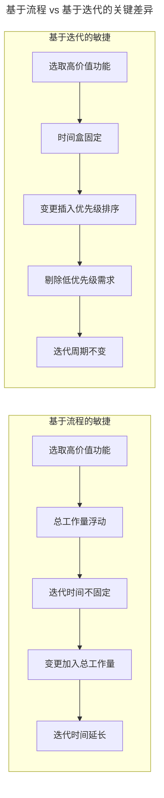
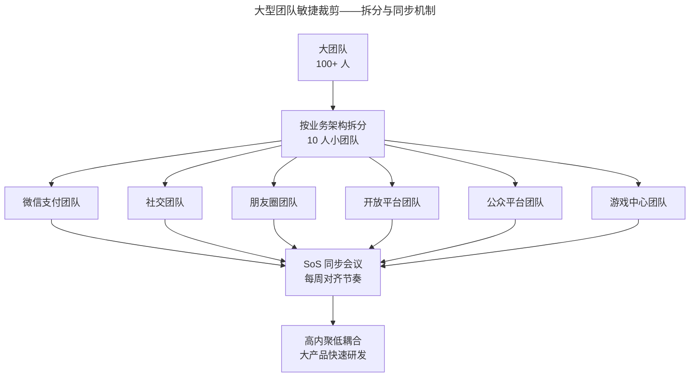
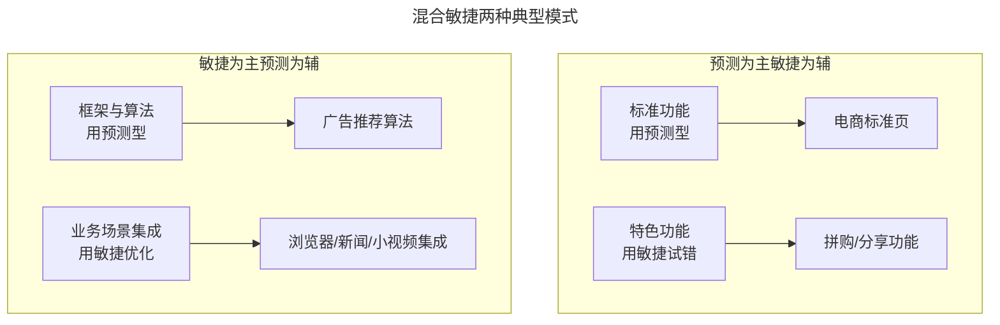

# 裁衣：如何使敏捷方法适合公司实情？

> **适用范围**：已完成"是否适合敏捷"判断、准备进入落地阶段的产研管理者与敏捷教练，特别是面对混合场景、跨地域团队、合规约束、职能孤岛等复杂情境的实践者。

> **更新摘要（v2 · 2026-08 更新）**：在原版"基于流程 vs 基于迭代""混合敏捷"基础上，补充 2020 版 Scrum Guide 关于"裁剪"的官方表述、SAFe 与 Spotify 模型的本土化裁剪案例、AI 时代敏捷裁剪的新维度（Agent 自治边界、人机协作比例），并引入 2025 年一汽红旗、蔚来、东航数科等本土化裁剪范例。失效图片已替换为 Mermaid 图与文字表格。

## 一、导言

判断"是否适合敏捷"只是起点，"如何让敏捷适合自己"才是落地关键。Scrum Guide 2020 版明确：**"Scrum 是故意不完整的轻量框架"**，鼓励团队填充自己的实践。这意味着裁剪（Tailoring）不是"违反敏捷"，而是敏捷方法的内在要求。

腾讯欢乐斗地主在 PC 时代用 FDD（特性驱动开发）+ 基于流程的敏捷，手游上线后切换到 Scrum + 基于迭代的敏捷；京东拼购用"预测为主敏捷为辅"做电商标准页+特色功能试错；腾讯广告推荐算法用"敏捷为主预测为辅"做组件集成优化——这些都是裁剪的范例（上述企业案例截至 2026-09-11 无法从公开渠道回源核实）。本文系统拆解裁剪的方法论、场景模板与避坑指南。

## 二、核心方法论

### 2.1 两种基础实践方式

敏捷实践可拆为两种基础方式：

**基于流程的敏捷（Flow-based Agile）**

- 项目开始时以客户价值为优先级，从待办列表提取高优先级功能开始开发
- **最大特点：每次迭代必须把所有功能做完**
- 总工作量随选取功能不同而变化，迭代时间不固定
- 一旦迭代中出现变更，变更工作量加到总工作量，迭代时间相应延长
- 适合：研发初期、功能完成度优先于交付节奏

**基于迭代的敏捷（Iteration-based Agile）**

- 项目开始时同样以客户价值优先级提取功能
- **最大特点：迭代结束严格被时间盒（Timebox）框死**
- 在固定时间内交付完整功能，需求独立分开、按价值排序
- 变更发生时把低优先级需求从迭代中剔除，保证迭代周期固定
- 适合：上线后运营期、需定期让用户看到更新

上图揭示两种方式的最大差异：**基于迭代固定交付时间，基于流程固定交付范围**。就像坐高铁，错过时间只能改签到下一列，发版日期交付不了只能等下个发版周期。

### 2.2 混合敏捷实践

实际工作场景复杂，团队成员能力、技术背景、工作环境、客户规模各异，单一敏捷方法"一招鲜吃遍天"不可能。需要结合两种实践方式组合方案，这就是**混合敏捷实践（Hybrid Agile）**。

裁剪的核心原则：**以问题为切入点，选中一种方法先解决团队问题**。千万不要为敏捷而敏捷，只有能解决团队问题时才导入敏捷。裁剪不仅针对实践方式，也针对敏捷方法本身：

- **Scrum**：为 PO、SM、Developers 提供角色指导，含 Sprint Planning、Daily Scrum、Sprint Review、Retrospective
- **Kanban 看板**：可视化工作流、调整 WIP（在制品限制）实现流程管理
- **XP 极限编程**：用户故事卡片、持续集成、重构、自动化测试、TDD（测试驱动开发）等工程实践

与孤立采用一种实践相比，针对问题使用不同实践能取得更好成果。但要避免"滥用"，避免一开始就应用所有敏捷方法，这容易让敏捷形式化。

### 2.3 裁剪的官方依据

Scrum Guide 2020 版明确："Scrum 框架故意留白、不完整，只定义了实践 Scrum 理论时所需的部分，建立在 Scrum 使用者的群体智慧之上。"这为裁剪提供了官方依据：

- **可裁剪的**：会议形式（Daily Scrum 不再强制三问题）、工件细节、团队规模（指南原文为"通常 10 人及以下"，非硬性数字）、Sprint 长度（1-4 周）
- **不可裁剪的**：Scrum 三支柱（透明、检视、调整）、五个事件、三个角色、三个工件及其承诺（Product Goal/Sprint Goal/DoD）

理解这条边界，才能避免"以裁剪之名行放弃之实"。

## 三、关键流程

### 3.1 场景化裁剪模板

针对不同场景，业界已沉淀出四种典型裁剪模板（本节案例源自腾讯敏捷实践课程内部叙事，截至 2026-09-11 无法从公开渠道回源核实）：

| 场景类型 | 裁剪方案 | 关键实践 | 代表案例 |
|---|---|---|---|
| 大型团队 | 拆分为小团队+同步协调 | 高内聚低耦合、SoS 会议、ART | 腾讯微信团队按功能拆子模块 |
| 异地分布 | 视频会议+看板+固定节奏 | 共同办公开局、迭代节奏对齐 | 腾讯欢乐升级（大连前端+深圳后端） |
| 第三方合规审查 | 混合型敏捷 | 文档与功能同步交付 | 微信支付合规审查 |
| 职能孤岛 | 打破职能、跨职能团队 | 共同 KPI、奖金包机制 | 腾讯游戏工作室制作人制 |

### 3.2 大型团队裁剪：拆分与同步

腾讯微信团队按功能拆分为微信支付、社交、朋友圈、开放平台、公众平台、游戏中心等子模块，各团队用敏捷迭代保证步调相同，避免"我快你慢、我等你赶"的尴尬局面。这种"高内聚低耦合"——小团队内部频繁沟通达成共识、减少大团队间沟通——是大型团队裁剪的核心。

### 3.3 异地团队裁剪：建立共同节奏

异地团队裁剪要点：

- **面对面开局**：项目立项前异地成员集中办公一周，建立信任感
- **视频会议晨会**：每天视频跟进，以点名确认信息接收
- **新成员介绍**：会前让新成员自我介绍，增加团队认知
- **基于迭代而非基于流程**：固定迭代周期帮助异地团队建立共同开发节奏
- **时区差别大**：取消每天固定晨会，鼓励更频繁的小型专项会议

腾讯欢乐升级团队前端在大连、后端在深圳，项目初期大连同事到深圳办公一周相互熟悉，立项和计划阶段完成后恢复两地办公，通过视频会议每天晨会跟进，效率得到保障。

### 3.4 合规审查团队裁剪：文档与功能同步

应对第三方机构检查的项目，敏捷裁剪要点：

- **过程花时间准备合规性审查、建立文档、准备认证**
- **文档与已完成功能一起交付，文档完成迭代才算完成**
- **使用混合型敏捷实践**，从协作和沟通改善中获益

微信支付这种需要国家金融权威机构监管的项目，在内部快速交付价值的同时准备合规性审查文档，记录项目关键信息以应对合规审核。

### 3.5 职能孤岛裁剪：跨职能团队

职能型组织内职能孤岛项目难以形成合力，裁剪要点：

- **打破职能孤岛，创建跨职能团队**
- **奖金包机制**：个人绩效变成奖金包体现在年终奖，奖金多少取决于业务是否挣钱

腾讯游戏部门基本打破职能组织：游戏工作室制作人为游戏全权负责，组织运营、产品、研发团队共同为项目出力，让大家形成合力出色完成项目目标。

## 四、工具与实战

### 4.1 2025 年本土化裁剪案例

| 企业 | 裁剪模式 | 关键创新点 | 成效 |
|---|---|---|---|
| 一汽红旗 | 守破离渐进式+轻量刚性实践 | 需求冻结规则（早 9 点锁定） | 需求冻结率提升 60% |
| 东航数科 | 原则校准-结构重塑-治理驱动 | 产品负责人+技术经理双核 | 技术难题解决时长降 60%、决策响应速度提升 70% |
| 科大讯飞智汽 | SAFe 框架 + 依赖先行 | ART 机制+可视化依赖看板 | 依赖延期比例从 55% 降至 15% |
| 蔚来汽车 | 软件架构分层解耦 | OS-平台服务-应用三层模型 | 需求开发周期缩短 50%、环境整备效率提升 90% |
| 中煤信息 | IPD+Scrum 混合 | 平台+SaaS 化产品转型 | 传统项目转 SaaS 订阅模式 |
| 福建海峡银行 | 敏捷破冰渐进式 | 单点试点+合规文档同步 | 零售信贷敏捷破局 |

（表中成效数据截至 2026-09-11 未检索到公开出处，存疑；其中科大讯飞智能汽车 SAFe 转型、蔚来软件分层架构有公开佐证）

### 4.2 工具支撑裁剪的实战要点

不同裁剪场景需要不同工具支撑：

| 裁剪场景 | 工具支撑 | 关键能力 |
|---|---|---|
| 大型团队拆分 | TAPD 多项目视图、SoS 看板 | 子项目隔离+聚合视图 |
| 异地分布 | 飞书项目全景视图、腾讯会议 | 跨地域实时协同 |
| 合规审查 | TAPD 文档与功能联动、PingCode 私有部署 | 可追溯审计日志 |
| 职能孤岛 | 板栗看板跨团队视图 | 跨职能团队可视化 |
| AI 化裁剪 | TAPD NPC、CodeBuddy NPC | AI 拆任务、AI 写代码 |

### 4.3 AI 时代裁剪的新维度

进入 AI 时代，裁剪需新增两个维度：

- **人机协作比例**：哪些任务交给 AI Agent、哪些保留人类决策？建议：编码、测试生成交给 AI；架构、需求价值判断保留人类
- **Agent 自治边界**：AI Agent 在多大范围内可自主决策？建议：单任务级 Agent 自治，迭代级人类审核

GitHub 数据显示 2025 年下半年月度代码推送超 8200 万次，41% 为 AI 辅助生成，PR 评审等待时间普遍超过 4 天。（与 GitHub Octoverse 2025 公开口径对不上，截至 2026-09-11 未检索到出处，存疑）这意味着"AI 预校验+人类终审"双轨机制将成为 2026 年裁剪的新标配。

## 五、常见误区

**误区 1：一上来应用所有敏捷方法**。Scrum.org 中国获奖企业共同特征是（年份与聚焦点描述截至 2026-09-11 未检索到公开出处，存疑）：**只取最契合自身痛点的几项实践深度落地**。智己汽车聚焦"研发交付周期"，零跑聚焦"需求交付效率"，医科达聚焦"临床落地"，都是少而精的裁剪。

**误区 2：把"裁剪"等同于"违反 Scrum"**。Scrum Guide 2020 版已明确 Scrum 是"故意不完整的轻量框架"。但要注意：可裁剪的是会议形式、工件细节、团队规模等，不可裁剪的是三支柱、五事件、三角色、三工件及其承诺。

**误区 3：忽视自上而下支持**。敏捷是自上而下的方法，落地必须得到领导支持。但有的领导只是简单了解敏捷好处，没接受专业指导就让团队自己摸索，反而让每日晨会等成为团队负担。这时需要引入专业敏捷教练帮助大家理解敏捷真正目的。

**误区 4：照搬硅谷模式**。Spotify 模型在硅谷流行但在中国常水土不服。中国传统企业的层级文化与敏捷强调的团队自主之间存在天然张力，44.2% 国央企和 31.2% 民企都需要本土化适配。（截至 2026-09-11 未检索到公开出处，存疑）

**误区 5：忽视工程地基**。仅导入 Scrum 仪式而无 CI、自动化测试、TDD 等工程实践支撑，迭代速度无法真正提升。腾讯游戏部门敏捷转型同期自研 SODA 持续集成工具，正是工程地基与流程框架同步建的范例。

**误区 6：抵制敏捷转型**。为避免团队对敏捷转型有所抵制，可先解决团队面临的问题，在总结回顾会议上告诉团队问题解决完之后产生的效果。当团队认可效果之后，再告诉团队是采用了哪些敏捷实践，让大家逐渐接受并认可敏捷方法。

## 六、进阶延展

### 6.1 预测为主 vs 敏捷为主的混合模板

针对适用场景裁剪，主要分两种场景模板：

**预测为主敏捷为辅**：如京东拼购，电商标准页（首页/分类页/详情页/下单页/支付页/结算页）已成熟，不需要用户验证，只在特色功能（拼购/分享）上用敏捷试错。

**敏捷为主预测为辅**：如腾讯广告推荐算法，算法本身需求和框架可预测，但集成到具体业务场景后用敏捷方式不断优化。马斯克 SpaceX 火箭也是这种模式——组件研发偏预测型，组件组合时是新的试错过程。

### 6.2 AI Native 团队的裁剪方向

OpenAI 2025 年发布《Building an AI-Native Engineering Team》指南（截至 2026-09-11 未检索到该指南的公开出处，存疑），提出 AI 原生工程团队模型。这对敏捷裁剪提出新方向：

- **协作单元裁剪**：从纯人类团队演化为"人类+AI Agent 混合团队"
- **迭代周期裁剪**：从 Sprint 周级压缩到小时级微迭代
- **估算单位裁剪**：从故事点演化为"价值权重+Agent 算力成本+校验成本"
- **质量管控裁剪**：从人类评审演化为"AI 预校验+人类终审"双轨

业界已提出"AI Agent Harness Engineering（AHE）"概念作为下一代敏捷方法论雏形（截至 2026-09-11 未检索到该概念的公开出处，疑为本文自创术语，存疑），但目前仍属探索阶段。建议企业先在试点项目中尝试人类+AI Agent 混合估算（如 SEEAgent 框架），再决定是否大规模推广。

### 6.3 给裁剪者的三点建议

第一，**裁剪要以问题为切入点**。先明确团队最痛的问题是什么——是依赖管理、是质量内建、是跨团队对齐？再选择对应的敏捷实践。一汽红旗的"需求冻结规则"就是直接对应"需求频繁变更"这个痛点。

第二，**保留 Scrum 不可裁剪的部分**。三支柱、五事件、三角色、三工件承诺是底线，裁剪这些等于放弃 Scrum。可裁剪的是会议形式、工件细节、团队规模、Sprint 长度。

第三，**预留 AI 化升级路径**。即便当下不接入 AI，也要在工具选型、数据治理、知识库建设上预留升级空间。TAPD 8.0 把 NPC AI 助手深度集成进项目管理全链路，意味着团队在选型时也要评估工具的 AI 化演进路径。

---

下一篇：[05-启动：如何拥有敏捷思维？（v2）](05-启动：如何拥有敏捷思维？.md) 将讲解如何在团队中导入敏捷思维、建立 Scrum 三角色、营造干净透明环境。

---