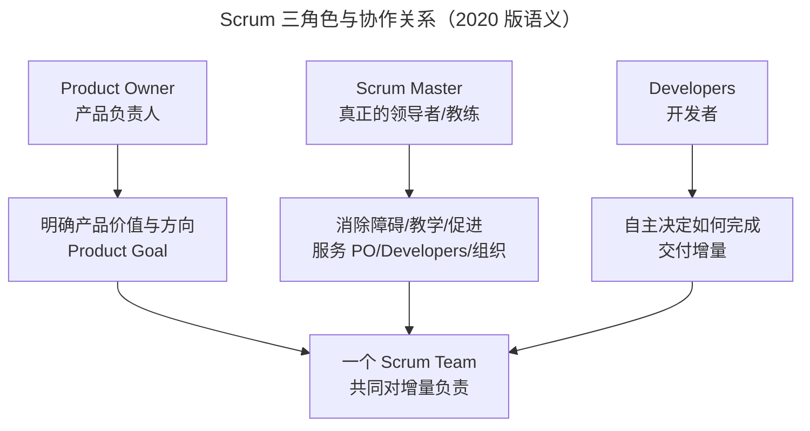
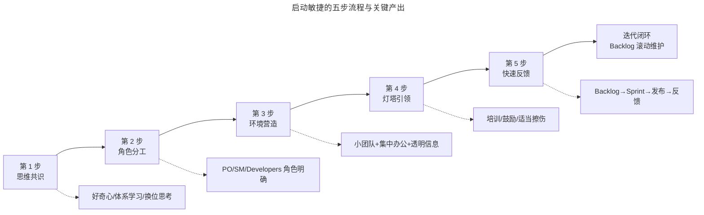

# 启动：如何拥有敏捷思维？

> **适用范围**：准备向团队导入敏捷、需要从思维共识与角色分工入手启动转型的敏捷教练、项目经理与新晋产研管理者。

> **更新摘要（v2 · 2026-08 更新）**：在原版"敏捷思维三特点（快速/高效/试错）"基础上，对齐 Scrum Guide 2020 版的角色语义（移除 Development Team、Self-Managing 替代 Self-Organizing、SM 真正的领导者定位），引入 2025 年中国敏捷教练队伍数据，补充 AI 时代敏捷思维新增的"人机协作"维度。失效图片已替换为 Mermaid 图与文字表格。

## 一、导言

判断完是否适合敏捷、裁剪完适合公司的方法，下一步就是"启动"——把敏捷真正在团队中跑起来。但启动的难点不在工具、不在流程，而在**思维**。

很多团队导入敏捷失败，根因都是把敏捷当工具导入：买了 TAPD、安排了 Daily Scrum、画了看板，但团队对敏捷思维没有共识，最后变成"流程合规"的形式主义敏捷。腾讯从 2006 年首次导入敏捷到 2011 年欢乐斗地主成功转型，间隔 5 年正是用于思维沉淀。（2006 年起源属实；"2011 年转型"时间点截至 2026-09-11 未检索到公开出处，存疑）

本文用一篇文章讲清启动敏捷的三个关键：思维共识、角色分工、实践环境，并补全 2020 版 Scrum Guide 带来的角色语义校准与 AI 时代的新维度。

## 二、核心方法论

### 2.1 敏捷思维的三个特点

VUCA 时代下敏捷思维特点可用三个词概括：

- **快速（Fast）**：雷厉风行，只有跑得比别人快才能保持优势
- **高效（Efficient）**：组织高效协同，才能持续交付价值
- **试错（Iterative）**：通过不断低成本试错，满足客户真正需要

这三点不是口号，而是评判日常决策的尺子。每个决策都可以问三个问题：是否更快了？是否更高效？是否更接近用户真实需要？如果三个问题都是否定，这个决策违背敏捷思维。

### 2.2 思维转变的两个起点

**起点一：改变自己**

无论是否是团队领导，只要想敏捷，自己必须先形成敏捷思维习惯。具体做法：

- **保持好奇心**：对 5G、AI、大数据等新事物保持好奇，鼓励自己不断学习前沿技术，从不同领域汲取知识，开拓视野、提升格局，培养终身学习习惯
- **体系化学习敏捷知识**：自媒体了解的敏捷常过于片面缺乏系统性，建议系统化学习，构建全面立体的敏捷知识体系

**起点二：引导团队**

有了改变自己的自觉性，加上理论支撑，可以从三个方面引导团队：

- **换位思考**：站在他人角度思考问题，沟通更加高效
- **共同经历**：和团队成员一起经历工作之外的事情（腾讯定期举行登山或徒步团建，培养团队默契；内部叙事，截至 2026-09-11 无法回源核实）
- **建立共同目标**：团队和自我都希望在工作中得到提升，有共同目标后协作更高效

### 2.3 Scrum 三角色的 2020 版语义校准

Scrum 是当下最流行的敏捷方法，启动敏捷必须先理清三种角色。Scrum Guide 2020 版对角色语义做了关键校准：

上图揭示了 2020 版的关键变化：**一个 Scrum Team** 共同对增量负责，PO 与 Developers 不再是"甲方/乙方"关系，SM 是真正的领导者而非命令式管理者。

**Product Owner（产品负责人，PO）**

- 一般由产品经理担任，是项目的第一负责人
- 指导产品方向，对最终交付的产品负责
- 将待办事项里的需求按客户价值排序
- 从客户那里获得产品反馈并告诉团队如何改善
- 与团队开展日常合作，参加迭代计划会、每日晨会、评审会与回顾会
- 决定版本是否达到发版要求

腾讯经营理念"一切以用户价值为依归"印证了 PO 的核心定位。

**Scrum Master（敏捷教练，SM）**

2020 版明确 SM 是"真正的领导者（True Leader）"，承担六项职责：

| 职责 | 含义 |
|---|---|
| 教练 | 教 PO 与 Developers 如何使用 Scrum |
| 教师 | 传授 Scrum 知识与实践 |
| 促进者 | 促进 Scrum 事件有效召开 |
| 障碍清除者 | 帮助团队清除推进障碍 |
| 变革引领者 | 带领组织拥抱变化 |
| 仆人式领导 | 命令式转向服务式 |

**Developers（开发者）**

2020 版用"Developers"取代了"Development Team"概念，强调：

- 跨职能团队，含设计、开发、测试、运营等所有交付所需角色
- 按项目在空间上聚集，共同负责 KPI
- 自管理：选择谁做、做什么、怎么做
- 在更短时间内独立交付高质量产品

### 2.4 划龙舟的隐喻

如果把敏捷实践比作划龙舟：

- PO 相当于舵手：把握方向
- SM 相当于鼓手：节奏与鼓舞
- Developers 相当于划船人：执行落地

每个角色各司其职，认识到自己的职责所在，敏捷才能深入人心。

## 三、关键流程

### 3.1 启动敏捷的五步流程

### 3.2 第 1 步：思维共识

详见 2.2 节，关键是先改变自己再引导团队，建立共同目标。

### 3.3 第 2 步：角色分工

详见 2.3 节，关键是明确 PO/SM/Developers 三角色职责，PO 决定做什么、SM 教学促进、Developers 自管理决定如何做。

### 3.4 第 3 步：营造干净透明环境

**透明环境**：信息和规则要透明。复杂层级造成执行效率低下，敏捷鼓励让团队自己做决定，团队需要清楚目前的信息和规则来做判断。

**小团队运作**：根据业务架构将团队拆分成相对独立的 10 人以下小团队。小团队沟通更简单，管理成本更低。

**集中办公**：跨职能团队尽量按项目组合，物理位置坐在一起。腾讯不少团队霸占大会议室作为"作战室"，为一款产品共同工作两三个月，发布后再回工位。

### 3.5 第 4 步：灯塔引领

敏捷转型负责人要肩负灯塔责任，具体做法：

- **培训与交流**：敏捷方向培训建立一致语言、体系化知识；专业技能培训提升专业知识
- **鼓励庆祝**：转型阵痛期鼓励团队，取得成绩后庆祝使团队获得信心
- **适当"擦伤"**：遇到小问题不马上给方案，让团队自己解决，锻炼独立解决问题能力

腾讯转型敏捷时一次案例：团队要产品验收但时间紧，质疑验收必要性，让团队自己决定不做验收。结果测试人员测试十几个用例后发现产品与需求不一致，叫产品经理确认是开发理解问题。迭代回顾会上团队主动提出"产品验收很重要，可以快速发现问题、节省测试时间"。（内部案例，截至 2026-09-11 无法回源核实）

### 3.6 第 5 步：建立快速反馈机制

敏捷注重频繁交付价值，通过频繁交付得到及时反馈，修正方向。快速反馈机制五步：

1. 整个团队根据所有任务建立产品待办事项列表（Product Backlog）
2. 产品经理从 Product Backlog 选取价值高的需求列入迭代待办事项（Sprint Backlog）
3. 研发人员用 1-2 周时间快速迭代
4. 测试完成后发布
5. 产品经理收集用户反馈整理成需求，重复第 1 步

**重要提醒**：快速反馈机制不是一蹴而就，需要在开发中不断总结优化，使之与团队更加匹配。

## 四、工具与实战

### 4.1 中国敏捷教练队伍数据

截至 2025 年末，中国持有 Scrum Alliance 认证（CSM/CSP）的专业人士达 86,421 人，同比增长 22.7%，其中高级认证（CSP）持有者 12,853 人，占总数 14.9%。（截至 2026-09-11 未检索到公开出处，存疑）头部企业内部认证敏捷教练队伍规模：

| 企业 | 内部认证敏捷教练人数 |
|---|---|
| 腾讯 | 217 |
| 阿里巴巴 | 189 |
| 京东 | 153 |
| 平安科技 | 136 |
| 招商银行 | 94 |

（表中人数截至 2026-09-11 未检索到公开出处，存疑）

数据表明：**敏捷教练队伍是规模化敏捷可持续推进的关键战略资产**。如果企业没有内部认证教练队伍，启动敏捷时建议先引入外部专业教练。

### 4.2 工具支撑启动敏捷

启动敏捷时，工具应支撑而非替代思维共识：

| 启动阶段 | 工具支撑 | 关键能力 |
|---|---|---|
| 思维共识 | 飞书文档/Confluence | 共建敏捷知识库、价值观海报 |
| 角色分工 | TAPD 角色/权限配置 | PO/SM/Developers 角色与权限明确 |
| 环境营造 | TAPD 看板墙+作战室预订 | 信息透明可视化 |
| 灯塔引领 | 腾讯会议+乐享 | 培训内容沉淀、回顾会纪要 |
| 快速反馈 | TAPD Backlog+迭代管理 | Product Backlog→Sprint Backlog 流转 |

### 4.3 TAPD NPC 在启动阶段的辅助

TAPD 8.0 引入 NPC AI 助手，启动敏捷时可辅助：

- **AI 写需求**：PO 描述业务背景，NPC 自动生成用户故事与验收标准
- **AI 拆任务**：把大需求拆解为可执行子任务，降低 Developers 拆解负担
- **AI 写报告**：自动生成迭代评审材料，节省 SM 准备时间

某游戏团队通过 TAPD AI 报告自动生成，把每周准备迭代评审材料的时间从 4 小时压缩到 20 分钟，让 SM 把精力从"准备材料"转向"促进团队反思"。（截至 2026-09-11 未检索到公开出处，存疑）

### 4.4 跨地域启动敏捷的实战

腾讯欢乐升级团队前端在大连、后端在深圳，项目启动时采用"开局一周集中"模式：

- 大连同事到深圳办公一周，相互见面熟悉工作方式
- 完成项目立项和项目计划阶段
- 恢复两地办公后通过视频会议每天晨会跟进
- 异地团队办公效率得到保障

这种"开局集中+日常远程"模式已成为异地团队启动敏捷的标配。

## 五、常见误区

**误区 1：把 Scrum Master 当项目经理**。2020 版 Scrum Guide 明确 SM 是"真正的领导者、教练、教师、促进者、障碍清除者"，而非命令式管理者。如果 SM 仍然按项目经理模式分派任务、监督进度，团队无法自管理。

**误区 2：PO 与 Developers 对立**。2020 版移除 Development Team 概念、强调"一个 Scrum Team"，目的就是消除 PO 与开发之间的"我们 vs 他们"代理对立。如果 PO 仍把开发当乙方，敏捷转型必然形同虚设。

**误区 3：忽视思维共识直接上工具**。买了 TAPD、安排了 Daily Scrum，但团队对敏捷思维没有共识，最后变成"流程合规"的形式主义敏捷。腾讯从首次导入敏捷到欢乐斗地主成功转型间隔 5 年，正是用于思维沉淀。

**误区 4：不让团队"擦伤"**。转型初期，负责人遇到团队任何问题都立即给方案，团队没有自解决能力。腾讯"擦伤"案例证明：让团队自己犯错、自己反思、自己总结，比直接给方案更有效。

**误区 5：忽视培训与庆祝**。培训建立一致语言、庆祝让团队获得信心。如果转型阵痛期不鼓励团队、取得成绩后不庆祝，团队会失去信心承担更多责任。

**误区 6：把敏捷教练当"项目经理助理"**。敏捷教练的核心是教学、促进、清除障碍、变革引领，而非行政事务。如果让敏捷教练忙于填表、安排会议、出报告，就无法承担真正的转型推进职责。

## 六、进阶延展

### 6.1 自管理（Self-Managing）取代自组织（Self-Organizing）

Scrum Guide 2020 版用"自管理"取代"自组织"，看似一字之差，实则有重大语义差异：

| 维度 | 自组织（Self-Organizing） | 自管理（Self-Managing） |
|---|---|---|
| 自主范围 | 自行认领任务 | 选谁做、做什么、怎么做 |
| 决策深度 | 任务分配层 | 团队运作层 |
| 责任承担 | 个人对任务负责 | 团队对增量负责 |
| 领导关系 | 仍可能依赖外部指挥 | 真正脱离命令式管理 |

这意味着启动敏捷时，不能只让团队"自己分任务"，还要让团队"自己决定做什么、谁来做、怎么做"。这是更高阶的授权要求，需要管理层克制干预冲动。

### 6.2 AI 时代敏捷思维的新维度

进入 AI 时代，敏捷思维需要新增第四个特点：**人机协作（Human-AI Collaboration）**。具体含义：

- 识别哪些任务交给 AI Agent、哪些保留人类决策
- 明确 AI Agent 自治边界（任务级 vs 迭代级）
- 重塑人机估算协作（如 SEEAgent 框架）
- 建立"AI 预校验+人类终审"双轨质量机制

GitHub 2023 年调研显示，68% 引入 AI 工具的团队遇到原有敏捷流程适配问题。（截至 2026-09-11 未检索到该调研的公开出处，存疑）这意味着 2026 年启动敏捷时，思维共识必须包含"如何与 AI 协作"的讨论，而非仅讨论人与人协作。

### 6.3 给启动者的三点建议

第一，**思维共识先于工具导入**。在引入 TAPD/Jira 等工具前，先花 1-2 个 Sprint 让团队理解敏捷价值观与原则，否则工具只会放大混乱。

第二，**先建角色再定流程**。明确 PO/SM/Developers 三角色职责后再定义流程，避免"流程先行、角色模糊"导致的责任真空。

第三，**预留 AI 化升级路径**。即便当下不接入 AI，也要在思维共识中加入"人机协作"讨论，让团队对未来 AI Agent 接入有心理与流程准备。TAPD 8.0 的 NPC AI 助手已能在工作项评论区一句话完成拆任务、写用例、写代码，团队在选型时也要评估工具的 AI 化演进路径。

---

下一篇：[06-自组织：敏捷团队如何开展自组织？（v2）](06-自组织：敏捷团队如何开展自组织？.md) 将讲解自管理团队的组建、待办事项列表的创建与维护。

---