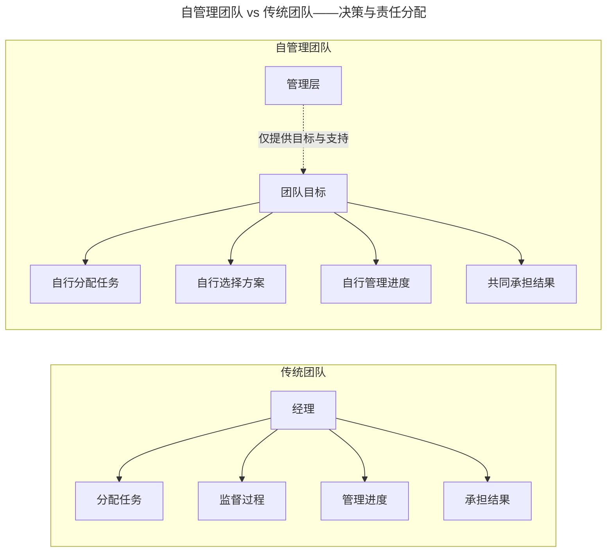
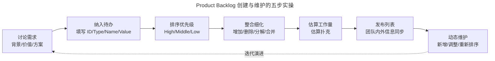

# 自组织：敏捷团队如何开展自组织？

> **适用范围**：已完成敏捷启动、希望让团队真正进入"自管理"状态的敏捷教练、Scrum Master 与产研管理者，特别是对自组织边界、待办事项列表维护有困惑的实践者。

> **更新摘要（v2 · 2026-08 更新）**：在原版"自组织团队"基础上，对齐 Scrum Guide 2020 版"Self-Managing 自管理"语义（取代 Self-Organizing 自组织），引入 DEEP 模型与现代 Product Backlog 实践、Product Goal 作为长期承诺的指引，补充 2025 年 AI Agent 自治团队的新形态与混合人机协作的边界。失效图片已替换为 Mermaid 图与文字表格。

## 一、导言

敏捷宣言十二原则之一："最好的架构、需求和设计出自自组织团队"。但在 Scrum Guide 2020 版中，"自组织（Self-Organizing）"被改为"自管理（Self-Managing）"——一字之差，强调的不再只是"自己认领任务"，而是"自己决定做什么、谁来做、怎么做"。

很多团队导入敏捷后停留在"自组织"层级：管理层授权团队自己管理工作过程和进度，团队通过自己的方式完成工作。但要做到 2020 版的"自管理"，还需要团队真正承担起对增量（Increment）的责任，管理层只看最终情况、不事无巨细关心推进过程。

本文用一篇文章讲清自管理团队的边界、组建流程、待办事项列表的创建与维护，并补全 AI 时代"人机自治团队"的新形态。

## 二、核心方法论

### 2.1 自管理团队的边界

自管理团队（Self-Managing Team）也叫被授权的团队。**管理层授权团队自己管理自己的工作过程和进度，团队通过自己的方式完成工作**。但自管理并非完全自由，而是在管理层战略下有约束的自由。

露营团队就是典型的自管理团队：大家一起去露营，需要搭灶生火、洗菜做饭、搭帐篷等，每个人根据自己的能力自发认领任务或帮忙打下手。但大家默认"集体为重"——每个人需要先完成集体的事情再去做个人的，如果有人违反规定就自行退出。这就是自管理的限制因素。

### 2.2 自管理团队应该做什么

自管理团队往往就是跨职能团队，由拥有不同职能专业、思考方式和行为模式的成员组成，就像游戏团队通常有策划、美术、开发、测试、运营等。对于自管理团队来说，他们需要做的是：

- 自己分配任务，而不是等管理层分配任务
- 团队自行考虑用怎样的产品方案和技术手段实现目标
- 团队自行制定需要遵循的行为准则（如腾讯某团队的三条准则：开会自动交手机、迟到发红包、尽量不给别人"添麻烦"即文档或代码自检）
- 团队向管理层随时报告进展和问题
- 团队成员自己管理自己的工作内容、流转工作状态

工具可以很好地帮助团队透明化，减少反馈的繁琐流程。腾讯通常使用敏捷项目管理工具 TAPD，实时显示团队工作状态。

### 2.3 自管理 vs 传统团队

上图揭示传统团队与自管理团队的本质差异：**传统团队由经理决定所有事情，自管理团队自己决定如何达成目标，管理层只看最终情况**。

传统团队的优点是对分配任务和执行任务进行专业化分工，资源被最大化合理运用。如果没有变化，效率最高。但现实中项目推进伴随着变化，传统团队应对变化的能力非常弱——人员变动（请假、调动）、变更占用现有资源时，所有资源需要重新安排。

回到敏捷实践，自管理开发团队内 PO 和 SM 为团队明确工作目标，让其他成员清楚此次迭代要完成什么功能、自己要做些什么。每个人对自己的职责更清晰、对自己的工作负责，保证完成的任务经过自检，从而不把质量问题留给下游。

## 三、关键流程

### 3.1 管理层如何组建自管理团队

自管理团队不代表不需要管理层，而是在管理层战略下有约束的自由。组建自管理团队时管理层需要做以下事情：

| 步骤 | 管理层职责 | 腾讯案例 |
|---|---|---|
| 确定团队目标和愿景 | 让团队理解做事的目的和意义 | 斗地主项目让玩家畅快对局 |
| 确定团队上下文 | 组织结构、团队结构、团队组成 | 业务部门背负部分业绩 KPI |
| 提供环境和支持 | 安全感、团队空间、氛围、技能辅导 | 安排最近位置、电子看板墙、作战室、外部教练 |
| 适当放权 | 给予团队自治权，让团队自我管理 | 管理层不插手执行过程，仅当需要时反馈 |
| 训练协作 | 通过实操让团队"练兵" | 给团队制造"意外"让团队自行处理 |

阿里巴巴 CTO 的"小惊喜"实践——叫人去机房拔网线、制造大量访问——通过不断"练兵"让阿里团队面对突发情况丝毫不慌，正是训练协作的范例。

### 3.2 创建待办事项列表（Product Backlog）

待办事项列表是自管理团队的"工作清单"，由团队共同创建并维护。Scrum Guide 2020 版明确 Product Backlog 的承诺是 Product Goal——这意味着列表不是无序任务清单，而是围绕长期目标滚动维护的优先级排序。

待办事项列表应该包含：

| 字段 | 含义 | 示例 |
|---|---|---|
| ID | 唯一标识 | FE006 |
| Type | 类型（用户故事/外网 BUG/开发任务） | Feature |
| Name | 名称 | 微信支付 |
| Value | 价值 | 75 |
| Priority | 优先级（high/middle/low） | High |
| Initial Estimate | 初步估算工作量 | 2 |
| How to demo | 演示方式（细化结果） | 用户支付时可选微信支付 |

**类型分三种**：
- **用户故事**：站在用户角度写的需求，通常由产品经理撰写
- **外网 BUG**：外网曝出的 BUG，通常来自数据或用户反馈，需测试人员确认
- **开发任务**：开发人员撰写的任务，如数据库设计、系统重构任务等

分类型可帮助团队根据当前主要任务更快选择相应待办事项。如本次迭代目标是解决大量外网用户投诉问题，就在外网 BUG 类型里选择待办事项。

### 3.3 创建待办事项列表的实操步骤

实操步骤：

1. **讨论需求**：明确需求背景、价值，以及是否有现成解决方案，确定是否纳入待办事项列表
2. **纳入待办**：填写 ID、Type、Name、Value
3. **排序优先级**：待办事项提出者加入优先级（High/Middle/Low）
4. **整合细化**：增加/删除/分解/合并。复杂需求关注完整性、可拆分需求拆为更小单元
5. **估算工作量**：自管理团队共同估算，按估算扑克（Planning Poker）方式，每人估算后差距大于可接受范围时各自陈述理由
6. **发布列表**：保证团队内外信息同步

### 3.4 DEEP 模型：评估 Backlog 质量

DEEP 模型用于衡量待办事项列表是否合理：

| 维度 | 含义 |
|---|---|
| **D**etailed Appropriate | 适当详细程度——描述清晰简洁，明确解决哪类用户问题、做什么、价值 |
| **E**stimated | 估算——有大概的工作量估算值（与迭代计划估算不同，是初步估算） |
| **E**mergent | 涌现——允许随时插入新需求，自管理团队积极应对变化 |
| **P**rioritized | 优先级——每个待办事项排优先级，新需求根据优先级比对放到合适位置 |

### 3.5 维护待办事项列表

敏捷拥抱变化，待办事项列表是动态更新的，随时让团队知道最优先功能是什么，始终推进开发优先级最高的需求（即对用户最有价值的需求）。

**示例：插入一个新的待办事项"微信支付"**

- **分析**：产品经理分析新需求，确定是否放入待办列表。如确认则在表中新增一行（ID=FE006，Type=Feature，Name=微信支付）
- **排序**：产品经理评估需求价值并优先级排序（Value=75，Priority=High）
- **理解**：团队共同理解需求描述（How to demo：用户选择支付时可选择微信支付支付货款）
- **估算**：团队估算工作量（Initial Estimate=2）
- **更新发布计划**：添加后向团队内外发布更新后的计划，做好信息同步

每当遇到新任务就按上述流程更新待办事项列表，按列表推进会更高效。

## 四、工具与实战

### 4.1 工具支撑自管理团队

| 工具能力 | 自管理支撑 | 2025 年代表工具 |
|---|---|---|
| 看板可视化 | 实时显示团队工作状态 | TAPD 看板墙、Jira Board |
| 任务流转 | 团队自行管理任务状态 | TAPD 任务流转、飞书项目工作流 |
| Backlog 管理 | 滚动维护 Product Backlog | TAPD Backlog、PingCode |
| 估算辅助 | 估算扑克在线协作 | TAPD NPC、Planning Poker 工具 |
| 进度透明 | 报表系统让领导看到执行过程 | TAPD 报表、Jira Dashboard |

### 4.2 TAPD NPC 辅助自管理

TAPD 8.0 集成腾讯混元大模型，自管理团队可用 NPC AI 助手：

- **AI 写需求**：PO 描述业务背景，NPC 自动生成用户故事与验收标准
- **AI 拆任务**：把大需求拆为可执行子任务，降低团队拆解负担
- **AI 估算**：基于历史数据推荐工时模型（如复杂度高任务=基准工时×1.5）
- **AI 验收标准生成**：根据需求文档一键生成验收点
- **AI 报告**：自动生成迭代进度与风险预警报告

某游戏团队通过 TAPD AI 报告自动生成，把每周准备迭代评审材料的时间从 4 小时压缩到 20 分钟，让 SM 把精力从"准备材料"转向"促进团队反思"。

### 4.3 中国自管理团队的本土化挑战

中国企业的层级文化与敏捷强调的团队自主之间存在天然张力。SACC 2025 白皮书显示：

- 44.2% 国央企和 31.2% 民企是敏捷转型主力军
- 一汽红旗采用"守破离"渐进式模型，需求冻结率提升 60%
- 东航数科采用"产品负责人+技术经理双核枢纽"模式，技术难题解决时长降 60%

这意味着中国企业的自管理团队组建需要本土化适配，而非直接套用硅谷模式。

## 五、常见误区

**误区 1：把"自管理"等同于"完全自由"**。自管理是"管理层战略下有约束的自由"，不是无政府状态。管理层仍要确定团队目标、团队上下文、环境支持，仅放权执行过程。

**误区 2：自管理团队不需要管理层**。完全不是这样。管理层负责确定目标与愿景、确定团队上下文、提供环境和支持、适当放权、训练协作。自管理是更高阶的协作，不是否定管理层。

**误区 3：把自管理等同于"自组织"**。Scrum Guide 2020 版用"Self-Managing"取代"Self-Organizing"，强调的不只是"自己认领任务"，而是"自己决定做什么、谁来做、怎么做"。这是更深层次的授权。

**误区 4：忽视估算共识**。估算扑克的本质不是求平均，而是让每人发言、达成共识。如果团队估算差距大却不陈述理由，估算就失去意义。

**误区 5：待办事项列表一次性建好不维护**。敏捷拥抱变化，待办事项列表是动态更新的。一次性建好不维护，列表很快失真，团队推进的就不是最高价值需求。

**误区 6：忽视 Product Goal 的指引作用**。2020 版 Scrum Guide 引入 Product Goal 作为 Product Backlog 的承诺，给待办列表一个长期北极星。如果只关注当前 Sprint 不关注 Product Goal，团队容易陷入"局部最优"陷阱。

## 六、进阶延展

### 6.1 AI Agent 自治团队的新形态

进入 AI 时代，自管理团队正在演化为"人类+AI Agent 混合自治团队"。OpenAI 2025 年提出 AI Native Engineering Team 模型，业界提出 AI Agent Harness Engineering（AHE）概念：

| 维度 | 传统自管理团队 | AI Agent 自治团队 |
|---|---|---|
| 协作单元 | 纯人类团队 | 人类+AI Agent 混合 |
| 决策速度 | 小时级 | 分钟级 |
| 任务执行 | 人类全程 | AI Agent 自治 |
| 质量管控 | 人类评审 | AI 预校验+人类终审 |
| 估算方式 | 估算扑克 | 价值权重+Agent 算力成本 |

但需要警惕的是，GitHub 2023 年调研显示 68% 引入 AI 工具的团队遇到原有敏捷流程适配问题。AI Agent 自治团队目前仍属探索阶段，建议先在试点项目中尝试人类+AI Agent 混合估算（如 SEEAgent 框架），再决定是否大规模推广。

### 6.2 SEEAgent：人机协作估算的范例

2025 年 9 月 arXiv 论文 SEEAgent 提出基于 LLM 的多智能体敏捷估算框架：

- **长期记忆**：微调 Llama-3.1 或用 GPT-4o-mini 学习项目历史故事，减少幻觉
- **短期记忆**：存储当前会话聊天记录与同伴估算
- **行动通信模块**：支持聊天解释与提交估算，可扮演前端/后端角色

4907 个用户故事验证表明 SEEAgent 在多数指标上超过 Deep-SE 等 SOTA 模型，83% 从业者认为协作自然。这预示着传统估算扑克可能演化为"人+AI 共同估算"的混合模式——保留团队共识机制，但用 AI 提供数据支撑与解释能力。

### 6.3 给自管理团队建设者的三点建议

第一，**先建目标与上下文再放权**。管理层必须先确定团队目标与愿景、组织结构、绩效方式，再放权团队自管理。否则团队没有方向，自管理会变成混乱。

第二，**用 DEEP 模型评估 Backlog 质量**。Detailed Appropriate、Estimated、Emergent、Prioritized 四个维度是 Backlog 健康度的硬指标，定期评估可发现列表失真问题。

第三，**预留 AI 化升级路径**。即便当下不接入 AI Agent，也要在估算流程、知识库建设、需求结构化上预留升级空间。TAPD 8.0 的 NPC AI 助手已能在工作项评论区一句话完成拆任务、写用例、写代码，团队在选型时也要评估工具的 AI 化演进路径。

---

下一篇：[07-计划：如何制定一份好的迭代计划？（v2）](07-计划：如何制定一份好的迭代计划？.md) 将讲解迭代计划会议的议程、估算方式与团队承诺。

---