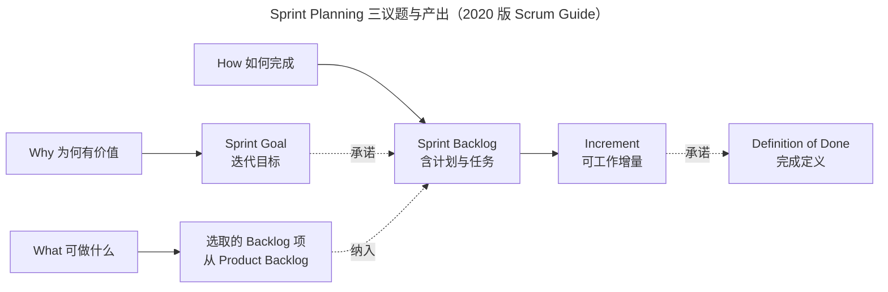
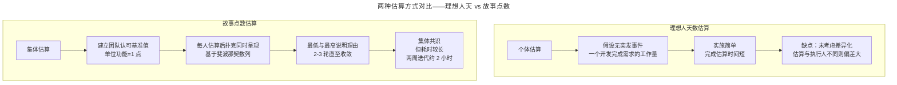

# 计划：如何制定一份好的迭代计划？

> **适用范围**：已完成敏捷启动与自管理团队组建、需要进入"按迭代节奏交付"阶段的 Scrum Master、PO 与产研管理者，特别是对迭代计划会议议程、估算方式选择、团队承诺机制有困惑的实践者。

> **更新摘要（v2 · 2026-08 更新）**：在原版迭代计划会议基础上，对齐 Scrum Guide 2020 版 Sprint Planning 三议题（Why/What/How），引入 Sprint Goal 与 Definition of Done 作为强制性承诺的现代实践，补充 2025 年 SEEAgent 多智能体估算框架与 AI 时代故事点失真问题，并加入中国本土化迭代节奏案例。失效图片已替换为 Mermaid 图与文字表格。

## 一、导言

经常有人问："敏捷核心是拥抱变化，那为什么要做计划？"这是因为敏捷和所有项目管理都一样，需要行动方案指导达成未来目标，计划帮助团队有序推进。但敏捷的计划频度较传统开发更高频、更灵活，称之为迭代计划（Iteration Plan / Sprint Plan）。

在敏捷中，团队要把上一个迭代中用户的反馈加入本次迭代，形成闭环：演进阶段根据待办事项列表选择优先级最高任务→实施阶段完成任务→反馈阶段收集用户体验→优化阶段根据反馈优化。迭代计划帮助团队高效推进。

Scrum Guide 2020 版明确 Sprint Planning 三议题：**为何有价值（Why）、可做什么（What）、如何完成（How）**。本文用一篇文章讲清迭代计划会议的完整议程、两种估算方式的选择、团队承诺的建立，并补全 AI 时代的故事点失真与重校准路径。

## 二、核心方法论

### 2.1 时间盒（Timebox）原则

时间盒是一种管理方法：**在预算时间内对完不成的功能进行删减或延迟，而不是拖延预算的时间**。一个好的迭代计划应该是在时间盒内尽可能排进价值最高的待办事项。

时间盒的核心逻辑：**交付时间固定，范围可变**。就像坐高铁，错过时间只能改签到下一列，发版日期交付不了只能等下个发版周期。这种刚性约束倒逼团队学会"按价值排序、低优先级剔除"的优先级管理能力。

### 2.2 迭代周期的关键考量

制定迭代计划时必须考虑以下方面：

- **确定迭代周期**：通常由团队自行决定，1-4 周之间。迭代周期取决于两个因素：
  - **敏捷成熟度**（团队敏捷实践能力）：成熟度越高周期越短
  - **自动化程度**（CI/CD、自动化测试覆盖率）：自动化越高周期越短
- **确定迭代内关键工作项**：什么时间进行需求评审、什么时间测试
- **固定关键工作项的发生时间**：用表格列出来放在团队都能看到的位置，大家共同遵守
- **培养团队的工作节奏感**：根据表格安排每周固定会议（需求评审会、迭代回顾会、迭代计划会等）
- **设置多个发布节点**：如有紧急需求可在迭代内发布，但一般不超过 2 个，避免节奏被打乱

### 2.3 Scrum Guide 2020 版的 Sprint Planning 三议题

2020 版 Scrum Guide 把 Sprint Planning 议程结构化为三个议题，对应原版的"What 与 How"但更清晰：

| 议题 | 含义 | 关键产出 |
|---|---|---|
| Why（为何有价值） | 这次 Sprint 为何对利益相关方有价值 | Sprint Goal |
| What（可做什么） | 这次 Sprint 可以完成什么 | 选取的 Product Backlog 项 |
| How（如何完成） | 选定的工作如何完成 | Sprint Backlog + 计划 |

上图揭示 2020 版的关键变化：**Sprint Goal 与 Definition of Done 不再可选**，分别作为 Sprint Backlog 与 Increment 的承诺。这意味着迭代计划必须明确"为什么做"和"什么算完成"两个底线，不能只关注"做什么"。

## 三、关键流程

### 3.1 迭代计划会议的五要素

迭代计划会议需要考虑以下要素：

| 要素 | 含义 |
|---|---|
| **会议目的** | 明确即将开展的工作内容，讨论明晰待办事项的相关信息 |
| **会议参与人** | SM 是组织者，PO 和跨职能团队均要参与 |
| **会议议程** | 分 What 与 How 两部分（详见 3.2） |
| **确定迭代目标** | 把此目标放在团队显眼处同步 |
| **输出** | 迭代待办事项列表（Sprint Backlog），即待办事项列表中优先级最高的事项子集 |

### 3.2 会议议程：What 与 How

**第一部分 What（明确做什么）**

需要换位思考，站在用户角度使用产品，设身处地从场景中提炼用户痛点，这个过程也叫作"讲故事"。

PO 会使用 MoSCoW 法则对任务进行基于客户价值的优先级排序：

| 优先级 | 含义 | 处理原则 |
|---|---|---|
| **M**ust | 必须做——系统基础，没有它们无法 work 或无价值 | 必须完成 |
| **S**hould | 应该做——这样系统才可正常使用，没有它们非常难用 | 应该完成 |
| **C**ould | 可以做——产品的附加值、加分亮点项 | 争取完成，变更时优先牺牲 |
| **W**on't | 不要做——这个产品不需要的功能 | 不纳入迭代 |

从待办事项列表中选出既能满足用户痛点、同时优先级较高的用户故事，支持用户场景落地。

**第二部分 How（明确怎么做）**

- **估算工作量**：采用故事点数（Story Points）或理想人天数（Ideal Days）估算
- **分解任务**：遍历所有用户故事，分解为团队成员可执行的任务（前端/后端/联调/测试等），遵循"谁认领谁分解"原则
- **团队承诺**：任务分配到成员后，每次成员承诺保质保量尽可能不延期完成

### 3.3 两种估算方式

**理想人天数估算（Ideal Days）**

- 个体估算方式
- 假设没有任何突发事件的理想情况下，一个开发人员完成该故事所需的工作量
- **优点**：实施简单，完成一轮估算所需时间较短，因每个人熟悉自己工作效率
- **缺点**：没有考虑差异化，像小马过河一样，每个人工作效率不同。一旦估算的成员与执行的成员不是同一个人，执行时的工作量偏差可能很大

**故事点数估算（Story Points）**

- 集体估算方式，敏捷更推荐使用
- 具体操作：
  1. 建立团队共同认可的估算基准值（即团队对同一个需求有一致理解，可以是页面数、数据库增删改查次数、操作步骤等，单位功能基准值为 1）
  2. 对同一个需求每位成员给出评估值，通过估算扑克同时呈现。基于斐波那契数列，故事点数设置为 0、1、2、3、5、8、13、20、40、60
  3. 估算最低和最高的成员说明理由。例如 A 认为点数是 60（涉及很多算法，团队之前没做过），B 认为是 5（知道有第三方算法工具可引用），综合考量后团队评估为 5 个故事点
  4. 对同一个需求进行 2-3 轮估算，通常 5 分钟左右最终确定
  5. 重复 2、3 步直到估算完本次迭代所有需求

**选择建议**：
- 刚接触敏捷的团队：使用理想人天估算
- 运用敏捷一年以上的团队：尝试故事点估算，更容易对需求达成一致

## 四、工具与实战

### 4.1 案例应用：商务酒店 APP 迭代计划

**迭代计划会议目标**：

- 搞清楚为什么要做本次迭代的理由
- 明确本次迭代要完成的内容
- 每个人对彼此的工作内容都很清楚
- 在什么时间点完成什么工作内容自己很清楚
- 团队彼此间认同、达成一致、心照不宣

**讲故事**：假设是用户要订房。出差一族平均报销房费 500 元左右，用户使用 APP 时能得到通过地理位置推荐附近价值合适的酒店列表，可以选择房型并发起预订，可以根据确切的酒店位置找到。

**用户故事**：房型清单、房型详情、下订、填写用户信息、确认房型信息。

**定目标**：第一个迭代目标是让用户能够在线上选订房间，具体包括房间展示、预订、退订。

**故事点数估算结果**：

| 用户故事 | 故事点数 |
|---|---|
| 房型清单 | 3 |
| 房型详情 | 2 |
| 下订 | 3 |
| 填写用户信息 | 1 |
| 确认房型信息 | 1 |

**分解任务**：对每个故事点拆解，分配负责人并让负责人评估自己任务的天数。

**团队承诺**：公开的承诺非常有效，在公开环境中大家会尽最大努力完成承诺。团队承诺可以是：张三、李四、王五、赵一检查自己的任务是合理适度且自力可成的，并在迭代会议上是否能保质保量完成打上分数（满分 5 分）。

### 4.2 工具支撑迭代计划

| 阶段 | 工具支撑 | 2025 年代表能力 |
|---|---|---|
| Backlog 选取 | TAPD Backlog 优先级视图 | 价值排序可视化 |
| 估算协作 | Planning Poker 在线工具 | 异地团队同步估算 |
| 任务分解 | TAPD NPC AI 拆任务 | 一句话拆解子任务 |
| 工时估算 | TAPD AI 工时模型推荐 | 复杂度×基准工时 |
| Sprint Goal 同步 | TAPD 看板墙/飞书文档 | 团队显眼处同步 |
| 团队承诺 | TAPD 任务认领+承诺打分 | 公开承诺+回顾打分 |

### 4.3 TAPD NPC 在迭代计划中的 AI 增强

TAPD 8.0 集成腾讯混元大模型，迭代计划会议可借助 NPC AI 助手：

- **AI 写需求**：PO 描述业务背景，NPC 自动生成用户故事与验收标准
- **AI 拆任务**：把大需求拆为可执行子任务，推荐工时模型
- **AI 写用例**：根据需求文档一键生成测试点
- **AI 写报告**：自动生成迭代评审材料

某游戏团队通过 TAPD AI 报告自动生成，把每周准备迭代评审材料的时间从 4 小时压缩到 20 分钟，让 SM 把精力从"准备材料"转向"促进团队反思"。

### 4.4 中国本土化迭代节奏案例

| 企业 | 迭代周期 | 关键节奏安排 |
|---|---|---|
| 腾讯欢乐斗地主手游 | 1-2 周 | 持续集成 SODA 自动编译/测试/部署 |
| 一汽红旗 | 2 周 | 早 9 点需求冻结规则 |
| 蔚来汽车 | 软件分层解耦后并行迭代 | OS-平台服务-应用三层模型 |
| 科大讯飞智汽 | SAFe ART 同步节奏 | 每周 SoS 会议同步依赖 |
| 福建海峡银行 | 增量交付+合规文档 | 文档与功能同步完成 |

## 五、常见误区

**误区 1：把 Sprint Goal 当 KPI**。Sprint Goal 是 Sprint Backlog 的承诺，给团队迭代焦点，不是 KPI。把它当 KPI 会催生"为达成 Goal 而忽略质量"的副作用。2020 版 Scrum Guide 同时把 Definition of Done 作为强制承诺，正是为了平衡这一点。

**误区 2：忽视 Definition of Done**。2020 版 Scrum Guide 把 DoD 列为 Increment 的强制承诺。如果团队没有明确的 DoD，"完成"的标准模糊，团队成员对"是否完成"理解不一，质量难以保证。

**误区 3：估算方式一刀切**。刚接触敏捷的团队用理想人天估算更简单，运用敏捷一年以上的团队用故事点估算更准确。一刀切会要么增加估算负担、要么失去估算精度。

**误区 4：估算只求数字不求共识**。估算扑克的本质不是求平均，而是让每人发言、达成共识。如果团队估算差距大却不陈述理由，估算就失去意义。

**误区 5：迭代内频繁发布打乱节奏**。如有紧急需求可在迭代内发布，但一般不超过 2 个。迭代内太多次发布，整个节奏就会乱掉，迭代节奏也就没有意义了。

**误区 6：照搬他司迭代周期**。腾讯欢乐斗地主用 1-2 周，一汽红旗用 2 周，蔚来用并行迭代。迭代周期取决于团队敏捷成熟度与自动化程度，没有"标准答案"，要根据自身情况裁剪。

## 六、进阶延展

### 6.1 AI 时代的故事点失真与重校准

GitHub 2023 年调研显示，68% 引入 AI 工具的团队遇到故事点估算失效问题。具体表现：

- **加速不均**：初级开发者用 Copilot 在常规 CRUD 接口上提速 3 倍，高级开发者在不熟悉的复杂集成上可能反而变慢。METR 研究显示经验丰富的开源开发者在真实任务上用 AI 反而慢 19%，但他们自认为快 20%
- **同一人不同任务差异大**：AI 擅长模板化代码，不擅长架构决策。一个开发者可能一个早上做完 3 个 3 点故事，然后花两天做一个 5 点的故事
- **评审瓶颈**：GitHub 数据显示 2025 年下半年月度代码推送超 8200 万次，41% 为 AI 辅助生成，PR 评审等待时间普遍超过 4 天
- **技术债变异**：AI 生成代码复制率高 4 倍、重构少 60%，短期提速但长期维护成本上升

**应对策略——分离"编码工作量"与"交付工作量"**：

| 阶段 | AI 影响 | 估算调整 |
|---|---|---|
| 理解需求 | 极小 | 保留原估算 |
| 写代码 | 高（2-10 倍提速） | 单独估算编码工作量 |
| 代码评审 | 负面（更多代码待评审、质量更低） | 评审工作量上调 |
| 测试 | 中等（AI 可生成测试但需验证） | 验证工作量保留 |
| 集成部署 | 极小 | 保留原估算 |

如果团队估算主要基于编码时间，故事点已严重失真；如果估算基于总交付工作量，则相对准确。建议团队用 2-3 个 Sprint 重新校准参考故事（Reference Stories），重新评估 5-10 个已完成故事，差距会显示校准方向。

### 6.2 SEEAgent：人机协作估算的新范式

2025 年 9 月 arXiv 论文 SEEAgent 提出基于 LLM 的多智能体敏捷估算框架，用"长期记忆+短期记忆+行动通信模块"实现可解释、可讨论的估算：

- 长期记忆：微调 Llama-3.1 或用 GPT-4o-mini 学习项目历史故事
- 短期记忆：存储当前会话聊天记录与同伴估算
- 行动模块：支持聊天解释与提交估算，可扮演前端/后端角色

4907 个用户故事验证表明 SEEAgent 在多数指标上超过 Deep-SE 等 SOTA 模型，83% 从业者认为协作自然。这预示着传统估算扑克可能演化为"人+AI 共同估算"的混合模式——保留团队共识机制，但用 AI 提供数据支撑与解释能力。

### 6.3 给迭代计划制定者的三点建议

第一，**先定 Sprint Goal 再选 Backlog 项**。2020 版 Scrum Guide 把 Sprint Goal 列为 Sprint Backlog 的强制承诺，意味着迭代计划必须先回答"为何有价值"，再决定"做什么"。如果直接从 Backlog 选项开始，容易陷入"无目标堆叠任务"陷阱。

第二，**Definition of Done 必须明确且团队共识**。2020 版 Scrum Guide 把 DoD 列为 Increment 的强制承诺。如果团队对"什么算完成"没有共识，"完成"的标准模糊，质量难以保证。建议团队在迭代计划会议开始前花 10 分钟共审 DoD。

第三，**预留 AI 化估算升级路径**。即便当下不接入 AI 估算，也要在历史数据沉淀、知识库建设、需求结构化上预留升级空间。TAPD 8.0 的 NPC AI 助手已能基于历史数据推荐工时模型（如复杂度高任务=基准工时×1.5），团队在选型时也要评估工具的 AI 化演进路径。

---

下一篇：[08-执行和监控：如何使团队进展“透明化”？（v2）](08-执行和监控：如何使团队进展“透明化”？.md) 将讲解执行与监控阶段的职责边界、每日站会与白板三区结构，让团队进展真正"透明化"。

---