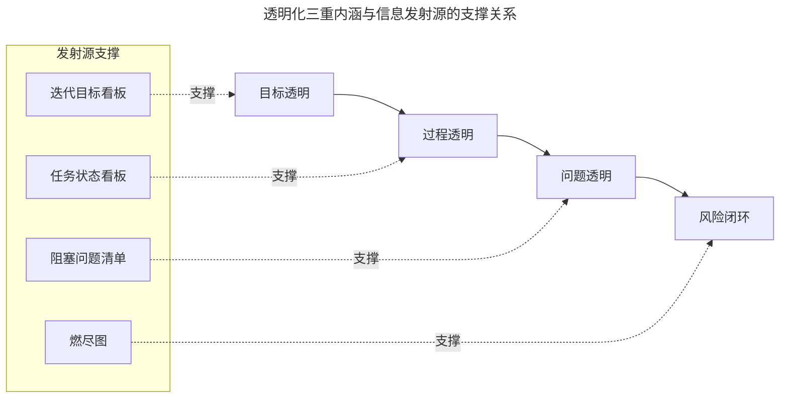
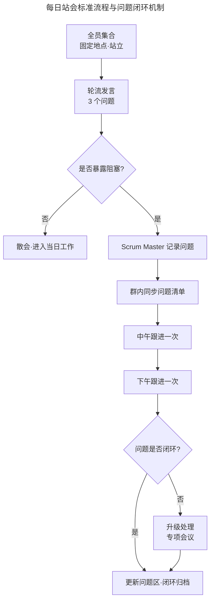

# 执行和监控：如何使团队进展“透明化”？

> **适用范围**：已制定迭代计划（Sprint Plan）并进入执行阶段的敏捷团队，尤其是 10 人以内的跨职能团队（Cross-functional Team）以及分布式协作团队。
> **更新摘要（v2 · 2026-08 更新）**：补充 2025 年 Jira、飞书项目、PingCode 等主流透明化工具的最新看板与燃尽图能力；引入信息发射源（Information Radiator）的工程化定义；增加远程与混合办公场景下的透明化实践；以 Mermaid 图替代失效图片，新增每日站会与白板三区结构的可视化解读。

## 一、导言

透明化（Transparency）是敏捷开发（Agile Development）三大支柱之首，与检视（Inspection）、调整（Adaptation）共同构成经验过程控制（Empirical Process Control）的理论基础。在迭代（Sprint/Iteration）执行阶段，团队进展是否透明，直接决定了风险能否被早发现、协同能否被高效达成、价值能否被持续交付。

透明化并非简单的“信息公开”，而是要求团队所有成员接收的信息保持一致、可追溯、可度量。它帮助团队对目标分解达成共识，降低跨职能协作的协调成本，并使偏离计划的工作能够被及时纠正。本文围绕职责边界、每日站会（Daily Standup）、信息同步工具三个维度，系统阐述执行与监控阶段如何实现团队进展的透明化。

## 二、核心方法论

### 一、透明化的三重内涵

团队进展透明化包含三重内涵：目标透明、过程透明、问题透明。目标透明指迭代目标（Sprint Goal）对所有人可见且理解一致；过程透明指任务状态、依赖关系、完成标准（Definition of Done，DoD）实时可查；问题透明指阻塞项（Blocker）被及时暴露并跟踪闭环。

三重内涵之间形成递进关系：目标不清晰会导致过程失去方向，过程不可见会导致问题被掩盖，而问题被掩盖最终会演化为交付风险。因此透明化的建设必须自上而下贯通，而非仅在工具层面贴几张看板。

### 二、信息发射源理论

信息发射源（Information Radiator）由 Alistair Cockburn 提出，指将关键信息以高可见度的方式展示在团队工作区域内，使任何人无需主动询问即可获取进展。优秀的发射源具备两个特征：一是信息更新频率高于团队查询频率；二是展示形式经过精简，只保留决策所需的关键数据。

上图揭示了透明化三重内涵与四类典型信息发射源的对应关系。值得注意的是，信息发射源既可以是物理形态的白板、便签墙，也可以是数字化形态的看板工具，关键不在于载体，而在于信息是否被高频更新且对决策有效。

### 三、职责边界的清晰化

实现透明化的前提是团队内外成员的职责边界清晰。敏捷团队的三类核心角色 Product Owner（产品负责人）、Scrum Master（敏捷教练）与 Developers（开发团队）拥有明确分工，而团队外部人员（管理层、投资人、客户）则属于干系人（Stakeholder），仅需参考其意见、交付其期望价值，无需让其介入日常执行。

## 三、关键流程

### 一、每日站会的标准化运作

每日站会是执行阶段最核心的透明化仪式。它通过固定节奏的信息同步，使团队进展、阻塞与计划在 15 分钟内完成对齐。

#### 1. 站会发言格式

站会发言格式取决于团队采用的敏捷方式。基于迭代的敏捷（如 Scrum）关注自组织团队的承诺与同步，发言格式为：昨天完成什么？今天计划完成什么？遇到什么阻碍、需要谁帮助？基于流程的敏捷（如 Kanban）关注工作流的协同与瓶颈消除，发言格式为：推进当前工作还需做什么？是否有人在看板之外做事？作为团队下一步需完成什么？工作流是否存在瓶颈或阻碍？

#### 2. 站会运作规则

下表汇总了高效站会的八条运作规则。

| 规则 | 说明 | 工程依据 |
| --- | --- | --- |
| 团队规模不超过 10 人 | 沟通路径为 N×(N-1)/2，人数越多效率越低 | 沟通复杂度理论 |
| 每日固定开展 | 任务粒度拆分至 1 天内，每日产生新进展与新问题 | 小步快跑原则 |
| 时间不超过 15 分钟 | 通常安排在上班 15 分钟后开始 | Scrum Guide 时间盒 |
| 固定地点 | 降低集合协调成本 | 习惯化理论 |
| 站立进行 | 提升注意力与会议效率 | 行为心理学 |
| 不解决问题 | 问题抛出后由 Scrum Master 安排专项会议 | 议题聚焦原则 |
| 相关人员全勤 | 所有项目相关人员均需出席 | 信息完整性 |
| 团队外人员不发言 | 避免外部干扰团队工作流 | 自组织原则 |

上图展示了每日站会从集合、发言到问题闭环的完整链路。问题闭环机制是站会价值兑现的关键，若站会暴露的问题得不到跟进与解决，团队将逐渐失去在站会中暴露真实问题的意愿，透明化将退化为形式主义。

以欢乐斗地主团队为例，该团队共 30 人，按功能拆分为 3 个小团队。每天上午 10 点 15 分在茶水间竖立团队白板，三个小团队先后开会，Scrum Master 携带“地主”小公仔作为发言令牌。所有会议通常 11 点全部结束，但每个小团队实际占用时间仅 15 分钟。对于站会提出的问题，Scrum Master 记录后发到群内，中午与下午各跟进一次直至闭环，必要时召开专项会议解决。这一案例体现了站会运作的两个关键点：一是发言令牌机制确保全员专注与公平发言；二是问题跟进的“双次确认”机制确保问题不遗漏。

### 二、白板的三区结构

白板是信息发射源的经典载体，无论是物理白板还是电子白板，通常包含三个关键区域：状态区、问题区、燃尽图区。

**状态区**用于呈现待办事项的当前进展。基础状态包括未开始、进行中、已完成；IT 研发项目可细分为未开始、开发中、开发完成、测试中、测试完成、发布中、发布完成。状态越细，过程透明度越高，但维护成本也越高，团队需在透明度与维护成本间取得平衡。

**问题区**列出团队当前出现的问题，包含问题描述、负责人、解决时间三个字段。负责人负责跟进并解决问题，完成后从问题区移除。问题区的存在使阻塞项对全员可见，避免问题被私下搁置。

**燃尽图区**以时间为横坐标、工作量为纵坐标，呈现剩余工作量随时间的变化趋势。燃尽图（Burndown Chart）中虚线表示基准值（计划完成趋势），实线表示实际值（实际完成趋势）。实线在虚线之上表示工作延误，在虚线之下表示工作提前。电子白板会自动更新燃尽图，物理白板则需 Scrum Master 每日站会后手工更新。

### 三、迭代版本日历

迭代版本日历将团队的共同节奏可视化，明确哪天开周会、评审会、需求评审。以两周一个迭代为例，纵坐标为角色，横坐标为时间。迭代 N-1 时，产品经理细化 N 的需求与体验，UI 设计师准备 N 的资源，研发人员完成 N-1 的开发。这种并行开发模式要求产品与设计提前一个迭代准备，以提升团队整体产能。

## 四、工具与实战

### 一、主流透明化工具的 2025 年能力对比

2025 年主流敏捷工具在看板可视化、燃尽图自动化、AI 辅助分析等方向持续演进。下表对比三款代表性工具的核心能力。

| 工具 | 看板能力 | 燃尽图能力 | 2025 年新增亮点 |
| --- | --- | --- | --- |
| Jira（Atlassian） | 支持 Scrum/Kanban/Bug 多模板，工作流高度自定义 | 自动生成迭代燃尽图与速率图 | AI 助手自动总结卡片内容、生成进度报告 |
| 飞书项目 | 多维表格空间统一管理，工作流支持公式与按钮触发 | 迭代燃尽图支持实际开始与结束时间对齐 | 多字段默认值、框选图片内容评论、跨行划词创建事项 |
| PingCode | 工作项状态流转支持且/或多条件验证 | 燃尽图记录工作项故事点变更数据 | 完成迭代支持重新打开、数据集接入 Gitee、状态停留时长指标 |

工具选型应遵循“场景优先”原则：跨地域大型团队优先考虑 Jira 的生态集成能力；国内中小企业偏好飞书项目或 PingCode 的本土化适配；需要深度代码数据度量的团队可优先 PingCode 的第三方数据源接入能力。

需要特别关注的是 2025 年工具演进呈现的三大趋势。其一，看板与文档系统的无缝衔接——任务状态变更时相关需求文档与测试用例自动触发版本标记，形成可追溯的闭环，减少跨平台切换导致的信息损耗。其二，AI 辅助决策从实验性走向普及——新一代算法通过融合历史项目数据与实时环境变量，将延期风险识别准确率提升至 92%，并能基于任务依赖关系自动生成风险热力图。其三，全生命周期数据贯通——从需求到代码到部署的数据可追溯，使透明化从“任务状态可见”升级为“价值流动可见”。这三大趋势意味着透明化工具正从“信息展示平台”演进为“智能决策平台”。

### 二、远程协作的透明化实践

远程与混合办公场景下，物理白板的作用被削弱，透明化建设需依赖数字化工具与新的会议规程。基于工程实践经验，以下建议可有效提升远程透明化质量。

第一，议题清晰度与会议连贯性是视频会议成功的关键，需事先协定发言时间与统一通讯平台。第二，规程表述越清楚越好，除非团队已约定俗成，否则避免使用英文缩写或专有名词。第三，避免向团队推送过多信息，发送前仔细斟酌表达内容以消除歧义。第四，关注性格内向的成员，远程沟通为不擅长集体发言者提供了更公平的表达环境。第五，设计远程庆祝与社交机制，如线上红包、远程生日会，增强团队凝聚力。

## 五、常见误区

### 一、将站会开成进度汇报会

站会的本质是团队内部的信息同步与自组织协同，而非向管理者汇报进度。一旦站会异化为汇报会，团队成员将倾向于陈述“看起来好”的内容，隐藏真实问题，透明化彻底失效。判断标志是：站会中是否只有 Scrum Master 或管理者在提问，团队成员是否在被动应答。

### 二、把燃尽图当作考核工具

燃尽图用于团队自我检视与调整，而非用于考核个人或团队绩效。当燃尽图被用于考核时，团队会通过调整故事点估算、拆分任务等方式美化图形，导致数据失真。正确做法是将燃尽图作为团队对话的起点，关注趋势背后的原因而非数字本身。

### 三、物理白板与电子看板双重维护导致信息割裂

部分团队同时维护物理白板与电子看板，导致信息更新不同步、维护成本翻倍。建议根据团队工作模式二选一：同地办公团队可保留物理白板以强化仪式感；远程或混合团队应全面采用电子看板，避免信息在两个载体间割裂。

### 四、追求工具功能全面而忽视使用门槛

工具功能越强大，配置复杂度越高，团队学习成本也越高。若团队成员无法在 10 分钟内完成一个任务的状态更新，工具本身就会成为透明化的阻碍。选型时应优先考虑易用性，再考虑功能完备性。

## 六、进阶延展

### 一、累积流图（CFD）的进阶应用

燃尽图关注单次迭代的进展趋势，而累积流图（Cumulative Flow Diagram，CFD）关注整个价值流的状态分布。CFD 以时间为横坐标、累积工作量为纵坐标，用不同颜色带表示各状态的工作量。当某状态的颜色带变宽，意味着该环节出现瓶颈；颜色带斜率反映交付速率。CFD 是比燃尽图更宏观的透明化工具，适合用于识别系统性瓶颈。

### 二、AI 时代的透明化新趋势

2025 年 DORA 报告显示，90% 的开发者已在工作中使用 AI 工具，AI 生成的代码量与 Pull Request 数量显著上升。这一趋势对透明化提出新挑战：AI 生成代码的可追溯性、Review 负载的可视化、AI 辅助决策的透明度。未来透明化工具需集成 AI 代码来源标记、Review 负载热力图、AI 决策日志等能力，以适应 AI 辅助开发的新范式。

### 三、从团队透明到组织透明

当多个团队同时进行敏捷实践时，单团队的透明化不足以支撑组织级决策。规模化敏捷框架（如 SAFe）通过敏捷发布火车（Agile Release Train，ART）看板、PI（Program Increment）进度仪表盘等机制，将多团队的进展统一呈现。组织级透明化的核心是建立统一的度量口径与可视化语言，使跨团队的依赖、风险、价值流动对管理层同样可见。

组织级透明化还需解决“信息过载”问题——当数十个团队的数据同时呈现时，管理层难以从中识别关键风险。有效做法是建立分层仪表盘：顶层只展示红黄绿三色状态与关键指标，下钻方可查看详细数据。这种“渐进式披露”设计使管理层能够在 5 分钟内判断组织健康度，并在需要时深入分析具体团队。

透明化的最终目标不是让所有人都看到所有信息，而是让正确的人在正确的时间看到决策所需的信息。这是从工具实践迈向工程方法论的关键一步。

---

下一篇：[09-收尾：如何开展展示与回顾会？（v2）](09-收尾：如何开展展示与回顾会？.md) 将讲解迭代收尾阶段展示会的价值验收流程与回顾会的定量定性双轨结构。