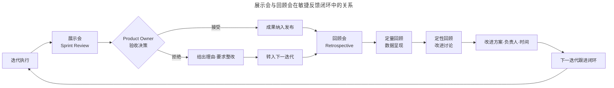
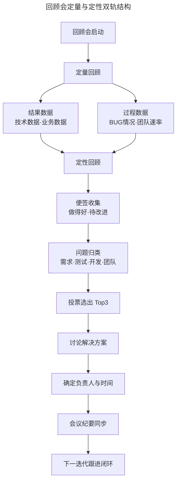

# 收尾：如何开展展示与回顾会？

> **适用范围**：迭代（Sprint/Iteration）接近尾声、需要验收成果并启动持续改进的敏捷团队，尤其是采用 Scrum 框架的跨职能团队。
> **更新摘要（v2 · 2026-08 更新）**：补充 Start-Stop-Continue、ORID、Mad-Sad-Glad、5 Whys 等 2025 年主流回顾会框架；引入心理安全感（Psychological Safety）与无 blame 复盘（Blameless Postmortem）理论；以 Mermaid 图替代失效图片，新增展示会流程与回顾会定量定性双轨结构可视化；更新回顾会工具与远程实践。

## 一、导言

迭代收尾阶段包含两个关键仪式：展示会（Sprint Review，又称迭代评审）与回顾会（Retrospective）。展示会面向价值验收，回答“本轮迭代交付了什么、是否被接受”；回顾会面向过程改进，回答“团队如何工作得更加有效”。二者共同构成敏捷的反馈闭环（Feedback Loop），是团队能否持续进化的决定性环节。

《敏捷宣言》第十二条原则指出：“团队要定期反省如何能够做到更加有效，并相应地调整团队的行为。”回顾会并非责备会议，而是从过往工作中学习经验、推动团队持续改进的机制。本文系统阐述展示会与回顾会的开展方法，并引入 2025 年主流的回顾会框架与最佳实践。

## 二、核心方法论

### 一、展示会的价值验收逻辑

展示会的核心目的是在成果发布前提前验收，帮助团队尽早知道成果是否能被接受，并及时发现与解决问题。其价值体现在三个方面：一是防止团队产生方向性错误，避免在错误路径上持续投入；二是通过短期成果产出保持产品开发目标的清晰与一致；三是让客户与管理层对产品建立信心。

展示会的本质是 Product Owner 对本轮迭代成果做出“接受或拒绝”的决策。这一决策并非简单的功能验收，而是基于用户场景的价值判断——功能是否真正解决了用户问题、是否值得发布。

### 二、回顾会的持续改进逻辑

回顾会遵循“检视—调整”的循环：团队检视过去一段时间的工作过程，识别改进点，制定改进方案，并在下一迭代中验证效果。回顾会分为定量回顾与定性回顾两部分。定量回顾通过数据呈现团队已达到的成果，增强团队信心与凝聚力；定性回顾通过结构化讨论找出过程改进点，推动团队自组织地解决问题。

上图揭示了展示会与回顾会的衔接关系。展示会解决“做什么”的验收问题，回顾会解决“怎么做”的改进问题，二者共同形成“执行—验收—改进—再执行”的螺旋上升循环。值得强调的是，回顾会的改进方案必须明确负责人与解决时间，否则改进将停留在讨论层面而无法落地。

## 三、关键流程

### 一、展示会的开展流程

展示会的开展分为会前准备、会中执行、会后衔接三个阶段。

**会前准备阶段**，Scrum Master 需邀请相关人员参与。核心参会人员包括开发人员、测试人员与 Product Owner；若条件允许，建议邀请管理层与客户参与，以增强其对产品的信心。若邀请重要角色，团队必须提前完成内部验收与测试，避免现场“翻车”。Scrum Master 还需搭建评审环境，包括产品运行环境、会议室、投影与白板等工具。

**会中执行阶段**，Scrum Master 负责宣读展示会议流程并维持流程正常进行。开发人员从用户场景角度演示本次迭代的产出结果，其他参会人员可就演示问题发表看法，开发人员有义务回答提问直到无疑问为止。测试人员需评估本次展示的质量。完成答疑后，Product Owner 做出接受或拒绝验收的决策；若拒绝，需给出理由并要求团队整改。随后 Product Owner 带领团队探讨下一轮迭代的内容，使团队对下一迭代形成初步预期。

**会后衔接阶段**，展示会的结论需同步至需求池与发布计划，被拒绝的功能进入下一迭代的待办列表，被接受的功能进入发布流程。

展示会的开展需注意三点：会议时间一般不超过 2 小时；演讲环节需相关人员提前准备内容；Scrum Master 需准备 Plan B 以应对演示环境设备故障等突发情况。

### 二、回顾会的开展流程

回顾会分为定量回顾与定性回顾两部分，需先开展定量分析，再开展定性分析。

#### 1. 定量回顾

定量回顾需展示结果数据与过程数据两类。

**结果数据**用于呈现团队已达到的成果。技术数据包括系统月平均稳定率（非故障时间除以系统运行总时长）与平均故障恢复时间（系统发生故障后平均恢复时长），反映技术团队的实力。过程数据包括 BUG 情况与团队速率（Velocity）：BUG 情况含平均每千行代码 BUG 率与 BUG 平均响应周期（从提出 BUG 到 BUG 被解决的时间）；团队速率指一个迭代所有待办事项的故事点（Story Point）之和。

以团队速率的工程意义为例：本轮迭代计划新增微信支付、支付宝支付、银行卡支付、京东白条支付四种支付方式，计划团队速率为 18 个故事点，其中京东白条支付为 2 个故事点。若迭代中发现京东白条支付无法按预期实现并推迟至下一迭代，则实际团队速率为 16 个故事点。若团队效率无显著提升，下一迭代可完成的故事点数之和不应超过 16，否则存在交付风险。

**业务数据**用于呈现团队在业务侧的经营成果。收入数据包括渗透率（付费人数占比）、人均消费金额、各付费类型占比；活跃数据包括日活跃数（用户登录并使用超过 3 分钟算一次活跃）、周活跃数、月活跃数；留存数据包括次日留存、7 日留存、30 日留存。

#### 2. 定性回顾

定性回顾的目标是找出团队过程中的改进点。经典流程如下：Scrum Master 给团队成员发放便签条；每位成员在 10 分钟内至少写两张，分别写“做得好的”与“有待改进的”，每张纸只写一条以便组合分析；Scrum Master 收集纸条，将做得好的贴于左侧墙上、有待改进的贴于右侧墙上；先点评做得好的部分以增强团队信心；针对有待改进的纸条，让填写人说明后按问题类型归类（需求问题、测试问题、开发问题、团队问题等）；引导团队投票选出 Top3 问题；针对 Top3 问题共同讨论解决方案，确定方案负责人与解决时间；将方案、负责人、解决时间作为会议纪要同步给相关人员，并在后续迭代中跟进直至问题闭环。

### 三、2025 年主流回顾会框架

下表对比 2025 年广泛使用的五种回顾会框架。

| 框架 | 核心结构 | 适用场景 | 优势 |
| --- | --- | --- | --- |
| Start-Stop-Continue | 三栏：开始做什么、停止做什么、继续做什么 | 新团队或寻求快速决策的团队 | 简单直接，产出可执行 |
| ORID | 客观事实（Objective）、感受反应（Reflective）、解释意义（Interpretive）、决定行动（Decisional） | 情绪复杂或争议较大的迭代 | 结构化深度对话 |
| Mad-Sad-Glad | 三栏：什么让人愤怒、什么让人难过、什么让人高兴 | 情感负荷较重的迭代 | 释放情绪、建立共情 |
| 5 Whys | 连续追问五次“为什么” | 根因分析、故障复盘 | 深挖根本原因 |
| Starfish | 五栏：多做、少做、停止、开始、继续 | 成熟团队持续优化 | 维度更细致 |

框架选型应遵循“匹配情境”原则。新团队或寻求快速决策的团队适用 Start-Stop-Continue，其三栏结构简单直接、产出可执行；情绪负荷较重的迭代（如经历重大故障或冲突）适用 Mad-Sad-Glad，先释放情绪再讨论改进；需要根因分析的场景（如 BUG 率异常上升）适用 5 Whys，通过连续追问深挖根本原因；成熟团队希望进行更细致的持续优化可选用 Starfish，其五栏结构覆盖了“多做、少做、停止、开始、继续”五个维度。值得强调的是，框架本身不产生改进，改进来自于框架引导下的深度对话与后续行动。Scrum Master 应避免“框架疲劳”——每次回顾会都换一个新框架反而会分散团队注意力，建议在同一时期固定使用一种框架，待团队熟练后再尝试切换。

上图展示了回顾会从定量到定性的完整双轨结构。定量回顾提供数据基线，定性回顾挖掘数据背后的原因，二者结合才能形成既有数据支撑又有行动方案的有效改进。值得注意的是，改进方案的数量不宜过多，每次迭代聚焦 Top3 问题并完成闭环，远优于一次提出十几个改进点却无法落地。

## 四、工具与实战

### 一、回顾会工具选型

物理白板与便签适用于同地办公团队，能够强化仪式感与互动性。远程或混合团队可采用 Miro、Mural 等数字白板工具，这些工具支持匿名便签、分组归类、点投票等功能，能够有效还原物理回顾会的体验。部分敏捷管理工具（如飞书项目、PingCode）已内置回顾会模板，支持行动项直接关联到下一迭代的待办列表，实现改进闭环的可追溯。

### 二、无 blame 复盘的工程实践

针对外网故障等严重事件，回顾会应采用无 blame 复盘（Blameless Postmortem）方法。该方法源于 Google SRE 实践，核心原则是：假设所有参与者在当时拥有的信息与资源下都做出了最佳决策，复盘的目标是理解系统而非追究个人。无 blame 复盘要求关注流程、工具、自动化层面的改进，而非“谁犯了错”。

### 三、心理安全感的建设

心理安全感（Psychological Safety）是回顾会有效性的基础。Google 的团队有效性研究发现，心理安全感是高效团队的首要特征。在回顾会中，Scrum Master 需主动营造安全氛围：鼓励安静成员发言、制止指责性言论、对暴露问题的成员给予肯定。匿名便签与匿名投票机制能够有效降低成员暴露真实问题的心理成本。

## 五、常见误区

### 一、展示会开成功能演示会

展示会的核心是 Product Owner 的价值验收决策，而非功能演示。若展示会仅展示“做了什么功能”而不讨论“是否解决了用户问题、是否值得发布”，则失去了价值验收的意义。判断标志是：展示会结束时是否有明确的“接受或拒绝”决策，以及下一迭代的内容是否被讨论。

### 二、回顾会开成抱怨会

回顾会若缺乏结构化框架与引导，容易退化为情绪化的抱怨会。表现是：讨论集中在“谁的错”而非“怎么改”，改进点零散且无负责人。应对方法是采用 Start-Stop-Continue 或 ORID 等结构化框架，并强制为每个改进点指定负责人与解决时间。

### 三、改进方案不闭环

回顾会最常见的失效模式是：会议热闹讨论、产出大量改进点，但会后无人跟进、下一迭代无人验证。这会导致团队逐渐对回顾会失去信任。Scrum Master 必须在下一迭代开始时回顾上一迭代的改进项执行情况，形成“提出—执行—验证”的完整闭环。

### 四、定量数据与定性讨论脱节

部分团队在回顾会中展示了大量定量数据，但未将数据与定性讨论关联；或进行了热烈的定性讨论，却缺乏数据支撑。正确做法是：用定量数据定位问题（如 BUG 率上升、速率下降），再用定性讨论挖掘原因并制定改进方案。

## 六、进阶延展

### 一、回顾会的节奏与时机

回顾会并非只在迭代结束时召开。以下时机均适合召开回顾会：团队完成一个发布或加入新功能时；团队意识到协作出现问题或效率下滑时；团队达到任何里程碑时；出现外网故障需要复盘时。针对不同时机，回顾会的深度与范围应有所差异——日常迭代回顾聚焦流程改进，故障复盘聚焦根因分析，里程碑回顾聚焦战略对齐。

### 二、团队速率的工程化应用

团队速率是回顾会中最具工程价值的数据之一。它不仅用于回顾，还用于下一迭代的容量规划（Capacity Planning）。通过对比多个迭代的速率趋势，团队可判断单位产能是否提升、估算是否准确、是否存在外部干扰。但需注意，团队速率仅适用于团队内部的纵向比较，不可用于跨团队横向比较，因为不同团队的故事点估算口径不同。

### 三、从回顾到学习型组织

回顾会的终极目标是推动团队向学习型组织（Learning Organization）演进。Peter Senge 在《第五项修炼》中提出的学习型组织五项修炼——自我超越、改善心智模式、建立共同愿景、团队学习、系统思考——与回顾会的理念高度契合。当回顾会的成果能够沉淀为团队知识库、指导新成员快速融入、影响组织级流程优化时，回顾会便从一种仪式升级为组织学习的核心机制。

持续改进的本质不是追求完美，而是建立一种能够持续发现并修正问题的能力。这是敏捷团队在不确定环境中保持竞争力的根本所在。

---

下一篇：[10-度量：如何度量敏捷团队的绩效？（v2）](10-度量：如何度量敏捷团队的绩效？.md) 将从速度、质量、价值三个维度展开敏捷绩效度量，并引入 DORA 与 SPACE 指标体系。