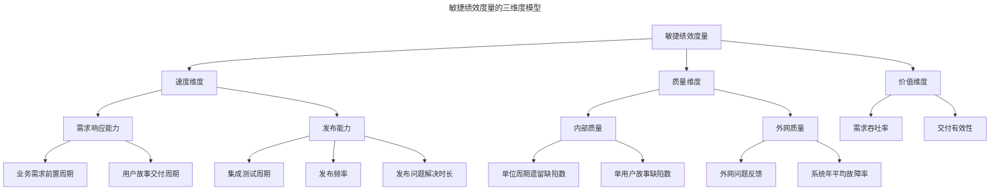
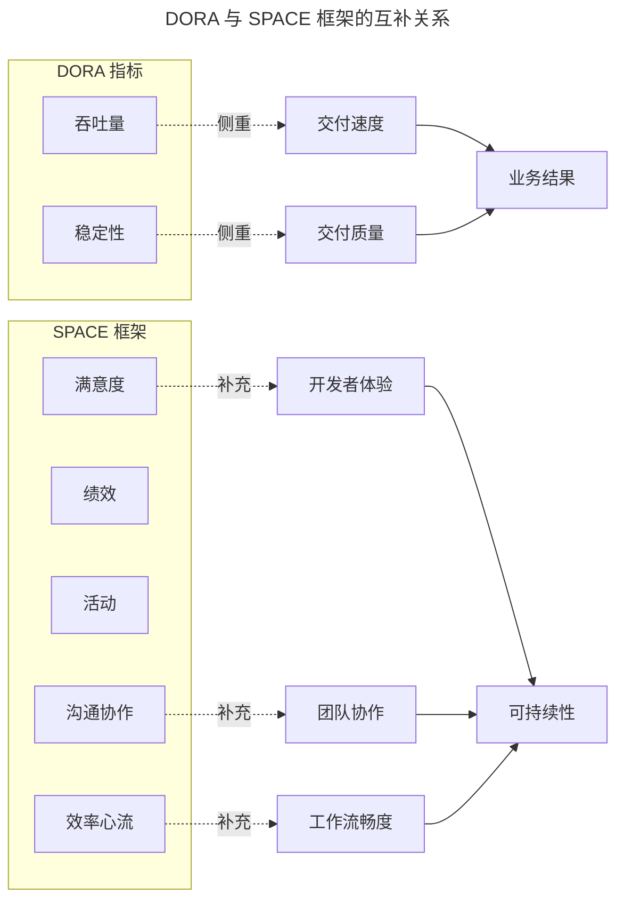

# 度量：如何度量敏捷团队的绩效？

> **适用范围**：已完成至少 2-3 个迭代、需要客观评估效率与价值的敏捷团队，尤其是希望以数据驱动持续改进的产研组织。
> **更新摘要（v2 · 2026-08 更新）**：引入 DORA 指标（2024 年新增第五项 Deployment Rework Rate）、SPACE 框架（Satisfaction/Performance/Activity/Communication/Efficiency）、FLOW 指标等 2024-2025 业界主流度量体系；以 Mermaid 图替代失效图片，新增三维度量模型与 DORA-SPACE 对照可视化；更新绩效管理误区与 AI 时代度量新挑战。

## 一、导言

敏捷转型成功与否，最终体现在效率与价值上，而效率与价值需要被客观度量。绩效度量（Performance Measurement）是组织对团队执行力的客观评价方法，它反映组织的执行力与工作效率，为团队持续改进提供数据支撑。

度量是敏捷的“镜子”：没有度量，团队无法知道改进是否有效；度量失真，团队会被错误的目标牵引。本文从速度、质量、价值三个维度阐述敏捷绩效度量的方法论，并引入 2024-2025 年业界主流的 DORA、SPACE、FLOW 指标体系，帮助团队建立科学的度量框架。

## 二、核心方法论

### 一、三维度量模型

敏捷团队的绩效度量可从速度、质量、价值三个维度展开。速度衡量团队的快速执行能力，质量衡量团队打造优质产品的能力，价值衡量团队是否掌握敏捷的核心——价值驱动。三维度量形成互补关系：速度忽视质量会导向“快而无用”，质量忽视速度会陷入“完美而迟缓”，速度与质量忽视价值则会导致“高效地做错误的事”。

上图呈现了三维度量的完整分解结构。三个维度并非孤立指标，而是相互制衡的系统：提升发布频率可能影响质量，追求零缺陷可能拖慢速度，强调直接价值可能忽视间接价值。度量设计的关键在于在三个维度间建立平衡，避免单一维度被过度优化。

### 二、速度维度

速度维度包括需求响应能力与发布能力。需求响应能力体现在业务需求前置周期（Product Owner 负责，指用户需求从被提出到排期的时间）与用户故事交付周期（Scrum Master 负责，指用户故事从排期到发布的时间），二者越短则需求响应能力越强。

发布能力主要体现在集成测试周期（从开发转测试到集成测试完成的时间）、发布频率（两次发布的间隔）、解决发布问题的平均时长（产品发布后从出现外网问题到每个被解决问题的平均时长）三个指标。计算公式如下：

- 集成测试时间 = 测试完成时间 − 转测时间
- 发布频率 = 本轮迭代发布时间 − 上轮迭代发布时间
- 解决发布问题的时长 = 问题解决时间 − 问题发现时间

### 三、质量维度

质量分为内部质量与外网质量。内部质量指产品在测试过程（单元测试、集成测试、上线前测试、线上测试）中产生的质量，体现在单位周期遗留缺陷数与单个用户故事缺陷数。缺陷按严重程度分为致命缺陷、严重缺陷、一般缺陷、轻微缺陷、建议缺陷，权重分别为 5、4、3、2、1，加权统计后缺陷数量越低则内部质量越好。

外网质量指产品发布后在外网呈现的质量，涉及外网问题反馈与系统年平均故障率。外网问题反馈难以量化（一个用户可能用多账号在多渠道反馈同一问题），因此一般度量系统年平均故障率（一年故障时间之和除以一年系统服务总时长），数值越低则系统越稳定。

### 四、价值维度

价值维度用需求吞吐率与交付有效性度量。吞吐率指单位时间内交付的业务需求数，例如一个迭代内团队交付了多少业务需求。交付有效性衡量业务需求的价值：直接价值可量化（收入提升、用户增长、活跃率提升），间接价值难以量化（用户体验提升）。团队在进行纵向绩效度量时更适合使用价值维度。

## 三、关键流程

### 一、引入 DORA 指标体系

DORA 指标由 Google 的 DevOps Research and Assessment 团队提出，是衡量软件交付绩效的业界标准。2024 年 DORA 新增第五项指标，形成“吞吐量（Throughput）—稳定性（Stability）”双因子五指标体系。

| 指标 | 类别 | 定义 | 工程意义 |
| --- | --- | --- | --- |
| 部署频率（Deployment Frequency） | 吞吐量 | 单位时间内成功部署到生产的次数 | 反映交付速度与发布信心 |
| 变更前置时间（Lead Time for Changes） | 吞吐量 | 从代码提交到成功部署生产的时间 | 反映价值流动效率 |
| 失败部署恢复时间（Failed Deployment Recovery Time） | 吞吐量 | 从部署失败到服务恢复的时间 | 反映应急响应能力 |
| 变更失败率（Change Failure Rate） | 稳定性 | 导致生产故障的部署占比 | 反映交付质量 |
| 部署返工率（Deployment Rework Rate） | 稳定性 | 非计划或由生产事件驱动的部署占比 | 2024 新增，反映返工负担 |

DORA 将团队分为低、中、高、精英（Elite）四个等级。精英团队的部署频率达每日多次，变更前置时间小于 1 小时，变更失败率低于 15%，恢复时间小于 1 小时。2025 年 DORA 报告进一步将团队细分为七种原型，更细致地刻画团队成熟度。

### 二、引入 SPACE 框架

SPACE 框架由 GitHub、Microsoft Research 与维多利亚大学的研究者于 2021 年提出，旨在弥补传统度量仅关注产出而忽视开发者体验的局限。SPACE 是五个维度的缩写：

- **Satisfaction and Well-being**（满意度与幸福感）：开发者对工作、工具、团队的满意度，是生产力的领先指标。
- **Performance**（绩效）：从产出转向结果，关注代码是否创造可度量的业务价值。
- **Activity**（活动）：可计数的工程动作，如提交、PR Review、部署次数，作为上下文而非目标。
- **Communication and Collaboration**（沟通与协作）：知识流动的质量与速度。
- **Efficiency and Flow**（效率与心流）：工作从构思到完成的顺畅程度，包含心流状态与系统级信号。

上图揭示了 DORA 与 SPACE 的互补关系。DORA 侧重交付速度与质量，回答“团队交付得快不快、稳不稳”；SPACE 侧重开发者体验与协作，回答“团队能否持续交付、是否健康”。单独使用 DORA 容易导致团队追求速度而透支开发者；单独使用 SPACE 则缺乏对交付结果的硬性约束。二者结合才能形成既关注结果又关注可持续性的完整度量体系。

### 三、FLOW 指标的补充

FLOW 指标关注价值在工作流中的流动效率，包含七个核心指标：FLOW 速度（单位时间完成的工作项数）、FLOW 时间（工作项从进入到完成的总时间）、FLOW 效率（工作时间占总时间的比例）、FLOW 分配（各类型工作的占比）、FLOW 分布（各阶段在制品数量）、FLOW 预测（基于历史数据预测交付时间）、FLOW 负载（团队当前负载与能力的比值）。FLOW 指标特别适合识别价值流中的等待与浪费。

FLOW 效率是其中最具工程诊断价值的指标。它等于“实际工作时间”除以“总周期时间”，揭示了工作项在流程中“等待”与“处理”的时间占比。若一个用户故事的总周期时间为 10 天，但实际开发与测试时间仅 3 天，则 FLOW 效率为 30%，意味着 70% 的时间消耗在等待（等待评审、等待部署、等待反馈）。提升 FLOW 效率的方向不是让开发者工作更快，而是减少等待——通过限制在制品（WIP）、消除依赖瓶颈、自动化流转来实现。这与 Kanban 的 WIP 限制原则高度一致。

## 四、工具与实战

### 一、度量工具的集成

主流敏捷工具已深度集成 DORA 与 FLOW 指标能力。Jira 通过与 CI/CD 工具链集成，自动采集部署频率、变更前置时间等 DORA 指标。PingCode 在 2025 年新增“状态停留时长”指标，可统计工作项在不同状态下的停留时间，直接支撑 FLOW 效率的计算。飞书项目通过多维表格的工时与状态数据，支持自定义度量仪表盘。

度量工具的选型应遵循“自动化优先”原则：优先选择能够从代码仓库、CI/CD 流水线、项目管理工具自动采集数据的方案，避免人工填报导致的数据失真。

### 二、度量仪表盘的设计

度量仪表盘应遵循“三层视图”设计：执行层视图供团队查看迭代内的速率、燃尽图、阻塞项；管理层视图供 Scrum Master 与 Product Owner 查看跨迭代的趋势与瓶颈；决策层视图供管理层查看组织级的 DORA 等级、SPACE 满意度、价值交付占比。三层视图共享同一数据源，确保信息一致性。

## 五、常见误区

### 一、将绩效度量等同于绩效管理

绩效度量只是绩效管理的一个环节。绩效管理是各级管理者共同参与的过程，包含绩效计划、绩效实施、绩效度量、绩效改进四个环节。将绩效度量等同于绩效管理，会导致团队只关注“被度量什么”而忽视“为什么度量”。

### 二、度量结果仅用于发奖金与调薪

若度量结果仅用于薪酬分配，员工会按照考核标准展示“想被看到”的行为。例如，若考核千行代码 BUG 率，员工可能将十几行代码的任务写成几十行以稀释 BUG 率，或让测试人员私下提出 BUG 而不录入系统。绩效管理更重要的意义是让员工的努力朝向组织战略目标，使每位员工知道成长方向。

### 三、过分追求全面的度量指标

度量指标并非越多越好。过多指标会带来两个问题：一是数据收集工作量大幅提升；二是团队成员无法兼顾所有指标，可能舍弃实现难度大的关键指标。应聚焦于少量关键绩效指标（Key Performance Indicator，KPI）进行考核，实现对关键指标的有效考核。

### 四、用统一标准横向比较不同团队

团队是复杂系统，业务类型、成员能力、磨合时间均不同，无法用统一标准横向比较。应多做纵向比较，即团队与过去的自身比较，关注引入新方法后的提升幅度，这才是管理层与团队共同的目标。横向比较还会诱发“指标竞赛”——团队为在比较中胜出而优化被度量指标，忽视未被度量但同样重要的维度，最终损害组织整体利益。

## 六、进阶延展

### 一、AI 时代的度量新挑战

2025 年 DORA 报告显示，90% 的开发者已使用 AI 工具，AI 与吞吐量呈正相关，但与交付稳定性仍呈负相关。Faros AI 研究发现，AI 采用伴随 PR Review 时间上升 91%、每人 BUG 率上升 9%。这意味着传统度量指标（如提交数、PR 数）已无法真实反映生产力——AI 生成的代码量上升不等于团队产出上升。

在 AI 时代，度量需新增三类指标：AI 代码来源标记与可追溯性、Review 负载与质量指标、开发者对 AI 输出的信任度。SPACE 框架的 Satisfaction 维度在 AI 时代尤为重要——开发者与 AI 生成的代码互动时，常报告“所有权与工匠满足感的隐性流失”，这种流失不会出现在提交数中，却会侵蚀团队的长期生产力。

### 二、从度量到改进的闭环

度量的最终目标是改进，而非考核。一个成熟的度量体系应包含“度量—分析—改进—再度量”的闭环：度量发现问题、分析定位根因、改进设计方案、再度量验证效果。若度量结果未触发任何改进行动，则度量本身已沦为形式。

### 三、度量伦理与反博弈

度量系统天然会被博弈——任何被度量的对象都会被优化。应对博弈的方法不是增加度量指标，而是建立度量伦理：明确度量的目的是改进而非惩罚；定期审视度量指标是否仍在度量真正重要的事物；允许团队质疑并调整度量口径。健康的度量文化是“数据服务于团队”，而非“团队服务于数据”。

度量是一把双刃剑：用得好，它能照亮改进方向；用得不好，它会扭曲团队行为。掌握度量的艺术，是敏捷管理者从实践者走向工程领导者的关键一步。

---

下一篇：[11-落地：如何从 0 到 1 导入敏捷？（v2）](11-落地：如何从%200%20到%201%20导入敏捷？.md) 将讲解从转型驱动因素识别、试点项目选择到教练培养与组织推广的从 0 到 1 导入路径。