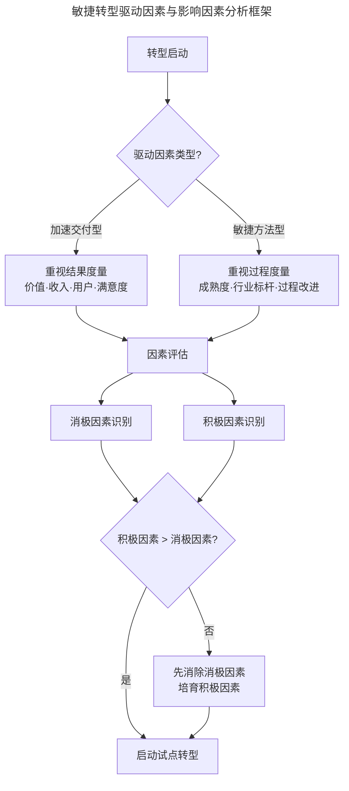
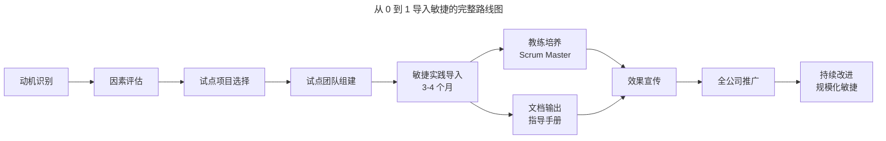

# 落地：如何从 0 到 1 导入敏捷？

> **适用范围**：计划启动敏捷转型但尚未确定路径的组织，尤其是 100 人以上、需要通过试点验证敏捷价值的中大型企业。
> **更新摘要（v2 · 2026-08 更新）**：补充 SAFe（Scaled Agile Framework）6.0、LeSS（Large Scale Scrum）等大规模敏捷框架 2025 年现状与采用率数据；引入转型驱动因素分析与积极/消极因素评估框架；以 Mermaid 图替代失效图片，新增转型路线图与试点项目选择决策可视化；更新敏捷教练培养与组织级推广策略。

## 一、导言

敏捷不是一蹴而就的方法，而是需要系统规划、逐步导入的转型过程。从前期的动机识别、可行性评估，到中期的试点选择、教练培养，再到后期的组织推广、文化沉淀，每一步都决定了转型的成败。据 BCG 2024 年调研，94% 的企业已启动敏捷倡议，但仅约一半真正实现了预期收益；Gartner 数据显示，超过 60% 的大型团队在规模化敏捷落地第一年未达预期效能。这一落差的核心原因在于导入路径的不当设计。

本文从转型驱动因素、影响因素评估、试点项目选择、教练培养与组织推广五个环节，系统阐述如何从 0 到 1 导入敏捷，并引入 SAFe、LeSS 等大规模敏捷框架的 2025 年现状作为进阶参考。

## 二、核心方法论

### 一、转型驱动因素的识别

企业导入敏捷的动机被称为转型管理驱动因素，主要分为两类。

第一类是与加速交付相关的转型。企业从小团队成长至千人规模后，原有工作方式愈发不合适，组织效率下降，管理者希望通过敏捷提高交付效率。这类转型多发生在互联网与传统软件行业，一般以业绩成果度量敏捷导入的产出——价值交付是否优化、收入与用户是否增长、满意度是否提升。

第二类是与敏捷方法相关的转型。敏捷在中国推广近二十年，许多公司（如腾讯）已导入敏捷并取得成效，引起其他大型企业关注。这类转型通常以改变协作方式为切入口，希望敏捷帮助团队与各部门、供应商更频繁地交流协作。企业重视敏捷过程的度量，如某些环节效率是否提升、与行业标杆的差距。这类转型多见于银行业。

针对不同动机应采用不同转型方式：加速交付型需重视结果度量；敏捷方法型需对企业成熟度进行度量，树立行业标杆，辅导团队做过程改进。

### 二、积极因素与消极因素评估

在确定转型动机后，需识别影响转型的积极因素与消极因素，据此判断转型困难程度。

**消极因素**主要包括：工作被分解为部门孤岛，创造出阻碍加速交付的依赖关系而非构建跨职能团队；短期交付型项目不适合敏捷（如甲方需求明确、变更以补充合同说明、交付时间写进合同的项目）；团队优化依据是部分效率而非端到端项目交付流；员工属于特定领域人才、缺乏技能多元化激励，不重视培养 T 型专家人才（T-shaped Professional，在某一领域具有专长同时能在多个领域有经验与见解的人）；员工被分散到过多项目而无法专注于单个项目，打破稳定团队结构。

**积极因素**主要包括：管理层具有强烈转型意愿（任何转型都是自上而下）；员工认知与改变意愿强（认可敏捷能解决当前问题并愿意改变工作方式）；组建跨职能团队（如腾讯按项目为单位组织产品、开发、测试、运营，共同背负业绩 KPI）；专注于短期目标而非长期目标（敏捷团队需不断试错以获得短期利益）；人才管理成熟度高（团队具备自我管理能力与自动化能力，如自动化测试、构建、部署）。

若积极因素大于消极因素，转型成功率较高；反之则较低。转型前应尽可能识别这些因素，避免消极因素、发展积极因素。

上图展示了从转型启动到因素评估的决策流程。值得强调的是，因素评估不是一次性活动，而应贯穿转型全过程——试点启动后，消极因素可能因组织阻力而新增，积极因素也可能因早期挫折而衰减，需持续监测与调整。

## 三、关键流程

### 一、试点项目的选择

试点项目的选择需从重要性、周期、规模、业务支持、团队能力五个维度综合考量。

**项目重要性**方面，应避免选择太不重要或太关键的项目。不重要项目的效果不为人知，无法形成有说服力的转型案例；最关键的项目在转型初期效率降低时会对士气造成冲击，甚至影响后期推广。建议选择次重要的项目，影响较好且风险可控。

**项目周期**方面，持续时间太短会让人误以为敏捷只适用于短小项目，太长则面临项目结束才能宣告成功的风险。建议选择持续时间为企业内项目通常持续时间一半左右的项目，约三四个月，足以让团队在 Sprint 中体会敏捷价值，又能证明敏捷适用于更长周期项目。

**项目规模**方面，建议选择只有一个团队的项目作为开始，并让团队成员坐在一起。原因有三：节省多团队间沟通成本；敏捷教练在第一个试点团队需集中精力处理大量问题；一个团队的结果更易量化，便于转型效果展示。

**业务方或客户支持**方面，敏捷转型不仅是产研团队的事，业务团队或客户也需一起改变。拥有来自业务方与团队一起工作的人很关键，尤其在推动改变不易改变的业务流程时，业务负责人的积极投入不可或缺。得到预期结果后，业务负责人是最适合宣扬成功的人选——他会跟其他人谈论“最近尝试敏捷转型的某项目比过去项目交付得更多一些”，这种来自业务方的口碑比任何内部宣传都更具说服力，也可能促使其他业务负责人要求其团队尝试敏捷。

**团队能力与意愿**方面，组建最初团队需关注融合度、建设性辩论、学习与适应意愿、技术能力、沟通能力。最需考虑的是个人尝试用新事物解决现有问题的主观意愿，最理想状态是所有人都有意识与渴望转型敏捷。

### 二、试点转型的执行与教练培养

在三四个月的试点周期内，团队需完成敏捷实践导入并培养输出能力。需培养至少一位 Scrum Master，该角色需具备专业敏捷教练能力，并能结合公司实际情况落地适合的敏捷实践。同时需输出“公司 Scrum Master 指导手册”，便于指导后续 Scrum Master 进行敏捷转型，使转型经验可复制、可传承。

上图呈现了从动机识别到全公司推广的完整路线图。试点阶段需并行推进实践导入、教练培养与文档输出三条线，三者共同构成可复制转型的“能力包”。效果宣传是关键环节——只有不断让他人知道敏捷给团队带来的切实好处，才能激发其他团队的转型意愿。若有 PMO（Project Management Office）团队，宣传职责由其承担；若有 HRBP（HR Business Partner），则由其负责；若两者皆无，则从试点团队选出至少一人负责。

## 四、工具与实战

### 一、大规模敏捷框架的 2025 年现状

当试点成功并进入全公司推广阶段，团队规模超过单团队容量时，需引入大规模敏捷框架。2025 年主流框架的采用率与适用场景如下表。

| 框架 | 采用率 | 核心特征 | 适用场景 |
| --- | --- | --- | --- |
| SAFe 6.0 | 约 22%-42%（500 人以上企业） | 规范化、多层次（团队/程序/投资组合/大型方案）、PI 规划、ART | 大型企业、强治理需求、跨团队依赖复杂 |
| LeSS | 较小但增长中 | 极简主义、Scrum 原则扩展、少量新增角色 | 已熟练 Scrum 的组织、偏好简约、2-8 个团队 |
| Scrum of Scrums | 较多 | 大使机制、跨团队同步 | 5-7 个 Scrum 团队的中等规模 |
| Nexus | 约 1% | Scrum 半官方扩展、跨团队层完成 | 3-9 个 Scrum 团队 |

SAFe 是目前应用最多的大规模敏捷框架，2025 年超过 70% 的财富 100 强企业使用 SAFe 作为主要规模化方法。SAFe 在 Scrum 迭代基础上引入 PI（Program Increment）与敏捷发布火车（Agile Release Train，ART）概念，以包含数个 Sprint 的周期构成 PI，通过多个 Scrum 团队合作完成较大规模产品增量。SAFe 定义了产品经理（PM）、发布列车工程师（RTE）、方案架构师（SA）、业务负责人（BO）等新角色。

LeSS 是极简主义框架，将 Scrum 原则扩展至多团队，仅保留 Product Owner、Scrum Master、Team 少量角色，强调简单性、经验过程控制与团队自治。LeSS 适合已熟练 Scrum、偏好有机式团队驱动采纳的组织。LeSS 与 SAFe 的核心差异在于：SAFe 提供详细的角色、仪式与制品定义，适合需要强治理的大型企业；LeSS 保持 Scrum 的简约，依赖团队成熟度与自治能力，适合组织文化开放、团队基础扎实的场景。选型时需评估组织的成熟度与治理需求——成熟度低、治理需求强选 SAFe；成熟度高、偏好简约选 LeSS。

### 二、SAFe 落地的工程要点

200 人规模团队的 SAFe 落地需关注三个工程要点。一是统一节拍：确立固定 8 周为一个 PI 周期（含 4 个双周冲刺），强制所有 Scrum 小组同一天召开 Sprint Planning、评审与回顾。二是角色赋能：RTE 不再是行政协调员而是流程警察，负责主持 PI Planning、执行停车灯会议（Parking Lot Meeting）；产品经理从需求收集者转型为价值定义者，通过加权最短作业优先（WSJF）模型对 Epic 量化排序。三是工具固化：建立“史诗-特性-用户故事”三层结构，打通项目管理工具与 CI/CD 工具链，建立统一仪表盘实时展示速率、累积流图与交付周期。

## 五、常见误区

### 一、选择最关键或最不重要的项目作为试点

最关键的项目在转型初期效率降低时会对士气造成冲击，甚至影响后期推广；最不重要的项目效果不为人知，无法形成示范效应。应选择次重要的项目，既有足够影响力又可控风险。

### 二、忽视基础设施先行

在大规模推广前，必须确保 DevOps 基础设施（自动化测试、容器化部署）就绪。否则敏捷的加速只会带来“更快地制造垃圾”。基础设施先行是规模化敏捷的前提条件。

### 三、将框架当作教条

SAFe 是框架而非教条。初期建议裁剪掉管理层级审批等非核心环节，保留 PI Planning、Scrum of Scrums 等高价值仪式，待团队适应后再逐步补齐。警惕“流程拜物教”——为流程而流程，忽视了敏捷的核心价值。

### 四、忽视心理安全感建设

在回顾会中需引入匿名反馈机制，鼓励一线员工暴露真实问题而非粉饰太平。心理安全感是敏捷落地的基础，缺乏安全感的团队无法暴露真实问题，转型将停留在表面。

## 六、进阶延展

### 一、业务敏捷的演进方向

敏捷的方法从 Scrum 到大规模敏捷，再到 DevOps 与业务敏捷（Business Agility）。业务敏捷性要求将整个价值流从概念重构覆盖到公司所有业务领域——无论是人事、行政还是运营、财务，都可以导入敏捷。例如腾讯 HR 试用新制度时采用敏捷的“灰度发布”，选择一个部门试点，收集反馈改进后扩展到全公司。

企业在敏捷转型中越来越关注业务价值，一切回归初心，所有方法与实践需回到服务业务目标的大方向。业务敏捷关注产品维度的短周期、小批量、高价值、高质量，以及小步快跑达到这些目标的基础能力，再加上团队级敏捷实践。只有真正有价值、能够对业务有所贡献的方法与实践才能得到高层的关注和发展。

### 二、裁剪与组合的工程智慧

不可能有单一的事实根源，也不能使用单一方法标准化。Scrum 创始人承认 Scrum 与 Kanban 协同会有更好效果；SAFe 规定了一套 Scrum、看板与 XP 原则的使用组合。越来越多的公司会综合考虑团队规模、工作性质、组织成熟度等因素，对敏捷进行裁剪选择更合适的方式。例如某电话手表公司用 IPD（Integrated Product Development）与敏捷方法混合的方式取得了不错成效。

### 三、从导入到内化的长周期视角

敏捷导入的完成标志不是“举办了站会与回顾会”，而是“团队的思维方式与行为模式发生了根本转变”。这一转变通常需要 1-3 年的时间。在导入期内，需警惕“形式敏捷”——仪式齐全但思维未变；在内化期，需警惕“敏捷疲劳”——新鲜感消退后回归旧习惯。持续的教育、度量、改进与文化沉淀，是将敏捷从“外来方法”转化为“组织基因”的必经之路。

内化的关键标志有三个：一是团队在无外部教练介入时仍能自组织运作；二是回顾会的改进方案能够被主动执行并验证；三是新成员加入后能在 2 周内融入敏捷节奏而非被旧习惯同化。达到这三个标志，方可认为敏捷已从“导入”走向“内化”。

敏捷转型的本质不是引入一套流程，而是重塑一种思维方式。流程可以被复制，思维方式只能被培养。这是从 0 到 1 导入敏捷最需要被理解的工程真相。

---

下一篇：[12-项目管理进阶之 ACP 认证攻略（v2）](12-项目管理进阶之%20ACP%20认证攻略.md) 将介绍 PMI-ACP 认证的价值、报考政策与备考攻略，并横向对比 CSM、CSP、PSM 等敏捷认证。