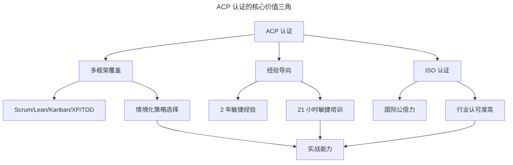
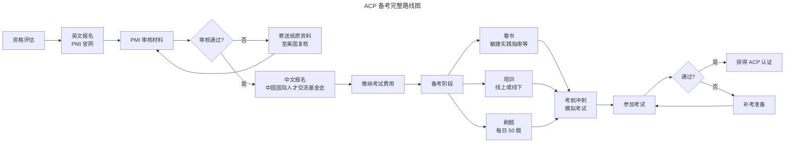

# 项目管理进阶之 ACP 认证攻略

> **适用范围**：已具备项目管理基础、希望在敏捷领域建立系统知识体系并获取国际认证的从业者，尤其是项目经理、产品经理、架构师、研发与测试工程师。
> **更新摘要（v2 · 2026-08 更新）**：更新 PMI-ACP 2025 最新报考政策（180 分钟、120 题、五年经验窗口）；引入 PMI-ACP 与 CSM、CSP、PSM 认证的多维度对比；以 Mermaid 图替代失效图片，新增认证体系全景与备考路线图可视化；补充敏捷认证在 AI 时代的新价值。

## 一、导言

在敏捷落地实践中，仅有经验而缺乏系统知识体系，往往难以应对复杂场景的判断与决策。PMI（Project Management Institute，项目管理学会）推出的 ACP（Agile Certified Practitioner，敏捷管理专业人士认证）为从业者提供了一套系统化的敏捷知识体系。

随着互联网兴起，企业对快速迭代的需求愈发迫切，而 PMP（Project Management Professional）等传统计划型项目管理方法难以应对快速迭代的开发需求。PMI 于 2011 年推出 ACP 认证，为互联网行业注入了新的管理方案。截至 2025 年，ACP 已成为国内敏捷领域知识方法全面、含金量较高、认可度较广的证书之一，许多互联网公司将 ACP 作为招聘的重要衡量标准。本文系统介绍 ACP 认证的价值、适用人群、报考政策与备考攻略，并与 CSM、CSP 等认证进行横向对比。

## 二、核心方法论

### 一、ACP 认证的核心价值

ACP 认证的核心价值在于其“多框架、经验导向、ISO 认证”三大特征。多框架指 ACP 不限定于某一种敏捷方法，而是涵盖 Scrum、Lean（精益）、Kanban（看板）、XP（Extreme Programming，极限编程）、TDD（Test-Driven Development，测试驱动开发）等多种方法，要求持证者能够根据具体情境提出最佳的敏捷策略组合方案。经验导向指 ACP 要求申请者具备真实的敏捷团队工作经验，而非仅通过短期考试即可获得。ISO 认证指 ACP 是业内唯一通过 ISO 国际标准化组织权威认证的敏捷认证考试，具备国际公信力。

上图揭示了 ACP 认证的核心价值三角。多框架覆盖提供知识广度，经验导向保证实践深度，ISO 认证赋予公信力，三者共同构成 ACP 持证者的实战能力基础。这也是为何 ACP 在招聘市场中具备较高辨识度——它同时验证了“知道什么”与“做过什么”。

### 二、ACP 与其他敏捷认证的定位差异

敏捷认证体系呈现“入门—进阶—专家”的阶梯结构。CSM（Certified Scrum Master，认证 Scrum 大师）由 Scrum Alliance 颁发，专注于 Scrum 框架，适合初学者；PSM（Professional Scrum Master）由 Scrum.org 颁发，同样聚焦 Scrum 但考试更严格；CSP（Certified Scrum Professional）是 Scrum Alliance 的高级认证，要求丰富的实战经验；ACP 则是跨框架的综合认证，适合需要统筹多种敏捷方法的从业者。

## 三、关键流程

### 一、ACP 报考资格

根据 PMI 2025 年最新政策，ACP 报考需满足以下资格条件。

| 条件类别 | 具体要求 |
| --- | --- |
| 学历 | 高中及以上学历（或国际等效学历） |
| 敏捷经验（满足其一） | 近 5 年内 2 年敏捷经验；或 GAC 认证项目学位加 1 年敏捷经验；或第三方敏捷认证加 1 年敏捷经验；或持有 PMP 认证 |
| 敏捷培训 | 21 小时正式敏捷实践培训（PMI 授权课程、ATP 培训或第三方培训均可） |

值得注意的政策更新：PMI 已将 ACP 考试时长定为 180 分钟（3 小时），题目数量为 120 道，覆盖英语、中文简体、中文繁体等 10 种语言。考试侧重场景题，要求根据题干问题选择最合适的解决方案。PMI 官方数据显示，86% 的 PMI-ACP 持证者获得了新机会，84% 的持证者在职业发展上获得认可，这反映了该认证在职场中的实际转化价值。

ACP 考试内容覆盖七大领域，各领域权重如下：敏捷原则与思维（约 16%）、价值驱动交付（约 20%）、干系人参与（约 17%）、团队绩效（约 17%）、适应性规划（约 12%）、问题发现与解决（约 10%）、持续改进（约 8%）。其中价值驱动交付与团队绩效占比最高，体现了 PMI 对敏捷“价值导向”与“人本协作”的强调。备考时应按权重分配精力，避免在低权重领域过度投入。

### 二、考试结构与通过标准

ACP 考试采用客观选择题形式，120 道题中随机 20 题不计成绩，剩余 100 题中答对 65 题即为通过。考试在国内由中国国际人才交流基金会（原国家外国专家局培训中心）负责组织实施，一年四次，分别在 3 月、6 月、9 月、12 月，一般为该月某个周六上午 9 点至 12 点进行。具体考试时间需密切关注中国国际人才交流基金会官网发布的信息。

上图展示了从资格评估到获得认证的完整路线图。整个流程通常需要 2-4 个月，其中备考阶段是决定通过率的关键。英文报名不需另外交费且允许一年报考期，超过报考期需重新提交；中文报名通常在考前一个月左右提交，需缴纳考试费用。

### 三、备考资料与策略

备考资料以官方推荐书籍为主。《敏捷实践指南》是考试大纲，考试内容基本在此书中；《用户故事与敏捷方法》作为补充知识，解释前者中难以理解的部分。时间紧张时可只读这两本。若时间充裕，建议补充阅读《看板实战》《敏捷估算与规划》《敏捷回顾》。《敏捷实践指南》虽是考试大纲，但翻译质量参差，建议结合英文原文或《用户故事与敏捷方法》交叉阅读以加深理解。

培训分为线下与线上两类。线下课程交互性强，有助于理解知识点；线上课程可反复学习，在看书或做题过程中有疑问时可反复观看。选择培训机构时建议优先选择知名机构，其通过率通常更高；选择讲师时需注重其实战经验与案例新鲜度，避免选择案例陈旧、实战偏少的讲师。每家机构的通过率不同，市面上培训机构良莠不齐，知名机构收费相对较高但通过率更有保障。

考前一个月为冲刺期，建议集中刷题，每日至少 50 题，对错题进行反思总结，建立错题本定期回顾。考前一周做一套冲刺题，按考试题型与时间进行模拟，熟悉考试节奏与时间分配。

## 四、工具与实战

### 一、PMI-ACP 与 CSM/CSP 的横向对比

下表从多个维度对比主流敏捷认证，帮助从业者根据自身需求选择。

| 维度 | PMI-ACP | CSM | CSP | PSM I |
| --- | --- | --- | --- | --- |
| 颁发机构 | PMI | Scrum Alliance | Scrum Alliance | Scrum.org |
| 框架覆盖 | 多框架（Scrum/Lean/Kanban/XP/TDD） | 仅 Scrum | 仅 Scrum | 仅 Scrum |
| 经验要求 | 2 年敏捷经验 | 无 | 丰富实战经验 | 无 |
| 考试形式 | 120 题选择题、180 分钟 | 在线考试 | 申请审核制 | 在线考试 |
| 认证有效期 | 3 年（需 PDU 续证） | 2 年（需 SEU 续证） | 2 年 | 永久有效 |
| 适合人群 | 项目经理、敏捷教练、需统筹多种方法者 | Scrum 初学者 | 资深 Scrum 实践者 | Scrum 初学者、偏好严格考试者 |
| 国内认可度 | 高 | 高 | 中 | 中 |

选型建议：若已具备 PMP 基础且希望向敏捷领域进阶，ACP 是首选；若刚接触 Scrum 且希望快速入门，CSM 或 PSM 更合适；若已是资深 Scrum Master 且希望向敏捷教练发展，CSP 或 ICP-ACC 更匹配。

### 二、认证与实战的转化

认证只是起点，知识点的实践转化才是目标。备考过程中应将所学框架与当前工作结合：学习 Scrum 时检视团队的站会与回顾会是否符合规范；学习 Kanban 时分析团队工作流的瓶颈；学习 XP 时评估团队的工程实践成熟度。这种“边学边用”的方式既能加深理解，又能立即产生工作价值。

## 五、常见误区

### 一、为考证而考证

部分从业者将认证视为“镀金”手段，考完即束之高阁。ACP 的价值在于其知识体系能够系统化地指导实践，若不将知识转化为能力，认证仅是一张纸。判断标志是：考后三个月内，是否将所学方法应用到至少一个实际项目中。

### 二、忽视经验积累

ACP 要求 2 年敏捷经验并非形式门槛，而是确保持证者具备真实场景判断能力。若仅通过培训凑足学时而缺乏实战，考试中的场景题将难以准确作答。建议在备考期间主动参与敏捷项目的核心仪式，积累可复用的场景经验。

### 三、盲目追求认证数量

部分从业者同时持有 CSM、PSM、ACP、SAFe 等多张认证，但每张认证的深度都有限。认证贵精不贵多，应根据职业发展方向选择 1-2 张核心认证深入掌握，而非追求认证数量的堆砌。

### 四、忽视续证要求

ACP 认证有效期为 3 年，需通过积累 PDU（Professional Development Unit）续证。若忽视续证导致认证失效，前期投入将付诸东流。建议在获得认证后立即规划续证路径，将 PDU 积累融入日常工作与学习。PDU 的获取途径包括：参与 PMI 分会的活动、撰写敏捷相关文章、在社区分享实践案例、参加进阶培训课程等。将续证视为结构化学习的契机而非负担，是维持认证长期价值的心态基础。

## 六、进阶延展

### 一、认证体系的进阶路径

敏捷认证呈现清晰的进阶阶梯。团队级认证包括 CSM、PSM I、ACP；规模化认证包括 SA（SAFe Agilist）、SPC（SAFe Program Consultant）；教练级认证包括 ICP-ACC（ICAgile Certified Professional in Agile Coaching）、CTC（Certified Team Coach）、CEC（Certified Enterprise Coach）。从业者可根据职业目标选择阶梯：从团队级认证起步，根据是否向规模化或教练方向发展，选择对应的进阶认证。

对于希望从 ACP 进一步进阶的从业者，建议关注三条路径。一是规模化方向：若所在企业有百人以上的多团队协作需求，可考虑 SAFe 体系的 SA 或 SPC 认证，掌握 PI Planning、ART 协调等规模化技能。二是教练方向：若希望从“实践者”升级为“赋能者”，可考取 ICP-ACC，系统学习引导与教练技能，再向 CTC、CEC 进阶。三是管理方向：若希望向更高层级的项目管理或 PMO 负责人发展，可在 ACP 基础上补充 PgMP（Program Management Professional）或 PfMP（Portfolio Management Professional）认证，掌握项目组合级别的管理能力。

### 二、AI 时代认证的新价值

在 AI 辅助开发日益普及的背景下，敏捷认证的价值不仅未下降，反而更加凸显。AI 改变了代码的生成方式，但未改变团队协作、价值流动、持续改进的底层逻辑——这些正是 ACP 等认证的知识核心。2025 年 DORA 报告显示，AI 与交付稳定性呈负相关，团队更需要扎实的敏捷实践来治理 AI 引入的风险。持证者若能将敏捷知识应用于 AI 时代的团队治理（如 AI 代码 Review 流程、AI 辅助规划的检视机制），将获得显著的职业差异化优势。

### 三、从认证到能力的终身学习

认证是知识体系的快照，而敏捷方法论本身在持续演进。SAFe 已更新至 6.0 版本，DORA 在 2024 年新增第五项指标，SPACE 框架在 AI 时代被重新诠释。持证者需保持终身学习态度，关注方法论演进、参与社区交流、复盘实践经验。PMI 的 PDU 机制正是为这种终身学习设计的——续证不是负担，而是结构化学习的契机。

认证是起点而非终点。真正的敏捷能力，是在无数次站会、回顾会、迭代规划中沉淀下来的判断力与领导力，这是任何考试都无法直接授予的。

---

下一篇：[13-个人成长（v2）](13-个人成长.md) 将以实战案例为蓝本，提炼敏捷项目管理从业者的职业发展路径与敏捷教练的成长阶梯。