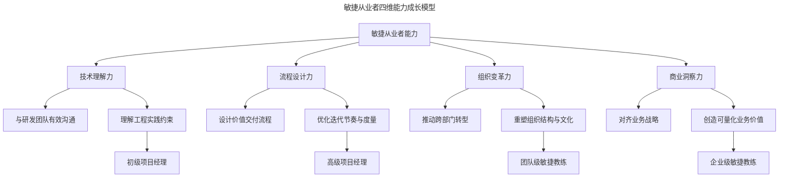
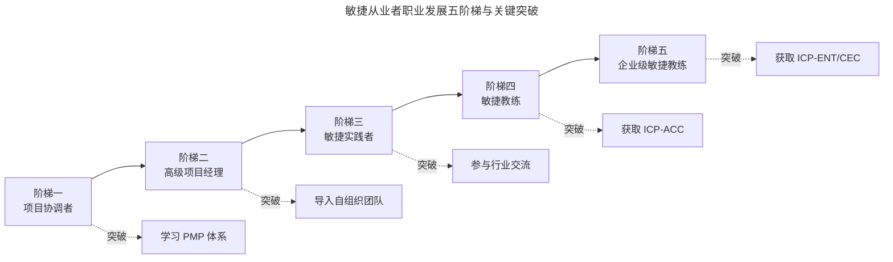

# 个人成长：敏捷项目管理从业者的职业发展路径

> **适用范围**：正在从事或计划转型项目管理工作、敏捷教练（Agile Coach）方向的从业者，尤其是希望系统规划职业发展路径的技术管理人员。
> **更新摘要（v2 · 2026-08 更新）**：将第一人称叙述重写为系统化的职业发展方法论；引入敏捷教练（Agile Coach）2025 年职业路径与薪资数据；补充 ICP-ACC、ICP-ENT、CTC、CEC 等敏捷教练认证体系；以 Mermaid 图替代失效图片，新增职业发展阶梯与能力成长模型可视化；更新 AI 时代敏捷教练的新角色。

## 一、导言

敏捷项目管理从业者的职业发展并非线性晋升，而是能力维度的持续扩展。从初入项目管理岗位的协调者，到带领大型交付团队的高级项目经理，再到跨企业赋能的敏捷教练，每一阶段的跨越都伴随着知识体系、思维模式与实践经验的质变。

本文以一位从基层开发者成长为项目管理专家与敏捷教练的真实历程为案例蓝本，系统提炼敏捷从业者可复制的成长路径，并结合 2025 年敏捷教练职业市场的最新数据，为从业者提供职业规划的方法论参考。

## 二、核心方法论

### 一、敏捷从业者的能力成长模型

敏捷项目管理的职业成长可归纳为四个能力维度的递进：技术理解力、流程设计力、组织变革力、商业洞察力。技术理解力是基础，使从业者能与研发团队有效沟通；流程设计力是核心，使从业者能设计并优化价值交付流程；组织变革力是进阶，使从业者能推动跨部门的敏捷转型；商业洞察力是高阶，使从业者能将敏捷与业务战略对齐。

四个维度并非阶段性地获得，而是贯穿职业全程持续深化。初级项目经理主要运用技术理解力与初步的流程设计力；敏捷教练需均衡运用四种能力；企业级敏捷教练则以组织变革力与商业洞察力为主导。

上图揭示了四维能力与职业阶段的对应关系。值得强调的是，能力成长不是“完成前一阶段才能进入下一阶段”，而是“在前一阶段基础上叠加新维度”。许多转型失败的案例恰恰是因为跳跃了某一维度——例如缺乏技术理解力就尝试组织变革，会导致变革方案脱离工程实际而无法落地。

### 二、从执行者到赋能者的角色转变

敏捷从业者的职业本质是从“执行者”向“赋能者”的转变。执行者关注“如何把事做对”，赋能者关注“如何让团队把事做对”。这一转变的核心标志是：从业者是否从“自己解决问题”转向“让团队学会解决问题”。

判断转变是否完成的标准有三：一是团队在从业者不在场时能否自运转；二是从业者是否将更多时间投入系统设计而非事务协调；三是从业者的影响力是否从单团队扩展至多团队或组织级。

## 三、关键流程

### 一、职业发展的五个阶梯

敏捷项目管理从业者的职业发展通常经历五个阶梯，每个阶梯对应不同的能力要求与价值产出。

**阶梯一：项目协调者**。初入项目管理岗位，主要工作是进度跟踪、会议组织、问题记录。此阶段的核心挑战是面对不同项目角色的沟通协调，常被进度、质量、成本三座大山压迫。突破路径是建立项目管理体系，从标准体系（如 PMP）入手学习结构化方法。

**阶梯二：高级项目经理**。通过体系化学习并应用于实践后，晋升为高级项目经理，管理更大规模的交付团队（如 60 人以上）。此阶段的核心挑战是“管理者成为瓶颈”——管理的人越多，自己越深陷各种会议。突破路径是寻找让团队自运转的方法，这正是敏捷“自组织型团队”理念的切入点。

**阶梯三：敏捷实践者**。深入敏捷方法论后，从业者开始在团队中导入敏捷实践（站会、回顾会、迭代规划），并积累落地案例。此阶段的核心任务是“将敏捷从书本知识转化为可操作的工作方式”。突破路径是参与行业交流（如敏捷社区大会），从大牛的实战案例中获取启发。

**阶梯四：敏捷教练**。具备丰富的敏捷落地经验后，从业者可向敏捷教练方向发展，跨团队、跨企业赋能。此阶段的核心任务从“自己做好敏捷”转向“帮助他人做好敏捷”。突破路径是获取专业教练认证（如 ICP-ACC），系统学习引导（Facilitation）与教练（Coaching）技能。

**阶梯五：企业级敏捷教练/顾问**。在企业级层面推动敏捷转型，涉及组织设计、文化变革、战略对齐。此阶段的核心任务是“将敏捷从团队实践升级为组织能力”。突破路径是获取企业级教练认证（如 ICP-ENT、CEC），并积累跨行业的转型案例。

上图展示了五阶梯的关键突破点。每个阶梯的突破都需要一个“质变契机”——或是体系化学习，或是方法论引入，或是认证获取。值得注意的是，阶梯之间并非时间线性关系，有的从业者可能在阶梯二停留多年而无法突破，关键在于是否主动寻求突破契机。

### 二、敏捷教练与 Scrum Master 的差异

敏捷教练与 Scrum Master 常被混淆，但二者在范围、框架归属、组织影响力、教练深度上有本质差异。Scrum Master 服务于单一团队（偶尔两个），在 Scrum 框架内运作，主要移除团队级障碍；敏捷教练跨多团队工作，框架无关（Framework-agnostic），融合 Scrum、Kanban、XP、Lean 等方法，致力于改变产生障碍的组织条件，教练对象包括领导者、管理者与整个部门。

简言之：Scrum Master 让一个团队更擅长 Scrum；敏捷教练让组织更擅长支持敏捷团队。

### 三、实战案例的积累方法

敏捷从业者的职业竞争力很大程度上取决于实战案例的质量与数量。有效的案例积累需遵循“STAR 结构”：情境（Situation）、任务（Task）、行动（Action）、结果（Result）。每个案例需明确业务背景、面临问题、采取的敏捷实践、可量化的产出。

以典型实战案例为例：在欢乐斗地主项目中，运用敏捷项目管理方法挖掘用户价值、快速迭代，6 个月内成功上线，达成日活 2000 万；在游戏安全中心，利用敏捷回顾方法优化安全对抗流程，使外挂误踢率降低 83%、效率提升 150%；在过程管理中心，运用敏捷快速交付价值，半年内追上竞品两年开发进度，服务上万人使用。这些案例的共性是“敏捷方法 + 可量化结果”，构成了从业者职业发展的核心资产。

案例积累需注意三个工程要点。第一，结果必须可量化——用数字（如日活、效率提升百分比、成本降低幅度）而非形容词描述成果，这使案例在面试与提案中具备说服力。第二，案例需覆盖不同场景——既要有互联网产品的快速迭代案例，也要有传统行业的转型案例，体现方法的跨场景适用性。第三，案例需持续更新——敏捷方法论在演进，三年前的案例可能已不反映当前最佳实践，需定期补充新案例以保持竞争力。

## 四、工具与实战

### 一、敏捷教练认证体系

2025 年敏捷教练认证体系呈现“团队级—企业级”双层结构。团队级认证以 ICP-ACC（ICAgile Certified Professional in Agile Coaching）为代表，聚焦敏捷教练的心态、知识与技能，通常为 2-3 天培训，无需考试，通过积极参与获得认证，提供 21 个 SEU。企业级认证以 ICP-ENT（ICAgile Certified Professional in Enterprise Coaching）与 ICP-CAT（ICAgile Certified Professional in Agile Transformation）为代表，聚焦系统思考、业务敏捷、组织设计与变革策略，通常为 5 周线上培训加异步学习。

Scrum Alliance 体系下还有 CTC（Certified Team Coach）与 CEC（Certified Enterprise Coach）两高级认证，通过申请审核制获得，要求丰富的实战经验与教练小时数。

### 二、敏捷教练的 2025 年市场数据

根据 2025 年职业市场数据，敏捷教练的需求保持高位，年均增长率约 13%。美国市场年薪区间为 9 万至 15 万美元，中位数约 12 万美元；入门级约 9.9 万美元，中级约 12 万美元，高级约 14.1 万美元，前 10% 的从业者年薪可达 15 万美元以上。国内市场敏捷教练薪资同样处于技术管理岗位的中上水平，且随着企业数字化转型加速，需求持续增长。

### 三、跨行业赋能的实践方法

敏捷方法不仅适用于互联网与软件行业，也可赋能传统行业。跨行业赋能的核心是“识别可迁移的敏捷原则”而非“照搬敏捷仪式”。例如：在某智能水表厂商，用人种学研究法（Ethnography）观察用户使用场景，做出通用性更好的系统；在某婚庆行业，用精益方法拆解婚礼展台搭建环节，优化效率并提高道具复用率，扭转连续亏损；在某智慧园区行业，用看板工具解决多地协同办公问题，定义 Product Owner 与 Scrum Master 职责，使版本迭代更快。这些案例表明，敏捷的底层逻辑（小步快跑、持续反馈、价值驱动）具有跨行业普适性。

## 五、常见误区

### 一、将认证等同于能力

认证是知识体系的验证，而非实战能力的保证。市场上存在“持证但无法落地”的从业者——认证齐全但案例匮乏。避免这一误区的方法是“边认证边实践”，每获取一张认证至少对应一个实战项目。

### 二、忽视技术理解力的持续深化

部分从业者在转向管理与教练方向后，停止了对技术理解力的深化。这在 AI 时代尤为危险——AI 改变了代码生成方式，若从业者不理解 AI 辅助开发的工程约束，将无法有效辅导技术团队。建议定期参与技术分享、阅读工程实践文章、与开发者保持深度对话。

### 三、过度依赖单一方法论

部分从业者将某一种敏捷方法（如 Scrum）视为唯一正解，排斥其他方法。这种“方法论原教旨主义”会限制从业者的问题解决视野。成熟的敏捷教练应框架无关，根据情境灵活组合 Scrum、Kanban、XP、Lean 等方法。

### 四、忽视心理安全感与变革管理

敏捷转型本质是人的变革，而非流程的更换。若从业者只关注流程设计而忽视心理安全感建设，转型将遭遇强烈阻力。变革管理（Change Management）能力是敏捷教练的核心能力之一，需系统学习抵抗管理、变革策略与沟通技巧。

此外，从业者常犯的一个错误是”技术傲慢”——认为不采用敏捷的团队就是落后的。这种态度会引发抵触情绪，阻碍敏捷的推广。成熟的敏捷教练应尊重团队现有的工作方式，以”解决痛点”而非”推销方法”为切入点，让团队在体会敏捷价值后主动拥抱变革，而非被动接受强加的流程。

## 六、进阶延展

### 一、AI 时代敏捷教练的新角色

AI 辅助开发的普及为敏捷教练带来了新挑战与新机会。2025 年 DORA 报告显示，90% 的开发者已使用 AI 工具，但 AI 与交付稳定性呈负相关。敏捷教练需新增三类能力：一是辅导团队建立 AI 代码的 Review 与治理流程；二是帮助团队度量 AI 辅助开发的真实生产力（避免被提交数等表面指标误导）；三是关注开发者与 AI 互动时的“所有权与满足感流失”，维护团队的心理健康。

AI 不会取代敏捷教练，但会重新定义敏捷教练的价值——从“流程辅导者”升级为“人机协作的设计者”。

### 二、从顾问到生态构建者

资深敏捷教练的终极形态不是“外部顾问”，而是“生态构建者”。外部顾问模式是“为企业解决问题后离开”，生态构建者模式是“帮助企业建立自有的敏捷能力体系”。后者包括培养内部敏捷教练、建立敏捷社区、沉淀组织知识库、设计度量体系。生态构建者的价值远高于顾问，但需要更长的时间投入与更深的组织信任。

生态构建者的核心能力是“让敏捷自我繁衍”——即建立的体系能够在没有外部输入的情况下持续进化。这要求体系具备三个特征：一是度量驱动，体系能够自检健康度并触发改进；二是社区支撑，从业者能够在社区中获取支持与反馈；三是知识沉淀，案例与经验被结构化记录并可被新成员检索。当这三个特征齐备时，敏捷便从“项目”升级为“组织能力”。

### 三、终身学习与社区参与

敏捷方法论本身在持续演进，从业者需保持终身学习。有效的学习途径包括：参与行业大会（如敏捷之旅 Agile Tour）、加入敏捷社区、阅读最新研究报告（如 DORA 年度报告）、参与开源敏捷工具的贡献。社区参与不仅更新知识，更能扩展职业网络——许多职业机会来自于社区中建立的信任与口碑。

敏捷从业者的职业发展是一场没有终点的马拉松。每一阶段的能力积累都会成为下一阶段的基石，每一次实战案例的沉淀都会成为职业差异化的资本。在这条路径上，方法可以学习，认证可以获取，但真正决定高度的，是对敏捷理念的深刻信仰与对持续改进的执着追求。这正是敏捷从业者从”做事”走向”成事”、从”成事”走向”成人”的终极路径。

---

下一篇：[14-敏捷，实践出真知（v2）](14-敏捷，实践出真知.md) 作为系列收官，将梳理敏捷在中国的本地化演进与 AI 时代敏捷实践的新趋势。