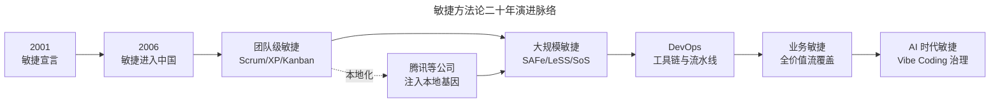
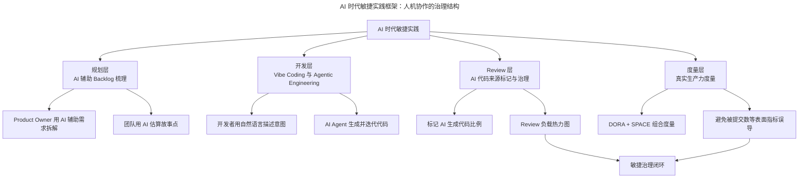

# 敏捷，实践出真知

> **适用范围**：希望理解敏捷方法论演进趋势与未来方向的从业者，尤其是需要在 AI 时代重新审视敏捷价值的团队负责人与技术管理者。
> **更新摘要（v2 · 2026-08 更新）**：引入 Vibe Coding、Agentic Engineering 等 AI 时代软件开发新范式；补充敏捷在中国二十年的本地化演进；以 Mermaid 图替代失效图片，新增敏捷方法论演进时间线与 AI 时代敏捷实践框架可视化；更新业务敏捷与 DevOps 工具链的 2025 年现状。

## 一、导言

敏捷自 2006 年进入中国，至今已近二十年。它伴随中国互联网行业的成长，腾讯等公司在摸索中为敏捷注入了本地化基因，相辅相成最终成就了彼此。如今敏捷已从软件开发走向金融、餐饮等各行业，尤其在快速变化、高度不确定的商业环境中，其价值愈发凸显。

本文追根溯源，梳理敏捷在中国的前世今生与使用方式，并聚焦 AI 时代敏捷实践的新趋势。在 Vibe Coding（直觉式编程）与 Agentic Engineering（智能体工程）兴起的背景下，敏捷方法论不仅未被淘汰，反而因其强调迭代、反馈与协作的底层逻辑，成为 AI 时代软件开发不可或缺的治理框架。

## 二、核心方法论

### 一、敏捷的演进脉络

敏捷的概念始于 2001 年的《敏捷宣言》（Agile Manifesto）及其十二原则。在具体实践中，敏捷从形式主义走向实用主义，目前已衍生出多种方法。Scrum 是最流行的敏捷方法，但极限编程（XP，Extreme Programming）、看板（Kanban）、DSDM（Dynamic Systems Development Method）等方法同样值得关注。

敏捷的演进呈现清晰的脉络：从单一团队的 Scrum，到大规模敏捷（SAFe、LeSS），再到 DevOps 与业务敏捷（Business Agility）。早期敏捷局限于软件开发团队，而业务敏捷性要求将整个价值流从概念重构覆盖到公司所有业务领域——无论是人事、行政还是运营、财务，都可以导入敏捷。

上图揭示了敏捷方法论的演进脉络。值得强调的是，演进并非替代关系，而是叠加关系——团队级敏捷仍是基础，大规模敏捷在此之上扩展，DevOps 提供工程能力支撑，业务敏捷将敏捷延伸至全价值流，AI 时代敏捷则重新定义了人机协作的治理方式。每一阶段都建立在前一阶段的能力之上。

### 二、裁剪与组合的工程智慧

不可能有单一的事实根源，也不能使用单一方法来标准化。Scrum 创始人承认 Scrum 与 Kanban 协同会有更好效果；SAFe 规定了一套 Scrum、看板与 XP 原则的使用组合。越来越多的公司会综合考虑团队规模、工作性质、组织成熟度等因素，对敏捷进行裁剪选择更合适的方式。

例如某电话手表公司从学习敏捷演进为适应型敏捷，用 IPD（Integrated Product Development）与敏捷方法混合的方式取得了不错成效。裁剪与组合的工程智慧在于：不追求方法论的纯粹性，而追求方法与情境的匹配度。

## 三、关键流程

### 一、业务敏捷的实现路径

业务敏捷关注产品维度的短周期、小批量、高价值、高质量，以及小步快跑达到这些目标的基础能力，再加上团队级敏捷实践。业务敏捷才是组织真正需要的，也是高层领导希望看到的敏捷转型。

以腾讯 HR 为例，试用新制度时采用敏捷的“灰度发布”，选择一个部门作为试点，在试点团队收集反馈以此改进，最后扩展到全公司，这样的“柔性政策”非常落地。企业在敏捷转型中越来越关注业务价值，一切回归初心，所有方法与实践需回到服务业务目标的大方向。

业务敏捷的实现路径可归纳为三步：第一步，识别价值流，从概念到现金的端到端流程；第二步，在每个价值流环节应用敏捷原则（小批量、短周期、快速反馈）；第三步，建立跨职能团队对价值流负责，打破部门墙。

### 二、敏捷工具的演进

在转型过程中，工具的支撑日益重要。敏捷早期采用物理看板作为信息同步工具，因其方便直观。但随着行业发展，团队迫切需要从数据中获取信息，而物理看板无法做统计分析，不能沉淀组织经验，于是敏捷相关的数字化工具应运而生。

2025 年主流敏捷工具呈现三大演进方向：一是看板与文档系统的无缝衔接，任务状态变更时相关需求文档自动触发版本标记；二是 AI 辅助决策从实验性走向普及，风险预测算法准确率突破 92%，资源调度智能建议系统实现 85% 自动分配准确率；三是全生命周期数据贯通，从需求到代码到部署的数据可追溯。代表工具包括腾讯 TAPD、阿里 Teambition、Jira、飞书项目、PingCode 等。

上图展示了 AI 时代敏捷实践的治理结构。AI 改变了代码的生成方式（开发层），但未改变规划、Review、度量层的敏捷逻辑——这些恰恰是 AI 生成代码最需要的治理环节。2025 年 DORA 报告显示，90% 的开发者已使用 AI 工具，AI 与吞吐量呈正相关但与交付稳定性仍呈负相关，这恰恰说明 AI 时代更需要敏捷的检视与调整机制。

## 四、工具与实战

### 一、Vibe Coding 与 Agentic Engineering 的辨析

Vibe Coding 由 Andrej Karpathy 于 2025 年 2 月提出，指开发者用自然语言表达意图，AI 将想法转换为可执行代码的编程方式。其特征是“先编码后优化”的思维方式，符合敏捷的快速原型与迭代反馈原则。Vibe Coding 在原型设计与 MVP（Minimum Viable Product，最小化可行产品）开发中表现出色，能够显著降低开发门槛。

Agentic Engineering 是 Vibe Coding 的演进形态，指利用自主 AI 智能体（Autonomous AI Agent）执行复杂多步骤任务、做出架构决策、生成生产级代码的开发方式。2026 年初，Karpathy 本人更倾向于使用“Agentic Engineering”这一术语，反映了 AI 辅助开发从“直觉式探索”走向“系统化工程”的成熟。

两者的核心差异在于控制权与自主性的平衡：Vibe Coding 保持人类在驾驶位，AI 作为智能副驾驶；Agentic Engineering 将部分决策权委托给 AI 系统。在项目阶段上，Vibe Coding 适合发现期（探索与原型），Agentic Engineering 适合扩展期（规模化生产）。

业界数据为这一趋势提供了量化支撑。2025 年 DORA 报告显示，90% 的开发者已在工作中使用 AI 工具，超过 80% 的开发者报告 AI 带来了生产力提升。然而，约 30% 的开发者对 AI 生成代码信任度仍较低，AI 与交付稳定性呈负相关。Faros AI 研究发现，AI 采用伴随 PR Review 时间上升 91%、每人 BUG 率上升 9%，但 PR 合并数激增 98%。这些数据揭示了一个工程现实：AI 显著加速了代码生成，但同时也放大了 Review 负载与质量风险，这正是敏捷的检视与调整机制在 AI 时代不可或缺的原因。

### 二、敏捷与 Vibe Coding 的互补关系

敏捷与 Vibe Coding 并非对立，而是分属不同层次。敏捷是过程框架，治理团队如何组织、计划与交付软件，涉及角色（Scrum Master、Product Owner）、制品（Backlog、燃尽图）与持续改进仪式（回顾会）；Vibe Coding 是开发技术，改变代码的编写方式（自然语言），但不规定团队如何计划或管理工作。

Vibe Coding 在敏捷框架中的价值体现在三方面：一是加速原型设计，支持“构建—度量—学习”循环；二是降低跨职能协作门槛，产品经理与设计师可直接用自然语言参与原型构建；三是支持测试驱动开发，AI 可根据用户故事快速生成测试用例。但 Vibe Coding 也引入新风险——研究表明约 40%-50% 的 AI 生成代码包含漏洞，AI 生成的代码难以调试且缺乏架构结构，这正是敏捷的 Review 与质量治理环节需要强化的方向。

### 三、地摊经济与 MVP 思维

敏捷的 MVP 思维在商业环境中具有普适性。以“地摊经济”为例，想开小吃店而门店成本与准备时间很长，若先选择摆摊，则不需要一开始就租赁店面，成本低、前期准备时间短、风险小，又能以此预估开店的可行性。这正是敏捷所倡导的——在频繁的价值交付中低成本试错。

MVP 思维的核心不是“做最小化产品”，而是“以最低成本验证最关键的假设”。这一思维适用于产品开发、商业模式验证、流程改进等各类场景，是敏捷方法论对商业世界的核心贡献之一。

## 五、常见误区

### 一、将敏捷等同于 Scrum

许多从业者将敏捷等同于 Scrum，忽视了 Kanban、XP、Lean 等方法的适用场景。Scrum 适合固定迭代的团队，Kanban 适合流程导向的团队，XP 适合对工程实践要求高的团队。将敏捷等同于 Scrum 会限制方法选择的视野，导致“用错方法解决错问题”。

### 二、认为敏捷对人员要求高而拒绝尝试

任何公司都可以尝试敏捷实践，如站会与回顾会——前者帮助快速同步信息，后者让团队变成学习型团队。不必等待“完美条件”才开始敏捷，敏捷本身就是在实践中逐步完善的。从最简单的仪式开始，在体会敏捷的好处后逐步深入，是更现实的导入路径。

### 三、在 AI 时代否定敏捷的价值

部分观点认为 AI 生成代码已足够快，敏捷的迭代与反馈机制不再必要。这是对敏捷的误解——敏捷治理的恰恰是“快”带来的风险。2025 年 DORA 报告显示，AI 使吞吐量上升但稳定性下降，PR Review 时间上升 91%，BUG 率上升 9%。这些数据表明，AI 时代更需要敏捷的检视、调整与持续改进机制，而非更少。

### 四、忽视 DevOps 的工程支撑

业务敏捷需要技术投入与工具支撑，这正是 DevOps 的强项。若团队只导入敏捷仪式而忽视 DevOps 工程能力（自动化测试、持续集成、持续部署），敏捷的“快”只会带来“更快地制造垃圾”。DevOps 是敏捷的工程底座，二者不可分割。

DevOps 实践日益受到大型团队青睐，他们希望通过基于工具链的标准化价值流管理，加强各团队协作、加速交付速度、提高质量。DevOps 与敏捷的关系是“工程能力”与“管理方法”的互补：敏捷定义“为什么做”与“做什么”，DevOps 提供“怎么做”的工程手段。关注业务价值需要技术投入与工具支撑，而这些正是 DevOps 的强项。

## 六、进阶延展

### 一、VibeOps：AI 与敏捷的融合新范式

2025 年末，业界提出 VibeOps 概念，指将 AI 辅助开发嵌入敏捷与 DevOps 的运营层。VibeOps 的核心是将 AI Agent 作为开发流水线的一环，参与需求拆解、代码生成、测试编写、部署决策等环节，同时保留人类的治理与审查权。VibeOps 的发展方向是“自演化代码库”（Self-evolving Codebase）——代码库能够基于运行数据与用户反馈自主优化，但演进方向由人类定义。

### 二、敏捷度量在 AI 时代的重构

传统度量指标（提交数、PR 数、代码行数）在 AI 时代已严重失真——AI 可在数秒内生成大量代码，但这不等于团队生产力提升。AI 时代的敏捷度量需重构：引入 AI 代码来源标记，区分人工代码与 AI 代码；度量 Review 负载与质量而非代码产量；关注 SPACE 框架的 Satisfaction 维度，监测开发者与 AI 互动时的满足感变化。度量的目标从“测产量”转向“测价值与可持续性”。

### 三、终身学习与实践出真知

敏捷不是一成不变的，需抱有终身学习的态度。在学习中把握它为了解决哪些问题、适用于什么情况。能否掌握敏捷，最重要的是躬行——在不断实践的过程中体会敏捷的价值，反思教训，总结经验。可以从问题切入，用不同的方法解决当前的问题。

敏捷的本质是一种思维方式：在不确定中通过小步快跑与持续反馈逼近确定性，在变化中通过自组织与持续改进保持适应性。无论技术如何演进——从瀑布到敏捷，从 DevOps 到 Vibe Coding——这一思维方式始终是有效应对复杂性的根本策略。实践出真知，这是敏捷留给每一位从业者最珍贵的启示。