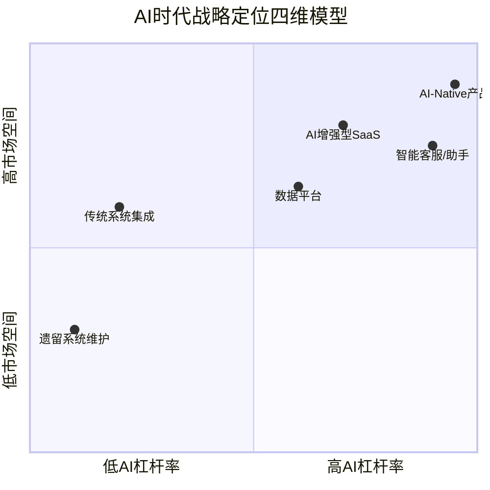
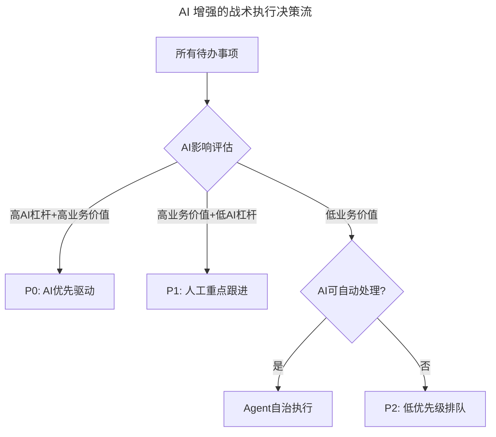
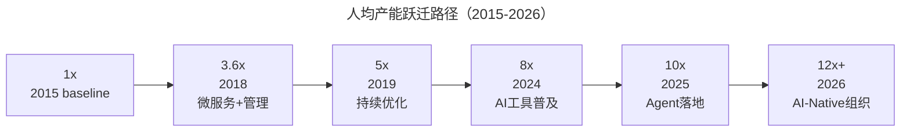

# 研发团队人均产能跃迁：定战略与抓战术的工程化管理框架

> **适用范围**：技术管理者、CTO、研发负责人，适用于中型及以上规模技术团队的产能提升与战略落地。

> **更新摘要（v2 · 2026-08 更新）**：在原文"定战略、抓战术"实践基础上，整合 AI 时代战略定位四维模型、AI 增强战术执行、产能跃迁路径等内容，将产能提升目标从 3.6 倍扩展至 8-12 倍，补充 AI 里程碑、Agent 接管清单、AI 驱动度量体系等 2026 年落地实践。

## 一、导言

随行付技术团队曾经历过 CPU 飙升 80% 以上、技术人员 24 小时打地铺加班、需求积压严重、技术高管离职的高压阶段。通过 2016 年 1 月至 2018 年 12 月三年的系统性改造，团队人均产能（Engineering Productivity）提升至 3.6 倍，85% 的任务一周内上线。这一成果来自两个方向：技术升级（微服务架构）与管理优化。

随行付的技术管理实践可以概括为十二字方针——"定战略、抓战术、搭班子、带队伍"。其中定战略与抓战术偏理性，搭班子与带队伍偏人文。技术管理者作为科技与管理的结合体，需要理性做事、人文育人。从做事角度看，定战略对应决策，抓战术对应执行，结果=决策×执行；从人文角度看，搭班子与带队伍同样对应决策与执行。

进入 2026 年，84% 的开发者正在使用或计划使用 AI 工具（Stack Overflow 2025 调查口径），Agent 承担 30-50% 的重复性工作，四象限框架在每个维度都需要融入 AI 思维。本文聚焦"定战略"与"抓战术"两个象限，阐述如何将管理方法论与 AI 能力叠加，实现从 3.6 倍到 8-12 倍的产能跃迁。

## 二、核心方法论

### 2.1 定战略三步法与 AI 时代第四定

定战略的"定"是指定位。技术领导者最重要的职责是给团队做好定位，明确有所为、有所不为。原文提出三个"定"：定范围、定赛道、定路径。在 AI 时代，需要新增第四个维度——AI 可行性，形成战略定位四维模型。

四维模型将战略选项按 AI 杠杆率与市场空间两个轴进行定位。AI-Native 产品位于右上角，兼具高 AI 杠杆与高市场空间，是 2026 年战略优选；遗留系统维护位于左下角，AI 增值有限，应尽量外包或淘汰。战略选择不再是单纯的"用户所需∩企业所长"，而是叠加了 AI 能力放大系数后的综合判断。

**定范围（AI 版）**：有效战略范围 =（用户需求 ∩ 团队能力）× AI 能力放大系数。其中 AI 能力放大系数取决于团队 AI 成熟度，通常在 1.5x 到 10x 之间。这意味着同一团队在 AI 成熟度不同时，可选的战略范围会发生量级变化。

**定赛道（AI 版）**：原文案例中，随行付孵化的 Iron Cloud 微服务私有云开发平台用四个限定词细分赛道——微服务、私有、云、开发。AI 时代建议在细分赛道时增加"AI 密度"作为筛选标准：该赛道的 AI 渗透率增速如何、AI 是否改变了竞争规则、团队 AI 能力是否构成壁垒、该赛道是否有 AI-Native 玩家入场。

**定路径（AI 版）**：原文采用每半年确定阶段性技术目标、OKR 分解的方式。AI 时代升级为引入 AI 里程碑，例如在"微服务架构迁移完成"基础上叠加"AI 代码生成覆盖率>60%"，在"交付速度提升 50%"基础上叠加"Agent 自动化测试率>80%"。

### 2.2 抓战术三词与 AI 增强

抓战术可以概括为三个词：抓大、放小、管细。这三词在 AI 时代分别获得新的执行方式。

**抓大**：原文强调同一时间只有一件事最需要关注，占用 70% 精力。AI 时代的大事判断新增三个标准——是否涉及 AI 战略方向决策、是否影响团队 AI 能力建设、是否是 AI 无法自主处理的复杂决策。对于高 AI 杠杆且高业务价值的事项，应 AI 优先驱动；对于高业务价值但低 AI 杠杆的事项，人工重点跟进；对于 AI 可自动处理的低价值事项，交给 Agent 自治执行。

**放小**：放小的"放"讲的是放权。判断大事小事的依据不是工作量或复杂度，而是"对失败后果的承受能力"。AI 时代新增了可放给 Agent 的小事清单，包括代码格式化、测试用例生成、文档初稿、周报数据汇总、Issue 分类排序、会议纪要整理、环境配置脚本等，节省时间从 80% 到 100% 不等。

**管细**：管细不是事无巨细，而是制定合理、贴切、细致的测量标准。原文已做到数字化管理，利用大数据统计各项目组日常工作情况，每周横向排名，只统计不考核。AI 时代度量体系新增 AI 生成代码占比、AI 采纳率、AI 拦截问题数、AI Debt Ratio、AI 节省工时、Agent 成功率等指标。

## 三、关键流程

### 3.1 战略落地流程

战略落地遵循"定位→OKR 分解→阶段性目标→AI 里程碑叠加"的流程。随行付最终选择的战略目标是"线下收单行业交付速度第一"。为达成这一目标，每半年确定一个阶段性技术目标，采用 OKR（Objectives and Key Results）分解到各个团队。

AI 时代的战略落地流程新增 AI 增强目标设定环节。在传统 OKR 基础上，加入 AI 效能指标作为关键结果。例如某季度的 OKR 可以是：目标=交付速度行业第一；关键结果 1=85% 任务一周内上线；关键结果 2=AI 代码采纳率>65%；关键结果 3=人均 AI 节省工时>10h/周；关键结果 4=Agent 自治任务比例>50%。

### 3.2 战术执行流程

战术执行流程围绕"抓大→放小→管细"展开，AI 时代形成人机分工的执行闭环。抓大环节通过 AI 影响评估对待办事项分级；放小环节将标准化、规则化的工作交给 Agent；管细环节通过 AI 驱动的精细化度量体系持续跟踪。

该决策流的核心价值在于将管理者的注意力从"所有事"聚焦到"AI 无法替代的复杂决策"上。P0 事项由 AI 优先驱动，人类审核关键节点；P1 事项需要人工深度参与；低价值事项中，AI 可处理的交给 Agent，不可处理的进入低优先级队列。这一流程使管理者 70% 精力真正聚焦在不可替代的决策上。

## 四、工具与实战

### 4.1 战略工具

- **OKR 框架**：目标与关键成果法，用于战略分解与跟踪。
- **AI 成熟度评估模型**：从工具采纳、流程融合、能力建设、组织文化、价值产出五个维度评估团队 AI 成熟度，作为战略范围确定的输入。
- **AI 密度分析**：评估目标赛道的 AI 渗透率与竞争格局。

### 4.2 战术工具

| 工具类别 | 代表工具 | 适用场景 | 节省时间 |
|---------|---------|---------|---------|
| AI 编程助手 | Cursor、Windsurf、Copilot | 日常编码 | 30-50% |
| 测试用例生成 | CodiumAI、GPT-5.5 | 单元测试与集成测试 | 90% |
| 文档生成 | AI Writer | API 文档、设计文档 | 95% |
| 周报汇总 | Notion AI、Custom GPT | 团队周报、项目进展 | 100% |
| Issue 分类 | AI Triage Bot | 缺陷分类与优先级排序 | 80% |
| 会议纪要 | Otter.ai、Fireflies | 站会、评审会、回顾会 | 100% |
| 部署脚本 | AI DevOps Agent | 环境配置与部署 | 85% |

### 4.3 行动清单

制定 AI 时代产能提升路线图，建议按以下节奏推进：

- 本周：评估团队当前 AI 成熟度（五维度模型打分）；选择并统一团队的 AI 编程工具。
- 本月：制定 AI-enhanced OKR，加入 AI 效能指标；识别可交给 Agent 的"小事"清单（至少 10 项）。
- 本季度：建立 AI 效能看板，追踪关键指标变化。

参考目标值（中型技术团队）：AI Adoption Rate 从 50% 提升至 95%+；人均 AI 节省工时从 3h/周提升至 12h+/周；AI 代码采纳率从 40% 提升至 70%+；Agent 自治任务比例从 10% 提升至 65%+；人均产能提升基准→+100%+。

## 五、常见误区

**战略无路径**：没有可实施路径的战略就是耍流氓。很多技术管理者战略蓝图规划得很好，落地失败就归咎于执行不力。定路径是定战略的一部分，不能推给执行阶段。AI 时代尤其要避免"AI 战略"停留在口号，必须有 AI 里程碑和可量化的关键结果。

**小事不放权**：领导者容易陷入"自己做得更好"的惯性，不愿放权。AI 时代的新表现是不信任 AI 输出，对所有 AI 产出都进行过度审查。正确做法是基于失败后果承受能力划分大小事，对低风险事项大胆交给 Agent，只保留异常处理权。

**测量精确到个人**：数据统计和排名应只针对团队，不要精确到每个人。AI 时代更需要警惕用 AI 工具采纳率、AI 代码量等指标对个人进行 KPI 考核，这会导致"为了 AI 而 AI"的形式主义。

**过度依赖 AI**：AI 是放大器，不是替代品。优秀的管理方法论依然是基础。如果原管理框架本身存在缺陷，AI 只会放大缺陷的影响。尤其金融科技等合规要求高的领域，AI 使用必须有明确边界。循序渐进地引入，不要一次性全面 AI 化，选择 1-2 个点突破。持续测量和验证，用数据说话，验证 AI 带来的实际效益。保持学习和迭代，AI 技术发展快，管理方法也要同步演进。

**赛道选择盲目跟风**：选择战略方向时容易盲目追逐热门赛道，忽视团队长板与用户需求的匹配。AI 时代尤其要警惕"所有业务都往 AI 上靠"的倾向——并非所有场景都有高 AI 杠杆率，传统系统集成和遗留系统维护的 AI 增值有限。应在四维模型中客观定位，选择 AI 杠杆率与市场空间都较高的象限作为战略重点。

## 六、进阶延展

### 6.1 产能跃迁路径

从 2015 年的 1x 基准到 2026 年的 12x+，产能跃迁经历五个阶段，每个阶段有不同的核心驱动力。

| 阶段 | 核心驱动力 | 典型举措 | 产能倍数 |
|-----|----------|---------|---------|
| 1→3.6x | 架构升级+管理优化 | 微服务、OKR、放权 | 3.6x |
| 3.6→5x | 流程优化+工具链 | DevOps、自动化测试 | 1.4x |
| 5→8x | AI 编程工具普及 | Copilot/Cursor、AI Code Review | 1.6x |
| 8→10x | Agent 自动化 | 测试 Agent、部署 Agent | 1.25x |
| 10→12x+ | AI-Native 组织 | 全面人机协同、AI 战略融入 | 1.2x+ |

### 6.2 AI 时代度量体系升级

传统度量维度（产出、质量、效率、成长）在 AI 时代新增 AI 相关指标。产出维度新增 AI 生成代码占比、AI 采纳率；质量维度新增 AI 拦截问题数、AI Debt Ratio；效率维度新增 AI 节省工时、Agent 成功率；成长维度新增 AI 技能等级、Prompt 质量分。这些指标共同构成 AI 时代的精细化度量体系，为"管细"提供数据基础。

### 6.3 从管理人到管理人与 AI 的协作

定战略与抓战术两个象限的 AI 增强，本质上是管理对象的扩展——从"管理人"到"管理人与 AI 的协作"。管理者需要理解 AI 能力边界，在任务分配中考虑人机分工，在质量把关中制定 AI 质量门禁规则，在团队建设中培育人机协作文化。这一转变是下篇"搭班子、带队伍"的核心议题。

### 6.4 四象限 AI 增强优先级

将四象限按"AI 增强潜力"与"实施难度"评估：抓战术位于快速见效区（高潜力、低难度），应优先突破；带队伍位于战略投入区（高潜力、高难度），需系统性建设；搭班子位于中间区域，可渐进增强；定战略位于谨慎探索区（中潜力、高难度），需管理者深度参与。这一优先级为四象限的 AI 落地提供了清晰的实施路线图，避免全面铺开导致资源分散。

---

*注：本文基于随行付 CTO 于人的技术管理实践，整合 2026 年 AI 时代战略与战术升级内容。原文的"定战略、抓战术"四象限框架依然有效，在每个象限中融入 AI 思维可将产能提升从 3.6 倍推向 8-12 倍。下篇将聚焦"搭班子、带队伍"两个象限的 AI 时代演进。*
