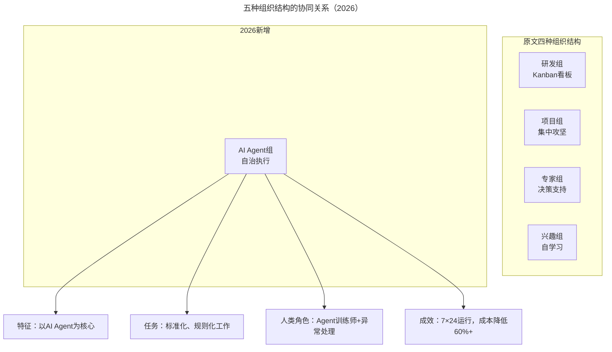
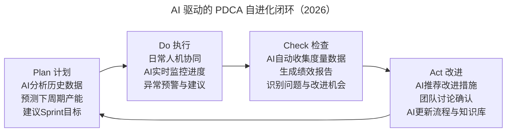

# 研发团队人均产能跃迁：搭班子与带队伍的人机协同框架

> **适用范围**：技术管理者、CTO、研发负责人，适用于需要系统性提升组织效能与人才梯队建设的中型及以上技术团队。

> **更新摘要（v2 · 2026-08 更新）**：在原文"搭班子、带队伍"实践基础上，整合 AI 时代人才矩阵、AI Agent 组织结构、人机互补木桶理论、AI 导师系统、AI 驱动 PDCA 闭环等内容，补充从 3.6 倍到 8-12 倍产能跃迁的 AI 贡献分解与三阶段落地路线图。

## 一、导言

上篇聚焦"定战略、抓战术"两个理性象限，本文聚焦"搭班子、带队伍"两个人文象限。搭班子和带队伍对应人文维度的决策与执行：搭班子是决策——选什么样的人、用什么样的阵型；带队伍是执行——如何让人在实践中成长、如何让团队自我进化。

随行付的实践表明，技术管理是理性和人文的结合体。理性做事解决"能不能做"的问题，人文育人解决"愿不愿意做、能做多久"的问题。在 2026 年 AI 时代，人文象限同样需要融入 AI 思维——人才标准新增 AI 协作能力维度，组织结构新增 AI Agent 组，团队建设引入人机互补的木桶理论，人才培养引入 AI 导师系统。AI 不是要改变"以人为核心"的理念，而是扩展"人"的定义——未来的高效团队是"人类+AI Agent"的混合体。

## 二、核心方法论

### 2.1 搭班子三步法与 AI 增强

搭班子可以概括为三个词：选人材、选阵型、搭团队。

**选人材**：正视二八定律，能者重用。原文将团队成员按业绩强弱与价值观强弱划分为千里马、小白兔、狐狸、野狗、老黄牛五类。领导者应把 80% 精力用在业绩强、价值观也强的"千里马"身上；价值观强但业绩弱的"小白兔"放在合适岗位，尤其不能放在管理位置；业绩强但价值观弱的"野狗"深谈一次，争取转化，无果则果断放弃；业绩和价值观双弱的"狐狸"尽早识别并淘汰；价值观和业绩中流的"老黄牛"用公平制度保证多劳多得。

AI 时代新增"AI 协作能力"作为人才评估的第三维度，形成增强型人才矩阵。AI 协作能力的评估包括：Prompt Engineering 能力（能否清晰向 AI 表达意图）、AI 输出评估能力（能否判断 AI 结果质量）、人机分工意识（知道什么适合 AI 做、什么必须人做）、AI 工具采纳度（日常工作中 AI 使用频率与深度）。在此基础上，原五类人才细化为：超级千里马（业务强+价值观强+AI 协作强）、千里马、AI 转型人才（业务中→强+价值观强+AI 协作强）、野狗、小白兔、狐狸/老黄牛。

**选阵型**：复合结构灵活运用。原文中随行付有四种组织结构——研发组（Kanban 看板，面向业务线敏捷团队，目标高速交付）、项目组（紧急重要任务集中攻坚）、专家组（领域专家专业性讨论，有否决权与建议权但无决策权，主责人承担最终成败）、兴趣组（民间组织，备案即成立）。

AI 时代新增第五种组织结构——AI Agent 组。其特征是以 AI Agent 为核心，处理标准化、规则化的工作；人类角色是 Agent 训练师加异常处理；可 7×24 小时运行，成本降低 60% 以上。典型应用场景包括自动化测试执行与报告生成、监控告警初步诊断与自愈、文档自动生成与维护、数据报表定期生成与分发、客服工单初步分类与回复。

AI Agent 组与原文四种结构形成互补：研发组确保常规工作自动运转，项目组攻坚紧急任务，专家组调动集体智慧并彰显公平，兴趣组赋能团队成长，AI Agent 组承接标准化工作的自治执行。五种结构的灵活运用，使团队能够应对日常工作中的各种场景。

**搭团队**：取长补短发挥"木桶效应"。搭团队要注重补短板，而用人恰恰要取长板，一定不能反着来。原文强调，错误的把补短板用在下属个人成长上极其危险——尝试让下属补短板可能导致人才流失与消沉。木桶的水位取决于最短的那块板，交付速度取决于流程中最慢的环节，这与 TOC（Theory of Constraints）瓶颈理论一致。

AI 时代的新木桶理论将团队能力与 AI 能力叠加：传统木桶中团队成员的能力短板决定团队上限；AI 时代木桶中 AI 在弱项上帮助更大，能够拉平短板。例如团队各成员能力为 [90, 85, 80, 75, 70]，AI 能力补强为 [+10, +15, +20, +25, +30]，综合能力达到 [100, 100, 100, 100, 100]，团队上限从 70 提升至 100。这意味着 AI 时代搭团队的核心命题从"补齐人的短板"转向"识别人与 AI 的最优组合"。

### 2.2 带队伍三带与 AI 赋能

带队伍可以概括为三个词：带着做、带着说、带着想。

**带着做**：在实践中进步。原文针对不同能力、不同意愿的员工采用差异化的管理方式——指令型（新员工、能力不足，传授具体工作细节）、支持型（能力够但信心不足，给予鼓励与支持）、教练型（能力和意愿都弱，精心设计任务由易到难）、完全授权型（轻车熟路、信心爆棚，留自主试错空间）。四种管理方式必须与员工胜任力匹配，不可错位。

AI 时代为每种管理方式增加了 AI 增强做法：指令型新增 AI 生成操作手册与 SOP 视频；支持型新增 AI Pair Programming 伙伴；教练型新增 AI 个性化学习路径；完全授权型新增 AI 助手随时待命答疑。AI 导师系统的核心能力包括 7×24 小时答疑、个性化学习推荐、代码实时指导、进度跟踪与提醒。

**带着说**：注重方法论的沉淀与分享。原文提出员工成长四阶段——"我做你看"（领导者示范）→"你做我看"（员工实践、领导者指导）→"我说你听"（领导者总结理论传授）→"你说我听"（员工总结方法论分享给团队）。员工成长 70% 来自工作中学习，20% 来自向他人学习，10% 来自正式培训。

AI 时代的知识管理新增 AI 知识提取与智能检索环节。传统方式下知识沉淀依赖人工写 Wiki/文档（意愿低）、检索依赖关键词搜索（查准率低）、传承依赖师徒制（覆盖率有限）、创新依赖偶发的头脑风暴。AI 增强方式下，AI 自动从对话、代码、提交记录提取知识（沉淀量 5-10 倍）、自然语言问答加语义搜索（查找速度 10 倍+）、AI 导师 7×24 在线（覆盖率 100%）、AI 关联推荐加跨界启发（创新频率 3-5 倍）。

**带着想**：以团队自我进化为目标。带队伍的最高境界是让团队自管理，实现自我进化。关键是由人治变为法治，领导者要学会限制自己的权利、学会放手。当制度建立起来，团队就可以"自动化"运转；把制度修订权也交给团队，管理就实现了"智能化"。原文推荐《重新定义管理：合弄制改变世界》，并践行 PDCA（Plan-Do-Check-Act）的自管理闭环。

## 三、关键流程

### 3.1 人才管理流程

人才管理遵循"识别→分类→培养→放手"的流程。识别阶段通过业绩、价值观、AI 协作能力三维度评估；分类阶段按增强型人才矩阵归类；培养阶段匹配差异化管理方式与 AI 增强工具；放手阶段对胜任者完全授权，对 AI Agent 组设定自治边界。

试错文化是人才管理流程的关键支撑。原文分享了一个亲身经历：2015 年初新系统上线时 Native 异常造成 1500 多万潜在损失，公司没有第一时间追责，而是叮嘱尽快解决问题。联合创始人的回答影响了作者一生——"公司花了这么大成本，让你学到了经验教训。让你离职，公司岂不白损失了？"这种试错文化是快速增长的动力来源之一。

### 3.2 团队自进化流程

AI 时代的团队自进化通过 AI 驱动的 PDCA 闭环实现，形成持续改进的飞轮。

Plan 阶段由 AI 分析历史数据、预测下周期产能、建议 Sprint 目标与任务分配，人类确认和微调；Do 阶段日常工作人机协同完成，AI 实时监控进度和质量，异常情况预警并建议；Check 阶段 AI 自动收集所有度量数据、生成绩效报告和洞察、识别问题和改进机会；Act 阶段 AI 推荐改进措施（基于行业最佳实践），团队讨论确认改进方案，AI 更新流程规范和知识库，进入下一个 PDCA 循环。这一闭环使团队自管理从"制度驱动"升级为"数据+AI 驱动"。

### 3.3 知识沉淀流程

知识沉淀遵循"个人隐性知识→AI 知识提取→结构化知识库→AI 知识图谱→智能检索与推荐→知识复用与创新→新知识产生"的循环。AI 在每个环节承担自动化工作：从对话与代码中提取隐性知识、构建知识图谱、提供自然语言问答、关联推荐跨界知识。领导者应培养团队的分享文化，"火炬会互相点燃"，让知识之火传遍整个团队。随行付通过内部"百人讲坛"创造分享环境，并将技术影响力作为员工职级晋升的重要条件。

## 四、工具与实战

### 4.1 人才评估工具

- **增强型人才矩阵**：在业绩、价值观基础上新增 AI 协作能力维度，形成三维评估模型。
- **AI 协作能力评估表**：从 Prompt Engineering、AI 输出评估、人机分工意识、AI 工具采纳度四个维度量化评分。
- **差异化管理系统**：根据员工胜任力匹配指令型、支持型、教练型、完全授权型管理方式。

### 4.2 组织结构工具

| 组织结构 | 协作方式 | 目标 | AI 时代增强 |
|---------|---------|------|-----------|
| 研发组 | Kanban 看板 | 高速交付 | +AI 辅助 Sprint 管理 |
| 项目组 | 集中攻坚 | 紧急任务 | +AI 资源调度与进度预测 |
| 专家组 | 专业讨论 | 决策支持 | +AI 知识库辅助决策 |
| 兴趣组 | 业余研究 | 团队成长 | +AI 个性化学习推荐 |
| AI Agent 组 | 自治执行 | 标准化工作 | 7×24 运行，成本降低 60%+ |

### 4.3 AI 能力建设路线图

**Phase 1：AI 工具普及（1-3 个月）**——全员配置 AI 编程助手（Cursor/Copilot/Windsurf），建立 AI 工具使用最佳实践库，设定 AI 采纳率阶段性目标（3 个月达 80%）。

**Phase 2：流程融合（3-6 个月）**——将 AI 融入现有四象限管理体系，在"搭班子"中增加 AI 协作能力评估，在"带队伍"中引入 AI 导师系统，建设 AI 知识管理和沉淀平台。

**Phase 3：能力跃升（6-12 个月）**——探索 AI Agent 组的试点运行，建设 AI 驱动的自进化管理系统，实现"定战略、抓战术"的数据化和智能化，目标为人均产能较基准再提升 200-400%。

## 五、常见误区

**在小白兔身上投入过多**：软件开发行业很看重天赋，天赋能保证生产力的量级。价值观强而业绩弱，只能说明能力已触达天花板，难以靠管理解决。让小白兔承担其无法胜任的工作，领导者是好心办坏事。AI 时代的新表现是期望 AI 工具能弥补能力差距——AI 能提升效率，但无法改变天赋上限。

**补短板用错地方**：搭团队要注重补短板，用人恰恰要取长板，二者不可混淆。把补短板用在下属个人成长上极其危险，可能导致人才流失。AI 时代的新木桶理论表明，补短板的正确方式是通过 AI 补强团队弱项，而非强迫个人弥补自身短板。

**试错文化错位**：试错不等于不追责。随行付的试错文化核心是"花成本学到教训后不轻易放弃人"，而非放任错误发生。AI 时代尤其要区分"值得 AI 试错的标准化任务"与"必须人类把关的高风险决策"，对后者不能以试错为名放松审核。

**AI 过度依赖**：不要忽视人的因素，AI 是放大器而非替代品。优秀的管理方法论依然是基础。不要一次性全面 AI 化，应选择 1-2 个点突破。重视 AI 伦理和安全，金融科技领域合规要求更高。持续测量和验证，用数据说话。

## 六、进阶延展

### 6.1 3.6 倍产能跃迁的 AI 时代解读

原文成果是随行付 3 年人均产能提升 3.6 倍。如果加上 AI，基于行业数据和案例分析，3-5 年内人均产能有望达到 8-12 倍。各提升因子的贡献分解如下：

| 提升因子 | 原文方法贡献 | AI 额外贡献 | 说明 |
|---------|------------|-----------|------|
| 组织优化 | +40% | +20% | AI 辅助决策和协调 |
| 流程改进 | +50% | +80% | AI 自动化大量环节 |
| 工具提效 | +30% | +150% | AI 原生工具的质变 |
| 人才培养 | +30% | +50% | AI 导师加速成长 |
| 文化驱动 | +20% | +30% | AI 释放创新时间 |
| 综合乘数 | 3.6 倍 | 8-12 倍 | AI 是新的增长引擎 |

### 6.2 从管理人到管理人与 AI 的协作

管理者的角色在 AI 时代发生根本转变：任务分配变为人机任务编排，需要理解 AI 能力边界；进度跟踪变为 AI 辅助监控加异常干预，需要数据解读能力；质量把关变为 AI 质量门禁规则制定，需要 AI 输出评估能力；团队建设变为人机协作文化建设，需要变革管理能力；技术决策变为 AI 方案评估与选择，需要 AI 技术判断力；人才培养变为 AI 能力发展规划，需要学习路径设计能力。

### 6.3 四象限框架的 AI 增强全景

将定战略、抓战术、搭班子、带队伍四象限的 AI 增强效果按"AI 增强潜力"与"实施难度"两个维度评估：抓战术位于快速见效区（高潜力、低难度），应优先突破；带队伍位于战略投入区（高潜力、高难度），需系统性建设；搭班子位于中间区域，可渐进增强；定战略位于谨慎探索区（中潜力、高难度），需管理者深度参与。这一优先级为四象限的 AI 落地提供了路线图。

---

*注：本文基于随行付 CTO 于人的技术管理实践，整合 2026 年 AI 时代搭班子与带队伍的升级内容。核心观点是：原文的管理方法论已经是一套经过验证的高效体系，AI 的作用是在这个体系上叠加新的杠杆效应，让每个象限的效能都能得到进一步放大。特别强调 AI 在人才培养、知识管理和自进化方面的革命性作用，以及在金融科技领域的特殊考量。*
