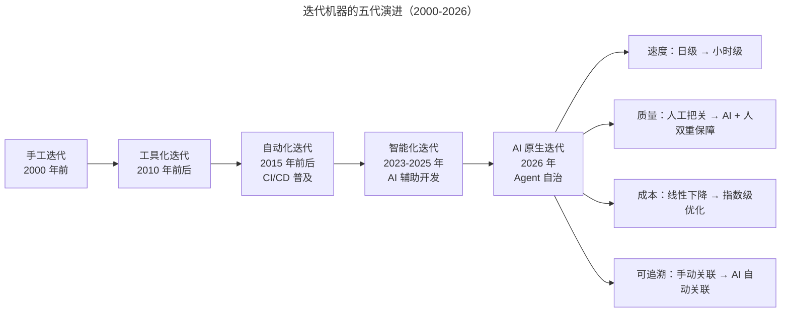
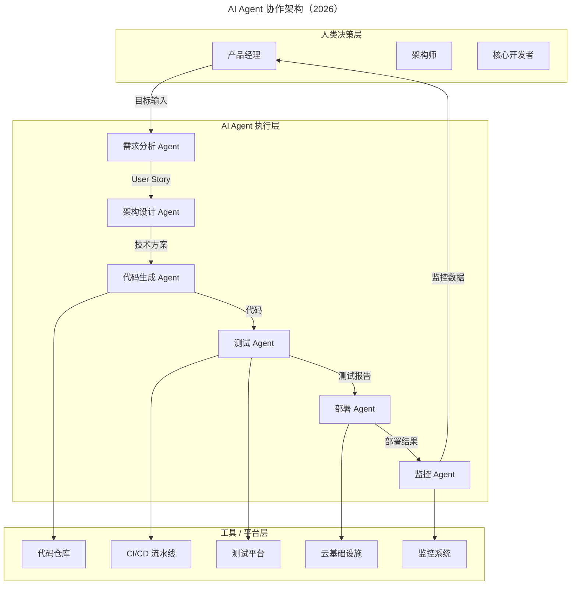

# 何世友：现代研发流程体系打造

> **适用范围**：CTO、技术总监、架构师、工程效能团队、DevOps 工程师；适用于希望打造高速运转的迭代机器（Iteration Machine）、并已在传统 CI/CD 流水线层面完成基础建设的团队，特别适用于规划 AI Agent 化升级的中大型研发组织。

> **更新摘要（v2 · 2026-08 更新）**：将原文上下两篇（迭代机器打造与流水线工具选型）与两份 AI 注解整合为统一叙事。保留"传送带—可追溯—沟通—自动化"四要素框架，整合 2026 年 AI 原生工具链、Agent 自治级别、AI 增强追溯、AIOps 智能运维等新内容，提供从基础设施到 Agent 化的完整落地路线图。

## 一、导言

移动互联网时代对研发流程提出两个没有上限的要求：迭代速度再快一点，交付质量更高一点。速度与质量在直觉上相悖，但在工程实践中必须同时满足。何世友将这一挑战归结为一个核心命题——打造一台高速运转的迭代机器（Iteration Machine）。

迭代机器的隐喻来自工业时代的传送带：贯穿各个环节，配合精确的时间控制，最终形成产出效率最大化的流水线。研发流程里的传送带就是现代化的项目管理工具，它承载任务流转与交付物关联，让一次迭代中的 5 种角色（PO、PM、Designer、Developer、Tester）与 10 种交付物（Story、Product Document、Task、Design、Test Case、Tech Design Document、Code Commit、CI Build、Test Run、Deployment）能够被系统化管理。

进入 2026 年，迭代机器的形态发生了代际跃迁：从"机器执行预设脚本"演进为"AI Agent 驱动的智能系统"。GPT-5.5、DeepSeek V4 等大语言模型的代码能力达到高级工程师水平，Agent 可自主完成端到端的开发任务，迭代周期从 2-4 周压缩到 3-7 天。本文将原文的四要素框架与 2026 年 AI 原生实践整合，给出一份从诊断到落地的完整指南。

## 二、核心方法论

### 2.1 迭代机器的演进路线

图示说明：五代演进并非完全替代，而是层层叠加——2026 年的 AI 原生迭代仍然依赖工具化时代的项目管理平台、自动化时代的 CI/CD 流水线、智能化时代的 AI 编程助手。AI 原生的核心增量在于 Agent 自治：从"人类发指令、机器执行"演进为"人类设定目标与约束、Agent 自主完成"。

### 2.2 四要素框架

迭代机器的打造可拆解为四要素：高速运转的传送带、可追溯的迭代、人与机器的沟通、用机器打造迭代机器。

**传送带**指现代化的项目管理工具。它不仅让各角色在平台上手工创建、更新任务卡片，更要具备从交付物所在平台获取动作事件、自动更新任务状态的能力。例如工程师完成一次代码提交，意味着任务完成，此时不应再要求他手动去任务平台更新状态。一个任务关联的产品原型、设计稿、技术设计文档、代码、测试用例、CI 构建、部署结果，都应被串联起来。

**可追溯**是传送带串联交付物的核心价值。互联网项目的代码腐化速度早已从年提升到月，新人 3 个月后往往搞不懂代码为何写成那样，根本原因就是无法追溯。仅靠任务平台关联产品变更与代码变更还不够，必须补充不断迭代的技术架构设计文档——架构设计也应像代码一样持续迭代，否则产出的代码一定不好理解。

**沟通**不仅是人与人之间，还包括人与机器之间。研发流程里参与的角色一半以上是机器或系统，沟通工具必须让人类角色能像与其他人类沟通一样与机器沟通——接收机器的通知（代码提交、告警）、向机器发送指令。Slack 的 Thread 功能让 #codereview 群组中的临时讨论不至于冲垮主消息流，是这种沟通形态的典型范例。

**用机器打造迭代机器**意味着尽可能自动化：编码（人类才智）→ 静态检查（机器）→ 单元测试（机器）→ 测试（机器）→ 代码审查（人类才智）→ 构建（机器）→ 部署（机器）→ 监控（机器）→ 自动扩缩容（机器）。除两个必须人类参与的步骤外，其他环节机器均可胜任。

### 2.3 AI 原生四要素升级

2026 年，四要素均发生质的改变：

| 要素 | 传统形态 | 2026 AI 原生形态 |
| --- | --- | --- |
| 传送带 | Jira/Trello 手动更新 | Linear AI/Cursor Projects 自动感知状态、预测进度、预警风险 |
| 可追溯 | 任务平台关联交付物 | AI 自动关联 Git PR、Design 文件、Test 结果，5-10 分钟定位根因 |
| 沟通 | Slack + 邮件 + 机器通知 | AI 内置沟通助手、上下文自动带入、跨时区异步协作 |
| 自动化 | CI/CD 流水线执行脚本 | AI Agent 协作架构，L1-L5 自治级别 |

## 三、关键流程

### 3.1 角色与交付物的 AI 增强

迭代过程涉及的 5 种角色在 2026 年演变为"人 + AI 助手"的协同形态：PO + AI 战略助手（AI 辅助优先级排序与市场分析）、PM + AI 需求分析师（AI 辅助 PRD 编写与用户故事拆解）、Designer + AI 设计助手（AI 生成初稿、人工精调）、Developer + AI Pair Programmer（人机结对编程，效率提升 2-3 倍）、Tester + AI 测试工程师（AI 生成用例、自动执行回归）。

10 种交付物的产出效率也获得数量级提升：Story 由人工撰写变为 AI 辅助生成 + 质量评分（3-5 倍）；Product Document 由手写文档变为 AI 生成初稿 + 人工审核（5-10 倍）；Task 由手动创建变为 AI 自动分解 Story 为 Task（4-6 倍）；Test Case 由测试工程师编写变为 AI 自动生成 + 覆盖率分析（10-20 倍）；Code Commit 由手工编码变为 AI Pair Programming（2-3 倍）；Deployment 由自动部署变为 AI 灰度发布 + 自动回滚（风险降低 80%）。

### 3.2 AI 增强追溯

图示说明：Agent 协作架构的关键不在于 Agent 数量，而在于"人类决策层—Agent 执行层—工具平台层"的清晰分层。人类负责设定目标与约束、审核关键产物，Agent 负责执行与产出，工具平台提供数据与算力。Agent 自治程度分为五级：L1 辅助型（10% 自治，敏感业务全程人工监督）、L2 协作型（40%，关键节点人工确认）、L3 半自主型（70%，内部工具异常时人工处理）、L4 自主型（90%，基础设施定期人工审计）、L5 全自主型（99%+，实验性项目仅设定目标与约束）。

### 3.3 流水线各环节的 AI Agent 升级

**静态检查**：从 ESLint、Pylint、FindBugs 升级为 AI Lint Agent，检查范围从语法错误扩展到语义逻辑、性能隐患、安全漏洞，自动修复 60-80% 的问题，并能从团队历史代码学习最佳实践。

**单元测试**：AI 测试生成 Agent 将编写速度从 1-2 小时 / 模块压缩到 5-10 分钟 / 模块，覆盖率从 60-80% 提升到 85-95%，边界条件由 AI 自动识别与覆盖，测试维护成本降低 70%。

**代码审查**：AI Code Review Agent 在 PR 提交后立即预审查，过滤 80% 的常规问题（代码风格、常见 Bug 模式、安全漏洞），让人类 Reviewer 聚焦在 20% 的高价值问题（架构合理性、业务逻辑正确性）。代码审查时间从 4-8 小时 / Sprint 压缩到 0.5-1 小时 / Sprint。

**自动化测试**：AI 智能测试编排 Agent 基于代码变更影响分析选择最相关的测试子集，测试时间降低 70%，覆盖率不变；失败智能分析自动区分环境问题、数据问题、真正的代码 Bug，误报率降低 60%。

**部署**：AI 智能部署 Agent 评估部署风险、制定部署策略、实时监控健康指标、异常时秒级自动回滚。回滚决策从人工判断（可能犹豫）变为秒级自动回滚，减少故障影响时间 90%。

**监控**：AIOps 智能运维 Agent 分五层——L1 监控（AI 异常模式识别，误报降低 70%）、L2 告警（智能降噪 + 根因定位，告警量降低 80%）、L3 诊断（AI 自动诊断 + 提供修复方案，MTTR 降低 75%）、L4 自愈（AI 自动执行已知修复脚本，自愈率 60%+）、L5 预防（AI 预测性维护，故障降低 50%）。

## 四、工具与实战

### 4.1 AI 工具选型指南

| 环节 | 推荐工具 | 适用场景 |
| --- | --- | --- |
| AI 编程助手 | Cursor / Windsurf / GitHub Copilot Workspace | 日常开发 |
| AI 代码审查 | CodeRabbit / Amazon CodeReviewer | GitHub/GitLab |
| AI 测试生成 | CodiumAI / Meta AI TestGen | 提升覆盖率 |
| AI 部署 | Harness AI / Argo CD + AI 插件 | K8s 环境 |
| AIOps | Datadog AI / PagerDuty AI | 生产运维 |
| AI 项目管理 | Linear AI / Notion AI | 敏捷团队 |

### 4.2 2026 年迭代效能基准

基于行业调研数据（2025-2026），AI 增强团队的典型指标：

| 指标 | 传统团队 | AI 增强团队 | 提升幅度 |
| --- | --- | --- | --- |
| 迭代周期 | 2-4 周 | 3-7 天 | -50-75% |
| 单次迭代产出 | 基准 100 | 150-250 | +50-150% |
| 代码审查时间 | 4-8 小时 / Sprint | 0.5-1 小时 / Sprint | -87% |
| 测试覆盖率 | 60-80% | 85-95% | +25-35% |
| 部署频率 | 周 / 双周级 | 日 / 多次日 | 7-14 倍 |
| MTTR | 1-4 小时 | 10-30 分钟 | -87% |
| 文档完整性 | 40-60% | 95%+ | +35-55% |

### 4.3 落地路线图

Phase 1 基础设施建设（1-2 个月）：为团队配置 AI 编程助手；升级项目管理工具至 AI 原生版本；建立 AI 辅助的代码审查流程。Phase 2 流程融合（2-4 个月）：将 AI 融入 Sprint Planning、Daily Standup 等仪式；部署 AI 测试用例生成与自动化执行；实施 AI 辅助的技术文档自动维护。Phase 3 Agent 化探索（4-6 个月）：在低风险项目中试点 Agent 自治开发；建立 Agent 输出质量评估体系；探索多 Agent 协作模式。Phase 4 全面智能化（6-12 个月）：逐步提升各环节 Agent 自治级别；建设内部 AI 平台（IDP）降低使用门槛；形成 AI 原生的研发文化与最佳实践库。

## 五、常见误区

**误区一：一次性全面替换。** AI 化应渐进式采用，逐步引入 AI 能力，避免一次性全面替换导致团队适应困难与流程中断。

**误区二：放弃人类把控。** 关键决策节点必须保留人工审核。AI 擅长处理常规问题，但架构合理性、业务逻辑正确性仍需人类主导。

**误区三：忽视数据质量。** AI 的效果高度依赖训练数据与上下文数据的质量。若代码库本身混乱、文档缺失、历史任务未关联，AI 增强追溯与代码审查的准确率会大幅下降。

**误区四：工具碎片化。** 不同环节使用不同 AI 工具、数据不通，是 2026 年效率低下的头号根因。统一工具栈与统一数据平台是前提。

**误区五：忽视 AI 伦理与安全。** AI 生成的代码可能有安全隐患，AI 使用需建立伦理规范与数据安全红线，禁止将生产密钥、PII、核心算法输入外部 AI 服务。

**误区六：忘记团队成长。** 一台高速运转的迭代机器中，人类角色才是真正的瓶颈。AI 工具再强，也需要具备 AI 素养的人才来驾驭。坊间有句话——互联网公司都是轻资产，值钱的就是人、流程、代码——这一判断在 2026 年依然成立。

## 六、进阶延展

当四要素的 AI 原生升级已落地后，团队可向三个方向延展。第一是多 Agent 协作模式探索：从单 Agent 自治扩展到多 Agent 编排，例如需求分析 Agent 自动调用架构设计 Agent、架构设计 Agent 调用代码生成 Agent，形成端到端的 Agent 流水线。第二是内部 AI 平台（IDP）建设：将 Prompt Library、Agent 编排、AI 工具配置集中到统一平台，降低团队使用门槛，让 AI 能力成为基础设施而非个人技能。第三是 AI 原生研发文化建设：将 AI 工具使用率、Agent 自治级别、AI 输出质量纳入团队效能度量，让"用 AI 驾驭 AI"成为团队的默认工作方式。

需要强调的是，迭代机器的打造没有终点。从手工迭代到 AI 原生迭代，每一代演进都在前一代基础上叠加而非取代。2026 年的迭代机器不再是简单的工具链自动化，而是由 AI Agent 驱动的、具备一定自主能力的智能系统。但无论形态如何变化，"产品快速度、高质量的生长离不开高速运转的迭代机器"这一核心判断始终成立。研发流程是一个团队打造产品的过程，这里边一个最基本的性质就是生长、不断的生长——这一本质，AI 时代同样不会改变。
