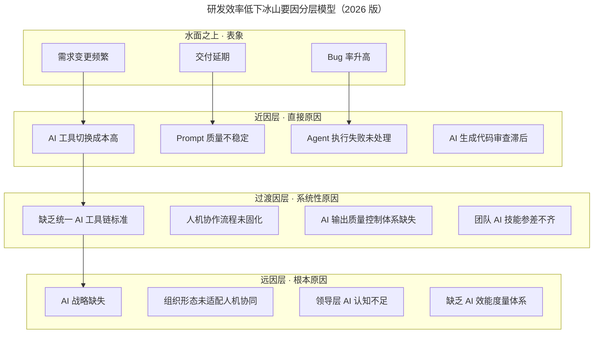
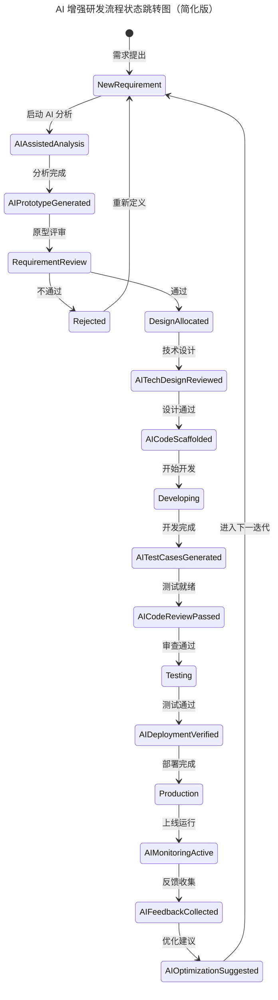

# 兰军：团队研发效率低下的要因分析

> **适用范围**：技术管理者、研发负责人、PMO、工程效能（Engineering Productivity）团队成员；适用于团队迭代延期、交付质量波动、AI 工具落地效果不达预期等问题的根因诊断与改进规划。

> **更新摘要（v2 · 2026-08 更新）**：在原冰山要因分析法与 21 种需求状态梳理的基础上，整合 2026 年 AI 普及背景下新增的 10 类 AI 状态节点、AI 效能度量指标体系与 30 天改进路线图，统一为一份覆盖诊断、流程、制度、能力、招聘的完整方法论。

## 一、导言

研发效率未达预期是绝大多数技术团队都会反复遭遇的问题。项目延期的表面原因五花八门——技术难题未突破、需求发生变更、设计方案反复调整、测试反馈滞后——但延期的真正价值不在于追责，而在于能否系统地找出更深层根因，避免在下一个迭代中重蹈覆辙。

进入 2026 年，Stack Overflow 开发者调查数据显示，84% 的开发者正在使用或计划在其开发流程中使用 AI 工具（2025 年调查口径），团队效率的瓶颈已经从"人工编码速度"迁移到"AI 工具链整合度""人机协作流畅度"和"Agent 自动化覆盖率"。这意味着传统的要因分析框架必须扩展，才能识别出 AI 时代特有的新根因，例如 Prompt Debt（提示词债）、Agent 僵尸任务、AI 工具碎片化等。

本文基于兰军在 ArchSummit 全球架构师峰会上分享的冰山要因分析法，结合 2026 年 AI 工程效能实践，给出一份适用于当前技术环境的诊断与改进框架。

## 二、核心方法论

### 2.1 冰山要因分析法

冰山模型将研发效率低下的原因分为三层：露出水面的近因（表面原因）、隐藏在水面之下的过渡因（迷惑性原因）和远因（根本原因）。远因一旦改善，往往能从根本解决问题；近因只是表象，处理近因只能缓解一时。

图示说明：水面之上的三类表象仅是结果，必须沿近因—过渡因—远因的链条逐层下沉，才能定位到决定整个团队 AI 转型方向是否正确的根本原因。远因基本都与领导者相关，老板就是组织的"天花板"。

### 2.2 头脑风暴与因果评分

要因分析的第一步是组织产品、技术、设计等所有相关角色进行头脑风暴，尽可能多地列举问题，不做反驳。第二步是构建因果矩阵：将所有原因在横向与纵向两两列出，逐一比较，"因"记 -1 分，"果"记 +1 分，无关记 0 分，再对每行求和并排序。

分数越高代表越接近近因，分数越低代表越接近远因。以最高分 H 与最低分 L 为基准，H/2 与 L/2 即为近因—过渡因、过渡因—远因的分界线。例如最高分 8、最低分 -11，则大于 4 的为近因，小于 -5.5 的为远因。

在 AI 时代，评分矩阵必须引入 AI 相关因子，例如"AI 工具不统一""Prompt 质量差""缺乏 AI 流程规范""导师/AI 教练缺位""招聘时未考察 AI 能力""管理层 AI 认知不足"等。下表展示了一份典型的 2026 版评分结果：

| 原因 | 总分 | 层级 |
| --- | --- | --- |
| 需求变更频繁 | +3 | 近因 |
| AI 生成代码 Bug 多 | +1 | 近因 |
| 缺乏 AI 流程规范 | +1 | 近因 |
| 导师 / AI 教练缺位 | +1 | 近因 |
| Prompt 质量差 | 0 | 过渡因 |
| 招聘时未考察 AI 能力 | 0 | 过渡因 |
| AI 工具不统一 | -2 | 过渡因 |
| **管理层 AI 认知不足** | **-6** | **远因** |

结论很明确：2026 年研发效率低下的最大远因是"管理层 AI 认知不足"，它决定了团队的 AI 转型方向、工具选型、流程重塑和人才培养是否到位。

### 2.3 四大问题分类

为便于落地，可将所有原因归纳为四大类：组织与制度问题、能力问题、沟通问题、招聘与解聘问题。组织与制度问题对应研发流程、考核机制、AI 治理规范；能力问题对应专业技能与 AI 素养；沟通问题对应信息透明度与人机协作带宽；招聘与解聘问题对应人员入口与出口的 AI 标准。后续章节将分别给出针对性的解决措施。

## 三、关键流程

### 3.1 研发流程的细化梳理

各公司研发流程的整体步骤并无本质差异：提需求、需求评审、设计与技术方案、开发、产品与设计验收、提测、灰度发布、正式发布。差异在于对中间环节的细化程度。梅沙科技在使用 TAPD（Tencent Agile Product Development）时，将需求细化为 21 种状态，覆盖从新需求、规划中、需求评审、UI 设计、开发中、需求变更、提测、产品发布到外网验证的完整链路，并为每一个状态明确负责人与可跳转的下游状态。

进入 2026 年，21 种状态已不足以覆盖 AI 增强后的研发流水线，需要新增 10 种 AI 相关状态节点：

| 新增状态 | 触发条件 |
| --- | --- |
| AI-Assisted-Analysis | PM 使用 AI 工具分析需求 |
| AI-Prototype-Generated | AI 生成可交互原型 |
| AI-Tech-Design-Reviewed | AI 参与的技术方案通过 Review |
| AI-Code-Scaffolded | AI 生成项目基础代码脚手架 |
| AI-Test-Cases-Generated | AI 自动生成测试用例集 |
| AI-Code-Review-Passed | AI Code Review 工具审核通过 |
| AI-Deployment-Verified | Agent 自动完成部署验证 |
| AI-Monitoring-Active | AI 监控系统接入并启用 |
| AI-Feedback-Collected | AI 自动收集并分析用户反馈 |
| AI-Optimization-Suggested | AI 提出性能或体验优化建议 |

图示说明：AI 状态节点并非简单的"额外步骤"，而是嵌入到既有流程的关键控制点。每一个 AI 节点都意味着一次自动化的质量门禁或一次可追溯的产物沉淀，使流程在不变长的情况下显著增强可控性。流程图绘制完成后，必须在团队中开展培训，让每个成员都清楚每一步的负责人与跳转条件，否则再细化的流程也只是文档。

### 3.2 四大类问题的应对策略

**组织与制度问题**的核心是建立 AI 治理体系：制定《团队 AI 工具使用手册》、建立团队 Prompt Library、定义 AI Code Review 规则与人工复审门槛、明确哪些任务可交给 Agent 全权处理、规定哪些代码与数据可以输入 AI 工具。其中数据安全红线尤其重要——禁止将生产环境密钥、用户个人身份信息（PII）、公司核心算法完整代码输入外部 AI 服务。

**能力问题**对应原文中"专业培训不足、导师指导不到位"的远因。2026 年的解决方案是将 AI 技能分为四个等级：L1 AI 使用者（会用 AI 工具写代码，1-2 周培养）、L2 AI 协作者（能优化 Prompt、调试 Agent，1-2 月）、L3 AI 架构师（能设计 AI 工作流、评估 AI ROI，3-6 月）、L4 AI 战略家（能制定团队 AI 转型路线图，6-12 月），并配套对应的认证方式。

**沟通问题**的解法是 AI 增强沟通带宽：使用 AI Meeting Assistant 自动记录会议纪要并提取 Action Items；使用 AI Documentation Generator 将代码变更同步到文档；在 IM 工具中部署 AI Status Bot 实时回答项目状态查询；使用 AI Cross-team Translator 在不同技术栈团队之间自动解释术语与架构决策。

**招聘与解聘问题**要求将 AI 能力纳入招聘标准。AI 素养权重应达到 20%，与编程能力、系统设计、问题解决、团队协作、学习能力并列。面试必问题包括：使用 AI 工具提升效率的具体案例、如何判断 AI 输出代码的正确性、AI 与直觉冲突时的处理方式、AI 在软件开发中的局限性。

## 四、工具与实战

### 4.1 AI 效能度量指标

传统指标（交付周期、Bug 率、On-call 频率）无法反映 AI 时代的真实效率，必须新增以下七项指标：

| 指标名称 | 定义 | 健康值 | 警戒值 |
| --- | --- | --- | --- |
| AI Adoption Rate | 团队成员日均使用 AI 工具的比例 | >80% | <50% |
| AI Acceptance Rate | AI 生成代码被采纳的比例 | 60-75% | <40% |
| Prompt Quality Score | Prompt 的有效性评分 | >7.5/10 | <5/10 |
| Agent Success Rate | Agent 任务自主完成的成功率 | >85% | <70% |
| AI Time Saved | AI 工具节省的人均工时 / 周 | >8 小时 | <3 小时 |
| AI Debt Ratio | 需要人工修正的 AI 输出比例 | <25% | >45% |
| Human-AI Collaboration Index | 人机协作流畅度综合评分 | >8/10 | <5/10 |

### 4.2 30 天改进计划

第 1 周聚焦诊断与基线建立：发放团队 AI 使用现状调研问卷，统计现有 AI 工具使用情况与痛点，建立上述七项指标的基线数据。第 2 周聚焦制度建设：起草《团队 AI 工具使用规范》，搭建内部 Prompt Library（至少收录 20 个高质量 Prompt），组织全员 AI 工具使用培训。第 3 周聚焦流程改造：在现有研发流程中嵌入 AI 状态节点，选择 1 个试点项目端到端运行 AI 增强流程。第 4 周聚焦复盘与推广：试点项目复盘并量化效率提升，制定下一季度 AI 转型路线图，全员分享成功经验。

预期成果：需求分析耗时从 5 天 / 需求压缩到 2 天 / 需求（30 天后）再到 1 天 / 需求（90 天后）；代码 Review 周转时间从 24 小时压缩到 8 小时再到 4 小时；Bug First Response Time 从 4 小时压缩到 2 小时再到 30 分钟（Agent 自动响应）；团队 AI Adoption Rate 从未知提升到 80% 再到 95%。

## 五、常见误区

**误区一：只处理近因，忽视远因。** 团队看到"需求变更过多"就加强需求管控，看到"Bug 率升高"就增加测试，但若不解决远因（管理层 AI 认知不足、组织形态未适配人机协同），近因会以新的形式反复出现。

**误区二：流程细化等于流程繁重。** 21 种或 31 种需求状态的本质是"明确每个环节的负责人与跳转条件"，而非让团队陷入状态流转的官僚主义。流程细化的同时必须配套培训与工具自动化，否则会反过来拖慢效率。

**误区三：AI 工具堆砌等于 AI 转型。** 团队使用 5 种以上不同 AI 工具、上下文无法共享，是 2026 年效率低下的头号新根因。统一工具栈、建立 Prompt Library、定义 AI 输出质量标准，比工具数量更重要。

**误区四：Agent 失败后无人处理。** 自动化 Agent 失败后形成的"僵尸任务"是隐蔽的效率黑洞。必须为每一个 Agent 任务明确失败时的告警路径与人工接管流程。

**误区五：用传统指标衡量 AI 时代的效率。** 仅看交付周期与 Bug 率，会遗漏 AI Debt Ratio、Prompt Quality Score 等关键信号，导致团队表面高效实则积累隐患。

## 六、进阶延展

当团队完成 30 天基础改进后，可向三个方向延展。第一是 Agent 自治级别提升：从 Level 1 辅助型（敏感业务、全程人工监督）逐步演进到 Level 3 半自主型（内部工具、异常时人工处理），最终在实验性项目中探索 Level 5 全自主型。第二是 AI 原生研发文化建设：将 AI 工具使用率、Prompt 贡献数、AI 优化案例纳入绩效评估，让 AI 能力成为团队默认技能而非加分项。第三是跨团队 AI 协同：建立公司级 Prompt Library 与 Agent 编排平台，让不同团队的 AI 产物可复用、可组合，避免重复造轮子。

需要强调的是，冰山要因分析法本身是一种可重复使用的诊断工具。建议每季度重做一次因果评分，观察远因是否已迁移——当"管理层 AI 认知不足"不再是最低分时，意味着团队已进入下一阶段的瓶颈，例如"AI 工具链的工程化成熟度"或"Agent 治理体系"。诊断的持续性，决定了改进的持续性。
