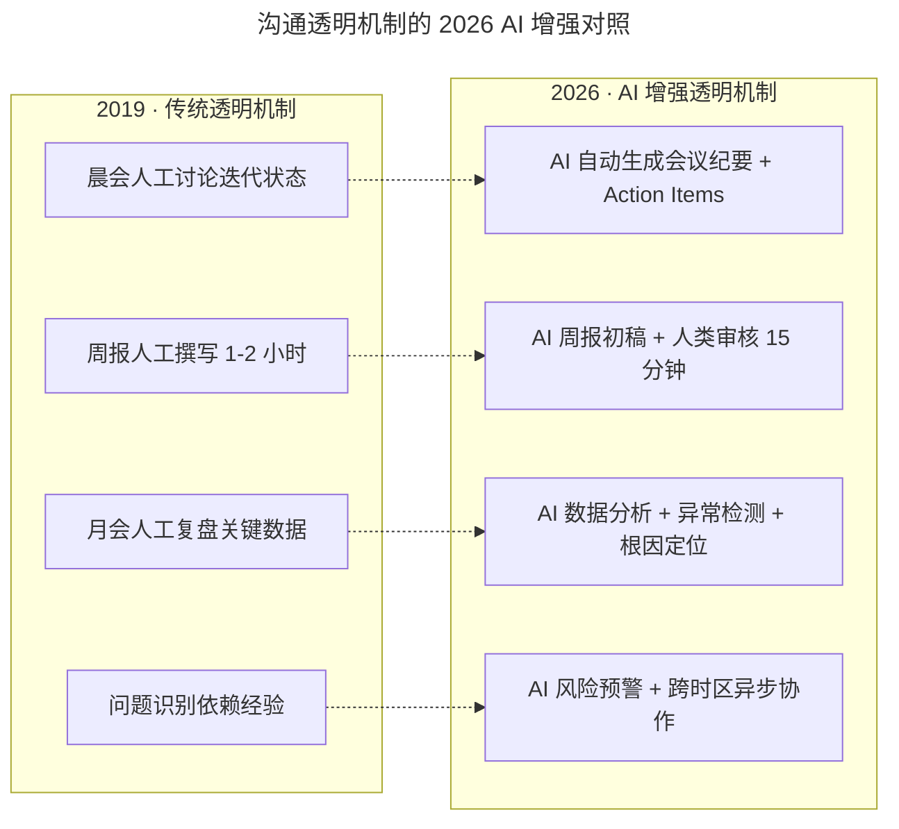
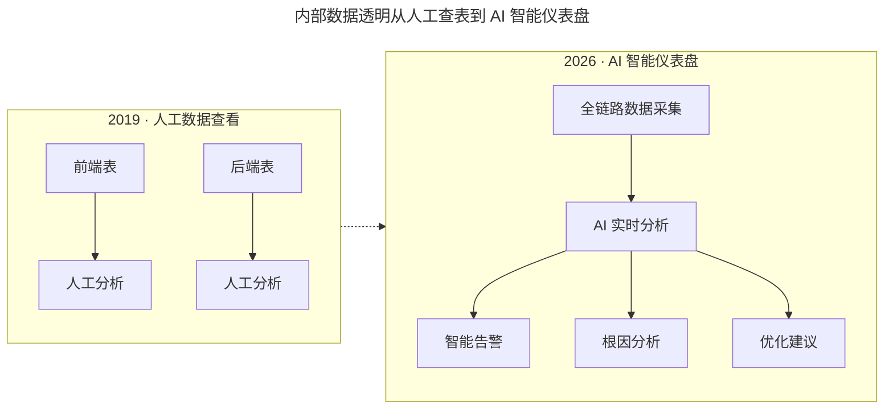

# 兰军：提升产品团队研发效率的实践（上）

> **适用范围**：技术管理者、产品负责人、工程效能团队成员；适用于希望从沟通、数据透明与能力培养三个维度系统提升团队研发效率，并已完成根因诊断（参见《团队研发效率低下的要因分析》）的团队。

> **更新摘要（v2 · 2026-08 更新）**：在原"沟通公开透明、内部数据透明、能力提升培训"三大实践基础上，整合 2026 年 AI 增强的会议纪要、进度追踪、智能仪表盘、个性化学习路径等新方法，给出一份覆盖工具链升级、监控维度扩展与培训体系重塑的统一实践指南。

## 一、导言

在完成研发效率低下的根因诊断后，接下来需要从能力问题与沟通问题两个方向落地改进。梅沙科技的实践可以归纳为三件事：沟通公开透明、内部数据透明、能力提升培训。这三件事看似朴素，但其背后指向的是研发效率提升的底层逻辑——信息对称减少协作损耗、数据可视化暴露隐性风险、人员能力提升扩大团队产出上限。

进入 2026 年，84% 的开发者正在使用或计划在开发流程中使用 AI 工具（Stack Overflow 2025 开发者调查口径），DevOps 演进为 AIOps，AI Agent 开始参与项目管理。这三大实践的形态发生了显著变化：会议纪要由 AI 自动生成并提取 Action Items；项目进度通过 Git Hook 与 AI 状态推断自动同步；周报由 AI 从代码提交与 PR 中提炼初稿，人类仅需 15 分钟审核；数据仪表盘从人工查看升级为 AI 实时分析、智能告警与根因定位；培训从统一课程升级为基于技能短板的个性化学习路径与 AI 编程助手的 24/7 教练模式。

本文将三大实践与 2026 年 AI 增强方法整合为统一叙事，并提供可执行的工具链与行动清单。

## 二、核心方法论

### 2.1 沟通公开透明

公开透明的沟通机制让团队成员彼此了解工作目标、进度与经验，从而减少信息不对称带来的隔阂与重复劳动。梅沙科技的实践是晨会、周会、月会固定在早上九点半召开，晨会主看迭代表，周会主看周报，月会主看关键数据。

迭代表包含需求、迭代、任务、缺陷等内容。若某项目迭代正常则跳过，若出现问题则将该迭代公开投影到会议室墙上，团队一起分析。周报包含四个模块：本周工作小结、下周工作计划、每周关键数据、问题反思与经验沉淀。其中"每周关键数据"最为关键，每位成员都需提炼自己所负责项目的数据并公开分享。周报全员公开，遇到问题会有成员主动给出建议，沉淀的经验可被全员借鉴。

图示说明：透明机制的"公开"原则没有变，变的是"透明的成本"——AI 把人工记录、人工撰写、人工分析的负担降到最低，让团队把精力聚焦在决策与行动上。下表对比了关键维度在两个时代的差异：

| 维度 | 2019 年 | 2026 年 |
| --- | --- | --- |
| 会议记录 | 人工记录 | AI 自动生成 + Action Items 提取 |
| 进度追踪 | 手动更新 JIRA | Git Hook 自动同步 + AI 状态推断 |
| 周报撰写 | 每人 1-2 小时 | AI 初稿 + 人类审核 15 分钟 |
| 问题识别 | 依赖经验 | AI 数据分析 + 异常检测 |

### 2.2 内部数据透明

数据透明的核心是让每位团队成员都能查看产品前端与后端的关键指标。前端关注页面访问量与页面加载速度，可反馈前端开发质量与技术实力；后端关注接口调用次数、反馈时长、平均耗时，若访问次数高但调用速度慢则必然存在问题。

2026 年的数据透明从"人工查看两张表"升级为"AI 智能仪表盘"：全链路数据采集后由 AI 实时分析，输出智能告警、根因分析与优化建议。监控维度也需扩展：

| 监控项 | 2019 年 | 2026 年新增 |
| --- | --- | --- |
| 性能指标 | 加载速度、接口耗时 | AI 推理延迟、Token 消耗成本 |
| 质量指标 | Bug 数、Crash 率 | AI 生成代码质量、幻觉率 |
| 效率指标 | 开发周期、交付速度 | AI 辅助率、Prompt 成功率 |
| 成本指标 | 服务器成本 | AI API 费用、云资源成本 |

图示说明：数据透明并未止步于"看得见"，而是演进到"看得懂、能行动"。AI 仪表盘的真正价值在于把数据转化为决策建议，让管理者即使不再深入具体产品与开发工作，也能从前端加载速度、后端接口耗时、Token 消耗、AI Debt Ratio 等指标中读出产品的流畅程度与稳定系数。

### 2.3 能力提升培训

原文将培训不足定位为研发效率低下的远因之一，并给出三种实践：互相培训、阅读分享、项目复盘。互相培训指各小组互相教授经验，例如开发给产品讲"状态机"概念以减少沟通障碍，设计师给产品讲对比色、临近色等专业知识并形成设计规范。阅读分享要求每位成员每年至少读完三本书并制作 PPT 在晨会分享，60 人团队每年可产生 180 次分享。项目复盘则通过具体案例（如登录注册流程图的规范化）沉淀团队共识。

2026 年的培训体系在三种实践基础上扩展为 AI-Augmented Learning：

| 实践 | 2019 年形态 | 2026 年 AI 增强形态 |
| --- | --- | --- |
| 互相培训 | 开发给产品讲状态机 | AI 生成可视化教程 + 互动练习 + 知识图谱 |
| 阅读分享 | 每年 3 本书 + PPT 分享 | AI 读书助手摘要 + 知识库语义检索 + 学习社群 |
| 项目复盘 | 人工复盘流程图规范 | AI 代码模式挖掘 + 最佳实践文档自动生成 + 预防性建议 |

AI 编程助手成为 24/7 导师，AI Code Review 成为实时教练，AI 知识库沉淀团队智慧并支持语义检索，AI 模拟面试与演练用于技能验证。这些能力让培训从"统一课程"演进为"基于技能短板的个性化学习路径"。

### 2.4 研效提升公式

原文的核心逻辑是"提升人员能力 → 改善沟通 → 提高效率"。2026 年这一逻辑可扩展为加权公式：

研发效率 = f( 人员能力 30%、工具赋能 25%、流程优化 20%、数据驱动 15%、文化氛围 10% )

其中人员能力是传统技能与 AI 素养的综合；工具赋能是 AI 工具链完善度；流程优化是自动化程度；数据驱动强调决策基于数据而非直觉；文化氛围指学习型组织。五项权重并非固定，团队可根据自身阶段调整，但任何一项缺失都会成为新的瓶颈。

## 三、关键流程

### 3.1 沟通透明的落地流程

第一步，固定会议节奏：晨会九点半，周二变周会，每月第一周周二变月会，所有会议同一时间点便于形成习惯。第二步，定义迭代表字段：需求、迭代、任务、缺陷，并约定"正常则跳过、异常则投影上墙"的规则。第三步，定义周报四模块并强制公开。第四步，引入 AI 增强工具：Otter.ai、Fireflies 等自动生成会议纪要；飞书智能伙伴或 Notion AI 辅助周报初稿；IM 中部署 AI Status Bot 实时回答项目状态查询。第五步，建立跨时区异步协作机制，AI 翻译与摘要让分布式团队的沟通成本接近本地团队。

### 3.2 数据透明的落地流程

第一步，明确前后端两张表的指标定义。第二步，搭建全链路数据采集，覆盖性能、质量、效率、成本四类指标。第三步，引入 AI 智能仪表盘，配置智能告警阈值与根因分析规则。第四步，将数据访问权限对全员开放，不止是管理者。第五步，建立数据治理机制：统一各部门对数据的定义，搭建数仓与 BI 系统，避免"同一指标不同口径"的混乱。

### 3.3 能力培训的落地流程

第一步，组织互相培训：产品给设计与开发讲产品课，设计讲交互与 UI，开发讲技术，测试讲质量。第二步，建立阅读分享机制：每人每年至少 3 本书 + PPT 分享，团队规模 60 人则产生 180 次分享。第三步，建立项目复盘机制：使用"复盘四步法"——审视目标、回顾过程、分析得失、总结规律。第四步，引入 AI 增强学习：AI 个性化学习路径根据技能短板推荐内容；AI 编程助手作为 24/7 导师；AI Code Review 作为实时教练；AI 知识库沉淀团队智慧并支持语义检索；AI 模拟面试用于技能验证。第五步，将培训成果纳入绩效：AI 工具使用率、Prompt 贡献数、内部分享次数均可量化。

## 四、工具与实战

### 4.1 工具链升级清单

| 场景 | 推荐工具 |
| --- | --- |
| 会议纪要 | Otter.ai、Fireflies、飞书智能伙伴 |
| 周报生成 | Notion AI、飞书智能伙伴 |
| 进度追踪 | Linear AI、Jira + AI 插件 |
| 数据仪表盘 | Datadog AI、Grafana + AI 插件 |
| AI 编程助手 | Cursor、Windsurf、GitHub Copilot |
| AI Code Review | CodeRabbit、Amazon CodeReviewer |
| 知识库 | Notion AI、飞书知识库 + AI 搜索 |

### 4.2 关键行动清单

本月必做：为团队配置统一 AI 编程工具；建立 AI 使用规范；启动 AI Code Review 试点覆盖核心模块；创建团队 AI 知识库共享最佳 Prompt 与实践；组织首次"AI 工具效能"分享会。本季度目标：团队 AI 工具使用率达到 100%；研发效率提升 30% 以上（以引入 AI 前为基线）；代码评审覆盖率提升至 85% 以上；建立 AI 时代的培训体系。

## 五、常见误区

**误区一：透明等于公开所有信息。** 透明的边界在于数据安全与个人隐私。AI 工具使用规范必须明确哪些代码、数据可以输入 AI 工具，禁止将生产密钥、PII、核心算法完整代码输入外部 AI 服务。

**误区二：AI 工具堆砌等于沟通高效。** 团队同时使用 5 种以上 AI 工具、上下文无法共享，反而增加沟通成本。统一工具栈是前提。

**误区三：数据仪表盘越复杂越好。** 仪表盘的价值在于"看得懂、能行动"，而非指标数量的堆砌。AI 智能告警与根因分析才是核心。

**误区四：互相培训流于形式。** 培训必须产出可复用的产物——设计规范、流程图模板、Prompt Library、最佳实践文档，否则只是"讲过即忘"。

**误区五：阅读分享变成任务负担。** 每年 3 本书的目的是养成学习习惯，而非完成 KPI。AI 读书助手可降低阅读门槛，但分享环节仍需人工主导以保证深度。

**误区六：数据透明等同于数据公开。** 透明的关键是"让需要数据的人能及时获得数据"，而非"所有人对所有数据都有权限"。AI 智能仪表盘应支持基于角色的数据视图，让管理者看到全局指标、让工程师看到自己负责模块的细节指标、让产品经理看到用户行为数据，避免信息过载。

**误区七：能力培训只看输入不看输出。** 培训的产出必须可量化——设计规范是否被采纳、Prompt Library 是否被复用、最佳实践文档是否被新人查阅、AI 工具使用率是否提升。仅统计培训场次与参训人数，无法反映培训的真实效果。

## 六、进阶延展

当三大实践的基础版与 AI 增强版均已落地后，团队可向三个方向继续延展。第一是 AI 原生文化：将 AI 工具使用率、Prompt 贡献数、AI 优化案例纳入绩效评估，让 AI 能力成为团队默认技能而非加分项。第二是跨团队知识共享：建立公司级 Prompt Library 与 AI 知识库，让不同团队的产物可复用、可组合。第三是数据驱动的持续改进：每季度重做一次沟通效率与能力短板的评估，观察瓶颈是否已迁移——当"信息不透明"不再是主要矛盾时，下一个瓶颈可能是"AI 工具链的工程化成熟度"或"Agent 治理体系"。

需要强调的是，沟通透明、数据透明、能力提升三件事并非一次性项目，而是需要持续运营的机制。AI 增强的是机制运行的效率，而非机制本身。当团队规模从 60 人扩展到 200 人甚至更大时，机制的刚性会变得更加重要，AI 工具的统一性与数据口径的一致性将成为决定成败的关键变量。

此外，三大实践之间存在内在的递进关系：沟通透明是基础——没有信息对称，数据透明就失去意义；数据透明是放大器——没有数据支撑，能力培训的方向就会偏离真实瓶颈；能力提升是终点——只有人员能力真正提升，沟通与数据的改善才能转化为产出。三者缺一不可，且必须按顺序推进。试图跳过沟通透明直接做能力培训，往往会出现"培训内容与实际需求脱节"的问题；试图跳过数据透明直接做 AI 增强，则会出现"AI 工具堆砌但无法度量效果"的局面。AI 时代并未改变这一递进关系，只是让每一步的执行成本更低、效果更可量化。
