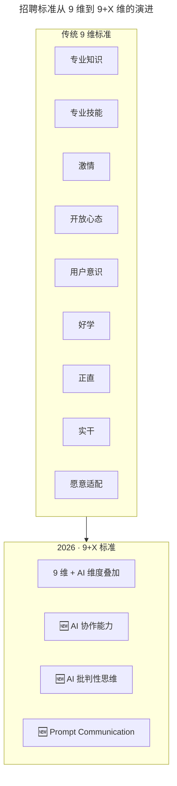
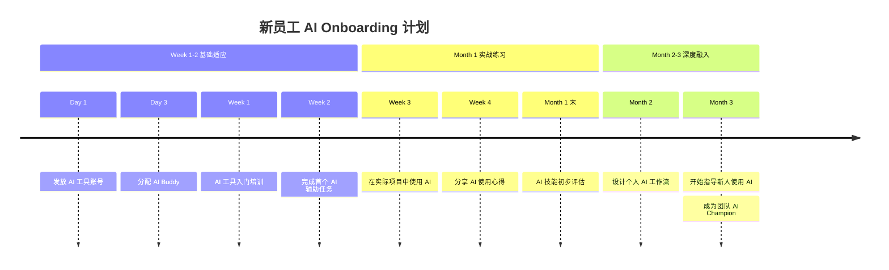

# 兰军：提升产品团队研发效率的实践（下）

> **适用范围**：技术管理者、HRBP、招聘负责人、团队 Leader；适用于希望通过招聘与解聘两个入口系统提升团队研发效率，并已在沟通、数据透明、能力培养层面完成基础建设的团队。

> **更新摘要（v2 · 2026-08 更新）**：在原"招聘标准、跨岗位面试、犹豫不录用、三个月规划、果断解聘"五大原则基础上，整合 2026 年 AI 实操测试、AI 协作能力评估、AI Onboarding 加速计划、AI 健康度体检等新内容，给出一份覆盖招聘标准升级、面试流程重塑、试用期管理与解聘决策的统一实践指南。

## 一、导言

研发效率的提升不仅依赖组织内部的沟通与能力建设，还依赖人员入口与出口的把关。再优秀的流程与培训体系，如果招进来的成员不合适或留下不合适的成员，都会让前期投入大打折扣。兰军在梅沙科技的实践可以归纳为三个招聘原则——招聘标准、跨岗位面试、犹豫就不录用——加上新员工三个月规划与果断解聘两条管理纪律。

进入 2026 年，AI 已深度融入工作流，招聘与解聘的判断维度发生了显著变化。AI 协作能力、AI 批判性思维、Prompt Communication（精准表达需求的能力）成为新的硬性要求；面试环节新增 Prompt Challenge、AI-Assisted Coding、AI Output Review、Agent Design 四类实操测试；试用期管理从"三个月内上线一个功能"升级为"三个月内建立个人 AI 工作流并指导新人"；解聘决策需要识别"AI 拒绝型""AI 低效型""AI 风险型""AI 停滞型"四类预警信号。

本文将原文五大原则与 2026 年新实践整合为统一叙事，并提供可执行的工具与清单。

## 二、核心方法论

### 2.1 招聘三大原则

**原则一：招聘标准。** 兰军从专业知识、专业技能、激情、开放、用户意识、好学、正直、实干、愿意适配九个维度评估候选人。其中"开放心态"尤其重要——能力不强但心态开放者能通过学习快速提升，能力尚可但无法听取建议者很难融入团队。面试中常通过具体问题考察素养，例如让产品经理候选人画出最常用 APP 的草图，验证其是否真正关注产品细节。

2026 年的招聘标准在九大维度基础上扩展为"9+X"标准：每一项原维度都叠加 AI 相关要求，例如"专业知识 + AI 领域知识""专业技能 + AI 工具使用能力""开放心态 + 对 AI 变革的开放度""正直 + AI 伦理意识""实干 + AI 实战经验"。同时新增三项独立能力：AI 协作能力（人机协同的经验与能力）、AI 批判性思维（识别 AI 错误的能力）、Prompt Communication（精准表达需求的能力）。

图示说明：原九维标准并非被取代，而是被 AI 维度"染色"——每一项都需在 AI 时代重新定义其内涵。新增的三项独立能力则反映了人机协同场景下的新要求，无法被任何一项原维度覆盖。

**原则二：跨岗位面试。** 招聘产品经理时由开发人员面试，招聘开发经理时由产品经理面试。这种双向跨岗位面试让团队成员对"自己招进来的人"有归属感，后续沟通中即便出现分歧也更易化解。2026 年的跨岗位面试新增"AI Expert 面全员"环节：所有岗位都需要评估 AI 成熟度，避免招入对 AI 工具表现出抗拒或恐惧的候选人。

| 面试组合 | 传统目的 | 2026 新增考察点 |
| --- | --- | --- |
| 开发面 PM | 技术可行性判断 | 候选人能否用 AI 辅助产品设计？Prompt 质量如何？ |
| PM 面开发 | 产品思维、沟通 | 候选人能否理解 AI 对产品的颠覆性影响？ |
| AI Expert 面全员 | AI 能力评估 | 所有岗位都需要评估 AI 成熟度 |

**原则三：犹豫就不录用。** 一旦对候选人产生犹豫，立刻说 NO，相信直觉。2026 年这一原则有明确延伸：如果候选人对 AI 工具表现出抗拒或恐惧，不录用；如果候选人无法识别明显的 AI 错误，警惕；如果候选人主动分享 AI 使用经验与教训，加分。

### 2.2 新员工三个月规划

新员工入职后由指定导师带教三个月，导师为新人制定目标并帮助其快速成长，同时引导新人熟悉 SMART 原则。新人需每天发日报以便导师实时关注。产品经理入职需在三个月内上线一个功能或页面改版并提交数据分析，无论功能多小都要走通内部完整流程。三个月期满后根据目标完成度与自身素养（责任心、嫉妒心理、情绪稳定性、是否拒绝改变等）综合评估。

图示说明：2026 版的三个月规划在原"导师 + 日报 + 上线功能"基础上，前置了 AI 工具账号与 AI Buddy 的分配，并在第二、三个月要求新人从"使用者"成长为"设计者"与"指导者"。这种阶梯式设计既验证了新人的 AI 学习速度，也让团队 AI 文化得以传承。

### 2.3 果断解聘

解聘要果断，这对团队战斗力有益无害。留着一个不合适的员工既影响团队氛围，又影响战斗力，对该员工也是一种不负责任。原文用团队 D 与团队 E 的战斗力数据说明：其他 7 位成员能力均等，仅一位成员从 1 降到 0.6，团队战斗力直接降低近一半。这也是部分团队设置末位淘汰制度的原因。

2026 年的解聘决策在传统维度（能力不达标、文化不契合、态度问题）基础上新增两类信号：AI 适应困难（长期无法掌握基本 AI 工具）与 AI 伦理违规（不当使用 AI 导致问题）。同时引入团队战斗力公式更新：

- 传统公式：团队战斗力 = Σ(成员能力) × 协作系数
- 2026 公式：团队战斗力 = Σ(成员能力 × AI 增效倍数) × AI 协作系数 × (1 - AI 摩擦系数)

其中 AI 增效倍数为个人因使用 AI 产生的效率提升（1x-10x），AI 协作系数为团队 AI 工具链的一致性（0.8-1.2），AI 摩擦系数为因 AI 使用不当造成的内耗（0-0.3）。关键洞察在于：一个不使用 AI 或滥用 AI 的成员，不仅自身产出低，还会成为团队的 AI 摩擦源，降低整体协作效率。这比传统的"能力不达标"更隐蔽但危害更大。

## 三、关键流程

### 3.1 招聘流程

第一步，制定招聘标准与流程。流程五步：专业初试、专业复试、跨岗位复试、合伙人面试、HR 谈薪酬终试。标准采用 9+X 维度，权重分配建议：编程能力 20%、系统设计 20%、问题解决 15%、团队协作 15%、AI 素养 20%、学习能力 10%。

第二步，准备 AI 实操测试题库。分岗位、分难度，覆盖四类测试：

| 测试类型 | 形式 | 时长 | 考察重点 |
| --- | --- | --- | --- |
| Prompt Challenge | 给定任务写 Prompt | 15 分钟 | 逻辑思维、精确表达 |
| AI-Assisted Coding | 允许用 AI 编程 | 30 分钟 | 人机协作、代码审查 |
| AI Output Review | 找出 AI 生成代码的问题 | 20 分钟 | 批判性思维 |
| Agent Design | 设计简单 AI 工作流 | 25 分钟 | 系统思维 |

第三步，跨岗位面试 + AI Expert 面全员。面试官培训需覆盖"识别真正的 AI 能力 vs 简历包装"。

第四步，犹豫就不录用。对 AI 工具表现出抗拒或恐惧者直接淘汰。

第五步，发放 AI Welcome Package：工具账号 + 使用指南 + AI Buddy 匹配。

### 3.2 试用期管理流程

第一周：发放 AI 工具账号，分配 AI Buddy，完成 AI 工具入门培训。第二周：完成首个 AI 辅助任务。第三至四周：在实际项目中使用 AI 并分享使用心得，月末进行 AI 技能初步评估。第二个月：设计个人 AI 工作流。第三个月：开始指导新人使用 AI，成为团队 AI Champion。三个月期满后，根据目标完成度、AI 技能等级、自身素养综合评估是否转正。

### 3.3 解聘决策流程

第一步，识别预警信号：

| 信号类型 | 具体表现 | 严重程度 |
| --- | --- | --- |
| AI 拒绝型 | 明确表示不愿学习 / 使用 AI | 高（建议快速处理） |
| AI 低效型 | 使用 AI 但效率不升反降 | 中（先培训观察） |
| AI 风险型 | 使用 AI 但不遵守规范 | 高（安全隐患） |
| AI 停滞型 | 长期不提升 AI 能力 | 中（纳入绩效改进计划） |

第二步，给予一次改进机会，配套培训与明确目标。第三步，机会用完仍不达标则果断解聘，留下的工作临时交付给上级或直接由 Leader 承担。第四步，每季度做一次团队 AI 健康度体检，量化团队 AI 工具覆盖率、平均 AI 增效倍数、AI Code Review 采用率、AI 相关事故数，并按个人排名识别"AI 之星""稳步成长""需关注""待辅导"四类成员。

## 四、工具与实战

### 4.1 招聘 Checklist

- JD 中明确 AI 能力要求（具体工具、熟练度级别）
- 准备 AI 实操测试题库（分岗位、分难度）
- 面试官培训：能识别真正的 AI 能力 vs 简历包装
- 准备 AI Welcome Package（工具账号 + 使用指南）
- 设计 AI Buddy 匹配机制

### 4.2 团队 AI 健康度体检模板

整体指标：团队 AI 工具覆盖率、平均 AI 增效倍数、AI Code Review 采用率、AI 相关事故数。个人排名：AI 之星（增效 5x+，积极分享）、稳步成长（持续提升中）、需关注（近期 AI 使用下降）、待辅导（AI 适应困难）。行动建议：表彰 AI 之星；为需关注者制定提升计划；评估待辅导者的去留。

### 4.3 面试必问题

1. 请描述一个你使用 AI 工具显著提升工作效率的具体案例。
2. 你如何判断 AI 输出的代码是否正确？有什么验证方法？
3. 如果 AI 给出的技术方案与你的直觉不符，你会怎么处理？
4. 你认为 AI 在软件开发中的局限性是什么？

## 五、常见误区

**误区一：招聘标准一成不变。** 九维标准在 AI 时代需要叠加 AI 维度并新增三项独立能力。如果仍用 2019 年的 JD 招聘 2026 年的岗位，会招入与团队 AI 文化不匹配的成员。

**误区二：跨岗位面试流于形式。** 跨岗位面试的真正价值在于让团队成员对"自己招进来的人"有归属感。如果只是走过场，后续沟通中的分歧反而更难化解。

**误区三：犹豫不录用被"差不多就行"取代。** 缺人或招聘周期长时，管理者容易降低标准。但"差不多"的候选人在 AI 时代可能成为 AI 摩擦源，长期成本更高。

**误区四：试用期管理只看功能上线。** 2026 版的试用期管理必须包含 AI 技能评估与 AI 工作流设计，否则新人可能上线了功能但未融入团队的 AI 协作模式。

**误区五：解聘决策忽视 AI 信号。** 仅看传统维度（能力、文化、态度）会遗漏 AI 拒绝型与 AI 风险型这两类隐蔽但危害更大的不合适成员。

**误区六：给两次机会。** 一次机会改不了，给两次机会也是白搭。痛苦加反思才能进步，果断解聘反而有助于对方成长。

## 六、进阶延展

当招聘与解聘的标准与流程已落地后，团队可向三个方向延展。第一是招聘前置：与高校、社区、开源项目合作，提前识别具备 AI 素养的候选人，缩短招聘周期。第二是 AI Champion 体系：每位试用期转正的成员都需在第三个月指导新人使用 AI，形成"人人都是 AI 导师"的传承机制。第三是团队战斗力公式持续校准：每季度根据实际数据调整 AI 增效倍数、AI 协作系数、AI 摩擦系数的取值范围，让公式成为可量化的管理工具而非理论模型。

需要强调的是，招聘与解聘不是孤立的入口与出口，而是与沟通透明、数据透明、能力培养形成闭环的关键环节。当一位成员因 AI 适应困难被解聘时，团队需要反思：是招聘标准不够前置，还是试用期 AI 培训不到位，抑或是 AI 工具链本身不够友好？每一次解聘都应沉淀为招聘标准与培训体系的改进输入。只有这样，团队的"三角形底部"才能真正变窄，向精英化方向持续演进——不是因为招到了更厉害的人，而是因为 AI 让每位成员都能发挥出更厉害的水平。
