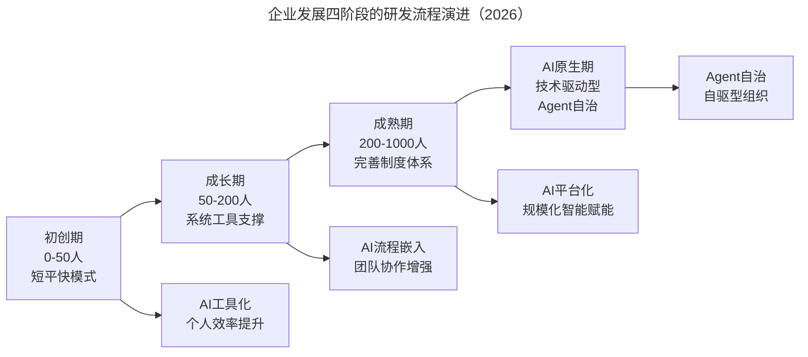
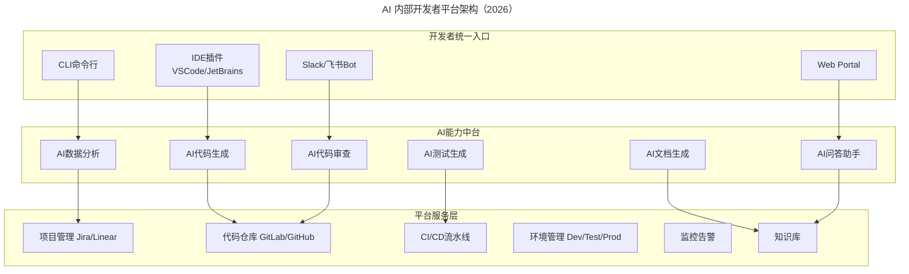

# 企业发展不同阶段的研发流程体系演进

> **适用范围**：CTO、技术 VP、研发负责人，适用于初创期、成长期、成熟期及 AI 原生期企业的研发流程体系建设与升级。

> **更新摘要（v2 · 2026-08 更新）**：在原文初创期、成长期、成熟期三阶段框架基础上，新增第四阶段"AI 原生期"，整合各阶段 AI 赋能策略、AI IDP 平台架构、人机协同管理模式、AI 治理框架等内容，补充从"以人为核心"到"管理人与 AI 的协作"的管理范式转变及管理者角色能力要求。

## 一、导言

互联网时代，企业发展可分为初创期、成长期和成熟期三种类型。初创期企业讲究短平快模式，尽可能缩短研发层级，保证最高效的沟通；成长期企业由于发展快、人员增多，被迫通过系统工具和管理流程体系进行管理；成熟期企业则必须采用成熟的工具和严格的流程体系架构来管理。企业所处阶段不同，研发流程体系也有本质区别。

这一核心理念在 2026 年 AI 时代不仅依然成立，而且因为 AI 技术的成熟度差异，各阶段的 AI 赋能策略有了显著分化。更重要的是，2026 年出现了原文未涵盖的第四阶段——AI 原生期：组织规模可能不大（甚至<100 人），但技术驱动极强，AI 不是"辅助工具"而是"核心生产力"，大量常规工作由 AI Agent 自主完成，人类专注于创造性、战略性工作。

企业打造高效研发流程体系最核心的还是人的问题。以人为核心的管理方法是最重要的管理方式，因为研发人员是高智商人群，只有把研发人员管理好了，研发效率才会快速提高。AI 时代这一理念有了新的诠释——从"管理人"到"管理人与 AI 的协作"。AI 不是要改变"以人为核心"的理念，而是扩展"人"的定义：未来的高效团队是"人类+AI Agent"的混合体。

## 二、核心方法论

### 2.1 企业发展四阶段模型

企业发展阶段决定研发流程体系的基本形态。原文提出三阶段模型，2026 年扩展为四阶段。

四阶段模型的核心逻辑是：每个阶段的 AI 赋能策略不同。初创期重点是 AI 工具化，为每个人配置 AI 编程助手，建立基础 AI 工具链，实现个人效率提升；成长期重点是 AI 流程嵌入，建设内部 IDP（Internal Developer Platform），将 AI 融入核心研发流程，实现团队协作增强；成熟期重点是 AI 平台化，建立 AI 治理框架，规模化推广 AI 最佳实践，实现规模化智能赋能；AI 原生期重点是 Agent 自治，探索 Agent 自治模式，打造极致人效比，实现自驱型组织。

### 2.2 各阶段管理特点

**初创期**采用独立的产品经理负责制，打破部门壁垒，拉近产品研发与市场距离，建立以客户需求和市场需要为导向的跨部门产品组。产品经理全权负责产品全生命周期管理，直接对产品市场成功与否和损益负责。产品经理不一定要隶属研发中心，也可隶属市场部，若隶属市场部则应在研发中心设立对应的产品研发经理。

**成长期**以 nEqual 为例，采用 M（管理）、P（产品经理）、T（工程师）、R（研究员）四系列职称体系，构建系统级与应用级监控系统，成立学院定期培训，采用 OKR 目标管理，使用 Scrum 加 CI/CD（Continuous Integration/Continuous Delivery），构建统一公共平台和数据中台。

**成熟期**采用系统监控负责制——所有模块（底层系统、应用系统、会议安排、员工管理等）全部通过监控系统实现。出现问题由监控系统通过邮件、短信、电话通知负责人，不处理就一直通知，关键指标上升到更高一级领导。管理制度包含完整的研发职称体系、完善的系统工具、全面的员工培训体系、分部门采取不同开发模式。

**AI 原生期**是 2026 年出现的新阶段。典型实践包括：AI Product Manager+AI Developer 协同（10 人团队产出抵传统 50 人团队）、70%+代码由 AI 生成人类审核调整、AI 全自动测试+AIOps 自愈、AI 数据分析师+AI 战略顾问、AI 客服处理 90%+问题。

### 2.3 以人为核心到人机协同的管理范式

原文强调"以人为核心的管理方法是最重要的管理方式"。AI 时代这一理念升级为"管理人与 AI 的协作"。

传统管理是管理者→员工→任务执行的线性结构。AI 时代管理变为管理者→员工+AI Agent→任务执行（人机分工协作）的网状结构，同时 AI 管理系统为每个员工+AI Agent 组合提供支持，并为管理者提供数据支撑。管理者的角色发生根本转变：任务分配变为人机任务编排（需理解 AI 能力边界）；进度跟踪变为 AI 辅助监控+异常干预（需数据解读能力）；质量把关变为 AI 质量门禁规则制定（需 AI 输出评估能力）；团队建设变为人机协作文化建设（需变革管理能力）；技术决策变为 AI 方案评估与选择（需 AI 技术判断力）；人才培养变为 AI 能力发展规划（需学习路径设计能力）。

## 三、关键流程

### 3.1 成长期的研发流程体系

以 nEqual 为例，成长期企业的研发流程体系包含七个关键环节：职称体系架构（M/P/T/R 四系列，提供清晰成长路径）、系统监控系统（系统级+应用级，邮件/短信/电话预警，系统责任制）、学院培训体系（前沿技术分享、分布式系统培训、项目问题分享）、OKR 目标管理（明确和跟踪目标及完成情况）、Scrum+CI/CD 敏捷开发（每天多次集成，自动化构建验证）、公共平台和数据中台（技术模块架构复用）、技术评审会（多备选方案、把握新技术应用、技术合力）。

系统责任制是成长期流程的关键设计。某产品线所有同学以负责系统稳定可靠为目标，系统出现任何问题此产品线所有同学都要承担责任。例如某工程师凌晨收到报警后需完成打开电脑→连接 VPN→连接服务器→查看日志→定位问题→重启程序→服务正常→继续睡觉的一系列动作。如果一天不从根本解决，每天都要重复，因此工程师会主动通过优化程序彻底解决问题，最大化调动积极性。

AI 时代成长期新增 AI 工程师职级序列、AIOps 智能监控+预测性告警（故障发现提前 2-4 小时）、AI 个性化学习路径+AI 导师（学习效果+40%）、AI OKR 对齐分析+进度预测（目标达成率+25%）、AI-Augmented Scrum+CI/CD/AI（交付效率+60%）、内部 AI 平台（IDP）+AI 能力中台（复用率+50%）。

### 3.2 成熟期的治理流程

成熟期企业需要建立 AI 治理框架，包含四个层面：

**AI 工具分级使用政策**：Level 1（全员可用）AI 编程助手、AI 写作助手；Level 2（需申请）AI 代码生成（敏感模块）、AI 数据分析；Level 3（严格管控）AI 访问生产数据、AI 对外接口调用。

**AI 输出审核机制**：代码类必须通过 AI Code Review+人工 Review；文档类需人工审核关键信息；决策支持类重要决策必须有人工确认。

**AI 安全与合规**：代码不得包含硬编码密钥（AI 检测）；敏感数据脱敏后才能输入 AI；AI 日志留存 180 天用于审计。

**AI 效能度量**：月度 AI 工具采纳率报告；季度 AI 输出质量评分；年度 AI 投资回报率分析。

### 3.3 IDP 平台建设流程

成长期企业的 AI IDP（内部开发者平台）架构分为三层：开发者统一入口（IDE 插件、Web Portal、CLI 命令行、Slack/飞书 Bot）、AI 能力中台（AI 代码生成、AI 代码审查、AI 测试生成、AI 文档生成、AI 问答助手、AI 数据分析）、平台服务层（项目管理、代码仓库、CI/CD 流水线、环境管理、监控告警、知识库）。

IDP 平台的核心价值是降低 AI 使用门槛。开发者通过统一入口访问 AI 能力中台，AI 能力中台调用平台服务层的底层能力。这一架构使每个开发者都能方便地使用 AI 代码生成、审查、测试、文档、问答、数据分析等能力，而不需要各自搭建 AI 工具链。

## 四、工具与实战

### 4.1 初创期 AI 工具包

**必备（立即配置）**：AI 编程助手（Cursor/Windsurf/GitHub Copilot）、AI 项目管理（Linear AI/Notion AI）、AI 设计助手（Figma AI/v0.dev）、AI 部署平台（Vercel/Railway/Fly.io）。

**选配（根据需求）**：AI 客服（Intercom AI/Zendesk AI）、AI 数据分析（Metabase AI/Hex AI）、AI 文档（Notion AI/GitBook AI）。

### 4.2 各阶段 AI 增强策略对比

| 实践领域 | 初创期做法 | 成长期做法 | 成熟期做法 | AI 原生期做法 |
|---------|----------|----------|----------|-------------|
| 组织架构 | 扁平化战斗小组 | M/P/T/R 职称体系 | AI 协调中心+扁平化项目组 | 1 人+多 AI Agent 小组 |
| 开发模式 | 敏捷/快速迭代 | Scrum+CI/CD | AI-Augmented Scrum+CI/CD/AI | AI-Native 全流程驱动 |
| 沟通协作 | 即时沟通 | 学院培训+OKR | AI 辅助审批+例外处理 | Agent 自治+人类监督 |
| 代码质量 | 依赖个人能力 | 统一框架+Code Review | AI Code Review+自动测试 | 70%+AI 生成人类审核 |
| 运维部署 | 手动或简单脚本 | 系统级+应用级监控 | AIOps 智能监控+自愈 | AI 全自动运维 |
| 知识管理 | 简单文档 | 公共平台+数据中台 | AI 知识图谱+智能检索 | AI 自动沉淀+主动推荐 |

### 4.3 落地行动项

**自查：你的企业处于哪个阶段？**

- 初创期（0-50 人）→ 优先为每个人配置 AI 编程助手，建立基础 AI 工具链。
- 成长期（50-200 人）→ 优先建设内部 IDP 平台，将 AI 融入核心研发流程。
- 成熟期（200-1000 人）→ 优先建立 AI 治理框架，规模化推广 AI 最佳实践。
- AI 原生期（技术驱动型）→ 优先探索 Agent 自治模式，打造极致人效比。

**统一行动项（所有阶段适用）**：评估当前团队的 AI 工具采纳率和使用深度；识别研发流程中可以引入 AI 增强的关键节点；制定分阶段的 AI 能力建设路线图；建立 AI 使用的规范和最佳实践库；设定 AI 效能的度量指标和目标值。

## 五、常见误区

**阶段错配**：初创期套用成熟期的严格流程体系，或成熟期仍保持初创期的短平快模式。AI 时代的新表现是初创期就试图建设复杂的 AI 平台，或成熟期仍停留在个人 AI 工具使用阶段。正确做法是根据企业阶段选择匹配的 AI 赋能策略。

**工具堆砌**：系统工具只是辅助手段，还需要通过各种流程和方法来激发研发人员潜力。AI 时代尤其要避免堆砌 AI 工具而不融入流程——买了 Copilot 但不改流程、部署了 AI 监控但不调组织结构。工具的价值在于融入流程而非独立存在。

**忽视人**：一切需要以人为核心来驱动。AI 时代的新表现是过度关注 AI 工具而忽视人的培养——AI 能力建设需要人去驾驭，没有 AI 协作能力的人才再先进的工具也无法发挥价值。应在职称体系中新增 AI 工程师序列，在培训中增加 AI 技能培养。

**AI 盲目引入**：不要一次性全面 AI 化。成熟期企业的 AI 工具分级使用政策（Level 1/2/3）是必要的——AI 访问生产数据、AI 对外接口调用等高风险场景必须严格管控。金融科技等合规要求高的领域尤其要重视 AI 安全与合规。

## 六、进阶延展

### 6.1 AI 原生期的组织实践

AI 原生期企业的典型实践正在各领域涌现：产品开发端 AI Product Manager+AI Developer 协同，某 AI 创业公司 10 人团队产出抵传统 50 人团队；代码生成端 70%+代码由 AI 生成，人类审核调整，Cursor/Windsurf 重度用户团队已实现；测试运维端 AI 全自动测试+AIOps 自愈，Netflix/Stripe 的 AIOps 实践是行业标杆；决策支持端 AI 数据分析师+AI 战略顾问，McKinsey/BCG 的 AI 咨询助手已商业化；客户服务端 AI 客服处理 90%+问题，Intercom AI/Zendesk AI 成为主流。

### 6.2 管理者的能力重构

AI 时代管理者的能力要求发生根本变化。传统管理者职责与 AI 时代职责对比：任务分配→人机任务编排（需理解 AI 能力边界）；进度跟踪→AI 辅助监控+异常干预（需数据解读能力）；质量把关→AI 质量门禁规则制定（需 AI 输出评估能力）；团队建设→人机协作文化建设（需变革管理能力）；技术决策→AI 方案评估与选择（需 AI 技术判断力）；人才培养→AI 能力发展规划（需学习路径设计能力）。

### 6.3 从"以人为核心"到"人机协同"

原文核心理念"以人为核心的管理方法是最重要的管理方式"在 AI 时代有了新的诠释。从"管理人"到"管理人与 AI 的协作"不是对原理念的否定，而是扩展——"人"的定义从单纯的人类扩展为"人类+AI Agent"的混合体。管理系统责任制的理念依然有效，只是责任主体从"某产品线所有同学"扩展为"某产品线所有同学+AI Agent"。

### 6.4 持续演进的方向

企业发展阶段不是线性的——初创期企业如果技术驱动极强，也可能直接采用 AI 原生期实践；成熟期企业某些创新业务也可能采用战斗小组+AI Agent 模式。关键是根据业务特征和团队 AI 成熟度灵活选择，而非僵化地按规模划分阶段。未来已来，AI 不是要改变"以人为核心"的理念，而是扩展"人"的定义——未来的高效团队是"人类+AI Agent"的混合体。

---

*注：本文基于 nEqual 合伙人兼 CTO 卢亿雷的企业发展阶段研发流程体系实践，整合 2026 年 AI 时代四阶段演进路径与 AI 赋能策略。核心观点是：AI 不是要改变"以人为核心"的理念，而是扩展"人"的定义——未来的高效团队是"人类+AI Agent"的混合体。提供了从初创到成熟的完整 AI 转型路线图。*
