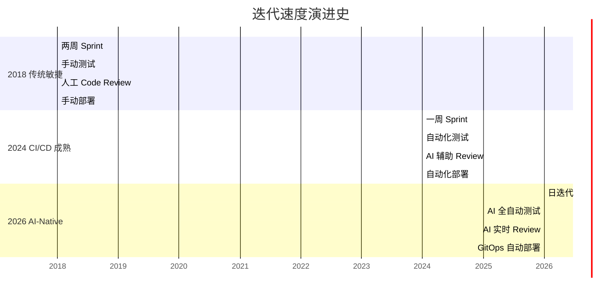
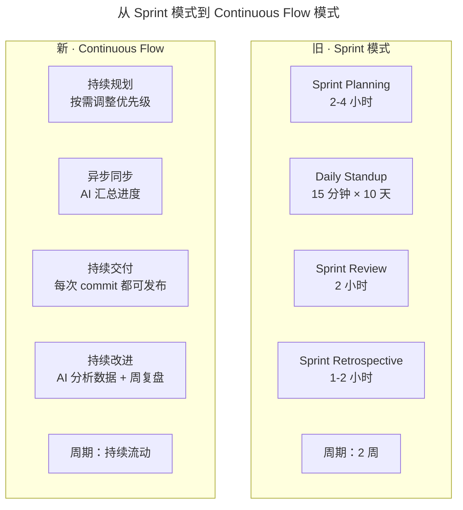

# 大咖对话-彭跃辉：保持高效迭代的团队是如何炼成的

> **适用范围**：CTO、技术总监、技术 Leader、工程效能负责人；适用于希望搭建高效迭代团队、保持稳定两周或更短迭代节奏的团队，特别适用于规划从 Sprint 模式向 Continuous Flow 模式演进、并希望以 AI 工具链压缩迭代周期的组织。

> **更新摘要（v2 · 2026-08 更新）**：在原"OKR 对齐目标、数据驱动决策、工具提效、人才成长体系、精英化团队"五大经验基础上，整合 2026 年迭代速度的代际跃迁（两周 → 日级甚至实时）、AI-Native 工具栈标准、Continuous Flow 流程重塑、AI 质量门禁、精英 AI 团队配置、团队效能仪表板等新内容，给出一份覆盖目标管理、迭代节奏、工具链、人才、质量保障的统一指南。

## 一、导言

Keep 技术团队从 2016 年的 20 多人发展到 200 多人，搭建了一个迭代稳定高效的技术团队，长期稳居健康健美榜首。彭跃辉将这套经验归纳为四点：引入 OKR 作为沟通与管理工具使团队对目标理解一致；提倡数据驱动，所有技术优化、产品功能、算法都设计数据指标并通过 AB 测试验证；使用 Phabricator 等工具保持每两周一个迭代频率；做好技术人员成长路线，包括专业定级体系与内部分享外部交流。

进入 2026 年，这套经验的核心方法论依然有效，但迭代速度已被 AI 压缩约 10 倍。AI 编码速度提升 5-10 倍，自动化测试覆盖率达到 95%+，AI 辅助 Code Review 即时完成，自动化部署流水线无缝衔接，AI 生成的测试数据实时可用。这意味着过去一个月的工作量，现在可以在 1-3 天内完成。本文将原五大经验与 2026 年 AI-Native 实践整合，给出一份适用于当前技术环境的高效迭代团队建设指南。

## 二、核心方法论

### 2.1 OKR 对齐目标

引入 OKR（Objectives and Key Results）作为沟通与管理工具，使团队对目标的理解保持一致。确定每个团队的核心目标时，不论向上还是向下都会进行几轮沟通，确保大家理解一致。核心目标确定后，从多个维度考虑怎样衡量这个目标，一般会将目标数字化，划分为具体的数据指标，相当于 OKR 中的关键结果。再根据 OKR 设定每个季度的 Roadmap，好处是大家的目标统一。执行过程中每三个月 Review 一次，并在 Review 中对目标进行调整。

OKR 在 2026 年依然是目标对齐的核心工具，但 Roadmap 的制定获得了 AI 辅助：AI 可基于历史数据预测目标达成概率，AI 可自动汇总各团队 OKR 进度并识别风险点，AI 可在 Review 时生成本季度成果报告与下季度建议。OKR 的本质没有变——确保团队目标一致——变的是 Review 的成本与精度。

### 2.2 数据驱动决策

不管是技术优化还是产品功能，甚至是算法，都设计数据指标。对比较长期的改动，设定较多的 AB 测试，通过 AB 测试验证改动对用户是否有效。彭跃辉加入 Keep 的第一件事就是搭建数据系统（数据中台），提供可交互的数据查询系统，并搭建 BI（商业智能分析及调度系统）。

数据准确性是核心挑战。数据不准确的原因可能是目标定义不清楚、产品经理提的需求不够准确、开发人员技术能力差异、各部门对数据的理解不同。解法包括：需求评审时更细致、开发过程中灰度测试与半自动化测试、搭建数仓等基础设施把公司内各部门对相关数据的定义统一起来。2026 年的数据驱动获得了 AI 增强：AI 自动分析 AB 测试结果并给出显著性判断；AI 异常检测替代人工阈值告警；AI 根因分析在数据异常时自动定位影响因素；AI 数据质量评估自动识别口径不一致问题。

### 2.3 工具提效与迭代节奏

鼓励团队成员使用工具提高效率，并给予一定的费用支持。Keep 使用 Phabricator 进行敏捷迭代，基本保持每两周一个迭代的频率，给用户提供稳定版本。除 Phabricator 外还使用谷歌套件（日历、邮箱、共享文档），提倡通过在线方式评论、协作、交流。

图示说明：迭代速度的代际跃迁不是单一环节的提速，而是需求分析、方案设计、编码实现、Code Review、测试验证、部署上线六个环节同时被 AI 压缩的结果。2018 年两周一次的迭代节奏在 2026 年变为日级甚至实时迭代，但彭跃辉强调的"明确整个流程、每个职能在各个环节要做的事"这一原则没有变——只是流程的颗粒度更细、自动化程度更高。

各环节的耗时变化：

| 迭代环节 | 2018 年耗时 | 2026 年耗时 | 加速倍数 |
| --- | --- | --- | --- |
| 需求分析 | 2-3 天 | 2-4 小时 | 10 倍 |
| 方案设计 | 2-3 天 | 2-4 小时 | 10 倍 |
| 编码实现 | 5-10 天 | 0.5-2 天 | 10 倍 |
| Code Review | 1-2 天 | 即时-1 小时 | 20 倍 |
| 测试验证 | 3-5 天 | 0.5-2 小时 | 30 倍 |
| 部署上线 | 0.5-1 天 | 5-30 分钟 | 50 倍 |
| 总计 | 14-24 天 | 1-3 天 | 10 倍 |

### 2.4 人才成长体系

打造技术人员的专业定级体系，从多个维度定义工程师级别。每年两次技术定级答辩，到高级工程师级别后每一个小级别晋升都需要答辩，规则是 5-7 人评审、两票否决制。组织内部分享与外部交流，每一个小组都有半年到一年的分享计划，每年挑选优秀员工参加 Google I/O、WWDC 等大型会议，公司承担机票酒店费用。团队架构一般是三角形的，级别越高的人越少，彭跃辉通过以上方法慢慢让三角形底部变窄，将整个团队往精英化方向打造。

2026 年精英化的实现方式变了：不是因为招到了更厉害的人，而是因为 AI 让每个人都能发挥出更厉害的水平。团队配置建议从传统的 15-21 人压缩到 5-9 人：Tech Lead 1 人不变但职责转变；Senior Engineer 从 2-3 人减到 1-2 人；Mid-level Engineer 从 4-5 人减到 2-3 人；Junior Engineer 从 5-8 人减到 1-2 人（AI 弥补经验不足）；QA Engineer 从 3-4 人减到 0-1 人（AI 自动化大部分测试）。

### 2.5 两周迭代的落地难点与解法

最初保持两周迭代的问题是交付内容不能得到保障，从产品到技术再到测试每个环节都可能出现问题。解法是明确整个流程以及每个职能在各个环节要做的事：基于两周迭代的事实，将整个迭代分成不同环节；迭代开始前一周就开始需求评审评估，当周内确定需求；迭代开始前制定具体排期表，明确各职能在不同阶段和时间点该交付什么内容。

第二阶段业务增长后变得复杂，团队成员增多，项目需要依赖其他部门，项目对接或推进出现问题。解法是为每个小项目设定一位总负责人，由他负责跟其他技术团队对接，推进前端、后端、客户端等整个流程。每一个迭代都产出一份数据报告与质量报告：数据报告呈现产品功能层面的数据表现；质量报告显示崩溃率、首页加载时间、业务核心指标等，由质量部（QA + 运维 SRE）每两周输出一份。各职能成员根据这些数据有针对性地提升本部门的效率与质量，形成较为完善的迭代与反馈优化节奏。

## 三、关键流程

### 3.1 从 Sprint 到 Continuous Flow

图示说明：Continuous Flow 的核心是取消固定的 Sprint 边界——功能完成后立即进入发布队列，小功能当天上线，大功能 2-3 天内上线。具体实施包括三方面：一是重新设计站会，每人每天花 5 分钟在协作工具更新进度，AI 自动汇总成日报发给 Team Lead，只在有阻塞问题时才开实时会议，节省时间 90%；二是自动化 Sprint Review，AI 自动生成本周交付报告（包含完成内容、数据表现、用户反馈），Team Lead 花 30 分钟审阅后异步分享给所有利益相关者；三是持续交付，每次 commit 都可发布，由 AI 质量门禁自动判断是否可合并与可部署。

### 3.2 AI 质量门禁体系

建立自动化质量保障体系，包括四道门禁：代码质量门禁（AI Style Check 通过率 > 95%、AI Complexity Analysis 圈复杂度 < 15、AI Duplication Detection 重复率 < 3%、AI Security Scan 无 Critical/High 漏洞，通过则自动合并）、测试覆盖率门禁（Unit Test Coverage ≥ 90%、Integration Test Coverage ≥ 80%、E2E Critical Path Coverage 100%、AI Generated Tests Pass Rate ≥ 99%，需人工确认）、性能门禁（API Response Time P95 < 200ms、Database Query Time P99 < 500ms、Memory Usage < 512MB、CPU Usage < 70%，自动通过）、安全门禁（SAST Scan 0 Critical 0 High、Dependency Vulnerabilities 0 Critical、Secrets Detection 0 leaked、Permission Check 最小权限原则，需人工审核并通知安全团队）。

### 3.3 技术管理者三能力模型

彭跃辉对技术管理者的要求分为三部分。第一是技术能力——具备把某功能或某业务实现并实现好的能力，通过质量、效率维度评估，提供内部分享、外部交流、更复杂项目锻炼中层管理者。第二是业务理解能力——知道业务未来方向、技术架构如何为业务服务、当前阶段应该做什么与不该做什么，希望技术 Leader 能发现业务问题并解决它，定期组织针对业务问题的开放性讨论。第三是创新能力——鼓励技术 Leader 做有挑战的事，把 Hackathon 中产生的点子落地到产品中（如 Keep 的游泳记录硬件）。

2026 版三能力模型的权重发生变化：技术能力中新增"AI 工具驾驭能力"，业务理解能力中新增"AI 对业务颠覆性影响的判断"，创新能力中新增"AI Agent 应用场景的探索"。技术人走向管理路线时，可有针对性地在这三方面做学习与锻炼。

## 四、工具与实战

### 4.1 AI-Native 工具栈标准

| 工具类别 | 推荐工具 |
| --- | --- |
| IDE 与编码 | Cursor Pro / Windsurf Enterprise（主），GitHub Copilot（备） |
| 代码审查 | AI Code Reviewer（CodeRabbit / AI Review） |
| 测试 | AI Unit Test Generator + Playwright + AI Test Gen，覆盖率目标 95%+ |
| 文档 | AI Doc Generator（Mintlify AI / Swizzle），代码变更自动更新文档 |
| 部署 | GitHub Actions + AI 插件，GitOps + Canary Release |
| 监控 | AI-powered APM（Datadog AI） |
| 协作 | Linear/Jira + AI，Slack/Discord + AI Bot，Notion/飞书 + AI 搜索 |
| 质量保障 | AI SAST/DAST Scanner，AI Performance Profiler，AI Accessibility Checker |

### 4.2 团队效能仪表板

速度指标：迭代速度（≥ 5 features/week）、Lead Time（< 1 小时）、部署频率（≥ 10 次/天）。质量指标：Change Failure Rate（< 5%）、MTTR（< 30 分钟）、Bug Escape Rate（< 2%）。效率指标：Developer Productivity（≥ 5.0 基准 1.0）、AI Adoption Rate（≥ 90%）、Code Review Efficiency（< 1 小时）。体验指标：Developer Satisfaction（≥ 8.0）、Burnout Risk（< 3.0）。

### 4.3 行动指南

行动 1 建立 AI 工具栈标准（Week 1）：立即采购和配置必备工具。行动 2 重塑迭代流程（Week 2-3）：从 Sprint 模式切换到 Continuous Flow 模式。行动 3 建立 AI 质量门禁（Week 3-4）：配置四道门禁的检查规则与通过条件。行动 4 打造精英 AI 团队（Month 1-3）：按 5-9 人配置调整团队结构，招聘新标准侧重 AI 工具使用与系统思维。

## 五、常见误区

**误区一：为了速度牺牲质量。** AI 加速了开发，但质量标准不能降低。质量与速度的新平衡点是：速度从 2 周/迭代提升到 1 天/迭代，质量从 Bug 率 15-25% 下降到 3-8%、测试覆盖率从 60% 提升到 95%+。

**误区二：忽视 AI 的安全风险。** AI 生成的代码可能有安全隐患。必须配置 AI SAST/DAST Scanner 与 Secrets Detection，关键代码人工审核。

**误区三：丢失团队文化。** 即使效率提升了，团队凝聚力与文化建设依然重要。彭跃辉强调的内部分享、外部交流、Hackathon 等文化活动在 AI 时代依然不可替代。

**误区四：停止人工审核。** 关键决策和敏感代码必须有人工把关。AI 质量门禁可以自动处理 80% 的常规问题，但 20% 的高价值问题（架构合理性、业务逻辑正确性）仍需人类 Reviewer。

**误区五：过度自动化。** 保留适当的人工触点以应对异常情况。Agent 自治级别应渐进式提升，从 L1 辅助型到 L5 全自主型需要时间积累信任。

**误区六：忘记测量和优化。** 持续监控团队效能仪表板的各项指标，不断改进流程。彭跃辉每两周输出一份质量报告的节奏，在 2026 年应升级为实时仪表板 + 周复盘。

## 六、进阶延展

当五大经验的 AI 增强版均已落地后，团队可向三个方向延展。第一是从"精英化团队"到"AI 增强个体"：彭跃辉说"让三角形底部变窄，将整个团队往精英化方向打造"，2026 年的实现方式变了——不是因为招到了更厉害的人，而是因为 AI 让每个人都能发挥出更厉害的水平。招聘新标准应从"5 年 Java 经验、精通 Spring Boot"调整为"2 年以上开发经验（AI 可弥补）、精通至少一种 AI 编程工具、具备 Prompt Engineering 能力、有使用 AI 显著提升效率的实际案例、对新技术有强烈好奇心、良好的系统思维与问题解决能力"。第二是从"经验传承"到"AI 知识库"：技术定级体系、内部分享、外部交流的产物全部沉淀到 AI 知识库，支持语义检索与智能问答，让新人在 7×24 小时内获得答疑。第三是从"两周迭代"到"持续流动"：取消固定 Sprint 边界，功能完成后立即进入发布队列，AI 质量门禁自动判断是否可发布。

需要强调的是，精英化的本质没有变——追求卓越的质量、保持高效的迭代、打造强大的团队文化、关注每个人的成长。但方法变了：从"堆人头"到"AI 增强个体"、从"2 周一迭代"到"持续流动"、从"人工质检"到"AI 门禁"、从"经验传承"到"AI 知识库"。未来的高效团队，不是人数最多的团队，而是最善于驾驭 AI 的团队。彭跃辉在 2018 年分享的经验，在 2026 年依然有效——只是实现方式已被 AI 重新定义。
