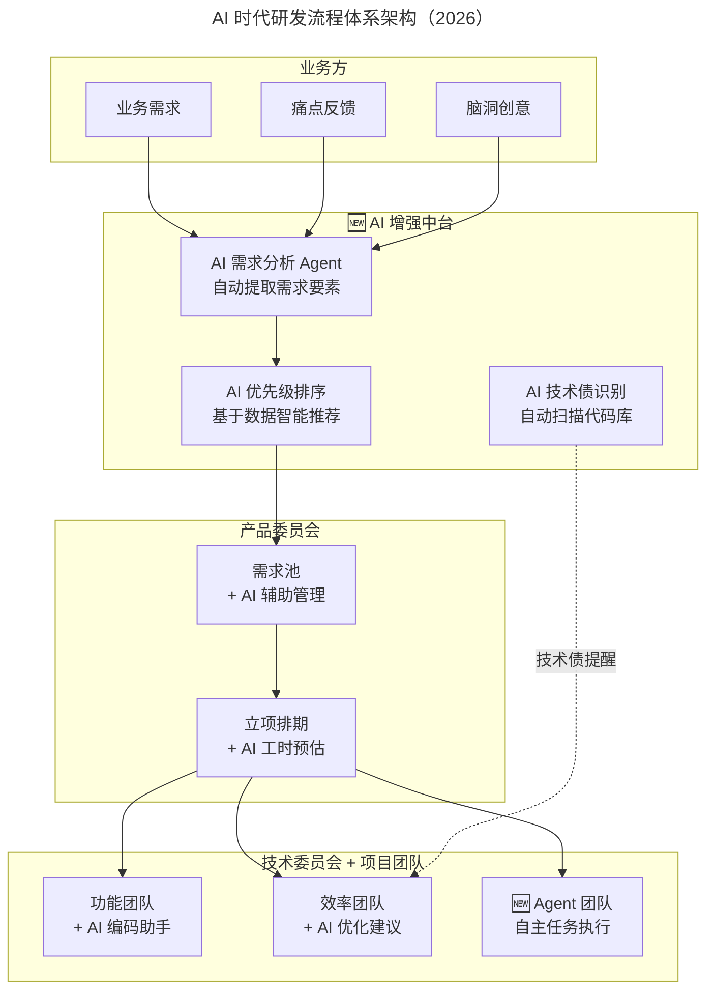
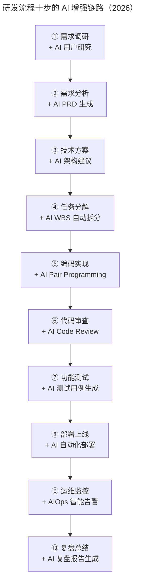

# 定制高效研发流程

> **适用范围**：CTO、技术总监、PMO、产品委员会成员、工程效能团队；适用于已完成组织架构搭建、希望让研发流程跑得快且跑得稳的团队，特别适用于业务方与研发之间存在"死锁"协作问题、并计划引入 AI 增强中台的团队。

> **更新摘要（v2 · 2026-08 更新）**：在原"研发流程体系架构 + 十步操作步骤 + 特赞之声闭环"框架基础上，整合 2026 年 AI 增强中台、智能需求池、AI 时代十步升级、特赞之声 2.0 等新内容，给出一份覆盖体系架构、操作步骤、业务协作、AI 落地陷阱的统一指南。

## 一、导言

研发团队组织架构搭建完毕后，接下来的挑战是让这个架构跑起来、跑得快、跑得稳。这需要定义出一个高效的研发流程，并尽可能降低研发过程中遇到的风险，确保流程每个环节都不出错。定制研发流程的逻辑是：先从整体入手定义体系架构，让团队从全局把控整个过程；再从局部入手罗列操作步骤，指导团队完成具体工作。

进入 2026 年，AI 已深度融入研发全流程。GPT-5.5 与 DeepSeek V4 的代码能力达到高级工程师水平，Agent 可自主完成端到端的开发任务。研发流程并未消失，而是被 AI 深度增强。管理者需要关注的不再是"步骤多不多"，而是"哪些环节可以让 AI 自主完成，哪些必须由人来把关"。本文将原体系架构与十步操作整合 2026 年 AI 增强内容，给出一份适用于当前技术环境的研发流程定制指南。

## 二、核心方法论

### 2.1 研发流程体系架构

高效的研发过程应该具备"多线程"特性，仿佛多条并行流淌的河流：上游是业务，中游是产品，下游是技术，流量取决于业务，流速取决于产品和技术。这里的"业务"包括公司内部使用产品的业务同事与公司外部使用产品的最终用户，统称"业务需求方"或"业务方"。

整个研发工作流程体系架构是职能团队与项目团队的有机结合。职能团队中，产品委员会的产品专家将业务需求统一记录到"需求池"中。需求池中的每一个需求都要描述业务当前现状与未来期望。每隔一段时间（一般 1-2 周），产品委员会根据需求池中的需求细节加以讨论，将优先级较高的需求立项排期，项目团队可知晓近期需要实现的业务需求，方向感更加清晰。从需求池中挑出的高优先级需求分别"流入"对应的项目团队。项目执行中遇到的技术遗留问题被列为"技术债"，由技术委员会的技术专家管理与跟踪，后期有针对性地偿还。

图示说明：AI 增强中台是 2026 版体系架构的核心增量。它位于业务层与产品层之间，承担需求要素自动提取、优先级智能推荐、技术债自动识别三项职能。原有"需求池—立项排期—项目团队"的主流程不变，但每个环节都被 AI 染色：需求池获得 AI 辅助管理，立项排期获得 AI 工时预估，项目团队新增 Agent 团队这一自主任务执行形态。

### 2.2 需求池的字段定义

需求池中一个典型的需求包括以下字段：需求名称（关键词描述，最多 15 字）、需求来源（业务、运营、财务、法务、市场、其他）、业务痛点（为何要实现该需求）、需求描述（业务将来的诉求）、渴望程度（本周、本月、下月、本季度、下季度、未来、具体截止日期）、需求类型（新功能从 0 到 1、优化从 1 到 100）、需求规模（大两周以上、中一至两周、小一周以内、未知）、备注、附件、创建人、处理状态（未处理、处理中、已处理、关闭）、优先级（A 重要且紧急、B 重要不紧急、C 不重要紧急、D 不重要不紧急、X 待定）、负责人。

简单情况下可使用电子表格维护需求池（Numbers、Excel），也可通过在线方式管理（石墨文档、金数据）。需求池对公司全员共享，由产品委员会管理维护，其他人员只能阅读不能编辑。产品专家必须先与业务需求方有效沟通，深刻理解业务痛点与未来期望后才能将需求入池。

2026 年的智能需求池在原有字段基础上新增 AI 字段：AI 复杂度评估（自动评估实现难度低 / 中 / 高）、AI 相似需求检测（检测是否与历史需求重复）、AI 影响范围分析（自动分析涉及的模块与接口）、AI PRD 草稿（根据描述自动生成 PRD 初稿）、AI 优先级建议（基于数据与业务权重推荐）、AI 工时预估（基于历史数据预测开发周期）、AI 依赖关系图（自动识别需求间的依赖）、AI 可行性评估（技术可行性自动检查）。

### 2.3 业务与研发协作的"特赞之声"

业务与研发之间常存在"死锁"：业务提出需求得不到及时响应，研发响应后得不到反馈，久而久之失去信任。特赞科技的解法是"特赞之声"——制作一种叫"特赞币"的虚拟货币（普通磁铁加自制图案），给业务部门发放固定数量。业务遇到痛点时在痛点卡片上手动填写具体痛点，并用特赞币将卡片固定在白板上，消耗一个或多个币（多个币表示优先级更高）。项目上线后业务部门提供使用反馈（称赞或吐槽）即可得到一个特赞币。提需求要"花钱"，提反馈可"赚钱"，确保业务所提需求都是最大痛点，研发与业务自然形成有效循环。除痛点与反馈外，公司全员也可提出脑洞（对产品的奇思妙想），被产品委员会采纳后赠送特赞币。

2026 版的特赞之声 2.0 在原机制基础上新增 AI 能力：业务方提痛点后，AI 预处理自动将痛点归类（功能 / 体验 / 性能 / 安全）、进行相似度检测判断是否重复、给出工时预估初步评估；业务方提反馈后，AI 情感分析判断反馈的情感倾向，正面反馈进入正向激励，负面反馈自动转化为优化任务并追踪到底。

## 三、关键流程

### 3.1 研发流程十步操作

将需求转化为产品、产品转换为项目、项目顺利上线，可定义 10 个操作步骤：① 需求调研、② 需求分析、③ 技术方案、④ 任务分解、⑤ 编码实现、⑥ 代码审查、⑦ 功能测试、⑧ 部署上线、⑨ 运维监控、⑩ 复盘总结。这份操作步骤可打印下来发给每一位研发人员并贴在会议室墙壁上，每日站立会时团队都能看见，慢慢会发现每个项目团队都有相同的工作习惯，并不断优化细节。

2026 版十步操作在每一步都叠加 AI 能力：

| 步骤 | 原文形态 | 2026 AI 增强 |
| --- | --- | --- |
| ① 需求调研 | 业务调研、记录数据 | + AI 用户研究 |
| ② 需求分析 | PRD 撰写 | + AI PRD 生成 |
| ③ 技术方案 | 架构设计 | + AI 架构建议 |
| ④ 任务分解 | WBS 手动拆分 | + AI WBS 自动拆分 |
| ⑤ 编码实现 | 手工编码 | + AI Pair Programming |
| ⑥ 代码审查 | 人工 Review | + AI Code Review |
| ⑦ 功能测试 | 测试用例编写 | + AI 测试用例生成 |
| ⑧ 部署上线 | 自动部署 | + AI 自动化部署 |
| ⑨ 运维监控 | 阈值告警 | + AIOps 智能告警 |
| ⑩ 复盘总结 | 复盘四步法 | + AI 复盘报告生成 |

图示说明：十步操作的顺序与职责划分没有改变，AI 增强的是每一步的"单位时间产出"。其中 ⑤ 编码实现、⑥ 代码审查、⑦ 功能测试是 AI 增益最显著的三步——编码由 AI Pair Programming 协助，人类负责架构决策与审核，AI 负责实现与优化；代码审查由 AI 24 小时自动 Review，人类 Reviewer 只需关注架构层面与业务逻辑；功能测试由 AI 自动生成测试用例并执行，覆盖率从 60-80% 提升到 85-95%。

### 3.2 复盘四步法

定期对已上线项目进行复盘，使用"复盘四步法"：审视目标（当初设定的目标是什么、目前达成的现状、差异是什么）、回顾过程（整个过程如何进行、大致分为几个阶段、每个阶段发生了什么）、分析得失（哪些方面做得好、做得不好、为什么）、总结规律（再次做同类事情应该怎么做、对未来工作有何指导、有何规律原则方法论）。2026 版的复盘可由 AI 驱动：AI 自动汇总代码提交、Bug 数量、工时等数据；AI 分析常见问题模式给出改进建议；AI 根据复盘结果自动生成改进计划。

### 3.3 特赞之声 2.0 流程

业务方提痛点（消耗特赞币）→ 白板展示 → AI 预处理（自动分类、相似度检测、工时预估）→ 需求池 → 产品委员会评审 → 立项排期 → 研发团队开发（+ AI 加速）→ 上线交付 → 业务方反馈（赚取特赞币）→ AI 情感分析 → 正面进入正向激励、负面转化为优化任务并自动追踪。新增的 AI 能力让特赞币的"花钱"与"赚钱"机制更加精准——AI 帮业务方判断痛点是否值得花币，帮研发方判断反馈是否需要立即响应。

## 四、工具与实战

### 4.1 AI 时代研发流程 Checklist

- 绘制 AI-enhanced 研发流程图，标注每个环节的 AI 工具
- 建立企业级 Prompt Library，覆盖各环节常用提示词
- 配置 AI Code Review 规则，明确审查标准和通过条件
- 启用 AI 需求池管理，自动填充关键字段
- 设立 AI 流程效能指标：AI 覆盖率、AI 采纳率、人效提升比
- 每季度回顾并优化 AI 工具配置，淘汰低效工具

### 4.2 推荐工具链

| 场景 | 推荐工具 |
| --- | --- |
| 需求池管理 | Notion AI / Linear AI |
| PRD 生成 | Notion AI / Cursor |
| 架构建议 | ChatGPT / Claude |
| 编码实现 | Cursor / Windsurf / GitHub Copilot |
| 代码审查 | CodeRabbit / Amazon CodeReviewer |
| 测试生成 | CodiumAI / Meta AI TestGen |
| 部署 | Harness AI / Argo CD + AI 插件 |
| 运维监控 | Datadog AI / PagerDuty AI |

### 4.3 AI 渗透率参考

| 研发阶段 | 传统耗时占比 | AI 时代耗时占比 |
| --- | --- | --- |
| 需求分析 | 15% | 8% |
| 设计 | 20% | 10% |
| 编码 | 35% | 15% |
| 测试 | 15% | 8% |
| 部署运维 | 15% | 9% |

## 五、常见误区

**误区一：过度自动化导致"黑盒流程"。** AI 自动完成太多步骤，团队成员不了解全貌。对策是保留关键节点的手动确认，确保可控性。

**误区二：AI 工具碎片化。** 不同环节使用不同的 AI 工具，数据不通。对策是建立统一的 AI 工具平台，确保流程数据贯通。

**误区三：忽视 AI 输出质量把控。** 信任 AI 生成的代码与文档，缺乏审核。对策是建立 AI 输出质量标准，强制人工审核关键产出。

**误区四：流程定义过重。** 没有人愿意在一个复杂的流程上投入更多时间。流程是帮助团队更规范地做事，目的是避免犯错。在流程定义上可以先简单后精细——简单才便于操作，精细才易于管理。十步操作只是一个参考模型，需根据自身实际情况合理调整，否则可能变成负担反而约束前进速度。

**误区五：业务与研发的"死锁"无法打破。** 特赞之声的"花钱提需求、赚钱提反馈"机制证明，业务与研发的协作问题可以通过机制设计解决，而非仅靠沟通技巧。

**误区六：忽视业务调研的数据沉淀。** 产品经理在需求调研阶段必须了解业务的当前现状——如果没有这项功能，业务同事需要花多长时间、多少人力来完成工作？当前的获客成本是多少？订单转化率是多少？这些信息和数据必须记录到需求池中，否则后续的 AI 工时预估与影响范围分析都会失真。

## 六、进阶延展

当体系架构与十步操作的 AI 增强均已落地后，团队可向三个方向延展。第一是 AI 流程效能指标的持续监控：除了传统的交付周期、Bug 率，新增 AI 覆盖率（各环节使用 AI 的比例）、AI 采纳率（AI 生成产物被采纳的比例）、人效提升比（引入 AI 前后人均产出的比值）三项指标，每季度回顾并优化 AI 工具配置。第二是 Agent 团队的常态化运营：从"AI 辅助人类"演进为"Agent 自主执行 + 人类把关"，在低风险项目中试点 Agent 自主完成端到端开发，建立 Agent 输出质量评估体系。第三是研发流程的"生长性"管理：研发流程是团队的行动规范，是大家共同智慧的沉淀，流程高效产出才能高效。AI 时代的高效流程 = 清晰的 AI 分工边界 + 强大的自动化能力 + 关键节点的人工质控——这一公式需要随团队规模、业务复杂度、AI 工具成熟度的变化而持续校准。

需要强调的是，研发流程没有终点。原文提供的十步操作与特赞之声机制是一种方法而非标准答案。2026 年的高效研发流程，本质仍是回答两个问题：哪些环节可以让 AI 自主完成，哪些必须由人来把关。管理者需要做的，是在"AI 分工边界"上持续做出清晰判断，并让流程在简单与精细之间保持动态平衡。
