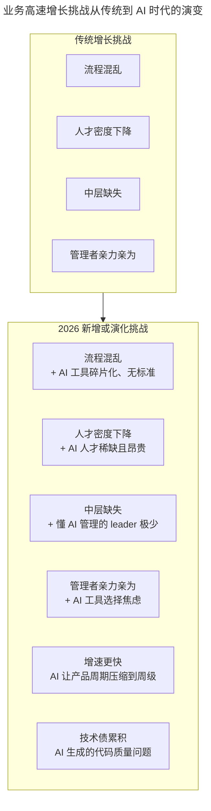
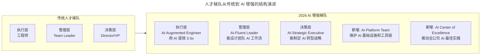

# 徐裕键：业务高速增长过程中的团队迭代

> **适用范围**：技术 VP、CTO、研发总监、创业公司技术负责人，以及在业务高速增长期面临团队扩张与流程重构挑战的管理者。

> **更新摘要（v2 · 2026-08 更新）**：整合贝贝网从 3 人到上千人的团队迭代经验与 AI 时代的团队高速增长新路径，补充 AI-Native 研发流程、AI 增强人才梯队、组织架构 AI 适配、AI 时代招聘 KPI 体系，以及"战略能力乘组织能力乘 AI 能力"的新成功公式。

## 一、导言

贝贝网在 2014 年上线，不到一年时间拿到 C 轮一亿美金融资，成为估值 10 亿美金的独角兽公司，用两年时间开始实现规模化盈利。公司从最初的 3 个人成长为上千人规模的大团队。一个高速增长的公司会面临各种各样的挑战，这些挑战来自方方面面，但大部分可以归结于业务和团队两大方面。

公司的高速增长必然伴随着业务的指数级增长，随着业务增长团队越来越壮大，团队中的角色也越来越多，此时会出现两个核心问题。第一个是流程混乱——从运营提出需求到产品设计再到开发上线，产品可能与最初预想的效果完全不一样，最初的产品需求是卖家秀效果，上线后变成了买家秀。第二个是团队内部挑战——创业初期公司影响力小、招人困难，随着业务快速增长需要不停增加人员，即使管理层很专业但管理想法就是落实不下去，因为中层是缺失的。

在 2026 年的 AI 时代，这两大挑战有了新的演变和新的解法。AI 让产品周期压缩到周级，AI 人才稀缺且昂贵，懂 AI 管理的 leader 极少，AI 工具选择焦虑加剧了管理者的亲力亲为倾向，AI 生成的代码质量问题带来新的技术债。但同时，AI 也提供了系统性的解决方案。本文将贝贝网的实战经验与 AI 时代的团队迭代策略整合为统一叙事。

## 二、核心方法论

### 两大挑战的 AI 时代演变

传统增长挑战包括流程混乱、人才密度下降、中层缺失、管理者亲力亲为。2026 年新增或演化的挑战包括：流程混乱叠加 AI 工具碎片化无标准；人才密度下降叠加 AI 人才稀缺且昂贵；中层缺失叠加懂 AI 管理的 leader 极少；管理者亲力亲为叠加 AI 工具选择焦虑；增速更快（AI 让产品周期压缩到周级）；技术债累积（AI 生成的代码质量问题）。

### 两大解决方案

**方案一：规范流程制度**。将它变得标准化、工具化、可度量，让团队成员有流程可依。业绩增长常会稀释人才密度，当业务复杂度往上快速增长时公司高绩效人才占比下降，两者会出现交叉点。交叉点出现时以前的那套流程已不适用，混乱和错误开始出现，产品迭代速度受到严重制约。此时最简单有效的解决方案就是梳理一套流程制度规范，授予团队成员合用的工具与方法帮助快速成长。

**方案二：完善人才梯队**。使人才密度的提升超过业务复杂度增长，同时通过工具化、产品化、智能 AI 等技术手段将业务增长带来的系统复杂度增长降低到最小。砍掉次要的边缘性业务或鸡肋业务，关注最核心、最具价值的事情，也能降低系统复杂性。

### 成功公式的 AI 时代升级

徐裕键老师的核心认知是"战略能力加组织能力等于成功"。在 AI 时代需要加上第三个要素：成功等于战略能力乘组织能力乘 AI 能力。没有 AI 能力的战略看不清技术趋势错失机会；没有 AI 能力的组织效率被竞争对手碾压；有 AI 能力但战略或组织不行依然无法成功。三者缺一不可，而 AI 能力是 2026 年最新的入场券。

上图展示了团队高速增长挑战从传统到 AI 时代的演变关系。原有的四大挑战在 AI 时代不仅没有消失，反而叠加了新的维度：流程混乱叠加 AI 工具碎片化，人才密度下降叠加 AI 人才稀缺，中层缺失叠加 AI 管理人才匮乏，管理者亲力亲为叠加 AI 工具选择焦虑。同时新增了增速更快和技术债累积两个全新挑战。这意味着团队迭代的复杂度在 AI 时代显著提升，需要系统性的应对策略。

## 三、关键流程

### 规范流程制度的 AI 增强

贝贝网的实践是增加项目经理角色，与产品经理、技术经理组成金三角推动项目。项目推进过程中建立专门的站会制度定期沟通同步进展，项目上线后不论成功失败都组织复盘，对流程进行持续迭代优化。规范项目流程能够确保上百号研发、数十条业务线做到并行迭代，新版本迭代速度从一个月一个版本缩短到三周一个版本。

2026 年的 AI 增强在金三角基础上叠加 AI Project Manager 实现自动化跟踪；站会制度叠加 AI 自动生成每日进度报告；复盘机制从季度或项目结束后升级为 AI 实时分析过程数据提前预警；文档管理从 Confluence 手动维护升级为 AI 自动生成加维护；代码质量从人工 Code Review 升级为 AI Code Review 全覆盖；知识沉淀从 Wiki 手动编写升级为 AI 知识库问答式检索。

AI-Native 研发流程将传统流程从月级周期压缩到周级：需求由 AI 分析，设计由 AI 生成原型，开发由 AI 辅助编码，测试由 AI 自动化，上线由 AI 监控，复盘由 AI 数据分析。整体提速 2-3 倍。

### 完善人才梯队的 AI 时代策略

传统人才梯队分为执行层（工程师）、管理层（Team Leader）、决策层（Director/VP）。2026 年的 AI 增强梯队新增了两个角色：AI Platform Engineer（维护 AI 工具链、GPU 资源、API 管理）和 AI Champion（各团队 AI 推广大使、培训师）。同时现有角色的职责也发生了变化：执行层升级为 AI-Augmented Engineer（用 AI 提效 3-5 倍），管理层升级为 AI-Fluent Leader（能设计团队 AI 工作流），决策层升级为 AI-Strategic Executive（能制定 AI 转型战略）。

上图对比了传统人才梯队与 AI 增强梯队的结构差异。原有三层梯队（执行层、管理层、决策层）在 AI 时代各自升级了 AI 相关能力，同时新增了 AI Platform Team 和 AI Center of Excellence 两个横向支撑团队。前者负责维护 AI 基础设施和工具链，后者推动全公司 AI 最佳实践的沉淀与传播。这种"纵向升级加横向新增"的结构，确保了 AI 能力在组织中的全面渗透。

### 关键岗位新定义

| 角色 | 传统职责 | 2026 年新增职责 |
|-----|---------|---------------|
| CTO/技术 VP | 技术战略、团队管理 | AI 战略规划、AI 工具选型、AI 文化建设 |
| 研发总监 | 交付管理、质量保障 | AI 效能度量、AI 流程优化 |
| Team Leader | 任务分配、进度跟踪 | AI 工具推广、AI Best Practices 建设 |
| 工程师 | 编码、实现功能 | AI 工具使用、AI Output Review |
| AI Platform Engineer（新增） | （无） | 维护 AI 工具链、GPU 资源、API 管理 |
| AI Champion（新增） | （无） | 各团队 AI 推广大使、培训师 |

### 组织架构的 AI 适配

| 阶段 | 传统架构 | 2026 年推荐架构 |
|-----|---------|---------------|
| 小于 20 人 | 职能型（统一管理） | 职能型加 AI Tool Admin 角色 |
| 20-100 人 | 职能矩阵型 | 业务矩阵型加 AI Platform 小组 |
| 100-500 人 | 业务矩阵型 | 业务矩阵加 AI CoE 加 AI Platform Team |
| 500+ 人 | 多事业部 | 每个 BU 配 AI 团队加中央 AI Platform |

无论规模大小，2026 年的组织架构中必须包含 AI 相关的角色和团队。

## 四、工具与实战

### 管理者背招聘 KPI 的 AI 版本

原文探讨过管理者到底要不要背招聘 KPI，结论是要背——招聘不仅是 HR 的事情也是管理者的事情，一名优秀的管理者也应该是一名优秀的 HR。在 AI 时代，招聘 KPI 体系新增了 AI 维度：AI 人才占比（新招员工 AI 能力达标率、团队 AI 成熟度提升）；AI 工具采用率（新员工首月 AI 使用率、团队整体 AI 工具覆盖率）；AI 文化指标（AI 分享参与度、AI 最佳实践贡献数）；AI 效能指标（新人 AI 增效倍数、团队人均 AI 产出提升）。

### 流程规范的 AI 增强对比

| 维度 | 传统做法 | 2026 年 AI 增强 |
|-----|---------|--------------|
| 项目管理 | 项目经理加金三角 | 加 AI Project Manager（自动化跟踪） |
| 站会制度 | 每日站会同步进展 | 加 AI 自动生成每日进度报告 |
| 复盘机制 | 季度或项目结束后复盘 | 加 AI 实时分析过程数据提前预警 |
| 文档管理 | Confluence 手动维护 | 加 AI 自动生成加维护项目文档 |
| 代码质量 | Code Review | 加 AI Code Review（全覆盖） |
| 知识沉淀 | Wiki 手动编写 | 加 AI 知识库（问答式检索） |

### AI 投入 ROI 预估

| 投入项 | 月成本 | 预期回报 |
|-------|--------|---------|
| AI 工具订阅（全员） | 50-200 美元/人 | 效率提升 30-50% |
| AI 培训（外部） | 2000-5000 美元/季 | 学习曲线缩短 60% |
| AI Platform Engineer（1-2 人） | 15-25K 美元/月 | 工具问题解决率 90%+ |
| 总投入（50 人团队，按各项低配估算） | 10-20K 美元/月 | 产出提升 50-100K 美元/月（ROI 5-10 倍） |

## 五、常见误区

**误区一：管理者亲力亲为**。不少管理者从技术转型而来，看到团队成员事情做得不好——代码写得慢、规范写不好、架构设计不好——就恨不得自己上手去做。但这样做终归解决不了问题。在 AI 时代，管理者更应关注 AI 工具选型和团队 AI 工作流设计，而非亲自编码。

**误区二：高薪引入专家会打破薪酬平衡**。之前创业初期招进的成员薪资较低，招聘技术专家可能薪资比别人多出一倍甚至好几倍。但团队需要这样的专家，当公司处在快速发展阶段时，最初跟随团队的员工也需要继续成长，通过引进专业人才可以倒逼大家突破天花板。结果证明这非常有效。

**误区三：照搬业界流程制度规范**。业界有不少成型的流程制度规范可以借鉴参考，但不能照搬照用。如何将其优化为适合自己公司的情况、真正落地执行是其中的关键。

**误区四：忽视组织架构演进**。职能矩阵型团队适合团队小、业务简单且产品单一的阶段，能更好地进行资源统筹及人员备份。当公司发展、团队变大、业务越来越复杂后，必须重组为业务矩阵型团队以业务线为主进行分工，将全职能目标打通建立利益共同体。

**误区五：AI 工具碎片化无标准**。在 AI 时代，各团队各自选用不同 AI 工具会导致协作成本激增。必须统一 AI 工具栈选型和采购，建立 AI 使用规范和安全指南，避免工具碎片化。

**误区六：AI 能力与战略组织割裂**。有 AI 能力但战略或组织不行依然无法成功。三者是乘法关系，任何一项为零则整体为零。AI 能力必须服务于战略目标，嵌入组织流程，而非孤立存在。

## 六、进阶延展

### 高速增长团队 AI Readiness Checklist

**Phase 1 基础设施（第 1-2 周）**：统一 AI 工具栈选型和采购；部署 AI Code Review 流程；建立 AI 知识库（Notion AI 或 Confluence AI）；制定 AI 使用规范和安全指南。

**Phase 2 人员准备（第 3-6 周）**：识别或任命 AI Champion（每 5-10 人 1 名）；启动全员 AI 基础培训；招聘时加入 AI 能力评估；将 AI 能力纳入绩效考核。

**Phase 3 流程优化（第 2-3 个月）**：用 AI 优化现有研发流程；建立 AI 项目模板和 SOP；启动 AI 效能仪表盘；定期举办 AI Share Session。

**Phase 4 文化建设（持续进行）**：打造 AI First 文化；表彰 AI 实践优秀案例；建立 AI 失败案例库（鼓励分享踩坑）；连接外部 AI 社区和资源。

### 扁平化管理与自驱动

贝贝网即使发展到两三百人规模也依然保持扁平化的管理方式，管理者只有 20 人左右，总占比不到 10%。这样做的目的是让研发同学在专业技能方面发挥更大的价值，以业务为导向激发团队自驱动性，将团队价值发挥到最大。

在 AI 时代，扁平化管理有了新的支撑——AI 工具可以替代部分中层管理职能（如进度跟踪、状态汇报、风险预警），使组织可以保持扁平的同时不损失管理效率。但前提是团队具备足够的 AI 能力和自驱动文化。

### 战略能力与组织能力的持久战

从过去几年的创业过程中可以发现，一个公司能否持续成功有两个决定因素：战略能力、决策能力和组织能力。在公司发展过程中每个阶段都有非常多的机会，能否选择对机会取决于战略能力和决策能力。即使选对机会但这个机会最终不一定会属于你，这时就看团队组织能力与执行力。在如今竞争残酷的市场中，半年就可以决定一个创业公司成或败，一年时间就可以决定一个公司的存亡。

在 AI 时代，这个公式需要更新为：成功等于战略能力乘组织能力乘 AI 能力。三者缺一不可，而 AI 能力是 2026 年最新的入场券。没有 AI 能力的战略看不清技术趋势，没有 AI 能力的组织效率被竞争对手碾压，有 AI 能力但战略或组织不行依然无法成功。团队迭代的核心是将 AI 能力系统性地嵌入战略决策和组织流程中，使其成为组织的内生能力而非外挂工具。
