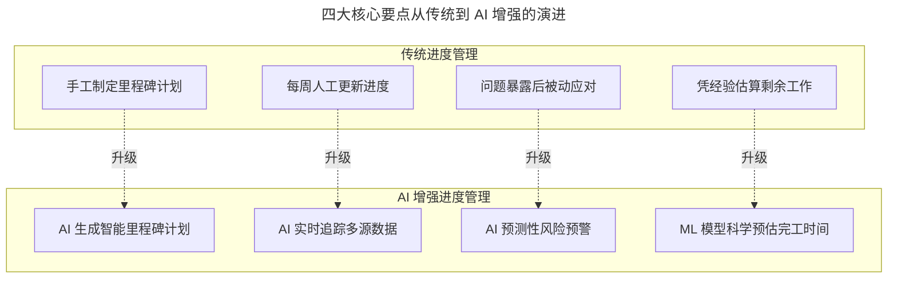
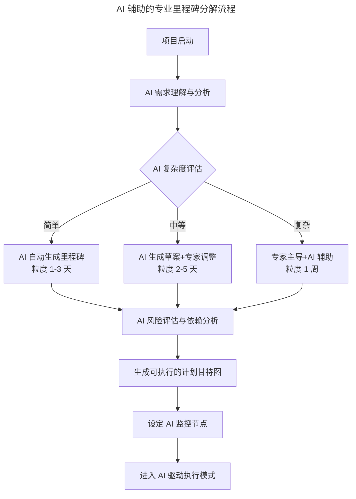

# 敏捷中的期限之殇，软件业该怎么做

> **适用范围**：项目经理、Scrum Master、研发主管、产品经理，以及需要提升大型项目按期交付率的技术团队。

> **更新摘要（v2 · 2026-08 更新）**：整合软件业按期交付四大核心要点（进度要素纳入敏捷、关键里程碑定义、跟踪响应沟通、按期交付激励）与 AI 驱动的准时交付体系，补充 AI 辅助里程碑分解方法论、AI 智能协同系统、AI 即时激励系统，以及完整的 AI 交付管理体系架构和分阶段落地路线图。

## 一、导言

敏捷开发宣言中并没有完全抛弃进度，它只是说响应变化要优先于遵循计划。因为迭代更新的周期相对稳定（2-4 周），看起来敏捷开发模式没有延期的问题，再不济也是割舍一些完不成的特性作为一个不算成功的迭代来复盘。但并非所有软件开发迭代都是这么短的周期。在新版本开发、复杂的企业 SaaS 特性开发中，一个迭代经常需要超过一个月，加上必要的测试和灰度发布可能轻易超过两个月。统计常用 APP 的版本更新历史发现，80% 以上的 APP 更新频度在两个月以上。

软件研发的里程碑定义存在普遍困难。按照设计交付、编码完成、测试发布和验证发布这样的粗线条节点划分虽然容易，但对进度管理并没有实质性的帮助。而且对于敏捷开发项目来说，设计交付甚至不是一个一刀切的工作，有一部分细化设计工作完全可能在编码工作开始以后再进行。很多软件外包项目的所谓开发交付计划都是根据客户要求的时点往前倒推而已。

问题的关键不在于交付期限的来源，而是有了交付期限以后应该怎样细分软件研发工作的关键里程碑。本文将四大核心要点与 AI 驱动的准时交付体系整合为统一叙事，呈现一套可预测、可控制、可持续的高质量交付方法论。

## 二、核心方法论

### 四大核心要点

**要点一：将进度要素纳入敏捷开发**。看似简洁的 Scrum 开发看板，在 In Process 这一栏中的任务内容需要建立另外一套计划和跟踪系统才能实现更可靠的进度控制。敏捷开发之外，传统的软件开发计划和建筑工程项目管理相比大多欠缺详尽的进度计划，而只是笼统定义几个粗放节点。

**要点二：软件研发的关键里程碑**。软件开发要根据前端开发、后端开发和测试的主要专业分部建立细化的专业里程碑。前端开发依据设计阶段产生的页面清点前端组件开发工作量；后端开发根据数据对象和功能特性细化出接口列表和数量；黑盒测试所需时间与前后端开发量总计成正比。达成里程碑所需的工作时间一般要细化到一周工作量以内的颗粒度。

**要点三：跟踪、响应和及时沟通**。接纳变更响应变化的前提是持续对里程碑计划进行维护，让最新版本体现出变更后的情况。当周不能完成里程碑的原因可能是需求变更或技术实现问题，解决办法和建筑业、制造业一样——及时的会商。团队可以约定在周中安排一次期中检查，主动发现执行瓶颈，避免到周末面对不得不被动接受延期的现实。

**要点四：按期交付的激励**。项目按期交付的额外物质激励或假期奖励从长期实践看有百害无一利，它会让管理的重心盯向结果而不是必要的过程。过度强调如期交付的奖励会让团队成员忽略质量，不愿意花费时间在计划和沟通上，还会制造研发人员和产品设计人员之间的矛盾。最好的按期交付激励应该落到平时，按周的如期交付同样值得奖励。

### AI 时代的四大要点升级

上图展示了四大要点从传统到 AI 增强的对应升级关系。手工制定里程碑计划升级为 AI 生成智能里程碑计划，每周人工更新进度升级为 AI 实时追踪多源数据，问题暴露后被动应对升级为 AI 预测性风险预警，凭经验估算剩余工作升级为 ML 模型科学预估完工时间。四个维度的升级共同实现了从"被动响应"到"主动预测"的范式转变。

| 实践环节 | 传统做法 | AI 增强做法 | 效果提升 |
|---------|---------|-------------|---------|
| 里程碑制定 | 架构师花 2-3 天分解任务 | AI 2 小时生成初稿加半天审核 | 速度 5-10 倍 |
| 工作量估算 | Poker Planning（误差正负 50%） | AI 历史数据分析（误差正负 15%） | 精度 3 倍 |
| 进度跟踪 | 每周五人工更新 Excel | AI 实时从 Jira/Git/CI 采集数据 | 时效性 100 倍以上 |
| 偏差检测 | 延期后才发现 | AI 提前 3-7 天预警 | 从被动到主动 |
| 剩余工作预估 | 主观判断 | AI 基于燃尽图趋势加团队效率模型 | 科学量化 |

## 三、关键流程

### AI 辅助的里程碑分解方法论

项目启动后，AI 首先进行需求理解与分析，然后进行复杂度评估。简单项目由 AI 自动生成里程碑（粒度 1-3 天），中等项目由 AI 生成草案加专家调整（粒度 2-5 天），复杂项目由专家主导加 AI 辅助（粒度 1 周）。三种路径汇合后进入 AI 风险评估与依赖分析，生成可执行的计划甘特图，设定 AI 监控节点，进入 AI 驱动执行模式。

AI 里程碑分解的质量标准包括五个维度：完整性方面无遗漏关键任务，AI 对照 Checklist 自动核查；合理性方面工作量评估准确，AI 基于历史数据交叉验证；依赖正确方面任务顺序逻辑无误，AI 自动检测循环依赖和缺失前置；可验证性方面每个里程碑有明确的 Done 标准，AI 自动关联验收条件；可追溯性方面里程碑与业务价值关联，AI 自动映射到 OKR/KPI。

### 软件研发里程碑的专业化分解

上图展示了 AI 辅助的专业里程碑分解全流程。从项目启动到进入 AI 驱动执行模式，关键在于 AI 复杂度评估后的三条分流路径。简单项目由 AI 全自动处理以提升效率，中等项目人机协作平衡效率与质量，复杂项目以专家为主导确保关键决策的正确性。这种分级处理机制既发挥了 AI 的效率优势，又保留了人类专家对复杂问题的判断力。

### AI 智能协同系统

在跟踪与沟通方面，AI 增强带来了显著的效率提升。每日站会从 30 分钟全员参与升级为 15 分钟 AI 预筛议题，节省 50% 时间；周中期检查从 1 小时会议升级为 AI 报告加 15 分钟聚焦讨论，节省 75% 时间；进度报告从 PM 花半天整理升级为 AI 自动生成（5 分钟审核），节省 95% 时间；风险通报从发现问题后临时召集升级为 AI 提前预警加定向通知，响应提前 3-7 天；跨部门协调从多轮邮件会议升级为 AI 翻译加自动安排会议，效率提升 3-5 倍。

AI 智能沟通助手具备三大核心能力：自动信息聚合（从 Jira/GitLab/Slack/邮件等多源采集信息，自动去重分类优先级排序，生成结构化摘要）；智能问答（如"支付模块当前进度如何"可获得包含进度数据、已完成项、进行中项、风险提示的结构化回答）；主动推送（连续 24 小时无代码提交提醒开发者、测试通过率低于 80% 通知 Tech Lead、里程碑预计延期提前 3 天告警 PM 和 Stakeholder、出现新的技术 Blocker 立即通知相关负责人）。

### AI 即时激励系统

原文反对项目结束时的"冲刺奖"，支持按周庆祝 small win。AI 增强后激励体系升级为三级机制：Level 1 日常微激励由 AI 自动触发（当日完成任务且质量评分大于 90 发送即时表扬、帮助他人解决 Blocker 在周报中突出显示、Code Review 被采纳 3 条以上颁发质量卫士徽章、连续 5 天无延迟交付生成稳定输出者证书）；Level 2 周度小胜利由 AI 辅助 PM 执行（周五下午生成本周成就报告、评选本周 MVP、小型庆祝活动、团队分享会）；Level 3 里程碑达成为正式认可（AI 生成详细贡献度分析、正式庆祝活动、个人成长反馈、更新个人能力档案用于晋升参考）。

## 四、工具与实战

### AI 驱动的完整交付管理体系架构

完整的 AI 交付管理体系由五层构成。输入层包含项目需求、交付期限、资源约束；AI 规划层包含 AI WBS 分解引擎、AI 估算模型、AI 风险评估器、AI 计划优化器；执行监控层包含 AI 数据采集器、AI 进度追踪器、AI 异常检测器、AI 预警推送器；协调沟通层包含 AI 沟通中枢、AI 会议助理、AI 文档生成器、AI 知识库；输出层包含按时高质量交付、团队成长与激励、经验沉淀与复用。

### 沟通场景的 AI 增强对比

| 沟通场景 | 传统方式 | AI 增强方式 | 时间节省 |
|---------|---------|-------------|---------|
| 每日站会 | 30 分钟/天（全员参与） | 15 分钟/天（AI 预筛议题） | 节省 50% |
| 周中期检查 | 1 小时会议 | AI 报告加 15 分钟聚焦讨论 | 节省 75% |
| 进度报告 | PM 花半天整理 | AI 自动生成（5 分钟审核） | 节省 95% |
| 风险通报 | 发现问题后临时召集 | AI 提前预警加定向通知 | 响应提前 3-7 天 |
| 跨部门协调 | 多轮邮件/会议 | AI 翻译加自动安排会议 | 效率 3-5 倍 |

### 激励体系的 AI 增强

| 激励类型 | 传统做法 | AI 增强做法 | 效果 |
|---------|---------|-------------|------|
| 及时性 | 项目结束后奖励 | 每周每个里程碑即时认可 | 动机持续性提升 |
| 客观性 | 主观评价 | AI 数据驱动的量化贡献分析 | 公平感提升 |
| 个性化 | 统一的奖励标准 | AI 识别个人偏好（成长/金钱/荣誉） | 满意度提升 |
| 可视化 | 季度绩效面谈 | AI 实时 Dashboard 展示个人贡献 | 成就感提升 |

## 五、常见误区

**误区一：倒算排期等同于合理计划**。是不是应该倒算排期是一个很难回答的问题，企业总是面临客户的需求压力和竞争压力。问题的关键不在于交付期限的来源，而是有了交付期限以后怎样细分关键里程碑。倒算排期可以提供时间约束，但必须在里程碑分解中验证其可行性。

**误区二：粗线条节点划分足够管理进度**。按照设计交付、编码完成、测试发布和验证发布这样的粗线条节点划分虽然容易，但对进度管理并没有实质性的帮助。必须细化到一周工作量以内的颗粒度，否则按周检查就失去了意义。

**误区三：项目冲刺奖能提升交付率**。项目按期交付的额外物质激励或假期奖励从长期实践看有百害无一利。它会让管理重心盯向结果而非过程，忽略让项目如期完成的原因。过度强调如期交付会让团队成员忽略质量，不愿意花费时间在计划和沟通上。

**误区四：计划制定与执行分离**。制定计划和执行计划的人如果是一致的，计划达成的概率就会更高。如果由不参与执行的人制定计划，执行者容易缺乏认同感，计划达成率下降。前后端开发工作不可避免地需要相互协调以确定科学次序，制定过程总是依赖产品和研发人员的集体会议。

**误区五：完全依赖 AI 而忽视人的判断**。AI 是辅助工具，关键决策仍需人类判断。AI 预测结果应与团队共享以建立信任，同时需持续用实际结果校准模型。应避免让团队成员感到被 AI 监控，强调 AI 是帮助而非监视。

## 六、进阶延展

### 落地实施路线图

**Phase 1 基础建设（第 1 个月）**：选择 AI 项目管理工具（推荐 Linear AI 或自建平台）；接入现有数据源（Jira、GitLab、CI/CD、Slack 等）；配置基础的 AI 进度追踪和报告功能。

**Phase 2 流程融合（第 2-3 个月）**：在 2-3 个试点项目中应用 AI 里程碑管理；建立 AI 辅助的站会和周检机制；训练团队的 AI 工具使用习惯。

**Phase 3 智能化升级（第 4-6 个月）**：启用 AI 预测性风险预警；实施 AI 驱动的即时激励系统；基于试点数据优化 AI 模型的准确度。

**Phase 4 全面推广（第 6-12 个月）**：在所有项目中推广 AI 交付管理体系；建设组织级的 AI 项目管理最佳实践库；持续迭代和优化 AI 系统能力。

### 预期收益

| 指标 | 行业平均（传统） | AI 增强团队（2026） | 提升 |
|-----|-----------------|-------------------|------|
| 大型项目按时交付率 | 45-55% | 80-92% | 提升 35-47% |
| 进度估算准确度 | 正负 50% 误差 | 正负 12-18% 误差 | 精度提升 3 倍 |
| 风险提前预警时间 | 0-2 天（通常滞后） | 5-10 天 | 从被动到主动 |
| 项目管理时间投入 | PM 30-50% 时间 | PM 10-20% 时间 | 效率翻倍 |
| 团队满意度 | 65-75 分 | 88-95 分 | 提升 20-30 分 |
| 客户信任度 | 中等 | 高度信任 | 长期合作基础 |

### 从激励到成长的闭环

对于软件研发人才，更宝贵的激励是能力的迅速提升。如果研发成员都参与过进度计划工作，尝试过科学拆解研发里程碑，他们将来的能力不仅仅是更出色的程序员，而是能够管理更复杂项目的主管人才。这种体验只要做过相关工作、尝到过胜利果实的研发人员都能迅速体会到。就像在足球赛场上，赢得最终比赛是激励，但除此之外，组织一次有效进攻、赢得一个进球、成功化解一次险恶进攻，都是非常有效的激励。

2026 年的准时交付不再仅靠人的意志力和加班来保证，而是靠 AI 驱动的科学管理体系来实现可预测、可控制、可持续的高质量交付。AI 不能消除所有延期风险，但能更早地发现问题、更准确地预测结果、更主动地应对挑战。将进度要素纳入敏捷开发、定义细粒度关键里程碑、持续跟踪与及时沟通、合理激励机制这四大要点，在 AI 加持下焕发出了新的生命力。
