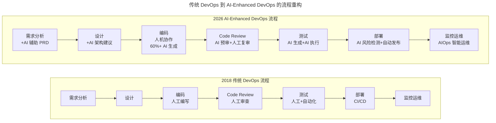
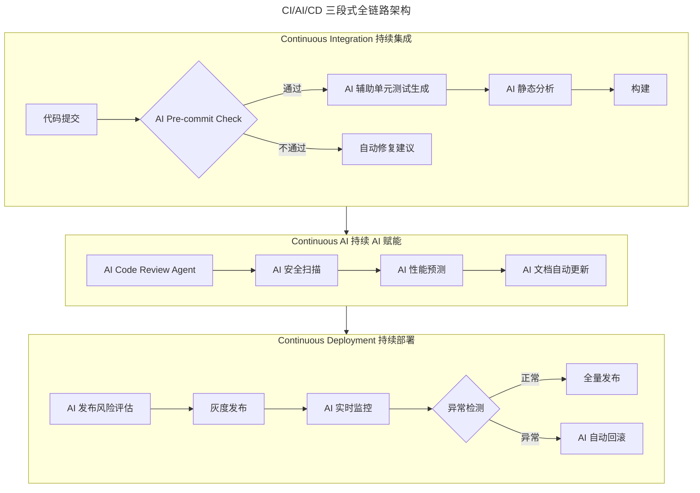

# 如何打造高效的研发流程与文化

> **适用范围**：研发负责人、工程效能团队、DevOps 工程师，以及正在推进研发流程 AI 化转型的技术团队。

> **更新摘要（v2 · 2026-08 更新）**：整合"流程、敏捷、工程化、文化、度量"五大研发原则与 AI 时代的范式转移，补充从传统 DevOps 到 AI DevOps 的演进路径、CI/AI/CD 全链路设计、AI Code Review 三层体系、AI 测试生成体系、AI 文档维护生态，以及团队 AI 资产库建设指南。

## 一、导言

高效的研发流程与文化是技术团队持续创造价值的基础。流程是效率的保障，从需求到上线需要标准化流程；敏捷实践提升响应速度，通过迭代、反馈、持续改进适应变化；工程化体系保证质量，依赖 CI/CD（Continuous Integration / Continuous Deployment，持续集成 / 持续部署）、代码审查、自动化测试；文化是流程的土壤，工程师文化驱动流程自觉执行；度量驱动持续优化，用数据说话。

2026 年的研发流程面临 AI 驱动的范式转移：84% 的开发者正在使用或计划在开发流程中使用 AI 工具（Stack Overflow 2025 调查口径），编码环节已被 AI 深度渗透；Agent 自主完成多步骤任务，从单点工具到端到端自动化；CI/CD 演进为 CI/AI/CD，AI 参与代码生成、审查、测试、部署全链路；传统 Code Review 瓶颈被打破，AI 实现 7×24 小时即时审查；文档维护不再是负担，AI 自动生成和更新技术文档；技术债务管理智能化，AI 识别、评估、优先排序技术债务。

本文将五大研发原则与 AI 时代实践整合为统一叙事，呈现一套以 AI 为原生要素重新设计的研发流程体系。核心理念是：2026 年的高效研发流程，不是在原有流程上加几个 AI 工具，而是以 AI 为原生要素重新设计流程——AI 不是外挂，而是流程的有机组成部分。

## 二、核心方法论

### 五大原则的 AI 时代升级

研发流程建设的五大原则在 AI 时代依然成立，但实施方式发生了根本变化。流程是效率保障升级为"AI 增强的流程是指数级效率保障"；敏捷实践升级为"AI 使敏捷更敏捷"，实现更快迭代、更低成本；工程化体系升级为"AI 驱动的工程化"，自动化程度大幅提升；文化是土壤升级为"AI-Augmented 文化"，主动拥抱 AI 变革；度量驱动优化升级为"AI 增强的数据洞察"，更细粒度、更实时。

上图对比了传统 DevOps 与 AI-Enhanced DevOps 的流程差异。传统流程中每个环节都以人工为主，编码、审查、测试、部署依次串行推进。AI 增强流程在保留环节骨架的同时，为每一步注入 AI 能力：需求阶段 AI 辅助生成 PRD 初稿，设计阶段 AI 提供架构建议，编码阶段人机协作让 AI 生成 60% 以上代码，Code Review 由 AI 预审加人工复审，测试由 AI 生成并执行，部署引入 AI 风险检测，运维升级为 AIOps 智能运维。这种重构不是简单加工具，而是重新定义每个环节的分工。

### 流程环节效率提升对比

| 流程环节 | 传统做法 | 2026 年 AI 增强版 | 效率提升 |
|---------|---------|---------------|----------|
| 需求分析 | 产品经理撰写 PRD | AI 辅助生成初稿，PM 聚焦决策 | 2 倍 |
| 技术设计 | 架构师画图写文档 | AI 生成方案草案，架构师审核优化 | 3 倍 |
| 编码实现 | 工程师手写全部代码 | 人机协作，AI 生成 60-70% | 3-5 倍 |
| Code Review | 同事人工审查 | AI 预审（即时）+ 人工复审重点 | 5 倍 |
| 测试 | 手写测试用例加执行 | AI 生成用例加 AI 执行加人工验证 | 4 倍 |
| 部署发布 | CI/CD 流水线 | AI 风险检测加智能发布策略 | 2 倍 |
| 监控运维 | 告警加人工排查 | AIOps 智能诊断加自动修复 | 10 倍 |

## 三、关键流程

### CI/AI/CD 全链路设计

传统的 CI/CD 流水线在 2026 年演进为 CI/AI/CD 三段式架构。第一段持续集成（Continuous Integration）中，代码提交触发 AI Pre-commit Check，通过后 AI 辅助生成单元测试，再经 AI 静态分析与构建；第二段持续 AI 赋能（Continuous AI）串联 AI Code Review Agent、AI 安全扫描、AI 性能预测、AI 文档自动更新；第三段持续部署（Continuous Deployment）执行 AI 发布风险评估、灰度发布、AI 实时监控、异常检测后全量发布或 AI 自动回滚。

上图展示了 CI/AI/CD 的三段式架构。持续集成段在代码提交后立即进行 AI 预检查，不通过时自动给出修复建议，避免低质量代码进入流水线；持续 AI 赋能段是新增的核心环节，串联 Code Review、安全扫描、性能预测、文档更新四类 AI Agent，实现对代码质量的多维自动保障；持续部署段由 AI 评估发布风险，灰度后实时监控，异常时自动回滚。三段之间工件实时传递，每个环节自驱动自运行。

### AI Code Review 三层体系

| 层级 | 执行者 | 审查内容 | 响应时间 | 覆盖范围 |
|-----|--------|---------|---------|----------|
| L1 即时审查 | AI Agent | 语法错误、风格规范、常见 Bug 模式 | 小于 1 秒 | 100% 代码 |
| L2 深度审查 | AI Agent | 逻辑缺陷、安全漏洞、性能问题 | 小于 5 分钟 | 100% 代码 |
| L3 人工复审 | 资深工程师 | 架构一致性、业务逻辑正确性、设计意图 | 小于 24 小时 | 变更的关键路径 |

标准化流程为：开发者提交 PR 后，L1 AI Agent 自动触发并在一分钟内完成，通过则进入 L2，不通过则自动评论具体问题与修复建议；L2 AI Agent 深度审查在十分钟内完成，低风险自动标注等待 L3，高风险阻断合并必须人工处理；L3 人工复审聚焦 AI 已标记的"需关注"区域、业务逻辑正确性、架构与设计层面问题；合并后 AI 自动更新相关文档并记录 Review 数据用于后续分析。

### AI 增强测试体系

传统测试痛点在于测试用例编写耗时（占开发时间 30-50%）、覆盖率难保证、回归测试执行耗时长、结果分析依赖人工。AI 增强后，输入需求文档、源代码、历史 Bug 库、变更日志，AI 分析需求生成测试场景，生成覆盖正常异常边界的测试用例，生成 Unit/Integration/E2E 测试代码，生成边界值与真实数据模拟的测试数据，并行执行后 AI 分析结果、智能分类、生成报告、推荐修复方案。

| 指标 | 传统方式 | AI 增强方式 | 提升 |
|-----|---------|-----------|------|
| 测试用例编写时间 | 4 小时/功能 | 30 分钟/功能 | 8 倍 |
| 测试覆盖率 | 60-70% | 85-95% | 提升 25% |
| 回归测试执行时间 | 2 小时 | 15 分钟 | 8 倍 |
| Bug 发现率（测试阶段） | 70% | 92% | 提升 22% |
| 测试维护成本 | 高（每次变更手动更新） | 低（AI 自动适配） | 5 倍 |

## 四、工具与实战

### AI 文档维护生态

传统文档困境在于写文档耗时、更新滞后于代码、质量参差不齐、查找困难。2026 年 AI 文档生态实现了"文档即代码"：API 文档由 AI 从代码自动生成加智能示例，维护成本降低 90%；架构文档由 AI 追踪代码变更自动同步，降低 80%；README 由 AI 根据 Git 历史持续更新，降低 70%；注释内联文档由 AI 辅助生成人工审核，降低 60%；Runbook/Ops 文档由 AI 从故障记录中学习生成，降低 85%。

文档工作流为：代码变更提交后 AI 自动检测变更影响范围，更新受影响的文档草稿，开发者审核调整 5-10 分钟后文档与代码同步发布，AI 建立文档-代码关联索引便于追溯。

### 开源文化与 AI 共享经济

2026 年的"开源"已超越代码本身。代码开源仍以 GitHub 为主导；模型开源于 Hugging Face 生态繁荣；Prompt 开源于 PromptBase、FlowGPT 等平台涌现；Agent Workflow 开源于 CrewAI Store、LangChain Hub；数据集开源自学术为主转向企业积极参与。

团队层面的 AI 资源共享应建设五大资产库：Prompt 模板库（代码生成类、Code Review 类、文档生成类、测试生成类）；Agent 配置库（编码 Agent、测试 Agent、运维 Agent 配置）；最佳实践库（成功案例、失败教训、优化技巧）；评估标准库（AI 输出质量评分卡、不同场景的验收标准）；工具集成配方（IDE 配置、CI/CD 集成、监控告警配置）。

### 关键数据参考

| 指标 | 行业平均 | 领先企业 | 差距启示 |
|-----|---------|---------|----------|
| 研发流程 AI 覆盖率 | 45% | 85%+ | 大多数企业还有很大空间 |
| AI Code Review 采用率 | 52% | 95% | 已成标配，越早越好 |
| AI 测试生成采用率 | 38% | 78% | 效益明显，值得投入 |
| AI 文档自动化率 | 25% | 65% | 容易上手 |
| 研发周期缩短（对比无 AI） | 1.5 倍 | 3 倍 | 用好 AI 可以显著加速 |
| AI 引入的质量问题占比 | 18% | 6% | 质量管控是差异化关键 |

## 五、常见误区

**误区一：AI 不是万能的，需建立质量保障机制**。误报方面，AI 把正常代码标为问题，应建立"误报反馈"机制持续优化规则；漏报方面，AI 没发现的真正 Bug，L3 人工复审应聚焦业务逻辑；上下文缺失方面，AI 不理解业务背景导致误判，应在 PR 描述中提供足够的 Context；过度依赖方面，看到 AI 通过就不仔细看，应强制 L3 复审关键变更。

**误区二：在原有流程上简单叠加 AI 工具**。流程 AI 化的核心不是加工具，而是以 AI 为原生要素重新设计流程。AI Code Review 准确率目标应大于 85%，误报率目标应小于 20%，人工复审发现 AI 遗漏的比例目标应小于 15%。

**误区三：为了 AI 而 AI**。流程 AI 化的核心目标是释放人类的创造力——让 AI 处理重复性、规则性的工作，让人类聚焦于创新、决策和复杂问题解决。始终以业务价值为导向，不要让工具选型变成技术崇拜。

**误区四：忽视文化同步推进**。技术升级但团队文化未跟上会导致推行阻力。应同步推进 AI 文化建设和培训，将 AI 使用纳入工程卓越的标准，设立 AI 工程创新奖项，推动 Prompt 和 Workflow 的内部开源。

## 六、进阶延展

### 分阶段行动建议

**立即行动（本周内）**：评估当前研发流程的 AI 成熟度，逐一检查编码、Code Review、测试、文档、部署、运维各环节的 AI 使用情况，得分低于 3 项需紧急启动，3-5 项有基础，大于 5 项领先；选择一个环节进行 AI Pilot，推荐从 AI Code Review 或 AI 测试生成开始（见效快、风险低），设定明确目标如"将 Code Review 响应时间从 24 小时降到 1 小时"；建立 AI 工具使用的初步规范，明确鼓励、禁止或限制使用的场景，规定 AI 生成内容的标注要求。

**短期规划（1-3 个月）**：构建 CI/AI/CD 基础流水线，引入 AI Code Review 工具，配置 AI 静态分析和安全扫描，建立 AI 生成的测试用例自动入库机制；建立 AI 文档维护流程，选择一个项目试点 AI 文档自动生成，制定文档质量标准和审核规范，将文档维护纳入 Definition of Done；启动团队 AI 资产库建设，创建内部 Prompt 模板库，建立 AI 最佳实践分享机制，定期组织 AI 工具使用经验交流。

**中期建设（3-12 个月）**：全面推进研发流程 AI 化，目标为核心流程环节 AI 覆盖率大于 80%，建立 AI 流程效能度量仪表盘，持续优化 AI 工具配置和规则；建设 Agent 能力，试点自主 Agent（如自主测试 Agent、自主运维 Agent），建立 Agent 的开发、部署、监控规范，积累 Agent 应用最佳实践；塑造 AI-Native 工程文化，将 AI 使用纳入工程卓越的标准，设立 AI 工程创新奖项，推动 Prompt 和 Workflow 的内部开源。

流程 AI 化的终极目标是让 AI 处理重复性、规则性的工作，让人类聚焦于创新、决策和复杂问题解决。不要为了 AI 而 AI，始终以业务价值为导向。AI 技术在快速演进，建议每季度回顾一次流程优化策略。
