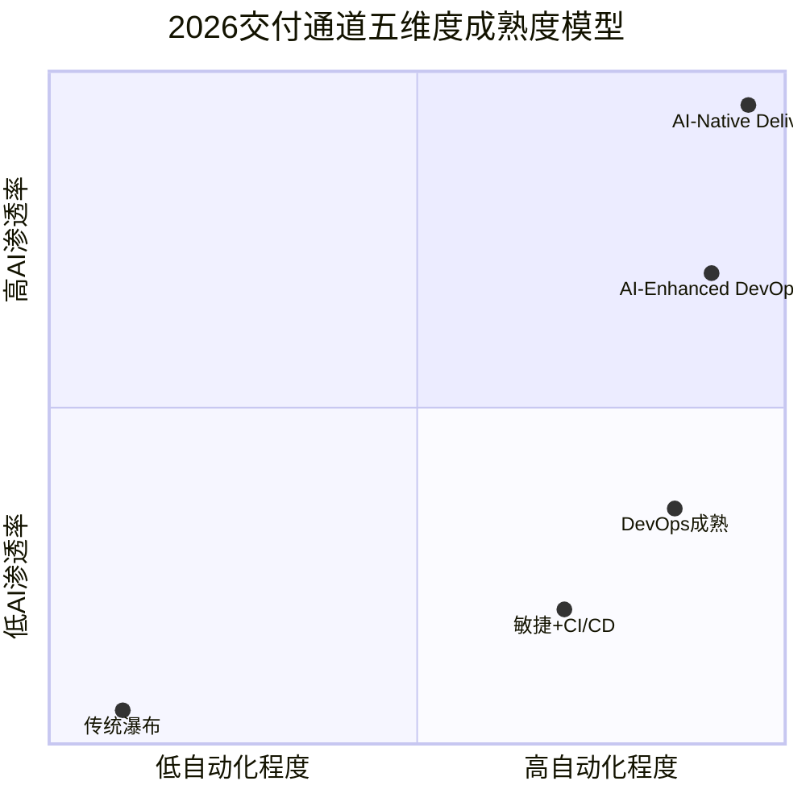
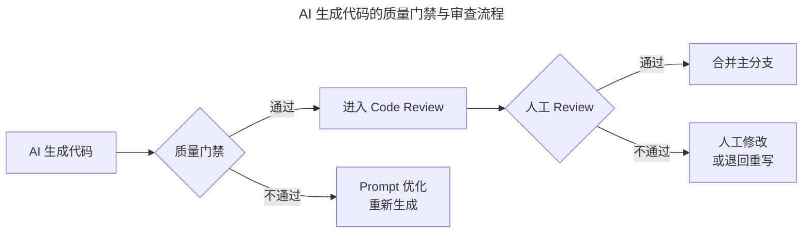

# 施翔：如何打造 7×24 高效交付通道（上）

> **适用范围**：架构师、DevOps 负责人、研发效能团队，以及需要构建高吞吐交付通道的中大型技术团队。

> **更新摘要（v2 · 2026-08 更新）**：整合 7×24 交付通道（7×24 Delivery Channel）的架构与配管实践，补充从 SOA（Service-Oriented Architecture，面向服务架构）到 AI-Native 架构的演进路径、AI 增强的配置管理规范、第五维度"AI"的成熟度模型，以及构建 AI 增强交付通道的分阶段行动清单。

## 一、导言

打造 7×24 高效交付通道的核心目标是让从产品需求提出到最后触达用户的通道全链路自驱动、自运行，各环节之间的工件传递实时完成。以阿里 CBU 技术部为例，从拉分支到正式发布的平均周期是 5.29 天，整个部门 1000 多个应用、350 多名开发人员，一年集成自动化约 29000 多次、发布约 15000 多次，平均每人每年发布 42 次，相当于人均每周约 0.8 次。

交付通道需要从四个维度出发考虑：系统维度确保可以无限扩展、编码不受限于环境；开发维度能够不断提交和验证需求；测试维度能够快速验证和快速反馈；运维维度确保灵活的发布手段和更快更好地感知线上问题。这四个维度的考量主要基于三点原因：业务长期述求希望技术快速高质量响应业务需求；研发生命周期中影响业务交付的因素很多，需要从各维度出发考虑问题；敏捷能力需要有持续性。

在 2026 年的 AI 时代，"7×24 交付通道"的概念被重新定义——从"人类轮班实现 7×24"进化为"Agent 7×24 加人类按需介入"。原文提到的 5.29 天交付周期、15000 次发布等数据，在 AI Agent 加持下可进一步压缩 50-70%。本文从架构和配管两个维度进行 AI 时代升级。

## 二、核心方法论

### 交付通道四维度与第五维度

架构、配置、测试、发布是提升效能的几个关键点，其中架构与配管尤为重要。升级了系统架构、提升了配管能力之后，开发同学的活力能得到极大激发，可以无拘无束地面对自己的系统、服务进行开发。通过平台化支持配置管理、测试环境管理等，解放人力，实现 7×24 小时战略支持。

2026 年在传统四维度基础上增加第五维度——AI。AI 辅助编码、AI 测试覆盖、AI 代码审查、AI 部署自动化、AI 运维智能化、AI 效能度量，共同构成了交付通道的 AI 维度。每个子维度都有从 L1 到 L4 的成熟度演进路径：AI 辅助编码从尝试到深度整合；AI 测试覆盖从手工到全 AI 生成加智能补充；AI 代码审查从无到 AI 初审加人工复审；AI 部署自动化从手工到 AI 自主加异常人工；AI 运维智能化从无到 80% 以上自主处理；AI 效能度量从无到实时看板加预测。

上图以象限图展示了交付通道成熟度模型。横轴代表自动化程度，纵轴代表 AI 渗透率。传统瀑布位于左下角，自动化与 AI 渗透率都极低；敏捷加 CI/CD 向右上移动但 AI 渗透率仍低；DevOps 成熟阶段自动化程度高但 AI 参与有限；AI-Enhanced DevOps 在两个维度都达到较高水平；AI-Native Delivery 位于右上角，代表自动化与 AI 深度融合的终极形态。团队可通过此图定位自身阶段，明确向右上角演进的路径。

### 架构演进的时间线

架构演进经历了从单体架构（2010 年前）到 SOA 架构（2010-2020）、微服务架构（2020-2024）、AI-Native 架构（2024-2026）、Agent-Native 架构（2026 年以后）的路径。在创业阶段，技术团队只有几个人，完全可以在主干上进行开发和发布，不用为架构而架构。当业务复杂、团队达到几十上百人规模后，需要对系统进行分层，如 MVC（Model-View-Controller）模式让前端、后端、测试等更专业的同学做更专业的事。随着业务继续发展，SOA 服务化满足了业务高速增长的需求，分布式架构也很好地解决了效率问题。

## 三、关键流程

### 架构——提升代码生产力

影响代码生产的因素包括代码结构是否合理、代码提交模块是否足够小、开发环境构建是否便捷、代码语言的适用性等。好的架构能有效提升代码生产力，但需结合团队规模、业务特点来决定适用架构。

当所有技术同学都围绕一个系统开发时一定会出现冲突，而当组件拆分后，所有技术同学都面向自己负责的服务进行开发，释放个人生产力，效率得到大幅提升。阿里整个系统的规模一直在不断膨胀，一个开发同学需要维护对应的两到三个系统，这是从系统架构层面提升开发同学生产力的体现。

### AI 时代架构设计的核心原则

| 原则 | 说明 | 2026 年实践 |
|-----|------|-----------|
| AI-First Design | 新系统设计时优先考虑 AI 友好性 | API 设计符合 LLM 调用规范，文档结构化 |
| Human-in-the-Loop | 关键节点保留人工决策 | 安全发布、数据变更、资金操作需人工确认 |
| Agent Composability | 系统由可组合的 Agent 构成 | 每个微服务配备专属 Agent，支持编排 |
| Observability by Default | 所有 AI 行为可追踪、可审计 | 全链路日志记录 AI 决策过程 |
| Graceful Degradation | AI 失败时自动降级到传统模式 | Agent 超时或错误时触发人工接管流程 |

### 配管——全天候的配置能力

以前有 SCM（Software Configuration Management，软件配置管理）岗位，负责版本控制、环境管理、配置管理，保证配置项的完整性和可跟踪性。当分布式架构、面向服务的架构蓬勃发展后，系统数量不断扩张，SCM 不可能再靠人肉方式部署。

代码分支管理是研发模式变革的起点，策略不存在好坏之说，需结合业务特点、技术团队规模等因素决定。两种主要策略各有优劣：分支开发主干发布可以维持稳定的主干环境，随时拉新分支独立开发，但所有分支必须在一个集成点才能集成，回滚成本高；分支开发分支发布拥有高灵活度，项目间不相互影响，但需要非常多的 merge 过程，导致测试工作量急剧增长。

阿里在 2009 年左右希望通过工具方式集成代码开发、代码提交、配置管理等环节，取代靠人协同的模式，打造了研发统一协作平台 Aone（对外也叫云效）。Aone 的核心要确保环境自动化部署、环境之间隔离、测试环境稳定性。

### AI 时代配管的新挑战

上图展示了 AI 生成代码的质量管控流程。AI 生成代码首先经过质量门禁检查，不通过则优化 Prompt 重新生成，避免低质量代码进入审查流程。通过门禁后进入 Code Review 环节，由 AI 预审加人工复审双重把关，最终合并主分支或退回重写。这一流程确保了 AI 生成代码的可控性和可追溯性。

AI 代码管理规范包括：Commit Message 必须标注 AI-Generated 或 AI-Assisted（Git Hook 强制检查）；单个 PR 中 AI 生成代码不超过 80%（CodeRabbit 自动统计）；AI 生成代码必须通过 SAST/DAST 安全扫描；AI 生成的第三方引用需验证 License 许可；关键 AI 生成代码需关联原始 Prompt（LangSmith 或 Prompt Versioning）。

## 四、工具与实战

### 架构选型决策矩阵

| 业务场景 | 推荐架构 | AI 集成方式 | 典型工具 |
|---------|---------|----------|---------|
| 高并发 API 服务 | 微服务加 AI Sidecar | 每个服务配 AI 编码助手 | Copilot Workspace |
| 复杂业务流程 | Agent Workflow 架构 | 多 Agent 协作完成任务 | LangGraph / CrewAI |
| 内容生成类应用 | LLM-Native 架构 | 核心逻辑由 LLM 驱动 | GPT-5.5 API / DeepSeek V4 |
| 数据分析平台 | AI-Augmented Analytics | AI 辅助查询和分析 | PandasAI / Code Interpreter |
| 传统遗留系统 | 渐进式 AI 增强 | 外挂 AI 层，不改核心 | AI Wrapper 模式 |

### 分支管理策略的 AI 适配

| 策略 | 适用场景 | AI 时代优化 | 推荐度 |
|-----|---------|-----------|--------|
| Trunk-Based Development | 小团队、快速迭代 | AI 生成 Feature Branch 后快速合并回主干 | 五星推荐 |
| GitHub Flow | 开源项目、中等团队 | AI 辅助创建 PR，自动化 CI/CD | 四星推荐 |
| GitFlow | 大型项目、版本化发布 | AI 辅助创建 Release/Hotfix 分支 | 三星推荐 |
| AI-Native Flow（新增） | AI-First 团队 | AI Agent 管理分支生命周期 | 四星推荐（新兴） |

2026 年推荐的 AI-Native 分支工作流为：需求触发 AI Agent 自动创建 Feature Branch，AI 生成初始代码并自动 Commit（标注 AI-Generated），开发者基于 AI 代码继续开发并正常 Commit，Push 触发 AI 自动运行测试套件，创建 PR 后 AI Code Review 加人工 Review，合并后 AI 自动更新文档并通知相关方，部署由 AI Deploy Agent 执行人工确认上线。

### 配管的 AI 增强工具链

| 功能域 | 传统工具 | AI 增强工具 | 提升效果 |
|-------|---------|-----------|---------|
| 版本控制 | Git + GitLab/GitHub | GitHub Copilot PR | Review 效率提升 5 倍 |
| CI/CD | Jenkins/GitLab CI | GitHub Actions + AI | 流水线配置下降 80% |
| 环境管理 | Docker/K8s | AI Environment Agent | 环境问题定位下降 70% |
| 配置中心 | Apollo/Nacos | AI Config Advisor | 配置错误预防提升 90% |
| 秘钥管理 | Vault | AI Secret Scanner | 泄露检测实时化 |
| 发布控制 | Spinnaker/ArgoCD | AI Release Manager | 发布风险预判 |

## 五、常见误区

**误区一：为了架构而架构**。在创业阶段，技术团队只有几个人时完全可以在主干上开发和发布，不存在依赖，一切在可控范围内。此时不需要考虑架构和研发效能问题，不用为了架构而架构，不用为了研发效能而研发效能。

**误区二：忽视系统分层的必要性**。当业务复杂、团队达到几十上百人规模后，如果所有人都在一个平台开发，彼此一定会相互等待，解决代码冲突花费的时间可能比代码开发时间还长。必须通过 MVC 或服务化分层释放个人生产力。

**误区三：AI 生成代码不设管控**。AI 生成的代码必须经过质量门禁、安全扫描和人工 Review，不能因为是 AI 生成就跳过审查流程。单个 PR 中 AI 生成代码比例应有上限（如不超过 80%），关键代码需关联原始 Prompt 以便追溯。

**误区四：分支策略一刀切**。分支策略不存在好坏之说，需要结合业务特点、技术团队规模等因素决定。分支开发主干发布和分支开发分支发布各有优劣，不能盲目照搬。

**误区五：忽视环境隔离与稳定性**。多套测试环境并存时，隔离与协同是平台必须解决的问题。环境必须能自动化部署，否则又回到人肉时代；测试环境的稳定性是重中之重，开发同学和测试同学都需要在上面做支撑。

## 六、进阶延展

### 构建 AI 增强交付通道的行动清单

**第一阶段：基础建设（第 1-2 周）**。评估现状，使用五维度成熟度模型评估当前团队；工具选型，选择并统一团队的 AI 编程工具（建议 Cursor Pro 或 Copilot Workspace）；为全员开通 AI 工具账号；组织 2 小时 AI 工具使用培训。

**第二阶段：流程嵌入（第 3-4 周）**。CI/CD 改造，在现有流水线中增加 AI 代码质量门禁；分支策略优化，向 Trunk-Based Development 演进；环境管理 AI 化，部署 AI Environment Agent 管理测试环境；建立规范，制定 AI 代码管理规范并宣贯。

**第三阶段：深度整合（第 2-3 月）**。Agent 引入，试点引入 1-2 个 AI Agent（如测试 Agent、部署 Agent）；效能度量，搭建 AI 效能看板追踪关键指标；持续优化，根据数据迭代改进 AI 工具链配置。

### 预期成果指标

| 指标 | 当前值（典型） | 目标值（3 个月后） | 提升幅度 |
|-----|---------------|-----------------|---------|
| 交付周期 | 5.29 天（阿里 CBU 2018 数据） | 2-3 天 | 下降 45% |
| 代码 Review 周转 | 24 小时 | 4 小时 | 下降 83% |
| 测试覆盖率 | 60-70% | 85%+ | 提升 20%+ |
| 部署频率 | 42 次/人/年 | 100+ 次/人/年 | 提升 140%+ |
| AI 代码采纳率 | 未知 | 65-75% | — |
| 事务性工作时间占比 | 25% | 小于 8% | 下降 68% |

交付通道需要打通且高效，但打通的方式从纯工具平台化进化到了"人加 Agent 协同"的新范式。核心理念不变——通过架构升级激发开发同学 Coding 的活力与能力，通过平台化、系统化解决配置、测试环境等问题，最终实现除去开发时间外任何代码都可在 7×24 小时内任意时间点快速上线。
