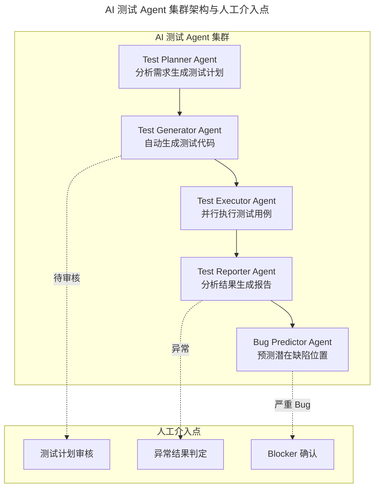
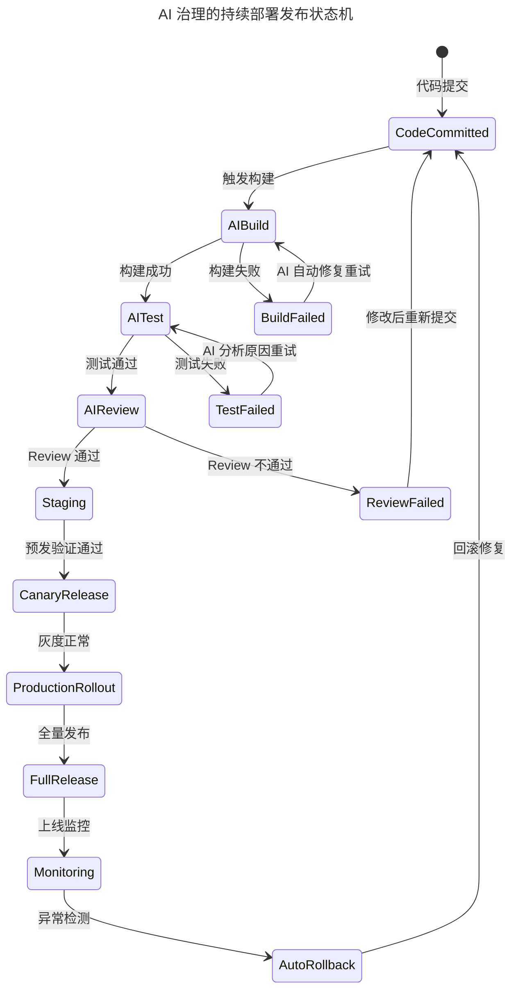

# 施翔：如何打造 7×24 高效交付通道（下）

> **适用范围**：测试工程师、发布工程师、SRE 团队、研发效能度量团队，以及正在推进测试与发布 AI 化的技术团队。

> **更新摘要（v2 · 2026-08 更新）**：整合 7×24 交付通道的测试与发布实践，补充 AI-Native Testing 测试金字塔、AI 测试 Agent 集群架构、AI-Governed Continuous Deployment 发布状态机、DORA 加 AI 效能度量新框架，以及从 2177 人日到 AI 时代效能跃迁的量化对标数据。

## 一、导言

在整个交付通道中，架构、配置、测试、发布是提升效能的几个关键点。上一篇分享了架构与配置环节的做法，本文继续分享测试与发布环节的实践，以及效能度量的方法论。

当一个技术团队比较小时，测试环节并不是那么必要。当业务发展到一定规模、用户对质量的容忍度越来越低时，才需要引入专业测试环节。传统软件是离线交付模式，测试不惜余力地把质量做好。互联网模式下更多是在线交付，测试团队的角色从守门员转变为质量反馈者——需要考虑怎样才能尽快对软件质量进行反馈，这决定了测试成为整个研发交付环节中非常重要的环节。

在 2026 年的 AI Agent 时代，原文提到的"无人值守自动化"、"50% 发布完全自动化"、"30 分钟内跑完所有用例"等成就已被大幅超越。新一代 AI 驱动的测试与发布体系可以实现 95% 以上的自动化率、分钟级交付、Agent 自治的故障自愈。本文从测试和发布两个维度进行全面升级。

## 二、核心方法论

### 测试策略的演进

测试包括单元测试、功能测试、系统测试、集成测试、回归测试等不同方法。发布越频繁，对集成测试的要求就越高，越需要可靠低成本的集成测试方案。原文提到三种集成测试策略：

第一种策略是分支开发主干发布，通过项目过程中不断的 merge 减少分支和主干冲突来提高项目间集成效率，过程中可用功能测试覆盖小集成需求。第二种策略是分支开发分支发布，用空间换时间，多个项目一次性集成提高单次集成效率，适用于复杂系统端到端验证。第三种策略是无人值守集成测试，通过测试技术手段解决多项目集成过程中的频繁验证问题，这是更能保证测试灵活性的方式。

2026 年的测试范式从传统的测试金字塔（单元测试 60%、集成测试 30%、UI 测试 10%）演进为 AI-Native 测试金字塔：AI 单元测试占 40%（AI 生成覆盖率大于 90%），AI 集成测试占 35%（AI 生成加执行），AI 探索性测试占 15%（AI 发现边界 case），AI 性能测试占 10%（AI 模拟真实负载）。

### 发布策略的演进

互联网行业无论开发上线速度多快，业务同学总希望更快，甚至可能出现要求一天开发一天上线的需求。阿里有多种发布模式：正式发布、Beta 发布、预发布、分批发布、灰度发布、隔离发布等。灵活的发布方式可以解决业务紧急上线时的效率问题。

2026 年的发布范式升级为 AI-Governed Continuous Deployment（AI 治理的持续部署），核心目标是随时随地快速上线，同时通过 AI 实现变更风险评估、发布窗口推荐、灰度策略计算、健康检查、异常检测、自动回滚等全流程智能化。

## 三、关键流程

### AI 测试 Agent 集群

上图展示了 AI 测试 Agent 集群的架构。五个 Agent 形成流水线：Test Planner 分析需求生成测试计划，Test Generator 自动生成测试代码，Test Executor 并行执行测试用例，Test Reporter 分析结果生成报告，Bug Predictor 预测潜在缺陷位置。人工介入点设计在三个关键节点：测试代码生成后待审核、异常结果需判定、严重 Bug 需确认 Blocker。这种"Agent 自治加人工把关"的模式既保证了效率又控制了风险。

### 从"30 分钟"到"5 分钟"的测试加速

| 阶段 | 耗时（传统） | 耗时（AI 增强） | 加速技术 |
|-----|-------------|---------------|----------|
| 测试计划制定 | 2 小时 | 10 分钟 | AI 需求分析 |
| 用例生成 | 4 小时 | 15 分钟 | AI 批量生成 |
| 测试代码编写 | 8 小时 | 30 分钟 | AI Code Gen |
| 测试执行 | 30 分钟 | 5 分钟 | 并行执行加智能跳过 |
| 结果分析 | 1 小时 | 5 分钟 | AI 报告生成 |
| 总计 | 约 16 小时 | 约 65 分钟 | 下降 93% |

### AI-Governed 发布状态机

上图以状态机展示了 AI 治理的持续部署全流程。从代码提交开始，经过构建、测试、Review、预发、灰度、全量发布到上线监控的完整链路。关键设计在于异常处理：构建失败时 AI 自动修复重试，测试失败时 AI 分析原因重试，Review 不通过则退回修改。监控阶段检测到异常时，严重级别以上自动回滚，中等级别通知人工确认。这一状态机实现了发布流程的自治运转，人类仅在关键节点介入。

### AI 增强的发布策略

| 发布策略 | 传统触发条件 | AI 增强触发条件 | AI 角色 |
|---------|------------|--------------|--------|
| 即时发布 | 紧急 Hotfix | AI 检测到安全漏洞/严重 Bug | AI 自动发起加人工确认 |
| 灰度发布 | 手动设置灰度比例 | AI 基于用户行为动态调整灰度比例 | AI 智能灰度 |
| 蓝绿部署 | 手动切换流量 | AI 健康检查自动切换 | AI 自动切流 |
| 金丝雀发布 | 固定比例灰度 | AI 实时监控指标自动扩缩 | AI 智能扩缩 |
| 特性开关 | 手动配置 | AI A/B Test 自动决策最佳版本 | AI 实验引擎 |
| 回滚 | 人工判断加手动执行 | AI 检测异常后自动或建议回滚 | AI 自治运维 |

## 四、工具与实战

### AI 测试能力矩阵

| 测试类型 | 传统方式 | AI 增强方式 | 效率提升 | 推荐工具 |
|---------|---------|-----------|---------|----------|
| 单元测试生成 | 手写或半自动 | AI 根据代码自动生成 | 10 倍 | CodiumAI / Amazon CodeWhisperer |
| 测试用例设计 | 基于经验设计 | AI 分析需求自动生成用例 | 8 倍 | GPT-5.5 + Custom Test Generator |
| 边界值分析 | 人工枚举 | AI 穷举所有边界组合 | 20 倍 | Property-Based Testing + AI |
| UI 测试脚本 | Selenium 手写 | AI 录制加自动维护 | 5 倍 | Katalon AI / Testim.io |
| 性能测试 | JMeter 手动配置 | AI 自动识别瓶颈加调优 | 3 倍 | LoadView AI / k6 AI |
| 安全测试 | 周期性人工扫描 | AI 实时漏洞检测 | 实时 | Snyk AI / GitHub Advanced Security |
| 视觉回归测试 | 截图对比 | AI 智能差异识别 | 5 倍 | Applitools / Percy |
| 探索性测试 | 人工随机测试 | AI Agent 自主探索 | 7×24 | Agent-based Exploration |

### AI 效能度量新框架

传统 DORA 指标（部署频率、变更前置时间、变更失败率、平均恢复时间 MTTR）在 2026 年新增了 AI 效能维度：AI Adoption Rate（AI 采用率）、AI Code Acceptance（AI 代码采纳率）、AI Time Saved（AI 节省时间）、Agent Success Rate（Agent 成功率）、AI Debt Ratio（AI 债务比率）、Human-AI Collab Index（人机协作指数）。三类指标综合形成效能评分。

### 效能仪表盘模板

| 维度 | 指标 | 目标 | 趋势 |
|-----|------|------|------|
| 速度 | 部署频率（次/天） | 大于 10 | 上升 |
| | 交付周期（小时） | 小于 4 | 下降 |
| | AI 节省工时（小时/人/周） | 大于 10 | 上升 |
| 质量 | 变更失败率 | 小于 5% | 下降 |
| | AI 代码采纳率 | 65-75% | 持平 |
| | Agent 任务成功率 | 大于 90% | 上升 |
| 稳定性 | MTTR（分钟） | 小于 30 | 下降 |
| | 线上故障数/月 | 小于 2 | 下降 |
| | AI 拦截问题数/月 | 大于 50 | 上升 |
| 效率 | AI Adoption Rate | 大于 90% | 上升 |
| | 人均产能提升倍数 | 3-5 倍 | 上升 |
| | 事务性工作占比 | 小于 8% | 下降 |

### 阿里 CBU 实践数据回顾与 AI 时代对标

| 指标 | 2018 数值 | 2026 预期（同规模团队） | 提升幅度 |
|-----|---------|---------------------|----------|
| 开发人员 | 350+ | 250+（AI 替代部分人力） | 下降 29% |
| 年集成自动化 | 29000+ | 100000+ | 提升 244% |
| 年发布次数 | 15000+ | 80000+ | 提升 433% |
| 人均年发布 | 42 次 | 320+ 次 | 提升 662% |
| 平均交付周期 | 5.29 天 | 0.5-1 天 | 下降 81-90% |
| 自动化发布占比 | 约 50% | 95%+ | 提升 90%+ |
| 年提效 | 2177 人日（5%） | 15000+ 人日（35%+） | 提升 600%+ |

效能跃迁的关键驱动力分布为：AI 代码生成贡献 35%（60-75% 代码由 AI 生成），AI 测试自动化贡献 25%（测试用例 AI 生成加执行），AI 发布自治贡献 20%（Agent 自主完成发布流程），AIOps 智能运维贡献 10%（自动处置告警），AI 效能优化贡献 10%（AI 识别瓶颈并建议优化）。

## 五、常见误区

**误区一：AI 幻觉导致的测试漏测**。AI 生成的测试用例看起来合理但实际无效，应建立"AI 测试用例有效性验证"机制，对 AI 生成的用例进行交叉验证。

**误区二：过度依赖 AI 导致技能退化**。团队成员可能丧失手动测试和发布能力。应定期进行"无 AI 日"演练，保持团队的基础能力。

**误区三：AI 安全盲区**。AI 工具可能泄露代码或密钥到外部。应严格的数据分类和访问控制，对 AI 工具的数据流向进行审计。

**误区四：Agent 失控**。Agent 可能执行非预期的破坏性操作。应设置严格的 Agent 权限和审批流，关键操作必须人工确认。

**误区五：忽视人的因素**。技术升级但团队文化未跟上会导致推行阻力。应同步推进 AI 文化建设和培训，让团队理解 AI 是帮助而非替代。

**误区六：将发布灵活性等同于随意发布**。灵活的发布模式是为了应对业务紧急需求，而非放松质量管控。每种发布模式都有其适用场景和前置条件，AI 治理的持续部署仍然需要严格的健康检查和异常回滚机制。

## 六、进阶延展

### 2026 实施路线图

**Phase 1：基础夯实（第 1-2 个月）**。统一 AI 编程工具（Cursor Pro 或 Copilot Workspace）；在 CI/CD 中集成 AI 代码质量门禁；部署 AI 单元测试生成工具；建立 AI 效能基线数据。

**Phase 2：Agent 引入（第 3-4 个月）**。引入测试 Agent，实现测试自动化率大于 80%；引入发布 Agent，实现标准化发布流程自动化；搭建 AI 效能看板；制定 AI 发布准入标准。

**Phase 3：深度整合（第 5-6 个月）**。实现 AI 自治发布（低风险变更全自动）；引入 AIOps 实现故障自愈；建立 AI 驱动的容量规划；达成年度效能目标。

### 效能度量的价值闭环

原文提到阿里 CBU 专门打造了部门提效中心来衡量工具平台的价值。衡量方法很简单：自动化以前通过人肉集成需要一小时，自动化后通过工具执行只需十分钟，对于工具而言就是执行一次提效 50 分钟。过去一年提升了 2177 个人日，基本占部门总人日的 5%。

在 AI 时代，效能度量应从"事后统计"升级为"实时洞察加预测"。AI 效能看板不仅展示当前指标，还能基于趋势预测未来瓶颈，建议优化方向。这种从"被动度量"到"主动优化"的转变，是 AI 增强效能管理的核心价值。

### 避坑提醒

| 坑 | 表现 | 对策 |
|---|------|------|
| AI 幻觉导致测试漏测 | AI 测试用例看起来合理但实际无效 | 建立 AI 测试用例有效性验证机制 |
| 过度依赖 AI 导致技能退化 | 团队丧失手动测试/发布能力 | 定期进行"无 AI 日"演练 |
| AI 安全盲区 | AI 工具泄露代码或密钥 | 严格的数据分类和访问控制 |
| Agent 失控 | Agent 执行非预期破坏性操作 | 设置严格的 Agent 权限和审批流 |
| 忽视人的因素 | 技术升级但文化未跟上 | 同步推进 AI 文化建设和培训 |

回顾整个交付通道：通过架构升级激发开发同学 Coding 的活力与能力；通过平台化、系统化解决配置、测试环境等问题；通过无人值守的自动化集成测试解决集成质量与效率问题；通过灵活可感知的方式解决随时随地发布代码的问题。这条路径在 AI 时代不仅没有过时，反而因为 AI 的能力爆发而变得前所未有的重要。除去开发时间，任何一款代码都可以在 7×24 小时内的任何一个时间点快速上线，而 AI 让这一目标的实现更加智能和可靠。
