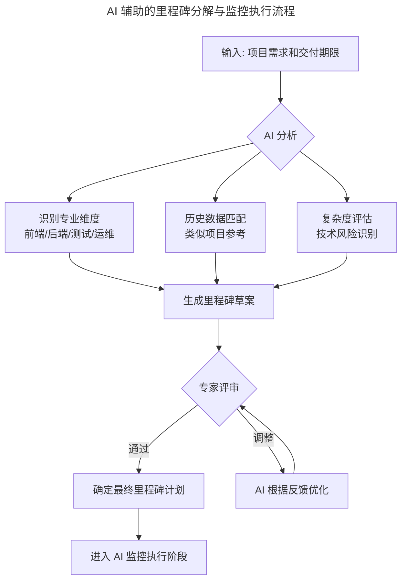
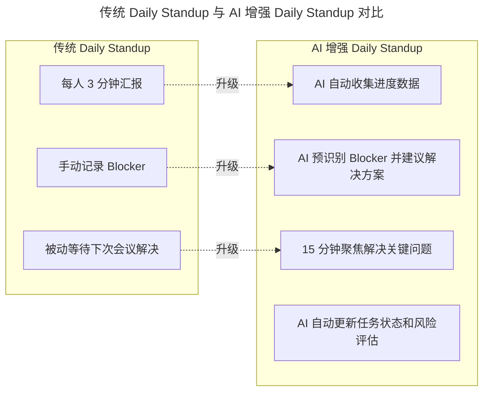

# 有了敏捷开发，那交付期限去哪儿了

> **适用范围**：项目经理、Scrum Master、技术负责人，以及需要管理长周期交付期限的研发团队。

> **更新摘要（v2 · 2026-08 更新）**：整合敏捷开发期限管理的核心矛盾与建筑工程、按单制造业的三大经验，补充 AI 驱动的 WBS（Work Breakdown Structure，工作分解结构）分解、AI 实时进度跟踪、AI 预测性风险预警、AI 增强 Daily Standup，以及从被动应对到主动预测的期限管理范式升级。

## 一、导言

今天软件行业已无人不知敏捷开发（Agile Development），实践者也不局限于互联网产品公司，即使是传统软件开发团队也十分愿意采纳敏捷。温和的看板之于严苛的期限，当然前者要友善得多。Scrum 能够得到普及，和它宽慰人心的作用是分不开的。

敏捷开发宣言让小型团队可以摆脱过于笨重的项目计划，让产品设计和开发避免闭门造车，不至于让程序员的青春年华浪费在那些因为失败而没有投入使用的软件项目上。它推动了需求方和开发者之间的持续透明沟通，让团队意识到高频度的沟通是提高软件交付质量的原动力，还将工作的起点转换到客户的具体问题解决上（User Story），而不是从一个看似完善的产品需求文档出发。

但敏捷开发在期限控制方面存在天然短板。Scrum 框架天然适合 2-4 周的短周期迭代，但在面对全新重构、大型版本迭代、技术债偿还、复杂特性交付时，几乎不可能在 2-4 周内达成。现实中经历的漫长迭代周期可能超过四个月。即使像 Salesforce、Asana、Atlassian 这样的高水平 SaaS 产品企业，都有过结果糟糕却又不得已为之的长跑型迭代。在 AI 时代，这一困境得到了显著缓解——AI 不仅能够提升执行效率，更能提供更精准的预测和更智能的风险管控能力。

## 二、核心方法论

### 期限之殇的核心矛盾

敏捷开发的"舒适区"是 2-4 周的短周期迭代，而现实项目的"真实需求"是 1-6 个月的长周期任务。结果是要么牺牲质量赶进度，要么承认延期。Scrum 的看板模型虽然直观有效，但只能支持日常特性迭代，在固定周期内完成合适数量的 User Story。在 In Process 这个狭窄的看板中，其实掩盖了过程控制问题——如果 In Process 不能在 1-2 周内完成编码和单元测试，整个冲刺就高概率地会失败。

Scrum 方法要求在延期情况下进行复盘，找出项目延期的原因，但从很多产品团队的反馈来看，这个原因通常总是被归结为 User Story 放得太多了或定义得太模糊了，而很少有去复盘设计开发过程中的进度控制问题。所以 Scrum 在带来价值的同时，并不能天然地保证团队准时的交付。

### 其他行业的三大经验

要为软件行业找到按期交付的办法，可以从建筑工程管理和按单制造业这两个对工作交付期限有更高要求的行业中寻找灵感。

**经验一：专业的 WBS 分解**。打开一个建筑工程项目管理文件或一家模具制造厂的工单分解和排程表，外行像看天书一样，因为每个分部分项工作都有专业衡量。建筑业的最小工作包从一两天到一两个月不等，都有行业显性知识支撑的预计工期。专业的任务分解、工期预估、流程次序和里程碑定义是进度管理的基础。

**经验二：持续的进度跟踪和关键里程碑**。建筑业通过原有基线对比来协调各分部施工方、分包商、材料供应商和施工人力资源的准备、入场和验收；制造业则紧紧围绕工件，依据工件在制造程序上的流转来确定进度，工件在单个制造工序上的完成是关键里程碑。

**经验三：遇到问题后的快速会商**。制造业的现场管理和站会不是没有道理的，在生产过程中发现和产生的问题，最好的解决办法就是在制造现场解决。建筑业工程项目部也永远设在施工现场附近，项目经理随时要召集不同职能的人会商问题。

### AI 时代的破局点

AI 将长周期任务拆解为可预测的短周期单元，AI 提供精准的进度预测和风险预警，AI 加速每个环节的执行效率。结果是长周期任务也能按期高质量交付。三大经验的 AI 增强对比如下：

| 经验 | 传统做法 | AI 增强做法 | 效果 |
|-----|---------|------------|------|
| 专业的 WBS 分解 | 依赖专家经验，耗时数天 | AI 自动分解加专家审核（2 小时） | 速度 10 倍以上 |
| 持续的进度跟踪 | 人工更新甘特图，滞后性高 | AI 实时跟踪加自动预警 | 时效性 100 倍以上 |
| 遇到问题后的快速会商 | 召集会议讨论，响应慢 | AI 预分析加定向邀请关键人（30 分钟） | 效率 5-10 倍 |

## 三、关键流程

### AI 辅助的专业里程碑分解

上图展示了 AI 辅助的里程碑分解流程。输入项目需求和交付期限后，AI 从三个维度并行分析：识别专业维度（前端、后端、测试、运维）、匹配历史类似项目数据、评估复杂度与技术风险。三者综合后生成里程碑草案，经专家评审通过或调整后进入 AI 监控执行阶段。这一流程将传统需数天的 WBS 分解压缩到 2 小时内完成，同时保持了专业严谨性。

里程碑颗粒度标准方面，小型功能（小于 1 周）粒度为 0.5-1 天，每日检查，AI 预测准确率 90% 以上；中型项目（1-4 周）粒度为 2-3 天，每 2 天检查，准确率 85% 以上；大型版本（1-3 个月）粒度为 1 周，每周检查，准确率 80% 以上；巨型重构（3-6 个月）粒度为 2 周，双周检查，准确率 75% 以上。

### AI-Augmented Scrum 的期限管理

在 Sprint Planning 阶段，传统基于经验估算 Story Points 升级为 AI 基于历史数据分析估算，准确度从正负 50% 误差提升到正负 15%；人工分配任务升级为 AI 根据技能匹配度和负载推荐，分配合理性提升 40%；口头承诺完成时间升级为 AI 生成概率性完成时间预测，可预期性大幅提升；识别潜在风险依赖人工升级为 AI 自动识别技术风险和依赖关系，风险发现提前 1-2 个 Sprint。

### AI 进度预测与风险预警

| 预测类型 | 传统方法 | AI 方法 | 准确率提升 |
|---------|---------|---------|-----------|
| Sprint 完成率 | Burn-down 图表外推 | ML 模型（考虑成员效率、历史偏差、假期等） | 60% 提升至 85% |
| 里程碑达成概率 | 主观判断 | 蒙特卡洛模拟加历史数据训练 | 随机提升至可量化 |
| 延期风险预警 | 问题暴露后才察觉 | 提前 3-7 天预测延期可能性 | 被动提升至主动 |
| 资源瓶颈识别 | 人工观察 | AI 自动分析负载和技能匹配 | 事后再提升至事前 |

### 实际案例：某电商大促版本的 AI 辅助期限管理

项目背景为双十一大促版本，周期 3 个月，涉及 50 余人团队。传统方式下，第一个月进展顺利但大家感觉良好，1.5 个月时开始出现延期迹象但未重视，第二个月多个模块延期开始加班赶工，2.5 个月时质量问题频发陷入恶性循环，第三个月勉强上线但 Bug 很多，后续修复花了一个月。

AI 增强方式下，Day 1 AI 生成了详细的里程碑计划（含 200 多个子任务），Week 2 AI 预测支付模块可能延期 1 周（准确），团队及时调整资源增加人手，Week 4 AI 预警测试环境不稳定（提前 2 周发现），运维团队提前优化测试环境，Week 8 AI 检测到代码质量下降趋势，安排专项 Code Review 和技术债偿还 Sprint，Week 10 AI 预测整体进度符合预期（置信度 85%），Week 12 按时高质量上线，线上故障率降低 70%，客户满意度 95% 以上，团队无过度加班。

## 四、工具与实战

### AI 增强的 Daily Standup

上图对比了传统与 AI 增强的 Daily Standup。传统站会每人 3 分钟汇报、手动记录 Blocker、被动等待下次会议解决，信息传递效率低且容易遗漏关键问题。AI 增强后，会前 AI 自动收集各系统进度数据并生成简报（进度概览、风险提示、建议议题），会中 15 分钟聚焦 AI 标记的风险项和阻塞问题，会后 AI 自动更新任务状态、生成 Action Items 并向相关人员推送待办事项提醒。会议时间从 30 分钟缩短至 15 分钟，问题发现和解决速度提升 3 倍，任务状态更新从滞后变为实时。

### 三大可执行策略

**策略一：AI 驱动的 WBS 分解与估算**。将需求文档输入 AI 系统，AI 自动生成 WBS 草案（含任务、依赖、估算），技术负责人审核调整（重点看关键技术路径），AI 基于审核后的计划生成甘特图和关键路径，设定 AI 监控节点每周自动检查进度。工具推荐 Linear AI、Notion AI 或自建 AI 估算模型。

**策略二：AI 增强的每日站会**。会前 AI 自动收集各系统进度数据并生成简报，会中 15 分钟聚焦 AI 标记的风险项和阻塞问题，会后 AI 自动更新任务状态、生成 Action Items、推送待办事项提醒。预期会议时间从 30 分钟缩短至 15 分钟，问题发现和解决速度提升 3 倍。

**策略三：AI 预测性风险管理**。配置 AI 监控系统接入 Jira、Git、CI/CD 等数据源，设定风险阈值（如连续 2 天无代码提交、测试通过率低于 80% 等），AI 每日生成风险报告（红黄绿灯状态），针对黄灯红灯项目 AI 自动触发干预流程，每周复盘 AI 预测准确性持续优化模型。技术风险由 AI 推荐备选方案加历史案例参考，资源风险由 AI 分析负载加建议调配方案，依赖风险由 AI 识别关键路径加提示替代方案，质量风险由 AI 监控代码质量指标加预警，需求变更风险由 AI 评估影响范围加建议应对策略。

### 关键指标对比

| 维度 | 传统敏捷团队 | AI 增强敏捷团队 | 改善幅度 |
|-----|-------------|-----------------|---------|
| 大型项目按时交付率 | 40-60% | 75-90% | 提升 30-50% |
| 进度预测准确度 | 正负 50% 误差 | 正负 15% 误差 | 精度提升 3 倍 |
| 风险提前预警时间 | 问题发生后 | 提前 3-7 天 | 从被动到主动 |
| 里程碑达成率 | 60-75% | 85-95% | 提升 20-35% |
| 团队加班强度 | 高（经常 996） | 低（正常工作时间） | 工作生活平衡 |
| 客户满意度 | 70-80 分 | 90-95 分 | 提升 15-25 分 |

## 五、常见误区

**误区一：完全依赖 AI 预测**。AI 是辅助工具，关键决策仍需人类判断。AI 预测结果应与团队共享以建立信任，而非作为黑箱指令执行。

**误区二：忽视模型持续校准**。AI 预测模型需要定期用实际结果校正，否则准确度会随时间衰减。应每周复盘 AI 预测准确性，持续优化模型。

**误区三：让团队感到被 AI 监控**。应强调 AI 是帮助而非监视工具。AI 预警的目的是提前发现问题、提供支持，而非考核个人表现。

**误区四：将延期责任归咎于需求变更**。很多软件开发的延期将责任归咎在需求的含糊和变更上，但其他行业同样存在变更。建筑工程中局部的施工修改随时可能发生，制造业总结出了"人、机、料、法、环"生产影响要素。关键不在于消除变更，而在于建立持续跟踪和快速会商机制。

**误区五：一刀切的迭代周期**。并非所有软件开发迭代都是 2-4 周的短周期。在新版本开发、复杂的企业 SaaS 特性开发中，一个迭代经常需要超过一个月。统计常用 APP 的版本更新历史发现，80% 以上的 APP 更新频度在两个月以上。必须把进度要素重新纳入敏捷开发的管理范畴。

## 六、进阶延展

### 软件业的实施路径

软件业要采用类似建筑业和制造业的思想提高进度管理水平，首先需要根据前端开发、后端开发和测试的主要专业分部建立细化的专业里程碑。前端开发依据设计阶段产生的页面清点前端组件开发工作量，页面数量越多、模块化程度越低的项目工作量越大；后端开发根据数据对象和功能特性细化出接口列表和数量，大部分企业应用的开发工作量和接口数量成正比；黑盒测试所需时间与前后端开发量总计成正比。

达成里程碑所需的工作时间一般要细化到一周工作量以内的颗粒度，否则按周检查就失去了意义。制定计划和执行计划的人如果是一致的，计划达成的概率就会更高。里程碑计划不必做成甘特图模式，而是将里程碑项目根据期限分组，每组就是一周内应该达成的里程碑，便于每周检查和跟踪。

### 从被动到主动的演进

2026 年的准时交付不再仅靠人的意志力和加班来保证，而是靠 AI 驱动的科学管理体系来实现可预测、可控制、可持续的高质量交付。AI 不能消除所有延期风险，但能让我们更早地发现问题、更准确地预测结果、更主动地应对挑战。通过 AI 驱动的 WBS 分解、进度预测和风险预警，即使是长达数月的大型项目，也能实现接近短周期迭代的可控性和可预测性。

实施时应循序渐进，先从单个项目试点，验证效果后再推广。同时保持透明沟通，AI 预测结果应与团队共享以建立信任。关注团队感受，避免让团队成员感到被 AI 监控。AI 是辅助工具而非替代品，关键决策仍需人类判断，这是 AI 增强敏捷的底线原则。
