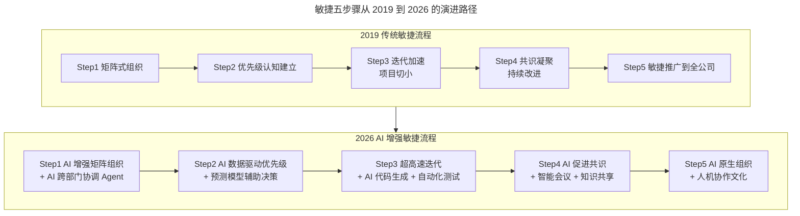
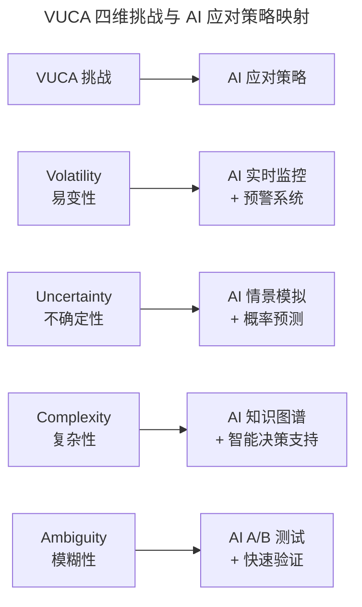

# 游舒帆：敏捷力，拥抱不确定性，与VUCA共舞

> **适用范围**：技术领导者、研发管理者、产品经理，以及希望在全公司层面推动敏捷转型与 AI 增强协作的跨职能团队。

> **更新摘要（v2 · 2026-08 更新）**：在 2019 版敏捷五步骤基础上，整合 AI 时代的敏捷力（Agile 2.0）演进，补充 AI-Native 组织协作模式、AI 数据驱动优先级、超高速迭代、VUCA 的 AI 应对策略，以及面向 2026 年技术领导者的分阶段行动建议。

## 一、导言

敏捷（Agile）一词在互联网爆发成长的这些年早已被谈到过火，但多年观察下来，敏捷这个词被过度曲解与滥用了。常见的错误认知包括：把每日站立会议、白板管理等同于 Scrum；把需求朝令夕改、让团队疲于奔命称作"要更敏捷"；或者以"加快迭代速度应对不确定性"为名，跳过本应花时间厘清的问题，最后碰壁返工。很多不确定性其实是自找的。

对敏捷的错误认知会导致错误的结果。在长鞭效应的影响下，流程最末端的研发团队与程序员必须以超时工作填补因项目不断变更而衍生的额外工作。身为技术领导者，不能以这种错误的敏捷观念做事，否则最终将累死自己，也累死团队。

VUCA——即易变性（Volatility）、不确定性（Uncertainty）、复杂性（Complexity）、模糊性（Ambiguity）——在 2026 年因 AI 技术的爆发而变得更加突出，但同时 AI 也提供了系统性的应对方案。本文将游舒帆老师提出的敏捷五步骤与 2026 年 AI 增强实践整合为统一叙事，不再保留"原文与注解分离"的结构，而是呈现一套可直接落地的敏捷力（Agile 2.0）方法论。

## 二、核心方法论

敏捷力的本质是快速响应变化、持续交付价值。游舒帆老师提出："如果敏捷走不出技术团队，就不可能真正敏捷。"仅在研发团队内推动敏捷成效有限，因为外部其他人总会成为走向敏捷的阻碍。数据力让信息一致透通，运营力与策略力凝聚共同方向与目标，三者对企业敏捷性都有极大帮助。

在 2026 年的 AI 时代，敏捷力的内涵从"快速响应"进化为"智能地快"——用数据驱动决策，用预测规避风险，用自动化释放创造力。AI 接管了重复性工作，人类可以专注于创造性、战略性、人际连接性的高价值活动。AI 打破了部门和层级的信息壁垒，真正的全公司敏捷成为可能。

上图展示了敏捷五步骤在两个时代的对应关系。左侧是 2019 年以人为主体的传统敏捷流程，右侧是 2026 年以"人机协作"为核心的 AI 增强敏捷流程。每一步都保留了原方法论的精神，但在执行层面被 AI 能力大幅放大：组织协作从依赖会议升级为 Agent 实时同步，优先级从专家打分升级为预测模型，迭代从两周 Sprint 升级为天级交付，共识凝聚从人工纪要升级为智能会议助理，敏捷推广从研发部门扩展到全公司 AI-Native 文化。

## 三、关键流程

### 步骤一：矩阵式组织重组与 AI 协调层

将团队分为两类：一类归属于产品团队，另一类划分到功能部门，每个部门由一到两个产品经理负责，让产品经理深入参与公司的各个业务过程。当研发团队与业务团队能更紧密地参与彼此工作、绩效互相挂钩时，默契与信任感就会渐渐产生，信息更透通，行动也更敏捷。

2026 年的升级方向是在矩阵结构之上引入 AI 协调层，打破信息孤岛。AI 协调 Agent 承担四类职责：自动同步跨部门依赖并识别阻塞点预警；基于历史数据预测各团队产能实现资源负载均衡；将技术语言翻译为业务语言（反之亦然）；提前发现潜在的资源争夺和目标不一致。部署企业级 AI 助手与"AI 每日简报"机制，预计可减少 30% 的跨部门沟通成本。

### 步骤二：建立优先级认知与 AI 数据驱动

产品经理必须跟业务部门一同敲定排优先级的规则。在排序之前，先列出影响优先级的要素，如提升业绩、提高用户体验、提高系统稳定性与性能等，给每个要素一定的权重值，试算每个项目的价值，价值愈高优先级愈靠前。权重值与排序规则通常需经几次修正才能为大家所认可。

2026 年的升级是利用 AI 预测模型优化优先级决策：业绩影响从专家打分升级为 AI 分析历史数据预测 ROI；用户体验从用户调研升级为 NLP 分析用户反馈情感倾向；技术可行性从 Tech Lead 评估升级为 AI 代码复杂度分析加技术债务评估；风险程度从经验判断升级为 AI 风险概率模型；依赖关系从手动梳理升级为 AI 自动识别依赖图谱。AI 输出的优先级排序列表会标注关键假设和不确定性，并给出置信度，供决策者参考。

### 步骤三：加快迭代与超高速交付

将大项目切小，优先执行最有价值的部分。举例来说，原先项目 A 要依序完成 10 项工作，为期 4 个月，价值 4000 万业绩。若切为 A1 到 A4 四个迭代，A1 先完成两项需求即可带来 2000 万业绩，A2 再完成三项需求带来 1000 万业绩，即完成 50% 的需求却已获得 75% 的价值。剩余 A3、A4 的价值只剩 1000 万，与 B1、C1 重新排序后或许应优先进行 B1。

2026 年的升级是借助 AI 实现"天级"甚至"即时"迭代。传统两周 Sprint 的 Day 1-2 用于 Planning，Day 3-8 编码，Day 9-11 测试，Day 12-13 Code Review 与部署准备，Day 14 发布与回顾。AI 增强后可压缩到一周或更短：Day 1 上午 AI 辅助 Planning 并生成 70% 基础代码，下午开发者专注业务逻辑与 AI Code Review；Day 2 AI 自动生成测试用例并执行回归；Day 3 人工验收关键路径加 AI 修复低风险 Bug；Day 4 自动化部署与灰度发布；Day 5 数据收集与 AI 生成回顾报告。整体时间缩短 50%，产出质量提升 30%。

### 步骤四：凝聚共识与 AI 促进协作

追求"更快交付价值"这个原则应持续推广到研发部门之外。解决问题不必总是仰赖技术，若时间急迫但研发部门暂时排不出资源，可从专业角度提出其他建议方案，例如请客服部门先以人工方式提供产品预计开发的功能。

2026 年的升级是让 AI 作为"中立调解员"和"知识桥梁"。智能会议助理在会前根据参会人角色自动生成议程并汇总背景资料，会中实时语音转文字加关键点提取、识别分歧点高亮提示、自动记录 Action Items 与责任人，会后五分钟内生成会议纪要并自动创建跟进 Task。跨部门知识共享方面，AI 建立"需求变更追踪系统"，每次变更自动记录原因、影响范围、决策人，分析变更模式，生成可视化"变更影响报告"，用数据说话减少情绪化争论。

### 步骤五：敏捷推广与 AI 原生组织

针对面临较高不确定性的部门持续协助导入敏捷流程。例如营销部门，以往最难回答的问题是一个活动举办后大概能创造多大成效。以多个小项目同时推进的小步快跑迭代方式，通过市场反馈与数据分析提高对现况的把握程度，可更精准达成项目原始目标。持续推动商业思维与导入敏捷约一年后，研发团队的工作中仅有 50% 来自业务部门与高层，剩余 50% 来自研发团队自提的需求。

2026 年的升级是构建"AI-First"的组织文化和工作方式，将 AI 增强敏捷推广到全公司：研发部用 AI 需求分析加代码自动生成；产品部用 AI 原型生成加用户测试模拟；市场部用 AI 营销文案生成加 A/B 测试优化；客服部用 AI 智能客服实现 7×24 多语言响应；销售部用 AI CRM 助手加个性化跟进建议；HR 部用 AI 简历筛选加面试辅助；财务部用 AI 自动报表加异常检测。

## 四、工具与实战

### AI 工具链赋能矩阵

| 环节 | AI 工具 | 效果 |
|------|--------|------|
| 需求拆分 | GPT-5.5 分析 PRD 生成 User Stories | 时间下降 60% |
| 代码生成 | Cursor / Copilot | 编码速度提升 40% |
| Code Review | AI 静态分析加安全扫描 | Review 时间下降 50% |
| 测试生成 | AI 根据代码生成单元测试 | 覆盖率提升 35% |
| 文档编写 | AI 从代码注释生成 API 文档 | 时间下降 80% |
| Bug 定位 | AI 日志分析加根因推测 | MTTR 下降 45% |

### VUCA 的 AI 应对策略

上图将 VUCA 的四个维度与 AI 的应对策略一一映射。易变性对应 AI 实时监控与预警系统，通过持续感知环境变化快速响应；不确定性对应 AI 情景模拟与概率预测，将未知转化为可量化的风险分布；复杂性对应 AI 知识图谱与智能决策支持，理清系统耦合与依赖关系；模糊性对应 AI A/B 测试与快速验证，用实验数据替代主观判断。这四种策略共同构成了 AI 时代的"感知-响应"循环，使组织能够在 VUCA 环境中保持敏捷。

| VUCA 维度 | 具体表现 | AI 工具与方法 | 效果 |
|-----------|---------|-------------|------|
| V - 易变性 | 技术栈半年一变 | AI 技术雷达加学习路径推荐 | 团队适应速度提升 50% |
| U - 不确定性 | 需求不明确 | AI 需求澄清对话加原型快速生成 | 需求返工率下降 40% |
| C - 复杂性 | 系统耦合度高 | AI 架构分析加依赖关系可视化 | 架构重构风险下降 35% |
| A - 模糊性 | 成功标准不清 | AI OKR 拆解加指标体系设计 | 目标对齐度提升 45% |

### 2026 年关键数据参考

| 指标 | 数据 | 来源 |
|------|------|------|
| 使用 AI 的开发者比例 | 84% | Stack Overflow 开发者调查 2025 |
| AI 辅助开发的效率提升 | 30-55% | McKinsey Dev Survey |
| AI 增强团队的需求返工率降低 | 35-45% | Agile Alliance Report |
| 企业采用 AI 项目管理工具的比例 | 62% | Forrester Research |
| AI 原生组织的市场响应速度提升 | 3-5 倍 | Harvard Business Review |

## 五、常见误区

**误区一：将敏捷等同于站会和看板**。每天开站立会议、用白板管理开发工作并不等于 Scrum，更不等于敏捷实践。敏捷的核心是快速响应变化、持续交付价值，而非形式化的仪式。

**误区二：把朝令夕改包装成敏捷**。需求变来变去、不断变更优先级、让团队疲于奔命，然后丢下一句"你们要更敏捷"，这是对敏捷最糟糕的曲解。很多不确定性是自找的，明明能花点时间厘清问题却急就章，最后碰壁返工。

**误区三：敏捷只是研发团队的责任**。如果敏捷走不出技术团队，就不可能真正敏捷。外部其他人总会成为走向敏捷的阻碍，必须让所有部门正确理解敏捷。

**误区四：为了 AI 而 AI 的技术崇拜**。在 AI 时代，追求的不是"更快的瀑布"，而是真正以客户价值为中心、充分发挥人和 AI 各自优势的智能协作模式。保持对工具的理性态度，AI 是手段而非目的。

**误区五：完全依赖 AI 预测而忽视人的判断**。AI 是辅助工具，关键决策仍需人类判断。AI 预测结果应与团队共享以建立信任，同时需持续用实际结果校准模型。

## 六、进阶延展

### 分阶段行动建议

**立即开始（本周）**：评估团队当前的 AI 工具使用率，统计使用 Cursor / Copilot 的开发者比例（目标大于 80%），识别 AI 工具使用的障碍；选择一个 Sprint 进行 AI 增强试点，设定基线指标对比结果；建立团队的 AI 最佳实践文档，收集 Prompt 模板分享到团队 Wiki。

**短期推进（1-3 个月）**：重新设计 Sprint 流程，引入 AI 辅助的 Planning 和 Review 环节，尝试将 Sprint 长度从两周压缩到一周；部署 AI 项目管理工具实现自动生成日报周报、风险预警和阻塞点识别、智能任务分配建议；组织 AI 敏捷培训，包括 Prompt Engineering 工作坊、AI 辅助 Code Review 实战、人机协作最佳实践分享。

**中期深化（3-6 个月）**：构建企业级 AI 知识库，将技术文档、历史项目、最佳实践向量化存储，支持自然语言查询和智能推荐；建立 AI 治理框架，包括使用规范和伦理准则、数据安全和隐私保护政策、AI 输出审核机制；推广到非技术部门，为产品、运营、市场等部门定制 AI 工具包，组织跨部门 AI 应用分享会。

**长期愿景（6-12 个月）**：打造 AI-Native 组织文化，从"AI 是工具"进化为"AI 是队友"，培养全员的数据思维和实验精神，成为行业敏捷加 AI 应用的标杆。

### 2026 年的敏捷宣言（AI 版）

在不断探索更好的软件开发方法过程中，通过人机协作和 AI 增强，智能化敏捷的价值体现在：个体和互动高于过程和工具（AI 作为智能助手）；可工作的软件高于详尽的文档（AI 自动生成文档）；客户合作高于合同谈判（AI 洞察客户需求）；响应变化高于遵循计划（AI 预测变化趋势）。右侧项仍有价值，但 AI 让左侧项的成本大幅降低。

敏捷不是目的，而是手段。在 AI 时代，我们追求的不是"更快的瀑布"，而是真正以客户价值为中心、充分发挥人和 AI 各自优势的智能协作模式。保持对工具的理性态度，避免陷入"为了 AI 而 AI"的技术崇拜陷阱，才能在 VUCA 时代与不确定性共舞。
