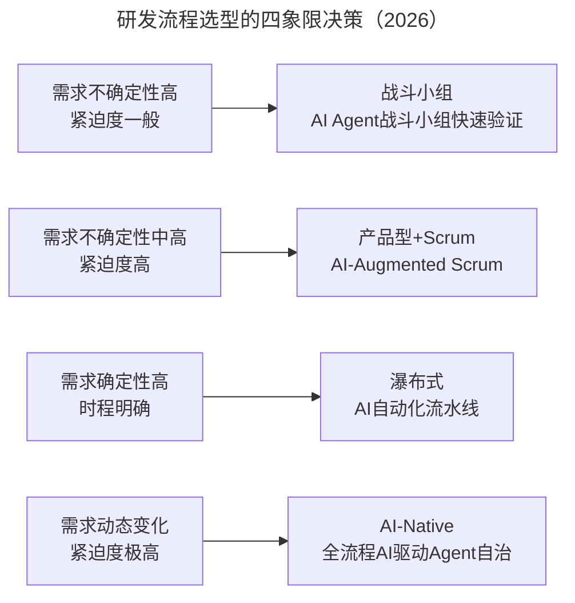
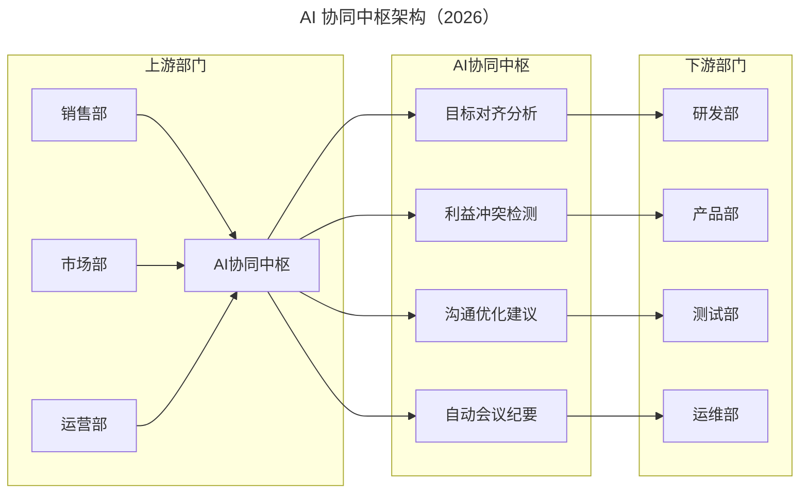

# 高效研发流程的组织架构、流程选型与管理实践

> **适用范围**：CTO、技术 VP、研发负责人、产品负责人，适用于需要从战略到执行系统性优化研发流程的各类企业。

> **更新摘要（v2 · 2026-08 更新）**：在原文组织架构、流程选型、需求管理、优先级、迭代交付、跨部门沟通、数据驱动、组织文化等主题基础上，整合 AI 时代 AI 原生研发组织、AI-Augmented Scrum、AI 需求智能平台、AI 协同中枢、AI 增强数据策略五步法、AI 原生文化五步法等内容，补充从集中式到 AI 分布式研发的演进路径及人机协同进化观。

## 一、导言

高效的定义是：更快的将事情做对、做好。产出要快、内容要对、质量要好——又快、又好、又有价值。"快"在互联网时代强调应变得快、调整得快，与组织架构、分工及决策过程有关；"好"是交付质量，与软件工程成熟度有关；"有价值"源自方向与优先级正确，与企业战略与目标设定有关。谈高效研发流程不能只谈研发流程本身，必须将视野拉到外部环境、企业战略与组织架构等层面。

原文提出两类最高效的场景：制造业生产线（每个关卡精密计算，毋须沟通，可大规模重复产出）和全栈型员工（毋须分工沟通，一人搞定所有事）。前者无法有效应对高变化性环境，后者生产力有限且存在专业性问题。从这两种极端案例可以了解到：流程高效的前提是对应了适当的场景，而场景源自所面对的挑战以及所发展出来的战略与组织架构。

2026 年 AI 时代，84% 的开发者正在使用或计划在开发流程中使用 AI 工具（Stack Overflow 2025 调查口径），这两种高效场景出现了融合的可能——AI Agent 团队使"1 人+多 Agent"的战斗小组兼具全栈型员工的高效与生产线的可扩展性。组织架构、流程选型、需求管理、跨部门沟通、数据驱动、组织文化都需要在 AI 时代重新审视。

## 二、核心方法论

### 2.1 四种企业组织架构与 AI 演进

原文提出四种企业组织架构：功能型（专业分工，稳定状况下提升效率）、产品型/BU 型（快速抢占市场，决策高效但资源重复）、混合型（多功能型与产品型并存，大型企业最终走向）、战斗小组（2-3 人多能工，应对极端不确定环境）。

以创业团队为例，刚起步时大多是创始团队组成战斗小组，随着市场需求厘清与扩张逐渐转为产品型，然后随着分工愈来愈清晰、制度愈来愈完善步入功能型，切入第二个产品或事业时变成混合型组织。AI 时代新增第五种——AI 原生研发组织，以 AI Product Manager、AI Pair Programming、AI Code Review Agent、AI QA Engineer 为核心，1 人+多 Agent 协同，效率可达传统战斗小组的 3-5 倍。

### 2.2 研发组织架构的三阶段演进

研发组织架构与企业组织架构的匹配经历三个阶段演进：

**集中式研发团队**：各部门对研发部门提出需求，研发部门依机制排序并按顺序开发。问题是销售与营销的需求往往优先，服务与后勤及产品技术架构优化需求被滞后。

**分布式研发团队**：将一部分研发资源放在功能部门处理短期需求（功能部门研发团队），另一部分专注产品与技术持续进步（研发团队）。问题是功能部门研发成员觉得自己做的工作技术含量不高，失去工作热情。轮岗实践成效不好——所有人都倾向于做看起来价值更高的事。

**矩阵式研发团队**：将功能部门定义成独立产品，每个产品有单独产品经理负责，核心任务与功能部门产出直接挂钩。例如销售系统被定义成独立产品，销售 PM 目标是让销售部门达成 KPI。角色从消极支持转为积极负责后，团队定位更清晰重要。AI 时代演进为第四阶段——AI 原生研发组织，AI 动态调配资源，智能匹配组织形式。

### 2.3 流程选型与 AI 增强

原文基于 CMMI Lv4 导入经验提出：流程高效的前提是对应了适当的场景。PMP 强调程序、输入、输出与权责，与功能型组织不谋而合；敏捷强调快速响应、迭代，与产品型组织或战斗小组更匹配。当公司内存在多种组织架构时，应该存在多种开发流程。

| 场景特征 | 不确定性 | 时程紧迫度 | 推荐方法 | AI 增强方案 |
|---------|---------|-----------|---------|-----------|
| 探索型 | 高 | 一般 | 战斗小组 | AI Agent 战斗小组，1 周内完成 MVP 验证 |
| 迭代型 | 中高 | 紧迫 | 产品型+Scrum | AI-Augmented Scrum，Sprint 周期 1-2 周，交付效率+50% |
| 确定型 | 低 | 明确 | 瀑布式 | AI 自动化流水线，减少人工错误 30%+ |
| AI 原生型 | 动态 | 极高 | AI-Native | 全流程 AI 驱动，Agent 自治 |

### 2.4 项目管理基本功与 AI 升级

原文强调项目管理基本功：项目启动时问产品经理"这个项目中有哪些不确定性，可能会导致你无法准时交付？"早期主要问题是需求不够清晰、不确定人力资源能否配合、对工作估时过长或过短、技术可行性待验证、老板可能改动需求。敏捷虽然强调拥抱不确定性，但不意味着对不确定性置之不理，而是要尽快让不确定成为确定。

AI 时代的基本功升级：需求清晰化→AI 需求质量评分（GPT-5.5+自定义评估框架）；时程估算准确→AI 历史数据分析预测（ML 模型+团队历史数据，误差从±50% 降至±15%）；不确定性管理→AI 风险预警系统（Agent 监控+异常检测）；变更控制→AI 影响范围分析（依赖图分析+自动评估）。

## 三、关键流程

### 3.1 需求管理：从期待管理到 AI 需求智能平台

需求管理本质上是期待管理。原文常问团队"你们清楚老板想解决什么问题吗？"——项目团队往往只看到有件事得做，时程已被压上，匆匆忙忙开始工作，却很少花时间理解项目背后的"为什么"。如果公司是科层组织，老板想解决一个简单问题，经过层层解读后最后收到的需求是做一整套系统，原先一两周能解决的问题拖上半年一年。

要真正做好期待管理，团队必须在承接每个项目时往上层了解源头问题，掌握"上游信息"。AI 时代新增 AI 需求智能平台：原始需求输入后 AI 评估质量，评分<60 则 AI 追问澄清问题，评分≥60 则 AI 提取业务价值、生成 User Story、关联历史类似需求、预估影响范围，输出结构化需求文档，需求清晰度提升 40-60%。

### 3.2 优先级排序：从权力决到 AI 数据驱动

原文提出三种优先级排序方式：权力决（权力大的人决定，决策者明确但现场把握度可能最差）、共识决（大家共同决定，但背后仍是权力决）、数据决（协议项目价值运算公式，客观但计算不会一开始就很精准）。原文倾向使用数据决，遭遇争议辅以权力决或共识决。

AI 时代的数据决新增多维度自动评估：业务价值（30%，销售数据、用户反馈）、技术可行性（25%，代码库分析、技术债务）、资源占用（20%，团队容量、技能匹配）、时间敏感度（15%，市场窗口、竞争态势）、风险评估（10%，历史数据、依赖关系）。AI 优先级算法自动计算 Priority Score，优先级决策效率从 2-3 天/轮次降至 4-8 小时/轮次。

### 3.3 迭代与交付：三段式方法的 AI 加速

原文提出问题解决的三段式方法：绕路解（workaround，先能提供临时方案）、临时解（如果根本解时间太长，提供临时解缓和用户痛苦）、根本解（从根本解决问题，避免累积技术债）。面对需求也用三段式方法：将需求细拆，找出相对有价值的部分先做，可能 1 周达到 20% 效益，4 周达到 60% 效益，最后推出根本解实现完整需求。

"解决问题，不必总是仰赖技术"——许多事情可以靠流程解、人工解、沟通解。原文案例中，产品功能争议僵持时，有同仁建议找客服部门合作人工服务 40 位客户抢先体验，人工处理调整效率高（早上反映下午就修正），一个半月后流程调整多次才交由系统迭代。

AI 时代三段式方法获得加速：绕路解从 1-2 天缩短至 2-4 小时（-75-83%）；临时解从 1-2 周缩短至 2-3 天（-70-79%）；根本解从 1-2 个月缩短至 2-3 周（-50-62%）。关键技术包括 AI 代码生成、AI 测试自动化、AI 根因分析、AI 重构建议。

### 3.4 跨部门沟通：从上游思维到 AI 协同中枢

原文用"河川下游"故事说明跨部门沟通：如果你住在河川下游，上游人每天在河里倒垃圾，你会怎么做？经过讨论通常得出"帮他们建立垃圾处理机制"——因为都认为那是对方的责任。如果上游出问题，不论他没能力、没资源或不愿意解决，问题就是在那，如果不帮他解决，自己就得蒙受其害。

AI 协同中枢的核心能力包括：自动翻译（将业务语言翻译成技术语言，反之亦然）、目标对齐（检测并提示各部门目标的潜在冲突）、信息同步（自动汇总和分发关键信息）、会议提效（AI 辅助会前准备、会中记录、会后跟进）。跨部门沟通成本降低 40-60%。

### 3.5 数据驱动：五步法的 AI 增强

原文提出数据策略落地五步法：依据策略提出数据需求→确认数据处理目标→盘点与汇整既有数据→盘点新数据采集需求→拟订数据行动方案。数据策略是衍生自企业策略，企业不该只盯着落后指针看，而要从数据中挖掘出洞见并采取行动。

AI 时代五步法全面增强：Step 1 提出数据需求从人工梳理问题变为 AI 自动识别业务问题（3-5 倍效率）；Step 2 确认数据处理目标从手工定义变为 AI 智能推荐分析维度（2-3 倍）；Step 3 盘点既有数据从人工盘点变为 AI 自动数据发现与分类（5-10 倍）；Step 4 盘点新采集需求从人工识别变为 AI 预测性数据需求分析（3-4 倍）；Step 5 拟订行动方案从人工制定变为 AI 生成可执行行动计划（4-6 倍）。

## 四、工具与实战

### 4.1 组织架构匹配工具

| 研发组织形态 | 特点 | 适用场景 | AI 增强方向 |
|------------|------|---------|-----------|
| 集中式 | 统一排序需求 | 小规模单一产品 | AI 辅助需求排序 |
| 分布式 | 功能部门+研发团队 | 中规模多需求 | AI 智能需求路由 |
| 矩阵式 | 功能部门定义为产品 | 大规模多产品线 | AI 产品经理协同 |
| AI 原生 | 1 人+多 Agent | 技术驱动型 | 全流程 AI 驱动 |

### 4.2 数据分析工具

AI 时代新增三类核心能力：AI 自然语言数据查询（从需要 SQL 数据分析师、等待数天变为自然语言提问、分钟级响应）；AI 预测性分析（需求完成时间预测误差从±50% 降至±15%，系统故障预测提前 2-4 小时预警，团队产能预测考虑假期和人员变动）；AI 自动洞察发现（自动生成周报摘要，提炼亮点、风险和优化建议）。

### 4.3 文化建设工具

原文提出文化建设五步法：思考企业价值观→定义团队思维与行为→与主管对齐认知→通过案例传递价值观→持续落实与检讨。AI 时代升级为五步法：思考企业 AI 价值观（如何看待 AI、AI 使用边界、效率与 AI 伦理平衡、AI 失败责任归属）→定义 AI 时代思维与行为（AI-first thinking、Critical AI literacy、AI ethics awareness）→与主管对齐 AI 认知（工具选择、质量验收、绩效考核、安全合规、投入计划）→通过案例传递 AI 价值观（成功案例、失败教训、伦理困境、最佳实践）→持续落实与检讨（采纳率、质量评分、能力成长、ROI、伦理规范）。

## 五、常见误区

**流程一刀切**：当公司内存在多种组织架构时，应该存在多种开发流程。过度坚持公司内只能有少数一两套程序，硬要逼所有人配合，与敏捷追求的"专注于更快创造价值，持续精进"理念背道而驰。AI 时代应让 AI 辅助流程选型，根据项目特征动态匹配最合适的方法论。

**需求不清晰就开工**：项目团队往往只看到有件事得做，时程已被压上，匆匆忙忙开始工作，却很少花时间理解"为什么"。一年下来做的项目不少，但没有几个真正解决问题。AI 时代可用 AI 需求质量评分在需求入口处把关，避免低质量需求流入开发流程。

**沟通推诿**：跨部门沟通中"我们都认为那是对方的责任"。AI 协同中枢能检测目标冲突、自动翻译业务与技术语言，但根本解决仍需建立"帮上游解决问题"的文化——如果不帮他解决，自己就得蒙受其害。

**数据滞后决策**：传统数据驱动决策存在数据获取延迟（天级）、洞察发现依赖专家经验、决策响应速度慢（周级）等问题。AI 增强后数据获取速度提升至分钟级（100 倍+），洞察发现效率提升 5-10 倍，决策响应速度提升至小时级（10-20 倍），数据分析门槛降低至自然语言交互（全民可用）。

**文化空谈**：文化是做出来的，不是说出来的。大家对文化的感受是"我们怎么做、怎么思考"，而不是"我们说了什么"。AI 时代尤其要避免"AI 文化"停留在口号——必须有 AI 价值观讨论、AI 行为准则定义、AI 案例分享机制、AI 效能度量体系。

## 六、进阶延展

### 6.1 AI 原生组织文化

AI 时代的文化演进路径为：传统文化（以人为本）→数字化文化（工具赋能）→敏捷文化（快速迭代）→AI 原生文化（人机协同）。AI 原生文化的四大价值观升级：解决问题从人工识别变为 AI 主动监测+预警（问题发现提前 2-3 天）；主人翁精神从人类负责变为人机共同负责（责任边界重新定义）；追求又快又好从自动化测试变为 AI 加速的质量革命（测试时间从 2 周降至 2-3 天）；追求更有价值从人工判断价值变为 AI 价值评估框架（含价值追踪闭环）。

### 6.2 进步的新定义

原文提到"进步，是永远不变的追求"——"忙是一时的，但你想想一年前我们做一样的事情花多少时间，现在又花多少时间？"传统进步观是更快交付→更少 Bug→更高质量。2026 年 AI 时代进步观扩展为：更高效的人机协作→更强的 AI 驾驭能力→更高的创新产出。别用战术上的勤奋，来掩饰战略上的怠惰。

### 6.3 价值观驱动的自管理

当价值观根深蒂固后，所有员工都明白面临抉择时按价值观做决定就不会错，不用事事请示领导，决策权分散出去，组织运作才会高效。AI 时代这一理念依然有效——当团队建立了清晰的 AI 价值观（AI 使用边界、AI 输出审核机制、AI 伦理规范），员工就能在日常工作中自主做出正确的人机协作决策，而不需要每个 AI 使用场景都请示。

### 6.4 AI 文化成熟度评估

AI 文化成熟度分为五个等级：Level 1 初识（采纳率<20%，个别开发者使用 Copilot）；Level 2 探索（采纳率 20-50%，团队开始建立 AI 规范）；Level 3 融合（采纳率 50-80%，AI 成为标配工具）；Level 4 优化（采纳率>80%，主动迭代 AI 使用方法）；Level 5 引领（采纳率>95%，输出行业最佳实践）。企业可定期评估自身成熟度，制定升级路线图。

---

*注：本文基于游舒帆的高效研发流程系列实践，整合 2026 年 AI 时代组织架构、流程选型、需求管理、跨部门沟通、数据驱动与组织文化的升级内容。核心观点是：如果敏捷走不出技术团队，就不可能真正敏捷；研发流程如果只着眼于研发工作本身，就不可能真正高效。AI 时代的进步是更高效的人机协作、更强的 AI 驾驭能力、更高的创新产出。*
